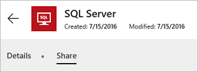

<properties
    pageTitle="Share resources used in your app | Microsoft PowerApps"
    description="Understand how resources used in your app are shared, when an app is shared"
    services=""
    suite="powerapps"
    documentationCenter="na"
    authors="archnair"
    manager="erikre"
    editor=""
    tags=""/>
<tags
    ms.service="powerapps"
    ms.devlang="na"
    ms.topic="article"
    ms.tgt_pltfrm="na"
    ms.workload="na"
    ms.date="06/28/2016"
    ms.author="archanan"/>

# Share app resources #

When you share an app that you created (or that someone shared with you) from PowerApps or [powerapps.com](https://web.powerapps.com), some of the resources used by the app will also be shared. Resources used by the app are:

- Connections
- On-Premise data Gateway
- Custom APIs
- Namespaces
- Excel workbook or other services
- Microsoft Flow

## Connections ##
When you share an app, any sharable connections (such as SQL Server) used by the app will be shared **automatically** with the users of the app.

To identify if a connection is sharable and/or update sharing permissions, go to the connection details page for your connection. Go to [powerapps.com](https://web.powerapps.com) and tap or click on **Connections** under the **Manage** section. If you see a **Share** tab, the connection is sharable.

  

## On-Premise data Gateway ##
When you share an app that uses on-premise connections that are not sharable (such as SharePoint), access to the On-Premise data Gateway will also be shared with the users of the app. This is to allow users of the app to create their own connections to the on-premise data source on the Gateway.

To view connections created on any Gateway you are an Admim on, go to [powerapps.com](https://web.powerapps.com) and tap or click on **Gateways** under the **Manage** section.

## Custom APIs ##
If your app uses a custom API, when you share your app, the custom API will also be shared with users of the app. The users of the app will still have to create their own connections to the custom API.

You can view or update permissions on the custom API by going to [powerapps.com](https://web.powerapps.com) and taping or clicking on **Connections** under the **Manage** section. Then, go to **New connection** and switch to **Custom** tab. Select your custom API to view details.

## Namespaces ##

TBD

## Excel workbook ##

If a shared app uses data to which not all users have access (such as an Excel workbook), [share the data](share-app-data.md) by granting permissions in the cloud-storage account where you store the workbook.

## Flow ##

If a shared app includes a flow, any users who run the app will be prompted to confirm or update any connections on which the flow relies. In addition, other users can’t customize the flow’s parameters. For example, a flow can send email to your address when an action occurs, but other users can’t change that address to their own.

**Prerequisites**

[Sign up](signup-for-powerapps.md) for PowerApps, and then do either of the following:

- [Sign in to powerapps.com](https://web.powerapps.com).
- [Install PowerApps](http://aka.ms/powerappsinstall), open it, and then sign in by providing the same credentials that you used to sign up.
- See [Share an app](./share-app.md) to understand how to share an app with other users.
