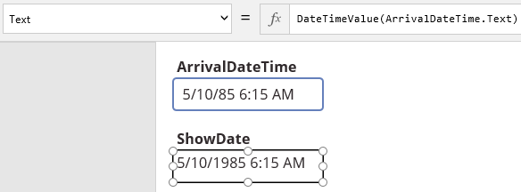
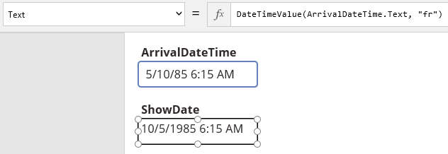
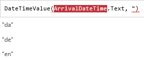
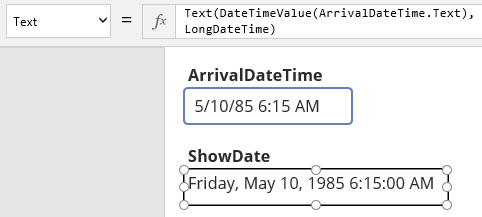
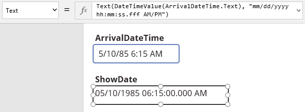
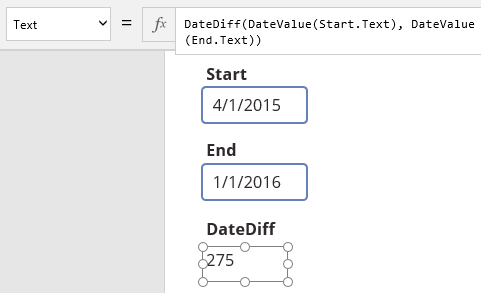
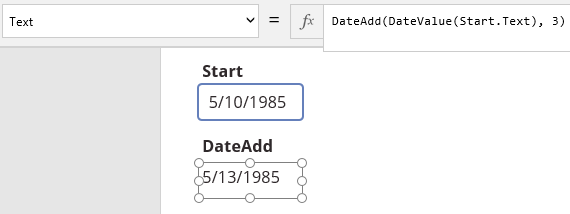

<properties
	pageTitle=" Show text and format a date or time in PowerApps | Microsoft PowerApps"
	description="Add and format dates and times using PowerApps"
	services=""
	suite="powerapps"
	documentationCenter=""
	authors="AFTOwen"
	manager="erikre"
	editor=""/>

<tags
   ms.service="powerapps"
   ms.devlang="na"
   ms.topic="article"
   ms.tgt_pltfrm="na"
   ms.workload="na"
   ms.date="04/24/2016"
   ms.author="anneta"/>

# Show text and format dates and times in Microsoft PowerApps #
Add dates and times, and format them to show the right level of detail or to reflect your locale. Calculate the amount of time between two dates, or calculate a date that's a certain amount of time before or after a date that you specify. Convert dates to or from separate values for days, months, and years, and convert times to or from separate values for hours, minutes, and seconds.

For example, add data from users about stock trades or client meetings, data from an external source, or data from another app created in PowerApps. If that data includes times down to the millisecond, round it to the nearest minute for simplicity. Calculate how many days remain before a major milestone. If you want to schedule client meetings every five days, calculate those dates automatically. If May 10, 1985, is stored in separate fields for the day, the month, and the year, consolidate them into a single value. Conversely, break each date into separate values if your app manages them separately.

**Prerequisites**

- [Sign up](signup-for-powerapps.md) for PowerApps, [install](http://aka.ms/powerappsinstall) it, open it, and then sign in by providing the same credentials that you used to sign up.
- Create an app or open an existing app in PowerApps.
- Learn how to [configure a control](add-configure-controls.md) in PowerApps.

## Show text in a Text box control ##
Show text in a **Text box** control by setting the value of its **Text** property. Set this property by typing directly into the control or by typing an expression in the formula bar.

- If you type directly into the control, it shows exactly what you type.
- If you type an expression in the formula bar, the control shows the result of the expression.

Here are some examples.

1. Add a **Text box** control named **ShowText**, and set its **Text** property to this formula:
 **Now()**

	If your computer is set to the "en-us" locale, the current date and time appears in this format:
	 *mm/dd/yyyy hh:mm AM/PM*

	If your computer is set to a locale such as "fr-fr", the current date and time appears in this format:
	 *dd/mm/yyyy hh:mm AM/PM*

1. Set the **Text** property of **ShowText** to this formula:
 **DateDiff(Today(), DateValue("01/01/2020"))**

	

	The control shows the number of days between today and January 1, 2020, by using these functions:

	- **DateDiff**, which calculates the number of days, quarters, or years between two dates.
	- **Today**, which calculates the current day as a value.
	- **DateValue**, which converts a literal string, as shown between double quotation marks, to a value on which calculations can be performed.

1. Add a **Text input** control named **BirthDate**, and move it under **ShowText**.

1. In **BirthDate**, type the month and the day of your birthday surrounded by double quotation marks (for example, **"05/18"**).

1. Set the **Text** property of **ShowText** to this formula:
 **DateDiff(Today(), DateValue(BirthDate.Text))**

	

	**ShowText** shows the number of days between today and whatever date you type into **BirthDate**. When you type a date into **BirthDate**, its **Text** property is automatically set to that value. If your birthday has already occurred this year, a negative value appears in **ShowText**.

## Format dates and times by using DateTimeValue ##
Convert dates and times from strings of text to values, which you can format in a variety of ways and use in calculations. Specify the format by using built-in and custom options.

> [AZURE.NOTE] The **DateTimeValue** and **DateValue** functions can convert dates in any of these formats into values:  
> - MM/DD/YYYY  
> - DD/MM/YYYY  
> - DD Mon YYYY  
> - Month DD, YYYY  

1. Add a **Text input** control named **ArrivalDateTime**, and type a date and time in this format:
 **5/10/85 6:15 AM**

1. Add a **Text box** control named **ShowDate**, and set its **Text** property to this formula:
 **DateTimeValue(ArrivalDateTime.Text)**

	

	**ShowDate** shows the same information that you typed, but it's been converted from text to a value (as the next step demonstrates).

1. Change the **Text** property of **ShowDate** to this formula:
 **DateTimeValue(ArrivalDateTime.Text, "fr")**

	

	**ShowDate** shows the day before the month, as a French user would expect.

	> [AZURE.TIP] To display a list of other locales in Intellisense, remove the closing quotation mark and **fr** from the formula, but leave the open quotation mark:

	>

1. To use one of several built-in formats, change the **Text** property of **ShowDate** to this formula:
 **Text(DateTimeValue(ArrivalDateTime.Text), DateTimeFormat.LongDateTime)**

	

	**ShowDate** shows the day of the week, the date, and the time.

	> [AZURE.TIP] The **DateTimeFormat** parameter supports several other built-in formats. To display that list, remove **LongDateTime** from the formula.

1. To use a custom format, change the **Text** property of **ShowDate** to this formula:
 **Text(DateTimeValue(ArrivalDateTime.Text), "mm/dd/yyyy hh:mm:ss.fff AM/PM")**

	

	**ShowDate** shows the date/time value in the format that you specified, including milliseconds.

	> [AZURE.TIP] To round the time to the nearest tenth or hundredth of a second, specify **hh:mm:ss.f** or **hh:mm:ss.ff** in the formula.

## Format a date by using DateValue ##
1. Add a **Text input** control named **ArrivalDate**, and then type a date in it (for example, **5/10/85**).

1. Add a **Text box** control named **FormatDate**, and set its **Text** property to this formula:
 **DateValue(ArrivalDate.Text)**

	**FormatDate** shows the date that you typed, except the year appears as four digits.

1. Set the **Text** property of **FormatDate** to this formula:
 **DateValue(ArrivalDate.Text, "fr")**

	**FormatDate** shows the day before the month, just as a French user would expect.

1. To use one of several built-in formats, set the **Text** property of **FormatDate** to this formula:
 **Text(DateValue(ArrivalDate.Text), DateTimeFormat.LongDate)**

	**FormatDate** shows the day of the week, the month, the day, and the year.

5. To use a custom format, set the **Text** property of **FormatDate** to this formula:
 **Text(DateValue(ArrivalDate.Text), "yy/mm/dd")**

	**FormatDate** shows the date in the format that you specified.

## Format a time using DateTimeValue ##

1. Add a **Text input** control named **ArrivalTime**, and then type **6:15 AM** in it.

1. Add a **Text box** control named **ShowTime**.

1. To use one of several built-in formats, set the **Text** property of **ShowTime** to this formula:
 **Text(DateTimeValue(ArrivalTime.Text), DateTimeFormat.LongTime)**

	**ShowTime** shows the time that you specified, including seconds.

1. To use a custom format, set the **Text** property of **ShowTime** to this formula:
 **Text(DateTimeValue(ArrivalTime.Text), "hh:mm:ss.fff AM/PM")**

	**ShowTime** shows the time that you specified, including seconds and milliseconds.

	> [AZURE.TIP] To round the time to the nearest tenth or hundredth of a second, enter **hh:mm:ss.f** or **hh:mm:ss.ff** in the formula.

## Show the time between dates ##
1. Add two **Text input** controls named **Start** and **End**.

1. Type **4/1/2015** in **Start**, and type **1/1/2016** in **End**.

1. Add a **Text box** control named **DateDiff**, and set its **Text** property to this formula:
 **DateDiff(DateValue(Start.Text), DateValue(End.Text))**

	

	**DateDiff** shows **275**, which is the number of days between April 1, 2015, and January 1, 2016.

1. Set the **Text** property of **DateDiff** to this formula:   **DateDiff(DateValue(Start.Text), DateValue(End.Text), Months)**

	**DateDiff** shows **9**, which is the number of months between April 1, 2015, and January 1, 2016. Replace **Months** with **Quarters** or **Years** to show the time in those units.

## Identify a date before or after another date ##
1. Add a **Text input** control named **Start**, and type **5/10/1985** in it.

1. Add a **Text box** control named **DateAdd**, and set its **Text** property to this formula:
 **DateAdd(DateValue(Start.Text), 3)**

	

	**DateAdd** shows **5/13/1985**, which is three days after the date in **Start**.

1. Set the **Text** property of **DateAdd** to this formula:
 **DateAdd(DateValue(Start.Text), -3)**

	

	**DateAdd** shows **5/7/1985**, which is three days before the date in **Start**.

1. Change the **Text** property of **DateAdd** to this formula:
 **DateAdd(DateValue(Start.Text), 3, Months)**

	

	The label shows **8/10/1985**, which is three months after the date in **Start**. Replace **Months** with **Quarters** or **Years** to identify a date that's the specified number of quarters or years before or after the date in **Start**.

## Calculate dates based on years, months, and days ##
1. Add three **Drop down** controls named **Year**, **Month**, and **Day**.

1. Set the **Items** property of **Year** to this formula:
 **Table({Year:"2014"}, {Year:"2015"}, {Year:"2016"})**

1. Set the **Items** property of **Month** list to this formula:
 **Table({Month:"1"}, {Month:"2"}, {Month:"3"}, {Month:"4"}, {Month:"5"}, {Month:"6"}, {Month:"7"}, {Month:"8"}, {Month:"9"}, {Month:"10"}, {Month:"11"}, {Month:"12"})**

1. Set the **Items** property of **Day** to this formula:
 **Table({Day:"1"}, {Day:"2"}, {Day:"3"}, {Day:"4"}, {Day:"5"}, {Day:"6"}, {Day:"7"}, {Day:"8"}, {Day:"9"}, {Day:"10"}, {Day:"11"}, {Day:"12"}, {Day:"13"}, {Day:"14"}, {Day:"15"}, {Day:"16"}, {Day:"17"}, {Day:"18"}, {Day:"19"}, {Day:"20"}, {Day:"21"}, {Day:"22"}, {Day:"23"}, {Day:"24"}, {Day:"25"}, {Day:"26"}, {Day:"27"}, {Day:"28"}, {Day:"29"}, {Day:"30"}, {Day:"31"})**

5. Add a **Text box** control, and set its **Text** property to this formula:
 **Text(Date(Value(Year.Selected.Value), Value(Month.Selected.Value), Value(Day.Selected.Value)), DateTimeFormat.LongDate)**

	**Wednesday, January 1, 2014** is listed by default. Select different values in the **Drop down** controls to change the date in the **Text box** control.

You may need to convert data that you didn't expect. If you add **Text input** controls instead of **Drop down** controls, a user may enter an incorrect date, such as May 45. The **Date** function handles atypical data in the following ways:

- If a year value is between 0 and 1899 (inclusive), the function adds that value to 1900 to calculate the year.
- If a year value is between 1900 and 9999 (inclusive), the function uses that value as the year.
- If a year value is less than 0 or is 10000 or greater, the function returns an error value.
- If a month value is greater than 12, the function adds that number of months to the first month of the specified year.
- If a month value is less than 1, the function subtracts that many months, plus 1, from the first month of the specified year.
- If a day value is greater than the number of days in the specified month, the function adds that many days to the first day of the month and returns the corresponding date from a subsequent month.
- If a day value is less than 1, the function subtracts that many days, plus 1, from the first day of the specified month.

## Calculate times based on hours, minutes, and seconds ##

1. Add two **Drop-down** lists named **Hour** and **Minute**.

1. Set the **Items** property of **Hour** to this formula:
 **Table({Hour:"9"}, {Hour:"10"}, {Hour:"11"}, {Hour:"12"}, {Hour:"13"}, {Hour:"14"}, {Hour:"15"}, {Hour:"16"}, {Hour:"17"})**

1. Set the **Items** property of **Minute** to this formula:
 **Table({Minute:"0"}, {Minute:"15"}, {Minute:"30"}, {Minute:"45"})**

1. Add a **Text box** control, and set its **Text** property to this formula:  
 **Text(Time(Value(Hour.Selected.Value), Value(Minute.Selected.Value), 0), DateTimeFormat.ShortTime)**

5. Select **15** in **Hour** and **45** in **Minute**.

	The **Text box** control shows **3:45 PM**.

	You can add entries to **Hour** and **Minute** so that users can select from a bigger range of hours and a more precise number of minutes. You can also add a third **Drop down** control so that users can specify seconds. If you add a third list, set the **Text** property of the **Text box** control to the following expression: **Text(Time(Value(Hour.Selected.Value), Value(Minute.Selected.Value), Value(Second.Selected.Value)), DateTimeFormat.LongTime)**
