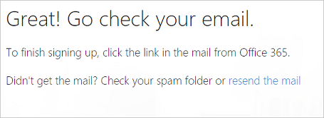
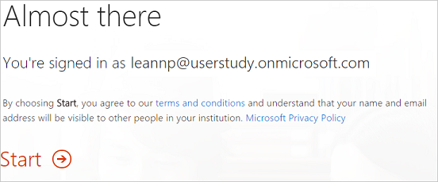
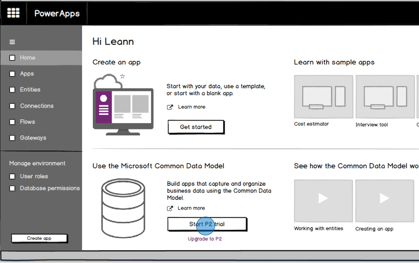
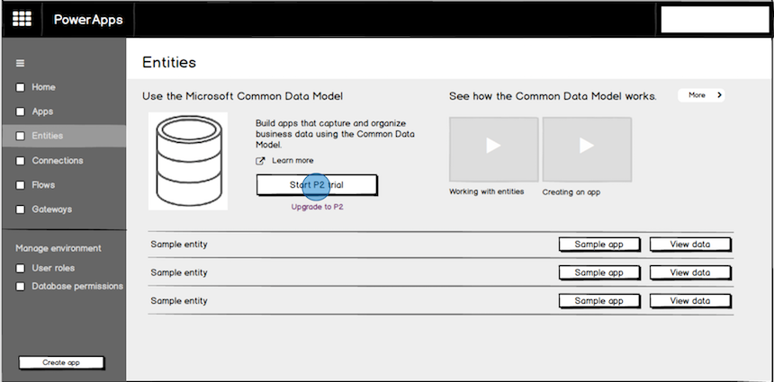

<properties
    pageTitle="Self-service sign up for PowerApps | Microsoft PowerApps"
    description="Follow these steps in order to signup for PowerApps as an individual."
    services=""
    suite="powerapps"
    documentationCenter="na"
    authors="jamesol-msft"
    manager="anneta"
    editor=""
    tags=""
 />
<tags
    ms.service="powerapps"
    ms.devlang="na"
    ms.topic="article"
    ms.tgt_pltfrm="na"
    ms.workload="na"
    ms.date="10/23/2016"
    ms.author="ricksal;jamesol"/>

# Self-service sign up for PowerApps #
Signing up for PowerApps, as an individual, is easy! You can choose to use a PowerApps trial account, purchase PowerApps Plan 1, or purchase PowerApps Plan 2, even if you are in an existing organization. Once you have determined which you would like to use, this article will walk you through the steps to get up and running.

For administration information, see [Purchase PowerApps for your organization](signup-for-powerapps-admin.md) or [PowerApps in your organization Q&A](signup-question-and-answer.md).

## TBD: UPDATE with new content

## What email addresses can you use with PowerApps ##
To sign up for PowerApps, enter your work or school email address.

> **NOTE** Currently, consumer email services, telecommunication providers, government, and military addresses are not supported. This includes:  
>
> - outlook.com, hotmail.com, gmail.com, and so on  
> - .gov and .mil

If you try to sign up with a personal email address, a message indicates that you must use a work or school email address.

## Sign up for PowerApps ##
1. Near the upper-right corner, click or tap **Sign up free**.

	If you're viewing this content on a phone, click or tap the menu icon in the upper-right corner, and then click or tap **Sign up free**.

  

2. In the dialog box, type your work or school email address, and then click or tap **Sign up**.  

	

3. If your account doesn't exist within an organization, you get a message to check your email:

	

	If your account is part of an existing organization, you get a message asking you to sign in with that account. Select **Sign in**, and sign in with your work account:  

	

4. If you received an email, select the link within the email to verify your email address. After you verify your address, you may need to enter some additional information about yourself.

5. If you have an existing organizational account, you see a message asking you to select **Start**:  
  

6. You're then taken to [powerapps.com][2], and you can start to use PowerApps.

  

## Enhanced services

### Upsell for P1

TBD I don't know what our story is here.

### Common Data Services

You may wish to have your app store data in a database. Microsoft Common Data Services can enable you to do this, and you can sign up for a free 90-day trial of Microsoft's P2 License.

1. To use Common Data Services, click or tap on **Start P2 trial**.

  

2. Click or tap **Start now**.

  

3. You can now start creating your database. For more information, see .
TBD: probably the wrong page to show...

  

## Troubleshoot ##
In many cases, you register for PowerApps by following the sign-up steps in this topic. However, sign-up may fail because of any of several reasons. The following table summarizes some of the most common reasons and ways you can workaround these issues.

| Symptom / Error Message |Cause and Workaround|
|---|---|
| **Personal email addresses (e.g. nancy@gmail.com)**     You receive a message like the following during signup:     `You entered a personal email address: Please enter your work email address so we can securely store your company's data.`     or     `That looks like a personal email address. Enter your work address so we can connect you with others in your company. And don’t worry. We won’t share your address with anyone.`| PowerApps does not support email addresses provided by consumer email services or telecommunications providers.     To complete signup, try again using an email address assigned by your work or school.|
| **.gov or .mil email addresses**     You receive a message like the following during signup:     `PowerApps unavailable: PowerApps is not available for users with .gov or .mil email addresses at this time. Use another work email address or check back later.`     or     `We can't finish signing you up. It looks like Microsoft PowerApps isn't currently available for your work or school.` | PowerApps does not support .gov or .mil addresses at this time.|
| **Self-service signup disabled**     You receive a message like the following during signup:     `We can't finish signing you up. Your IT department has turned off signup for Microsoft PowerApps. Contact them to complete signup.`     or     `That looks like a personal email address. Enter your work address so we can connect you with others in your company. And don’t worry. We won’t share your address with anyone.` | Your organization’s IT administrator has disabled self-service signup for PowerApps.     To complete signup, contact your IT administrator and ask them to allow existing users to sign up for PowerApps and to allow new users to join your existing tenant.|
| **Email address is not an Office 365 ID**      You receive a message like the following during signup:     `We can't find you at contoso.com.  Do you use a different ID at work or school? Try signing in with that, and if it doesn't work, contact your IT department.` | Your organization uses IDs to sign in to Office 365 and other Microsoft services that are different than your email address.  For example, your email address might be Nancy.Smith@contoso.com but your ID is nancys@contoso.com.     To complete signup, use the ID that your organization has assigned to for signing in to Office 365 or other Microsoft services.  If you don't know what this is, contact your IT administrator. |

## Next steps

After you successfully sign up for PowerApps, you can start to create some apps. Here are some good resources:

[Get started](getting-started.md)  
[Run a sample app](open-and-run-a-sample-app.md)  
[Run an app in a browser](run-app-browser.md)  
[Run an app on a phone](run-app-client.md)  
[PowerApps in your organization Q&A](signup-question-and-answer.md)  

<!--Reference links in article-->
[1]: http://go.microsoft.com/fwlink/p/?LinkId=715583
[2]: http://go.microsoft.com/fwlink/p/?LinkId=708209
