<properties
	pageTitle="Understand data-form layout | Microsoft PowerApps"
	description="Create great-looking form layouts using rows and columns."
	services=""
	suite="powerapps"
	documentationCenter="na"
	authors="gregli-msft"
	manager="anneta"
	editor=""
	tags=""/>

<tags
	ms.service="powerapps"
	ms.devlang="na"
	ms.topic="article"
	ms.tgt_pltfrm="na"
	ms.workload="na"
	ms.date="05/23/2017"
	ms.author="gregli"/>

# Understand data-form layout in Microsoft PowerApps #
In PowerApps, you can easily create forms that are attractive and efficient to use. For example, consider this basic form for recording sales orders:

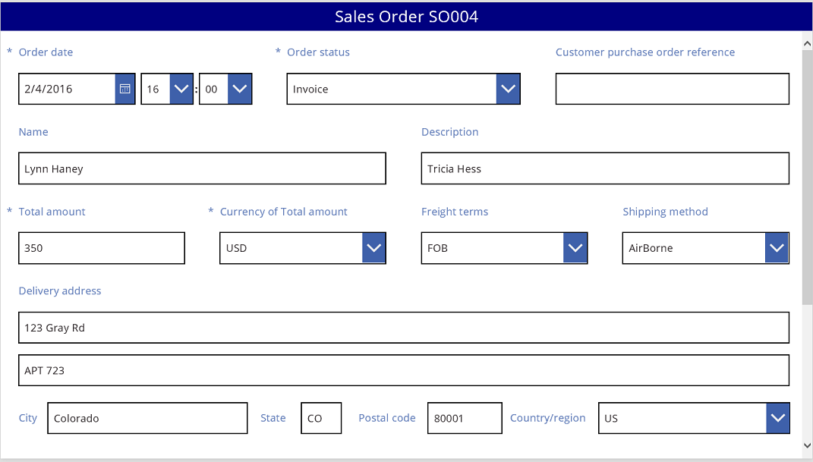

In this tutorial, we'll walk through the steps to create this form. We'll also look at some advanced topics, such as dynamic sizing of fields to fill available space.

## Before you start ##
If you're new to PowerApps (or have only generated an app automatically from data), you'll want to [build an app from scratch](get-started-create-from-blank.md) before you dive into this topic. By building an app from scratch, you'll become familiar with the concepts mentioned only in passing later in this topic, such as adding data sources and controls.

## Add a gallery ##
1. Create a tablet app from scratch.

	Everything discussed in this topic also applies to phone layouts, but phone apps often have only one vertical column.

1. Add the **Sales order** entity in the [Common Data Service](data-platform-intro.md) as a data source for the app.

	Outside of this tutorial, you can use any data source, including SharePoint lists and Excel tables.

1. Add a vertical **Gallery** control, change its **Layout** to show only a **Title and subtitle**, and set its **Items** property to **'Sales order'** so that the data appears.

	Later in this topic, you'll configure a form to show the record that the user selected in the gallery. For now, your screen should resemble this example:

	

## Add a form ##
1. Add a blank screen where you'll put the form.

	Outside of this tutorial, you can put the **Gallery** and **[Edit form](controls/control-form-detail.md)** controls on the same screen, but you'll have more room to work with if you put them on separate screens.

1. At the top of the new screen, add a **[Label](controls/control-text-box.md)** control, and configure it as a title bar.

 	For an example, see the graphic at the end of this procedure.

1. Show the sales-order number of the selected record by setting the label's **Text** property to this expression:
 **"Sales Order " & Gallery1.Selected.SalesOrderId**

1. Add an **Edit form** control, and then move and resize it to fill the screen under the label.

	In the next step, you'll connect the form control to the **Sales order** data source.

1. In the right-hand pane, click or tap the down arrow next to **No data source selected**, and then click or tap **Sales order**.

	A default set of fields from the **Sales order** data source will appear in a simple, three-column layout. However, they'll be blank and may take a few moments to settle into their final positions.  

1. Set the form's **Item** property to **Gallery1.Selected** to show a data from single record in the data source:

	

## Select fields to display ##
On the **Options** tab of the right-hand pane, you can show or hide a field by selecting or clearing its check box. You can also reorder fields by dragging them up or down and then dropping them in the locations that you want.

## Data cards ##
Each field displayed has a corresponding data card on the form. This card comprises a set of controls for the field title, an input box, a star (which appears if the field is required), and a validation error message.

You can also select cards directly on the form. When selected, a black caption appears above the card. To delete a card, select it, and then press Delete.

You can also reorder cards by dragging them in the form. Select the black caption, and then drag it to a different location. You can drop the card on either end of an existing card, and a gray drop zone appears while you hover.

## Snap to columns ##
When turned on, "Snap to columns" will organize all the cards into the specified number of columns. By default, tablet apps have three columns, and phone apps have one.

You can change the number of columns at any time, and all the cards will be re-sized to fit the new number of columns. In this graphic, we've changed the form to four columns:

If you select a card, you can increase its width by dragging the left or right border of its selection box until it spans multiple columns. As you drag the border, the card will "snap" to column boundaries.

## Varying number of columns ##
Depending on the width of each card, each row can have a different number of cards (or columns). For example, your first row might contain two fields, your second row might have four, and your third row might have three.

To have rows that contain a variety of 2, 3, or 4 columns, let's switch to 12 columns. Initially, this doesn't look any different than 4 column option, but now we have more snap points for the widths and positions of cards. 12 columns is commonly used in user interface design because it's evenly divisible by 1, 2, 3, 4, and 6.

Since 6 and 12 are large numbers, by default cards will span 2 or 3 columns respectively but can be sized smaller or larger after they are initially placed.

Let's position and size our cards to where we want them to be:

1. Set the number of columns to 12. This won't look any different since we were already using 4 columns, but we will soon discover that we have more snap points.

	

1. Drag and drop the "Postal code of Delivery address" card to the second half (indicating after) the "Country/Region of Delivery address". The cards will automatically re-layout to fill the space left behind.

	

2. Re-size the "Order date" card by dragging the right drag handle to the right one snap point. It will not take up one more twelfth of the form, now at 4/12 or 1/3. This is the right size for 3 cards across.

	

3. Re-size the "Order status" card to take up one more twelfth of the form also now at 1/3.

	

4. Drag and drop the "Customer purchase order reference" card to the second half (indicating after) of the "Order status" card.

	

1. Re-size the card we just moved to fill out the form.

	

5. Re-size the "Name" card to take up 6/12 or 1/2 of the form, halfway across.

	

6. Re-size the "Description" card to take up 6/12 or 1/2 of the form, consuming the other half of that same row.

	

1. Now let's turn our attention to the address fields. We'll make the first line of the Delivery address stretch entirely across the form:

	

1. And the same for the second address line:

	

All done. We have our desired form, mixing rows with 1, 2, 3, and 4 columns:

## Data-card manipulations ##

The delivery address is made up of lots of pieces of information that we want to visually group together for the user. Each field will remain in its own data card, but we can manipulate the controls within the card to make them fit better together.

Let's start by changing the text of the "First line of Delivery address" to be the label for the group of controls, calling it simply "Delivery address". We can do this by selecting the label control within the card and typing a text string.

For the second line's label, we can select and delete the text. It is tempting to simply remove the label control and in many cases that will work fine. But there may be formulas that depend on that control being present. The safer approach is to remove the text or to set the **Visible** property of the control to **False**.

We can now move the input text box over the label to reduce the space between the first and second lines of the address. The size of the card will shrink as the contents within them take up less space.

Now let's turn our attention to the third line of the address. Similar to what we just did, let's shorten the text of each label for these cards and arrange the input text box to be to the right of each label. Here are the steps for the State card:

| Step | Description | Result |
|------|-------------|--------|
| 1 | Start by selecting the state card. Notice that grab handles appear around the card. |  |
| 2 | Select the label within this card. Notice that grab handles are now around the interior label control. | 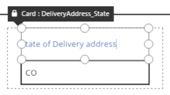
| 3 | Place the cursor to the right of the text, and delete the portion we don't need. | 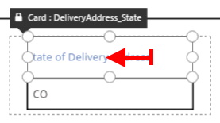 |
| 4 | Using the grab handles on the sides, size the label control to fit the new text size. |  |
| 5 | Select the text input control within this card. | 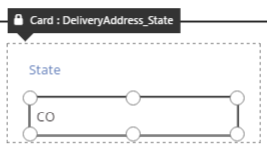 |
| 6 | Using the grab handles on the sides, size the text input control to the size desired. |  |
| 7 | Drag and drop the text input box up and to the right of the label control. |  |
| 8 | Our modifications to the state card are now complete. | 

The result for the complete third address line:

Note that many of the cards start out with dynamic formulas for their properties. For example, the Text input control we sized and moved above had a Width property based on the width of its parent. These dynamic formulas are lost when you drag-and-drop and are replaced with static values. If desired, you can restore the dynamic formulas by using the formula bar.

## Turning off snap to columns ##

Sometimes you will want finer control than the standard 12 columns can provide. For these cases you can turn off "Snap to columns" and position cards manually. The form will continue snapping to 12 columns, but you can also hold down the ALT key to manually position and size a card as desired.

In our example, the four components that make up the third line of the address all have exactly the same width. But this may not be the best layout, as City names are often longer than State names, and the input control for Country/region is short due to the length of its label.

To adjust this, turn off "Snap to columns" in the right hand pane. You can now hold down the ALT key while sizing and positioning these cards. While doing this, you will notice that all the controls on the screen will show black captions which is by design; this is a shortcut for seeing control names.

After careful positioning, the result has appropriate sizes for each field and even spacing horizontally between fields:

In summary, what are the differences when snap to columns is on versus off?

| Behavior | Snap to columns On | Snap to columns Off |
|---|----|----|
| Resize snaps to | Number of columns you select 1, 2, 3, 4, 6, or 12 | 12 |
| Resize snap can be overriden | No | Yes, with ALT key |
| Cards automatically re-layout between rows (more on this later) | Yes | No |

## Card properties ##

As with everything in PowerApps, the form's layout is governed by properties on the card controls. The drag-and-drop positioning and sizing we have covered so far all manipulate these properties on your behalf. But there will be situations in which you will want to understand and manipulate these properties yourself, especially when making your forms dynamic with formulas.

### Basic Layout: X, Y, and Width ###

The position of cards is controlled with the **X** and **Y** properties. When we are working with controls on the raw canvas these properties provide an absolute position. But when in a form, these properties have a different meaning:

- **X**: Order within a row.
- **Y**: Row number.

Similar to controls on the canvas, the **Width** property specifies the minimum width of the card (more on the minimum aspect in a moment).

Let's take a look at the **X**, **Y**, and **Width** properties of the cards in our form:

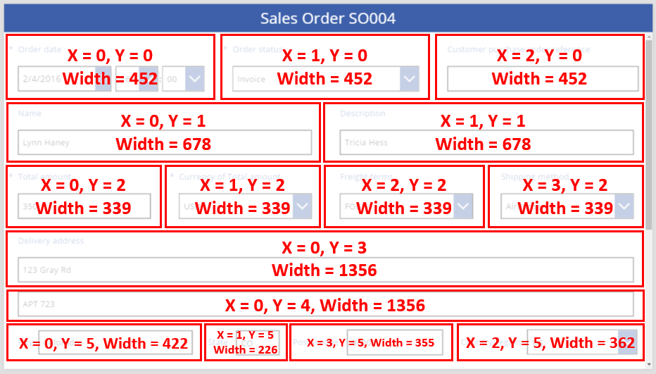

### Overflowing rows ###

What happens if the cards on a row are too wide to fit on that row? Normally you don't need to worry about this. With snap to columns on, these three properties will automatically be adjusted so that everything fits nicely within rows without overflowing.

But with snap to columns turned off or formula based **Width** on one or more of your cards, overflowing a row can happen. In this case, the cards will automatically wrap to create effectively a *new* row. For example, let's manually change the **Width** property of our "Customer purchase order reference" card (first row, third item) to 500 (first row, third card):

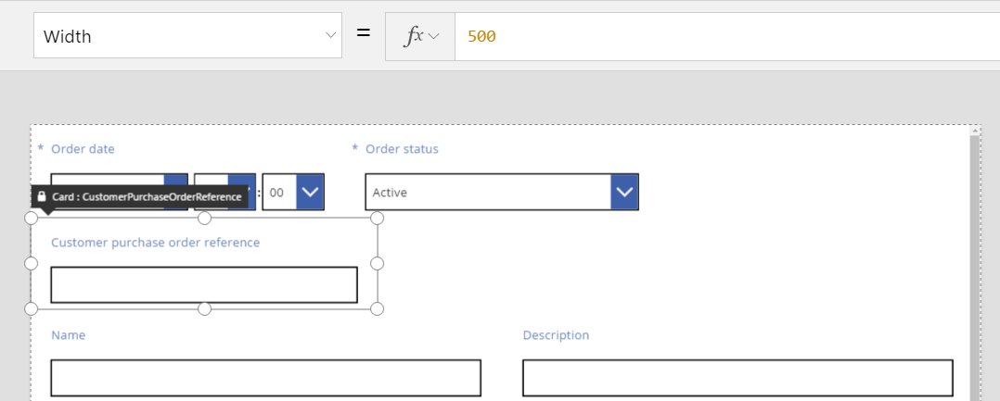

Notice that the three cards on the top row no longer fit in the horizontally and that effectively a new row has been created to wrap the overflow. The **Y** coordinate for all these cards is still the same at 0, and the "Name" and "Description" cards still have a **Y** of 1. Cards will not be merged across rows with different **Y** values.

You can use this behavior to create a fully dynamic layout where cards are placed based on a Z-order, filling across as much as possible and then moving to the next row. To do this, give all the cards the same **Y** value, and use **X** for the order of the cards.

### Filling spaces: WidthFit ###

The overflow in the last example created a space after the second "Order status" card of the first row. We could manually adjust the Width properties of the two remaining cards to fill this space but this is tedious.

As an alternative, use the **WidthFit** property. If one or more cards of a row have this property set to **True**, any remaining space on the row will be evenly divided between them. This is why we said earlier that the **Width** property of a card is a *minimum* and what is actually seen can be wider. Note that the card will not shrink in size, only expand.

If we set **WidthFit** on the second "Order status" card then the first card will remain unchanged while the second card fills the available space:

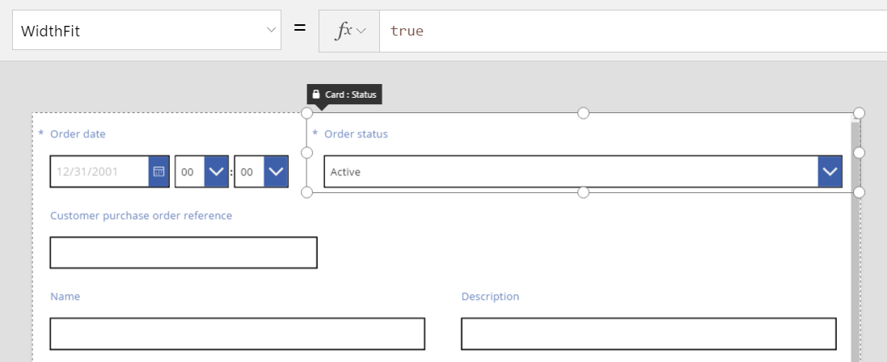

If we also set **WidthFit** on the first "Order date" card the both cards will evenly split the available space:

Note that grab handles on these cards take into account the extra width provided by **WidthFit**, not the minimum width provided by the **Width** property. It can be confusing to manipulate the **Width** property while **WidthFit** is turned on; 	you may want to turn it off, make changes to **Width**, and then turn it back on.

When might **WidthFit** be useful? If you have a field that is only used in certain situations, you can set its **Visible** property to **False** and the other cards on the row will automatically fill the space around it. You might want to use a formula that shows a field when another field has a particular value.

Here, we will set the **Visible** property of the "Order status" field to a static **False**:

With the second card effectively removed, the third card can now return to the same row as the first card. Since the first card still has **WidthFit** set to **True**, it alone expands to fill the available space.

Since it is now invisible, selecting the second card can become difficult. The screen explorer on the left hand side of the screen can be very helpful for selecting the card.

### Height ###

The **Height** property governs the height of each card. Be aware that cards have the equivalent of **WidthFit** for **Height**, and it's always set to **true**. Imagine there were a HeightFit property, but don't go looking for it in the product because it's not yet exposed.

You can't turn off this behavior, so changing the heights of cards can be challenging. All cards within a row will appear to be the same height as the tallest card. You may be looking at a row like this:

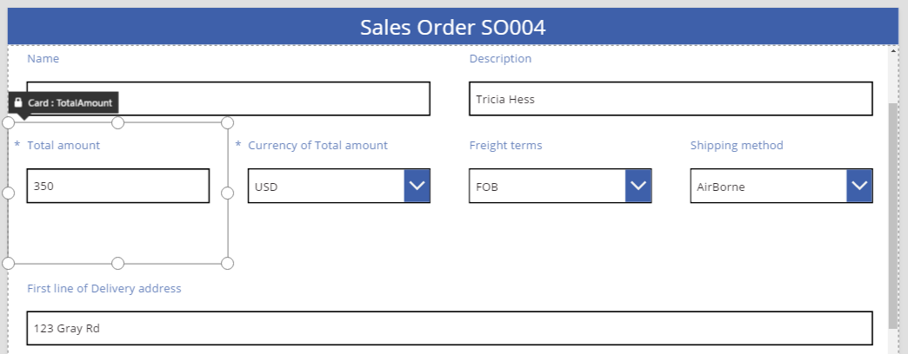

Which card is making the row tall? In the previous graphic, the "Total amount" card is selected and appears tall, but its **Height** property is set to 80 (same as the height of the first row). Except for the tallest card of the row, selecting any other card and attempting to change the height through drag-and-drop won't show any changes. You'll need to look at the **Height** property for each card to discover the one that's making the row tall.

### AutoHeight ###

Another factor that impacts the height of a card when rendered is if any controls within the card have their **AutoHeight** property set to **true**. Many cards provide a label to display an error message if the field's value causes a validation problem.

Without any text to display (no error) the label collapses to zero height. If you didn't know any better, you wouldn't know it was there, and that's as it should be:

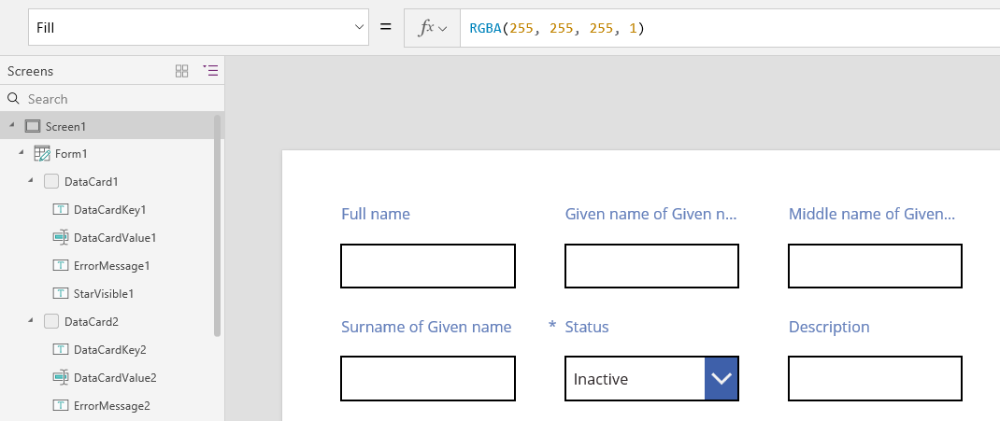

The screen explorer in the left-hand pane shows **ErrorMessage1**, which is our label control. At authoring time only, selecting this control will give the control some height, providing grab handles that help you position and size the control. The "A" in a blue box indicates that the control has **AutoHeight**:

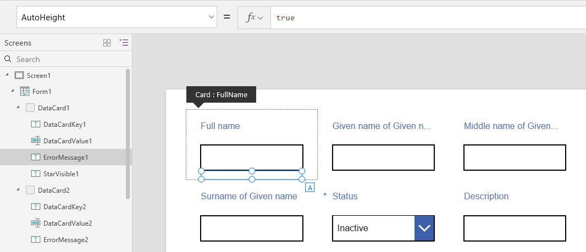

The **Text** property of this control is set to **Parent.Error**, which is used to obtain dynamic error information based no validation rules. For illustration purposes, let's statically set the **Text** property of this control, which will increase the height of the control (and, by extension, the card) to accommodate the length of the text:

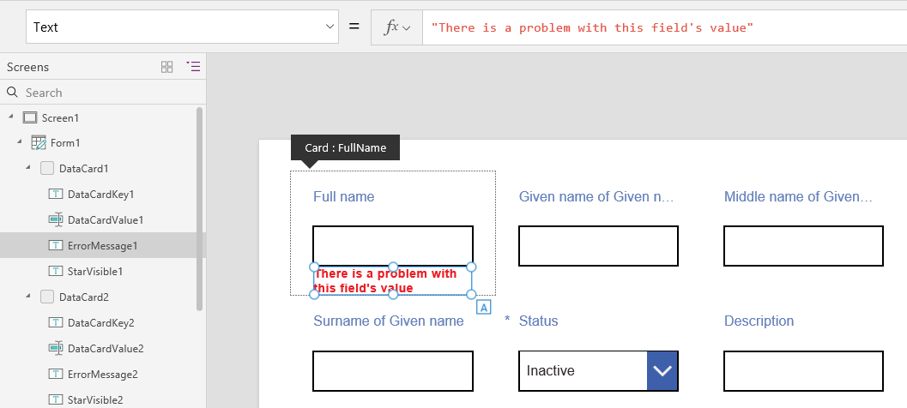

Let's make the error message a little longer, and again the control and the card grow to accommodate. Note that the row overall grows in height, retaining vertical alignment between the cards:

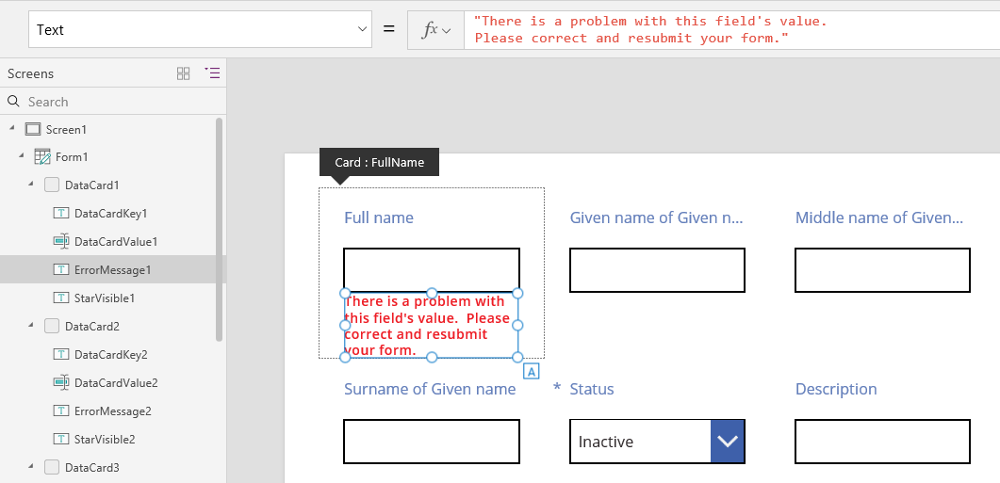
