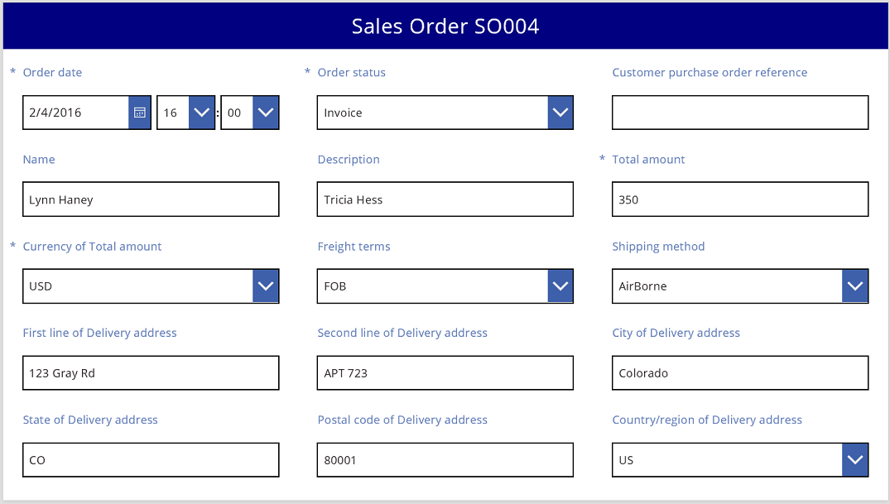
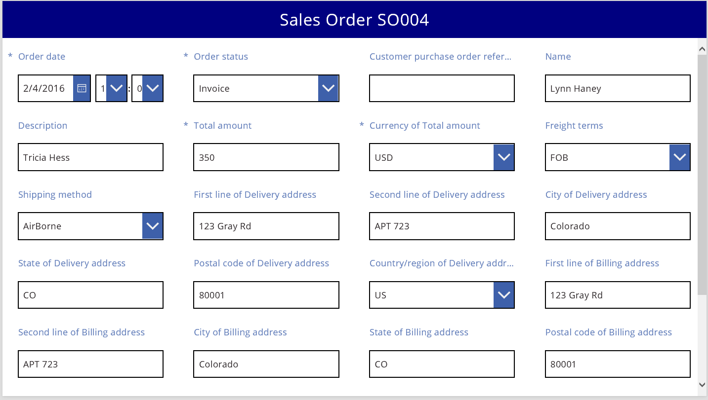
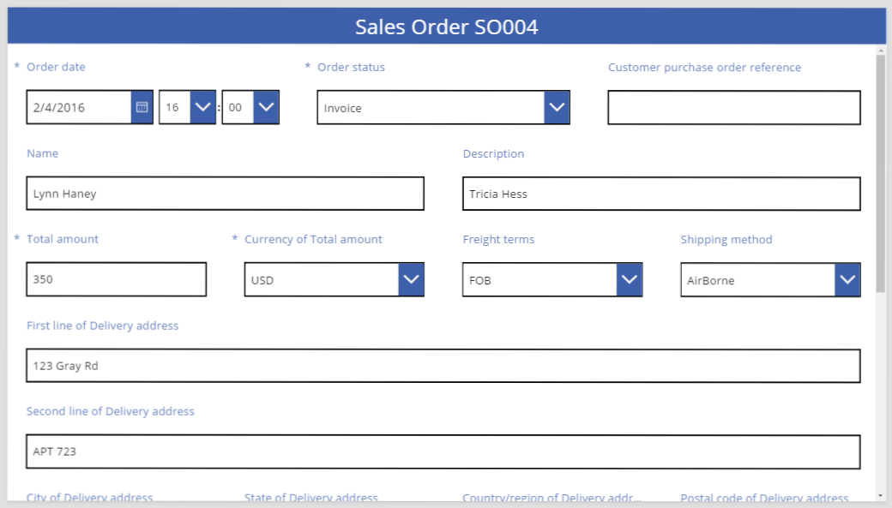
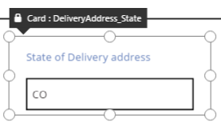
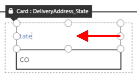
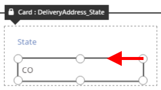
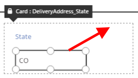
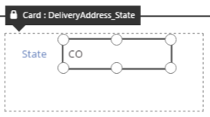
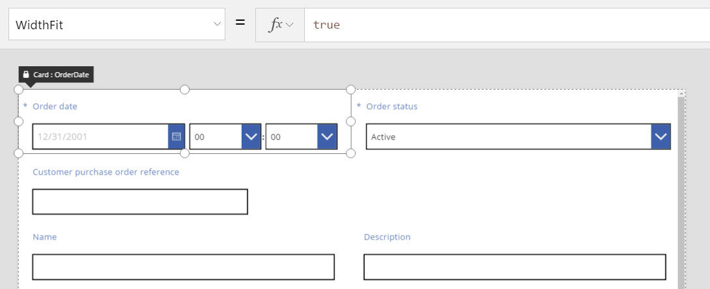

<properties
	pageTitle="Understand data form layout | Microsoft PowerApps"
	description="Create great looking form layouts using rows and columns."
	services=""
	suite="powerapps"
	documentationCenter="na"
	authors="gregli-msft"
	manager="anneta"
	editor=""
	tags=""/>

<tags
   ms.service="powerapps"
   ms.devlang="na"
   ms.topic="article"
   ms.tgt_pltfrm="na"
   ms.workload="na"
   ms.date="05/23/2017"
   ms.author="gregli"/>

# Understand data form layout in Microsoft PowerApps #

PowerApps makes it easy to create forms that are attractive and efficient to use.  For example, consider this basic sales order form:

In this articule, we'll walk through the steps to create this form.  We'll also look at some advanced topics such as dynamic sizing of fields to fill available space.

## Getting started ##

To begin, [create a new tablet app](get-started-create-from-blank.md).  Everything discussed here applies to phone layouts as well but phone apps often only have one vertical column.

[Connect to a data source](add-manage-connections.md).  In this example, we are using the "Sales order" entity in the [Common Data Service](data-platform-intro.md).  Any data source can be used including collections.

You will want a way to select a particular record from this data source.  On your first screen, insert a [**Gallery** control](controls/control-gallery.md) and connect it to the data source.  We can then use **Gallery1.Selected** to refer to the currently selected record.  Your screen should look something like this:

In order to have plenty of room to work with, create another blank screen where we will put our form.  The **Gallery** and [**Edit form** control](controls/control-form-detail.md) can be on the same screen.

Insert a [**Label** control](controls/control-text-box.md) at the top of this screen.  Here we will have our title bar with sales order number displayed.  Using the ribbon, change the fill color to blue, the text color to white, and increase the font size as desired.  Enter the formula for the Text property as **"Sales Order " & Gallery1.Selected.SalesOrderId**.

Insert an Edit form control and enlarge it to fill the entire screen.  Connect this form control to the Sales order data source.  It may take a few moments for the data cards to be added and then a few more moments for the cards to settle into their final positions.  Connect the Item property to **Gallery1.Selected**.  And you should see a very basic form layout with three columns:

## Selecting fields to display ##

Initially, the form will be filled with a default set of fields.

You can turn fields on and off with the right hand panel under Options.  Simply select the eyeball icon to make the field visible or not.   

To reorder the fields you can drag and drop them in the right hand pane.  

## Data cards ##

Each field displayed has a corresponding data card on the form.  This card is made up of a set of controls for the field title, input box, required star, and validation error message.  

You can also select cards directly on the form.  When selected, a black caption appears above the card.  Once selected, to remove a card press the delete key.

You can also drag and drop cards in the form to reorder them.  Select the black caption and drag and drop it to a new location.  You can drop on either end of an existing card and while hovering a gray drop zone will appear.  

## Snap to columns ##

When turned on, "Snap to columns" will organize all the cards into the specified set of columns.  The default for tablet layouts is 3 columns and for phone layouts it is 1 column.  

You can change the number of columns at any time and all the cards will be re-sized to fit the new number of columns.  Here we have changed our form to 4 columns:

Cards can span multiple columns.  Drag and drop the width of the card and it will "snap" to column boundaries.  

## Varying number of columns ##

To have rows that contain a variety of 2, 3, or 4 columns, let's switch to 12 columns.  Initially, this doesn't look any different than 4 columns but now we have more snap points for the widths and positions of cards.  12 columns is commonly used in user interface design as it is evenly divisible by 1, 2, 3, 4, and 6.  

Since 6 and 12 are large numbers, by default cards will span 2 or 3 columns respectively but can be sized smaller or lager after they are initially placed.  

Let's position and size our cards to where we want them to be:

0. Set the number of columns to 12.  This won't look any different since we were already using 4 columns, but we will soon discover that we have more snap points.

	

1. Drag and drop the "Postal code of Delivery address" card to the second half (indicating after) the "Country/Region of Delivery address".  The cards will automatically re-layout to fill the space left behind.

	

2. Re-size the "Order date" card by dragging the right drag handle to the right one snap point.  It will not take up one more twelfth of the form, now at 4/12 or 1/3.  This is the right size for 3 cards across. 

	

3. Re-size the "Order status" card to take up one more twelfth of the form also now at 1/3.

	

4. Drag and drop the "Customer purchase order reference" card to the second half (indicating after) of the "Order status" card.

	

1. Re-size the card we just moved to fill out the form.

	

5. Re-size the "Name" card to take up 6/12 or 1/2 of the form, halfway across.

	

6. Re-size the "Description" card to take up 6/12 or 1/2 of the form, consuming the other half of that same row.

	

1. Now let's turn our attention to the address fields.  We'll make the first line of the Delivery address stretch entirely across the form:

	

1. And the same for the second address line:

	

All done.  We have our desired form, mixing rows with 1, 2, 3, and 4 columns:

## Data card manipulations ##

The delivery address is made up of lots of pieces of information that we want to visually group together for the user.  Each field will remain in it's own data card, but we can manipulate the controls within the card to make them fit better together.

 

Let's start by changing the text of the "First line of Delivery address" to be the label for the group of controls, calling it simply "Delivery address".  We can do this by selecting the label control within the card and typing a text string.

 

For the second line's label, we can select and delete the text.  It is tempting to simply remove the label control and in many cases that will work fine.  But there may be formulas that depend on that control being present.  The safer approach is to remove the text or to set the **Visible** property of the control to **False**. 

 

We can now move the input text box over the label to reduce the space between the first and second lines of the address.  The size of the card will shrink as the contents within them take up less space.

 

Now let's turn attention to the third line of the address.  Similar to what we just did, let's shorten the text of each labels for these cards and arrange the input text box to be the right of each label.  Here are the steps for the State card:

| Step | Description | Result |
|------|-------------|--------|
| 1 | Start by selecting the state card. Notice that grab handles appear around the card.  |  | 
| 2 | Select the label within this card.  Notice that grab handles are now around the interior label control. | 
| 3 | Place the cursor to the right of the text, and delete the portion we don't need. |  |
| 4 | Using the grab handles on the sides, size the label control to fit the new text size. |  |
| 5 | Select the text input control within this card. |  |
| 6 | Using the grab handles on the sides, size the text input control to the size desired. |  |
| 7 | Drag and drop the text input box up and to the right of the label control. |  |
| 8 | Our modifications to the state card are now complete.  | 

The result for the complete third address line:
 
 

Note that many of the cards start out with dynamic formulas for their properties.  For example, the Text input control we sized and moved above had a Width property based on the width of its parent.  These dynamic formulas are lost when you drag-and-drop and are replaced with static values.  If desired, you can restore the dynamic formulas by using the formula bar.

## Turning off snap to columns ##

Sometimes you will want finer control than the standard 12 columns can provide.  For these cases you can turn off "Snap to columns" and position cards manually.  The form will continue snapping to 12 columns, but you can also hold down the ALT key to manually position and size a card as desired.

In our example, the four components that make up the third line of the address all have exactly the same width.  But this may not be the best layout, as City names are often longer than State names, and the input control for Country/region is short due to the length of its label.  

To adjust this, turn off "Snap to columns" in the right hand pane.  You can now hold down the ALT key while sizing and positioning these cards.  While doing this, you will notice that all the controls on the screen will show black captions which is by design, this is a shortcut for seeing control names.

 

After careful positioning, the result with appropriate sizes for each field and even spacing horizontally between fields:

 

In summary, what are the differences when snap to columns is on versus off?

| Behavior | Snap to columns On | Snap to Columns Off |
|---|----|----|
| Resize snaps to | Number of columns you select 1, 2, 3, 4, 6, or 12 | 12 |
| Resize snap can be overriden | No | Yes, with ALT key |
| Cards automatically re-layout between rows (more on this later) | Yes | No |

## Card properties ##

As with everything in PowerApps, the form's layout is governed by properties on the card controls.  The drag-and-drop positioning and sizing we have covered so far all manipulate these properties on your behalf.  But there will be situations in which you will want to understand and manipulate these properties yourself, especially when making your forms dynamic with formulas. 

### Basic Layout: X, Y, and Width ###

The position of cards is controlled with the X and Y properties.  When we are working with controls on the raw canvas these properties provide an absolute position.  But when in a form, these properties have a different meaning:

- **X**: Order within a row.
- **Y**: Row number.

Similar to controls on the canvas, the Width property specifies the minimum width of the card (more on the minimum aspect in a moment).    

Let's take a look at the X, Y, and Width properties of the cards in our form:

### Overflowing rows ###

What happens if the cards on a row are too wide to fit on that row?  The cards will automatically wrap to create effectively a *new* row.  For example, let's manually change the Width property of our "Customer purchase order reference" card (first row, third item) to 500 (first row, third card):

Notice that the three cards on the top row no longer fit in the horizontally and that effectively a new row has been created to wrap the overflow.  The Y coordinate for all these cards is still the same at 0, and the "Name" and "Description" cards still have a Y of 1.  Cards will not be merged across rows with different Y values.

When sizing and positioning cards with snap to columns on, these three properties will automatically be adjusted so that everything fits nicely within rows without wrapping.

### Filling spaces: WidthFit ###

The overflow in the last example created a space after the second "Order status" card of the first row.  We could manually adjust the Width properties of the two remaining cards to fill this space but this is tedious.  

An alternative is to use the **WidthFit** property.  If one or more cards of a row have this property set to **True**, any remaining space on the row will be evenly divided between them.  This is why we said earlier that the **Width** property of a card is a *minimum* and what is actually seen be wider.  Note that the card will not shrink in size, only expand.  

If we set **WidthFit** on the second "Order status" card then the first card will remain unchanged while the second card fills the available space:

If we also set **WidthFit** on the first "Order date" card the both cards will evenly split the available space:

Note that grab handles on these cards reflect their expanded form.  It can be confusing to manipulate the Width property while WidthFit is turned on - you may want to turn it off, make changes to Width, and then turn it back on.

When might **WidthFit** be useful?  If you have a field that is only used in certain situations, you can set its **Visible** property to **False** and the other cards on the row will automatically fill the space around it.  You might want to use a formula that shows a field when another field has a particular value.  

Here, we will set the **Visible** property of the "Order status" field to a static **False**:

With the second card effectively removed, the third card can now return to the same row as the first card.  Since the first card still has **WidthFit** set to **True**, it alone expands to fill the available space.

Since it is now invisible, selecting the second card can become difficult.  The screen explorer on the left hand side of the screen can be very helpful for selecting the card. 

### Height ###

The Height property governs the height of each card.  But be aware that cards have the equivalent of **WidthFit** for Height and it always set to **True**.  Imagine there was a **HeightFit** property, but don't go looking for it in the product as it is not exposed (yet). 

Since you cannot turn off this behavior, changing the heights of cards can be challenging as all cards within a row will appear to be the same height as the tallest card.  You may be looking at a row like this:

But which card is making the row tall?   In the picture above, the "Total amount" card is selected and appears tall, but in this case it isn't the "Total amount" card as its **Hieght** property is set to 80 (same as the height of the first row).  Except for the tallest card of the row, selecting any other card and attempting to change the height through drag-and-drop will not show any changes.  You will need to look at the **Height** property for each card to discover the one that is making the row tall.
 

  

  

  

 

