<properties
	pageTitle="Getting started with forms | Microsoft PowerApps"
	description="Use forms to collect and display information from a data source."
	services=""
	suite="powerapps"
	documentationCenter="na"
	authors="gregli-msft"
	manager="dwrede"
	editor=""
	tags=""/>

<tags
   ms.service="powerapps"
   ms.devlang="na"
   ms.topic="article"
   ms.tgt_pltfrm="na"
   ms.workload="na"
   ms.date="04/08/2015"
   ms.author="gregli"/>

# Understanding data forms #

Interacting with data involves three core activities, corresponding to three different controls in PowerApps:

| Activity | Control | Description |
|---------|------------|---------|
| **Browsing for records** | **[Gallery](controls/control-gallery.md)** control | Filtering, sorting, searching, and scrolling through the records of a data source to find the records desired.  To show many records on the screen at a time, only a few fields are shown. |
| **Viewing a record** | **[Display form](controls/control-form-detail.md)** control | Once a record has been identified, drilling in to see all the details or fields of the record. |
| **Editing a record** | **[Edit form](controls/control-form-detail.md)** control | Updating the fields of a record and saving those changes back to the underlying data source.  Facilities for editing are often used to create new records too. |

Visually, they might appear in your app as three different screens:

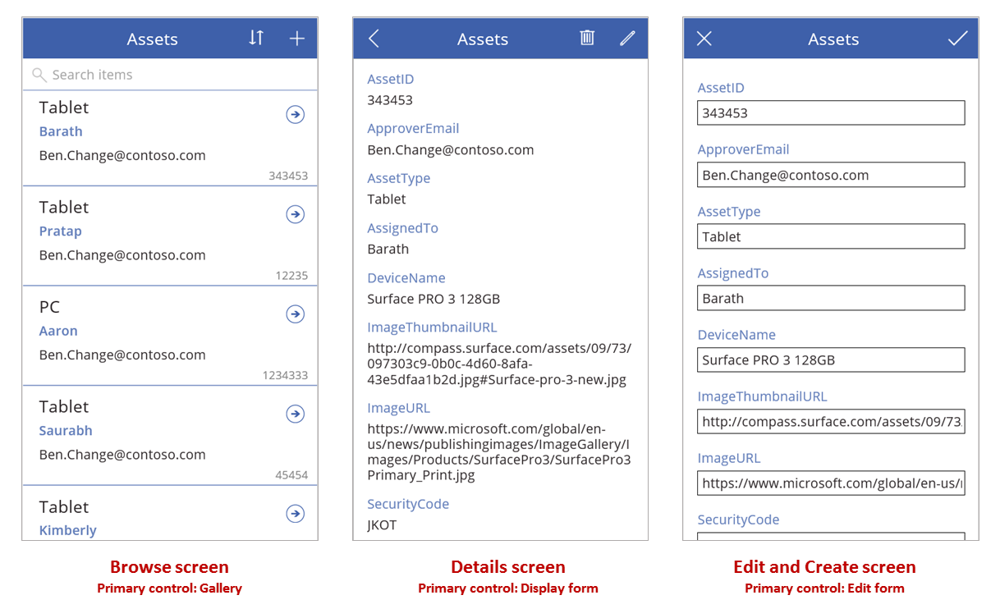

This article provides an overview of combining controls with formulas to create this user experience.

**Prerequisites**

- [Sign up](signup-for-powerapps.md) for PowerApps, [install](http://aka.ms/powerappsinstall) it, open it, and then sign in by providing the same credentials that you used to sign up.
- Learn how to [configure a control](add-configure-controls.md) in PowerApps.

## Dissecting an app created from data ##

PowerApps can generate an app from data for you.  The result is a set of screens, each with controls, and formulas that connect the controls together.  These apps can be used directly and can also be a great starting point for further customization.  Let's take a look at how one of those apps is constructed.  

### Browse screen ##

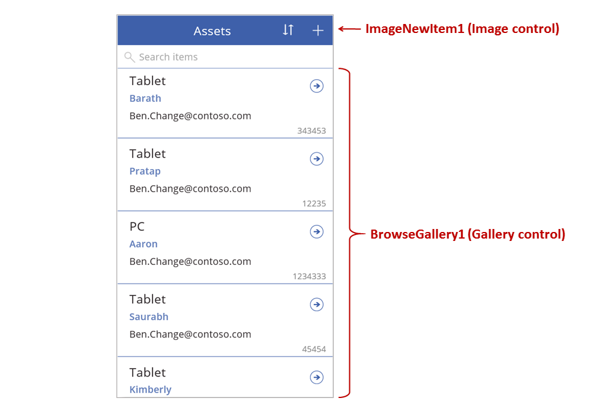

Key formulas:

| Control | Desired behavior | Formula |
|---------|--------|---------|
| **BrowseGallery1** | Display records from the Assets data source. | **Items = Assets** (simplified for now) |
| **ImageNewItem1** | Go to the edit screen to create a new record. | **OnSelect = NewForm( EditForm1 ); Navigate( EditScreen1, None )** |
| **NextArrow1** (in the gallery) | Go the detail screen to view the currently selected record. | **OnSelect = Navigate( DetailScreen1, None )** |

The primary control on this screen, that fills most of the screen's area, is the **Gallery** control.  This controls displays the records of a data source in a scrollable region, so that the end user can find the record they want to work with.

Wiring this control to the data source requires setting the **Items** property on the control.  In this case with "Assets" as the data source: **BrowseGaller1.Items = Assets**.  For a basic app, that is all the is required.  

Now if you look at what PowerApps creates when you ask to have an app created from data, **Items** will be set to a significantly more complicated formula than this, that supports searching and sorting.  We'll come back to this later.  But one of the strengths of PowerApps is that functions compose, and likewise decompose, allowing us to replace that large formula with something much simpler for the time being.

The second important control on this screen is at the top, the "+" button for creating new records.  This is actually an image control, filled with a "+" image.  When clicked, the following formula will be executed: **ImageNewItem1.OnSelect = NewForm( EditForm1 ); Navigate( EditScreen1, None )**.  This formula does two things.  First, it puts the EditForm1 **Edit form** control into **New** mode; instead of editing a record, it will create a new record instead.  And second, we change screens to show the edit screen.

Drilling into the gallery in the authoring experience, we see that **BrowseGallery1** is a container for other controls.  A controls template is defined for the first record, and then replicated for each additional record.  Let's select some of these controls to look at it in more detail:

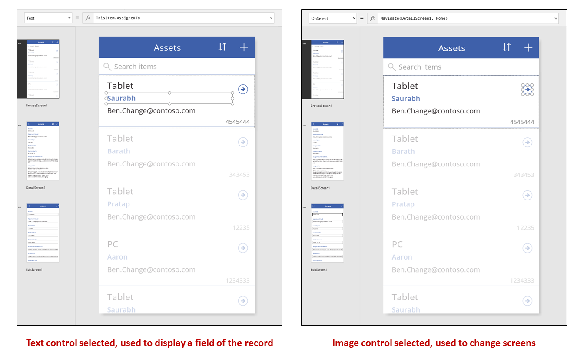

With the text control selected, we see that it's **Text** property is set to **ThisItem.AssignedTo**.  Through this formula, this control will display the **AssignedTo** field of the record.  Other text controls in the gallery template show different fields.  

With the image control selected, we see that it's **OnSelect** property is set to **Navigate( DetailScreen1, None )**.  When the user presses this image, acting much like a button, two things will happen.  First, since the user has interacted with a control for a particular record, it will be the selected record for the gallery and will appear as the value of the **Selected** property.  This is important since both the detail and edit screens use this fact to know what to display and edit.  Second, the **Navigate** function call will change the screen to the **DetailScreen1** and we will see the details of the currently selected record.

### Detail screen ###

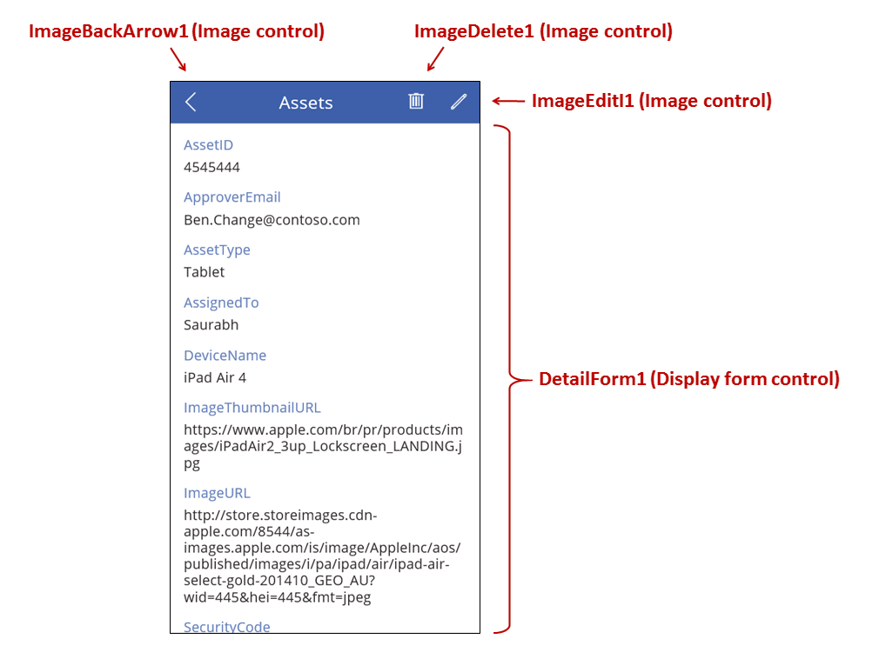

Key formulas:

| Control | Desired behavior | Formula |
|---------|--------|---------|
| **DetailForm1** | The data source this form works with | **DataSource = Assets** |
| **DetailForm1** | The record in the data source, currently selected by the user in the gallery | **Item = BrowseGallery1.Selected** |
| **Card** controls	| Within the **Display form** control, display a single field from the record | **DataField = "*field name*"** |
| **ImageBackArrow1** | User command: return to the browse screen | **OnSelect = Back()** |
| **ImageDelete1** | User command: delete this record | **OnSelect = Remove( Assets, BrowseGallery1.Selected )** |
| **ImageEdit1** | User command: Edit this record | **OnSelect = Navigate( EditScreen1, None )** |

At the top of the screen, we see three images that are acting as buttons.  These image controls are outside of the form and help orchestrate between the three screens of the app.

This screen is dominated by the **Display form** control.  This control displays the selected record in the gallery, through the formula **DetailForm1.Item = BrowseGallery1.Selected**.  It also uses its **DataSource** property in order to obtain meta-data about this data source, such as the user friendly display name for each field.

Drilling into the form control in the authoring experience, we see that **DetailForm1** is a container for **Card** controls.  Let's select one of these cards and take a closer look:

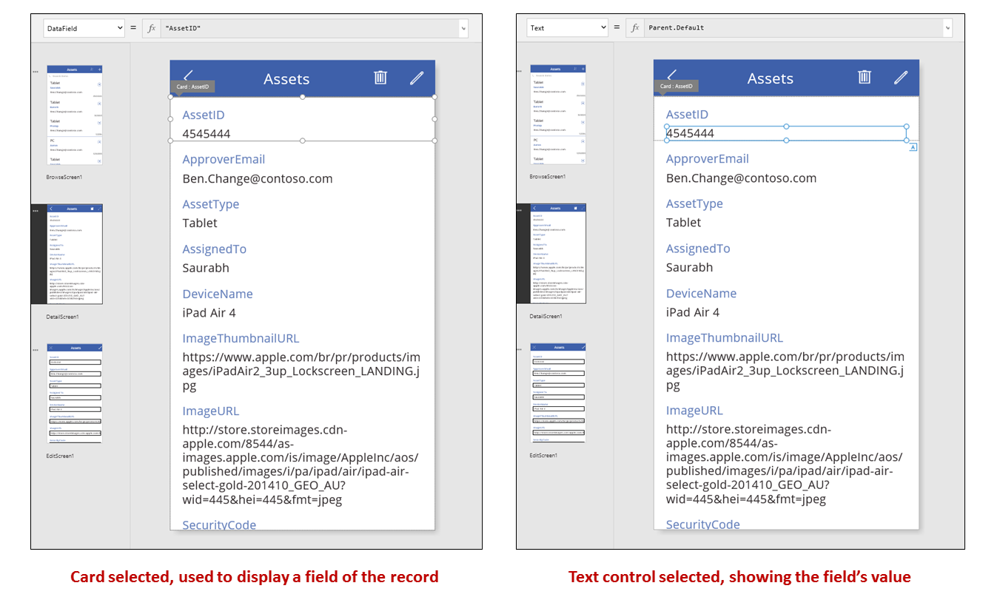

With the card selected, we see that the **DataField** property is set to "AssetID".  This is the field that this card will display.  Drilling into the card, we see that the card is made up of controls, and we can select these controls.  In the case, we have selected a text control which is bound to **Parent.Default**.  This text control is showing the **Default** value for the card, which is set through the **DataField** property.

Notice that the formula bar is gray for these two properties.  This card is *locked*: it was automatically generated by the PowerApp app from data process and some aspects cannot be modified unless the card is unlocked.  Even locked, the card can still be manipulated if we open up the options panel for this form:

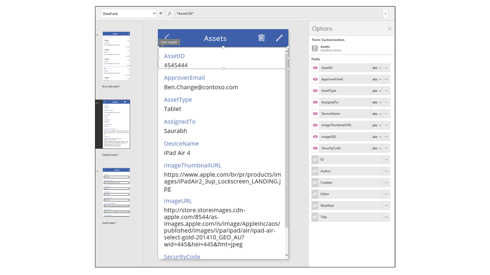

In the options pane, you can select which fields to display and which kind of card to use to display each field.

### Edit/Create screen ###

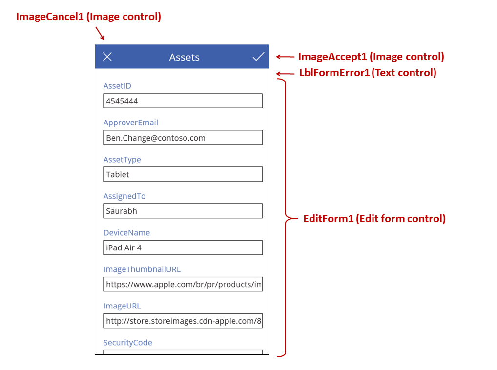

Key formulas:

| Control | Desired behavior | Formula |
|---------|--------|---------|
| **EditForm1** | The data source this form works with | **DataSource = Assets** |
| **EditForm1** | The record in the data source, currently selected by the user in the gallery | **Item = BrowseGallery1.Selected** |
| **Card** controls	| Within the **Edit form** control, edits a single field from the record | **DataField = "*field name*"** |
| **ImageCancel1** | User command: abandon any changes made by the user and return to the detail screen. | **OnSelect = ResetForm( EditForm1 ); Back()** |
| **ImageAccept1** | User command: Submit changes to the data source. | **OnSelect = SubmitForm( EditForm1 )** |
| **EditForm1** | If changes are accepted, return to the previous screen. | **OnSuccess = Back()** |
| **EditForm1** | If changes are not accepted, stay put and allow the user to fix any issues and try to submit again. | **OnFailure = *blank*** |
| **LblFormError1** | if changes were not accepted, we need to tell the user what is wrong.  | **Text = EditForm1.Error** |

Coming to our final screen, we find the **Edit form** control dominating this screen.  This control displays and allows the user to edit the selected record in the gallery, through the formula **EditlForm1.Item = BrowseGallery1.Selected**.  It also uses its **DataSource** property in order to obtain meta-data about this data source, such as the user friendly display name for each field, and to know where to push back changes.

Looking to the top of the screen, the "X" or cancel button performs two tasks.  First it resets the form to the state it was in before the user made any changes.  This is important for the scenario in which the user returns to this screen, where they should see the current record's value from the data source and not any abandoned edits.  Second, we return to the previous screen with the **Back** function, which in our case, will be the detail screen.

The "checkmark" or submit button performs just one task: it sends the user's changes to the data source by invoking the **SubmitForm** function.  But a few things are going to go on behind the scenes.  If the data source accepts the change, the form's **OnSuccess** formula will be evaluated, which in our case is set to **OnSuccess = Back()**, taking us back to the detail screen to see the result of the change.

Even more interesting is what happens if the data source does not accept the change.  In this case, the form's **OnFailure** formula will be evaluated, which for app is *blank* so nothing happens.  The form's **Error** property will be set to a user friendly error message, and this is displayed with the **LblFormError1** control on our screen.  Normally, this property is blank and nothing is shown.  In the error case, we do not use **Back** or **Navigate** to change screens; instead we stay where we are and allow the user to fix the issue that is preventing the data source from accepting the change, or abandon the change (by pressing the "X" Cancel icon).

As with the **Display form** control, the **Edit form** control is a container for **Card** controls: 

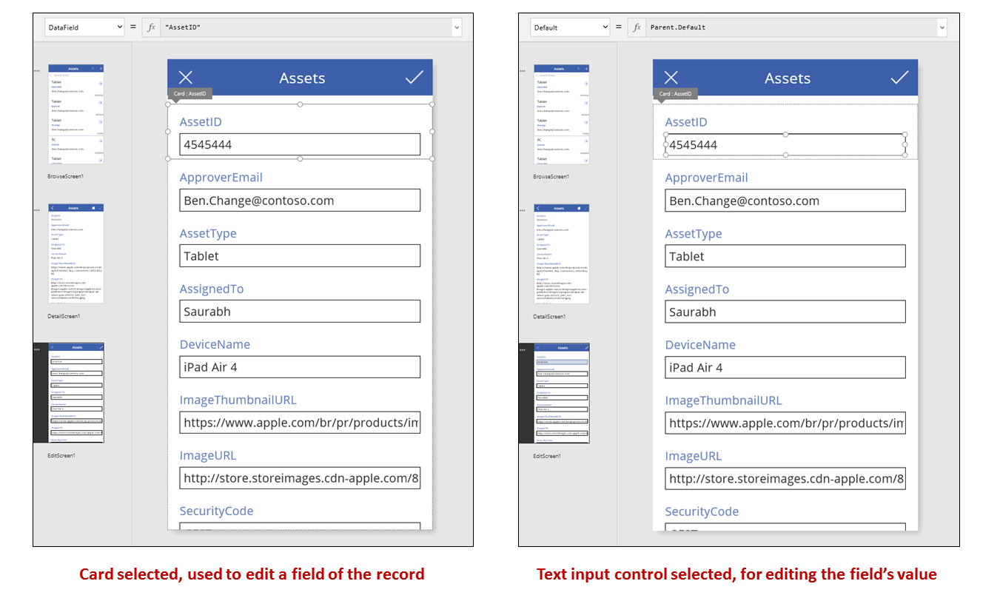

In this case, the card selected for the AssetID field contains an **Text input** control instead of a **Text** control that was used on the detail screen, since we are allowing the user to edit the field and not just see it.  The **Default** property of the **Text input** control is set to **Parent.Default** this time, and **Default** is appropriate since the user can change from this initial value.

Fields can be displayed or not, rearranged, and cards changed just as we did for the **Display form** control.

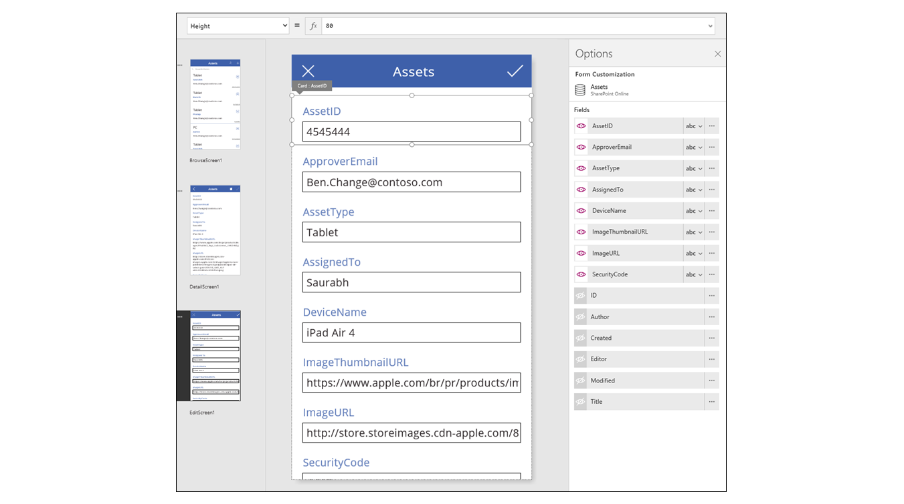

## Building a data app from scratch ##

Now that we have seen how PowerApps created a data app, let's build one of our own from scratch.  We'll use the same building blocks and formulas that we dissected above.

## Example data source ##

Let's start at the very beginning.  To get the most from this article, it is helpful to have a data source with which you can experiment.  Something that you can read, and write, and it won't be a problem if it is written with test data.  The remainder of this article will assume a SharePoint list named "Ice Cream" with the following contents:

1. Create a new PowerApp from blank, for phones.  Tablet apps are very similar but you may want a different [screen layout](#screen-layouts) to make the most of the extra screen space.

1. Create a connection to this data source in PowerApps.  For the remainder of this article, we will assume a data source with the name "Ice Cream".

## Browsing records ##

The first step in editing a record, is finding the record to edit.  The **Gallery** control  is designed to show a gallery of records, that the user can scroll through and select from.

1. Using the "Insert" ribbon, insert a **Gallery** control, of type "Text gallery" and "Vertical".

2. Set the **Items** property of the **Gallery** control to: **'Ice Cream'**

The gallery is showing the first three fields for this data source, which is not what we want.  Let's clean this up:

1. Select the first text control in the gallery by selecting the text which is currently showing the created date and time.

2. Change its **Text** property to **ThisItem.Title**.  The text box will now reflect the Title of this item.

3. Remove the other two text boxes in the gallery.

4. Resize the **Gallery** control to fill the screen.

5. Resize the repeating section of the gallery to take up less space.

When you are done, your screen should look more like this (it need not be exactly the same):

Great, we are now showing all the rows from the SharePoint list.

## Viewing details ##

With the gallery, we can identify a record of interest, that we want to drill into to see the price and quantity on hand.  We use the **Display form** control to view details of the record.  

The **Display form** control uses two properties to display the record:

* **DataSource** property.  The name of the data source that holds the record.  This property is used to populate the options panel with fields and is used to determine the display name and data type (string, number, date, etc) for each field.  

* **Item** property.  The record to display.  This is often connected to the **Selected** property of the **Gallery** control, allowing us to drill into the record that was selected in the **Gallery** control.

Once the **DataSource** property is set, you can add and remove fields through the options panel, and change how those fields are displayed.

At this stage, we do not wish to intentionally or accidentally change any values of the record.  The **Display form** control is a read-only control, it will not modify a record.

To use the **Display form** control in our sample app:

1. Add a new screen from the "Insert" tab.

2. Also from the "Insert" tab, open the "Forms" chunk, and select the "Display" form control.

3. Set the **DataSource** property to **'Ice Cream'**.

4. Open the Options pane.

You can now select the fields to display on your screen.  You can also select which type of card to display for each field.  As you make changes in the Options pane, the **DataField** property on each **Card** control is set to the field your user will interact with.  Your screen should look similar to this:

Finally, we need to connect the **Display form** control to the **Gallery** control, so we can look at details for a specific record.  As soon as we complete setting the **Item** property, we will see the first record from the gallery in our form.

1. Set the **Item** property on the **Display form** control: **Gallery1.Selected**.  You should immediately see the details for the selected item in the gallery.

Great!  We now turn to navigation - how does a user get to this screen from the gallery screen and back again.

2. Add a **Button** control to the screen, and set its **OnSelect** property to: **Button1.OnSelect = Back()**.  This will return the user back to the gallery when they are done viewing details.  Set the label text on the button to "Back".

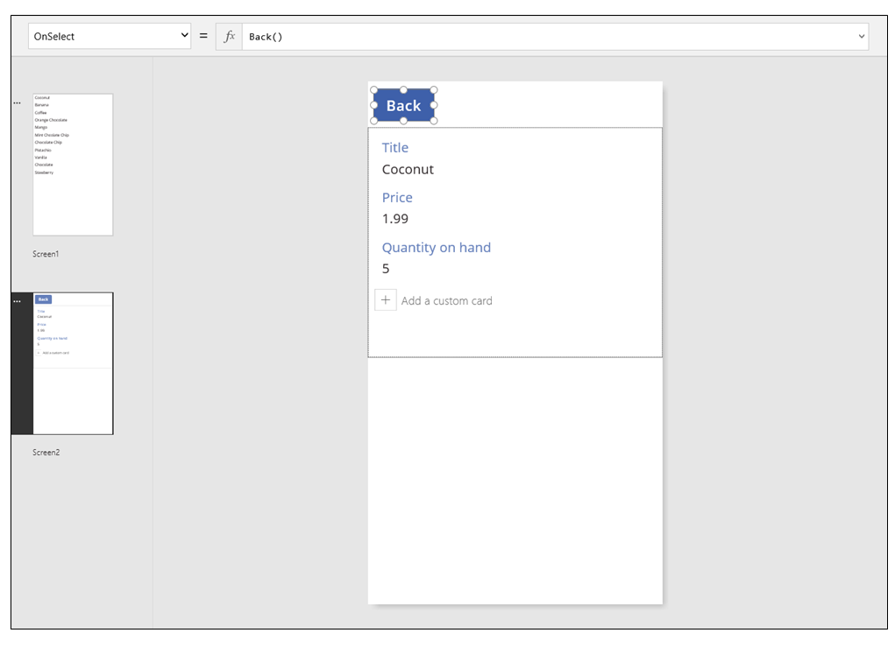

Now, let's return to the **Gallery** control and add some navigation to our detail screen.

1. Switch to the first screen, which is hosting our **Gallery** control.

2. Select the repeating region at the top of the gallery.

2. On the "Insert" tab, "Shapes" chunk, select the right arrow icon.  Place and resize as appropriate for the right hand side of the gallery.

3. Set the **OnSelect** property of the shape to **Navigate( Screen2, None )**.

You can now preview your app.  Press an arrow button next to an item in the gallery and you will be taken to a screen to see the details for that item.  Press the "Back" button to return to the gallery to select a different product.

## Editing details ##

Finally, our last core activity is changing the contents of a record.  We accomplish this with the **Edit form** control.

The **Edit form** control uses two properties to display and edit the record:

* **DataSource** property.  The name of the data source that holds the record.  Just as with the **Display form** control, this property is used to populate the options panel with fields and is used to determine the display name and data type (string, number, date, etc) for each field.  This property is also used to determine if a field's value is valid before submitting to the underlying data source.

* **Item** property.  The record to edit.  This is often connected to the **Selected** property of the **Gallery** control, allowing us to edit the record that was selected in the **Gallery** control.

To use the **Edit form** control in our sample app:

1. Add a new screen from the "Insert" tab.

2. Also from the "Insert" tab, open the "Forms" chunk, and select the "Edit" form control.

3. Set the **DataSource** property to **'Ice Cream'**.

3. Set the **Item** property to **Gallery1.Selected**.

4. Open the Options pane.

You can now select the fields to display on your screen.  You can also select which type of card to display for each field.  As you make changes in the Options pane, the **DataField** property on each **Card** control is set to the field your user will interact with.  Your screen should look similar to this:

These two properties are the same as the properties on the **Display form** control.  And with these alone, we can display the details of a record.  

Where the **Edit form** control goes further is offering the **SubmitForm** function, to write back changes to the data source.  You use this with a button or image control to save a user's changes:

* **Button2.OnSelect = SubmitForm( EditForm )**

Let's add a "Save" button:

2. From the "Insert" tab, add a **Button** control to the screen.

3. Change the button's text to **"Save"**.

4. Set its **OnSelect** property to: **SubmitForm( Form1 )**.  

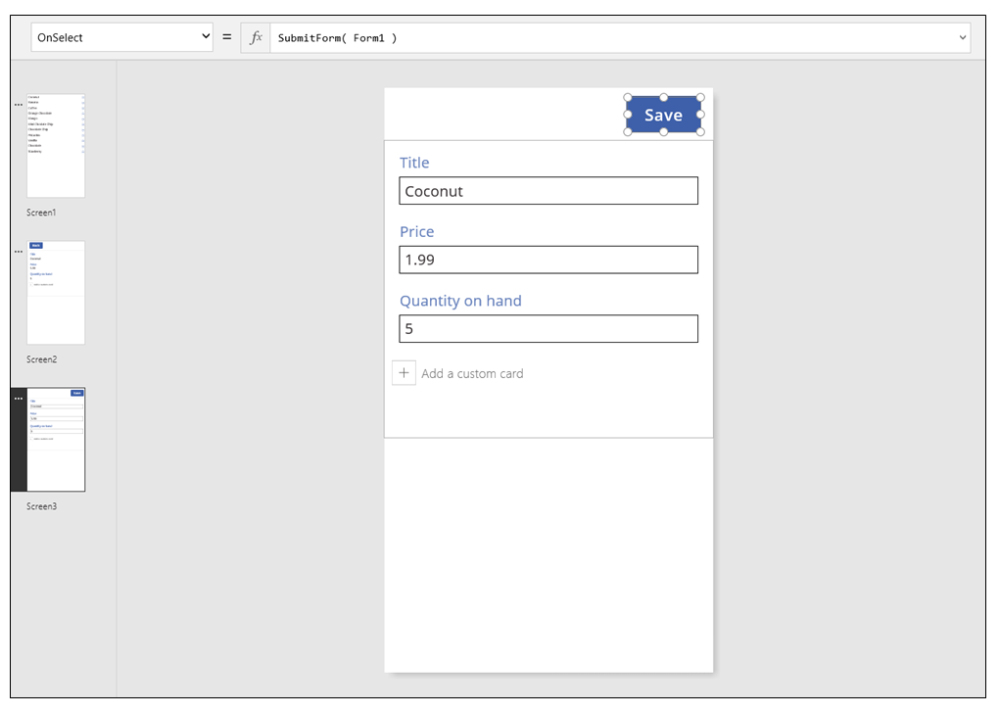

Finally, let's wire this screen in with the other screens.

2. From the "Insert" tab, add another **Button** control to the screen.

3. Change the button's text to **"Cancel"**.

4. Set its **OnSelect** property to: **ResetForm( Form1 ); Back()**.  This will clear out any user edits that may have been pending, and then return us to the previous screen.

	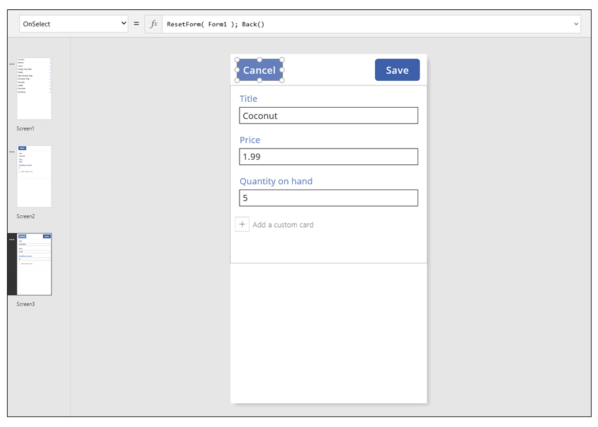

5. Select the **Edit form** control on the canvas.

6. Set the **OnSuccess** property to: **Back()**.  This will return us to the previous screen after a successful submission.

	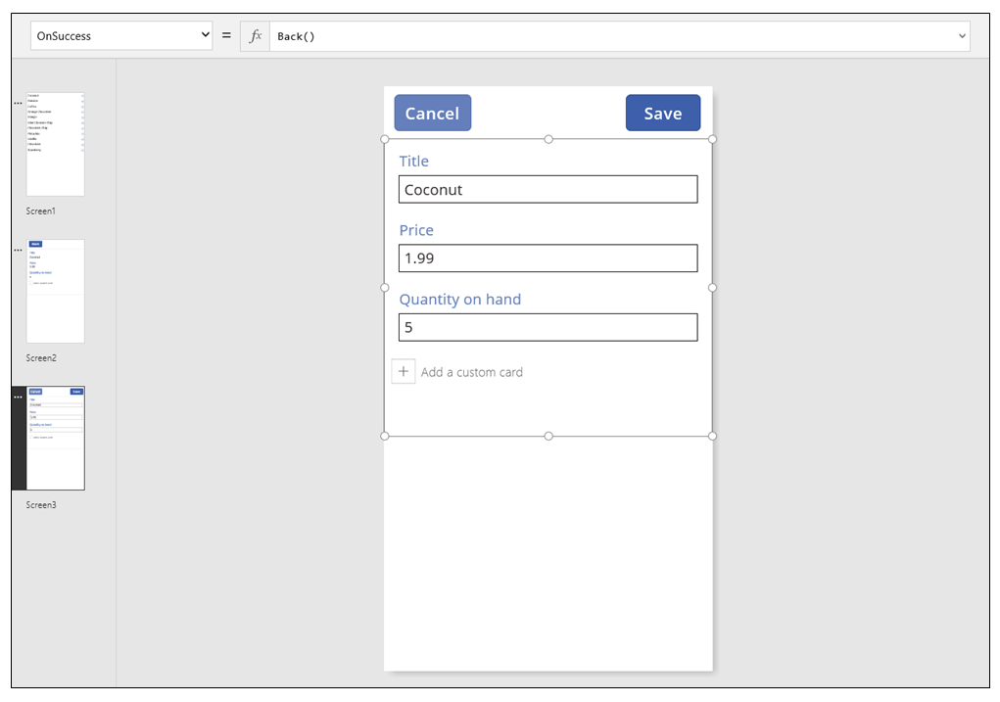

7. Return to the second screen, hosting our **Display form** control.

8. Insert another button from the "Insert" tab.

9. Change the caption of this button to **"Edit"**.

10. Change the **OnSelect** property of this control to: **Navigate( Screen3, None )**.

	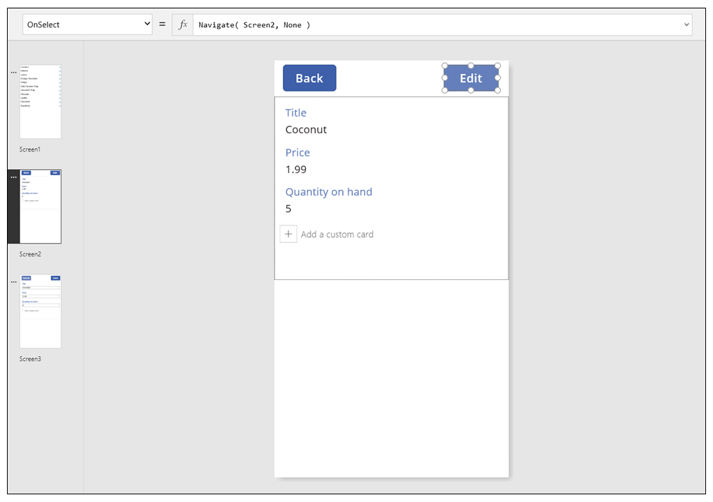

We have now completed our basic three screen data viewing and entry app.  Let's try it out: press the forward arrow "Preview" button at the top of the screen (or press F5).  The pink dot indicates where the user is tapping on the screen at each step.

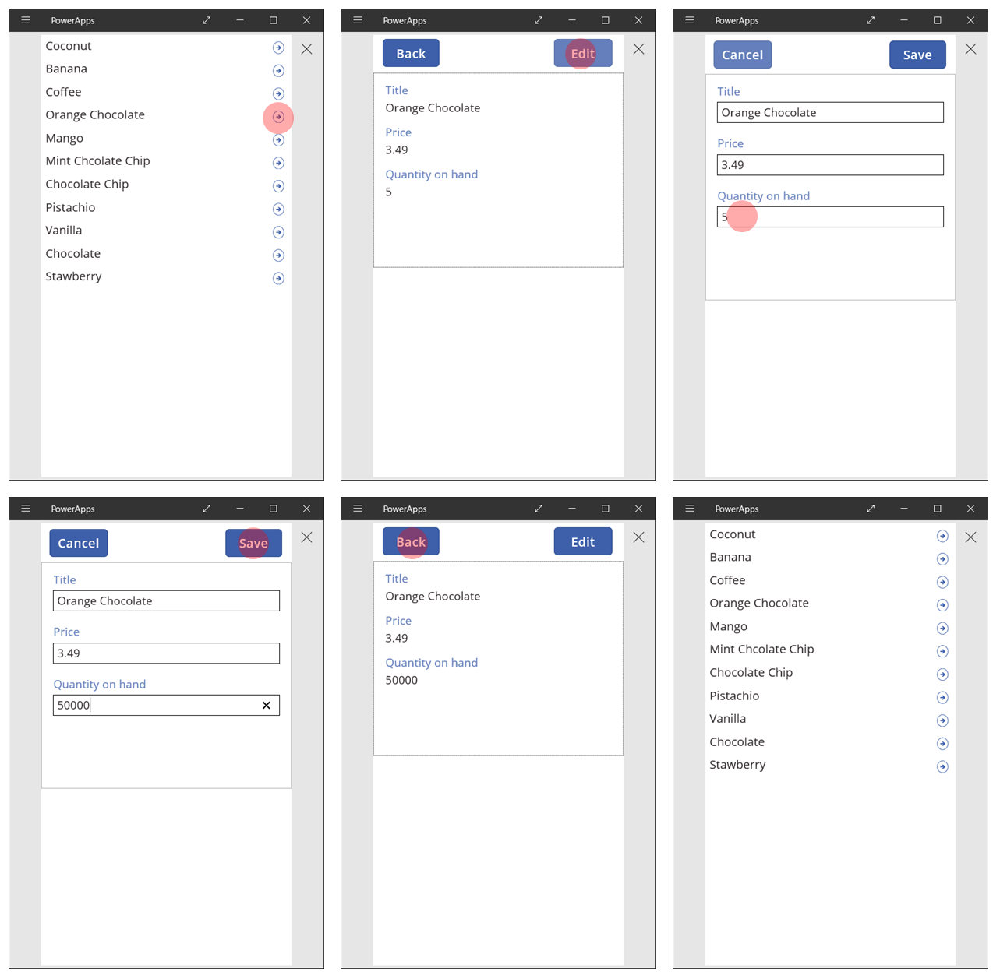

## Creating new records ##

The **Edit form** control is also used to create new records.  To shift from editing record to creating records, you call the **NewForm** function to place the form in to **New** mode.

When in **New** mode, the value of each field is taken from the defaults of the data source. The record provided to the form's **Item** property is ignored.  

When **SubmitForm** is called, a new record will be created instead of editing an existing record. Once the form has been successfully submitted the form is again returned to **EditMode**.  

Let's return to our first screen to add a "New" button:

1. Select the first screen, hosting our **Gallery** control.

2. Using the "Insert" tab, add a new **Button** control.

3. Change the caption to "New".

4. Set the **OnSelect** property for the button: **NewForm( Form1 ); Navigate( Screen3, None )**.  This will place the **Edit form** control on **Screen3** into "New" mode and take us to the third screen to fill it in.

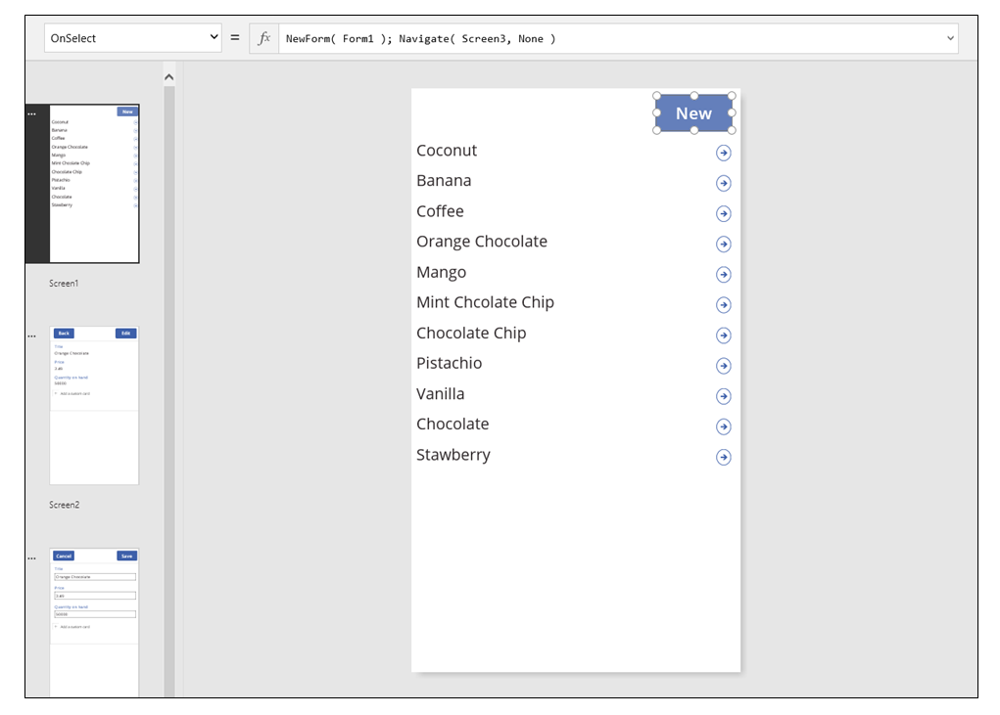

When we travel to the third screen now, the form will be empty, ready for us to add a new item.  Pressing "Save" now will create a record instead of editing an existing record (thanks to the **SubmitForm** function).  Without changing the formula, pressing "Cancel" will reset the form and exit "New" mode for the form (thanks to the **ResetForm** function), and return us to the gallery (thanks to the **Back** function).

## Deleting records ##

Your users may want to delete records too.  

2. Select the second screen, hosting our **Display form** control.

2. Using the "Insert" tab, add a new **Button** control.

3. Change the caption to "Delete".

4. Set the **OnSelect** property to: **Remove( 'Ice Cream', Gallery1.Selected ); Back()**

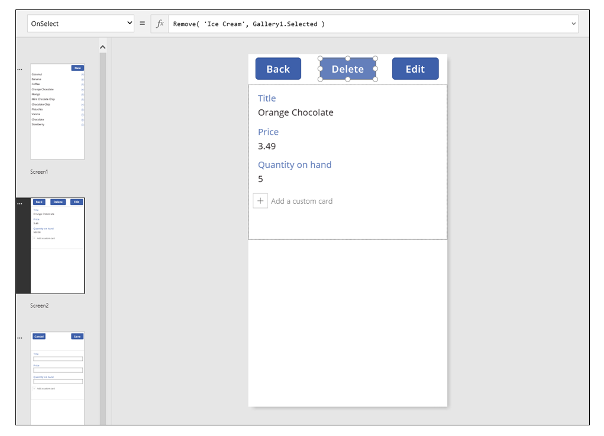

## Handling errors ##

Errors happen.  The value of a field may be invalid, a blank field may be required, you may be disconnected from the network, or any number of other problems may pop up.  

If **SubmitForm** fails for any reason, the **Error** property of the **Edit form** control will contain an error message to show the user.  With this information, the user should be able to correct the issue and resubmit, or they can choose to cancel the edit.

1. Select the third screen, hosting our **Edit form** control.

2. Insert a **Text** control.  Place it just below the "Save" button, so that the error is easy to see after the user has pressed this control to save their changes.

3. Set the **Text** property of this control to: **Form1.Error**.

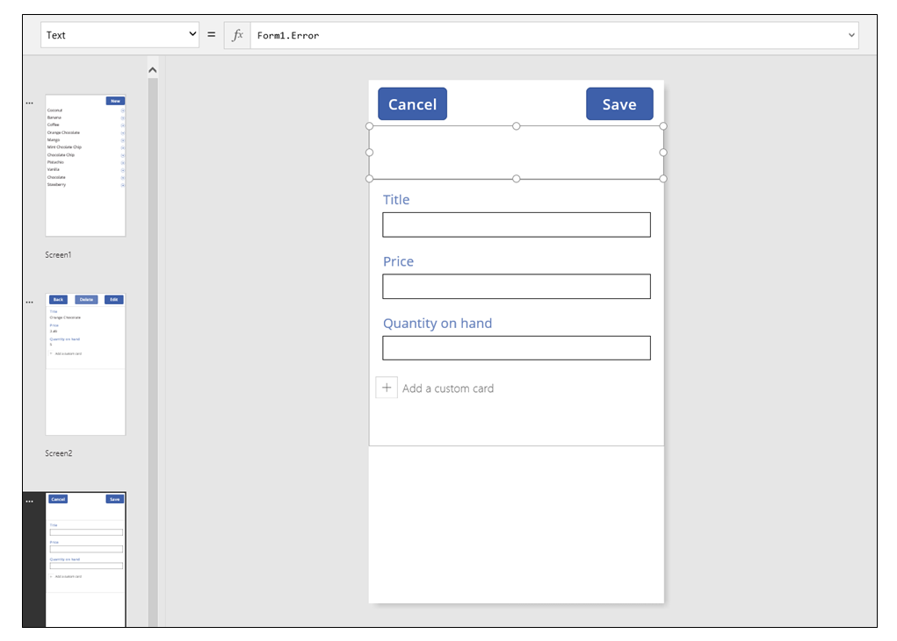

The app from data that is created by PowerApps sets the **AutoHeight** property on this control to *true* so that there is no space consumed if there is no error.  The **Height** and **Y** properties of the **Edit form** control are also adjusted dynamically to account for this control growing when there is an error.  For more details, create an app from data and inspect these properties.  As the error text control is very short when there is no error, you may need to use the "Advanced" view (available on the "View" tab) to select this control.

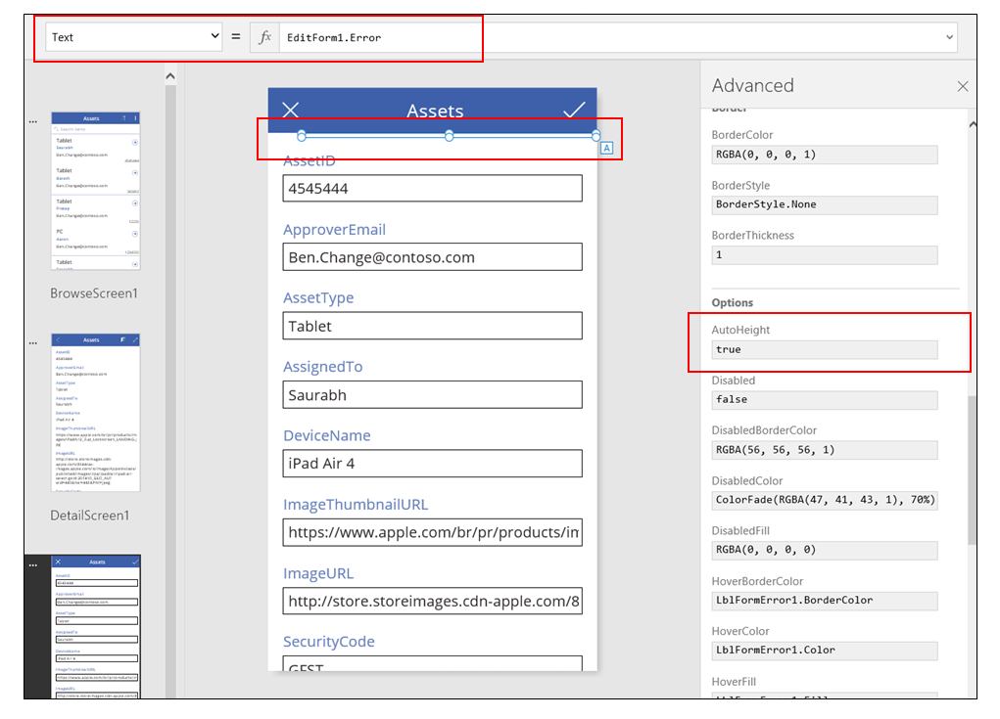

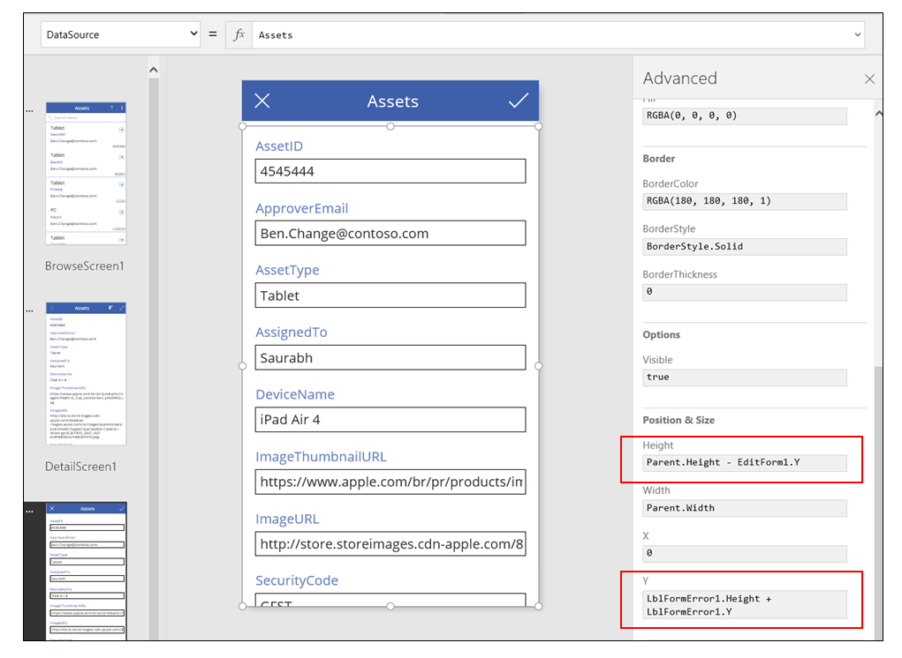

## Refreshing data ##

When the app is opened, the data source is refreshed.  To manually refresh the records in the gallery, you can add a "Refresh" button:

1. Select the first screen, hosting our **Gallery** control.

2. Add a **Button** control from the "Insert" tab.

3. Change the caption on this control to "Refresh".

4. Set the **OnSelect** property of this control to: **Refresh( 'Ice Cream' )**

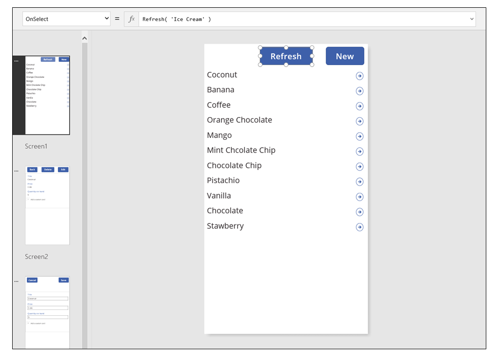

## Searching and sorting the gallery ##

Let's return to that app from data we had previously.  There were some controls that we neglected to discuss previously.  These extra two controls enable the user to search for a set of records or a particular record, and to sort the result up or down.  

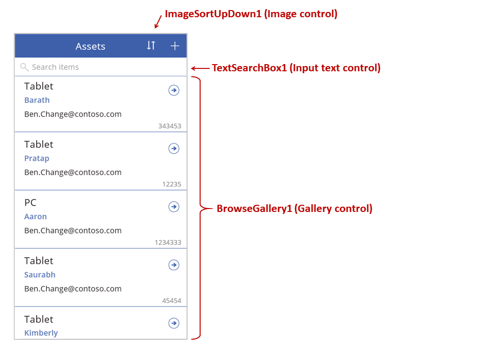

Let's look at the sort button at the top first.  This button, when pressed, will cause the sort order of the gallery to reverse.  To accomplish this, we use a *context variable* to hold which direction we are currently sorting.  When the button is pressed, we reverse the direction.

- **ImageSortUpDown1.OnSelect = UpdateContext( {SortDescending1: !SortDescending1} )**

The **UpdateContext** function will create the **SortDescending1** context variable if it does not already exist.  It will read it's value, and using the **!** operator, set it to its logical opposite: if it is *true* it will become *false* and if it is *false* it will become *true*.

We then craft a formula for the **Items** property of the **Gallery** control to use this context variable, along with the text in the **TextSearchBox1** control:

	Gallery1.Items = Sort( If( IsBlank(TextSearchBox1.Text), 
                               Assets, 
                               Filter( Assets, 
                                       TextSearchBox1.Text in Text(ApproverEmail) ) ),
	                        ApproverEmail, 
	                        If(SortDescending1, Descending, Ascending) )

Let's break this down:

- On the outside, we have the **Sort** function.  This takes a table as an argument, a field to sort on, and the direction to sort.  
	- The sort direction is taken from the context variable that the **ImageSortUpDown1** control toggles, translating the *true*/*false* value to the constants **Descending** and **Ascending**. 
	- The field to sort on is fixed to **ApproverEmail**.  If the fields shown in the gallery are changed, this argument will also need to be changed.

- On the inside, we have the **Filter** function.  This takes a table as an argument, and a filter expression to evaluate for each record.
	- The filter table is the raw **Assets** data source.  This is our starting point before filtering or sorting.
	- The filter expression searches for an instance of the string in **TextSearchBox1** within the **AproverEmail** field.  Again, if we change the fields shown in the gallery, this argument will also need to be updated.
	- There is check to ensure that **TextSearchBox1** is not empty.  If it is, the user is asking for all records, and the **Filter** function is bypassed.

This is but one example, you can craft your own formula for the **Items** property depending on the needs of your app, composing **Filter**, **Sort**, and other functions and operators together.    

## Screen layouts ##

So far, we haven't discussed how controls are to be distributed across screens.  And that is for a good reason - there are many possibilities and your selection will depend on your specific app's needs.

On a phone, with limited screen real estate, you will likely want different screens for browsing, viewing, and editing.  In the examples above, we used the **Navigate** and **Back** functions to move between these screens.  

On a tablet, with more screen real estate, you can place the **Gallery** control and the form controls on the same screen.  No **Navigate** or **Back** is required.

When working on the same screen, you need to be careful that the user can't change the selection in the **Gallery** and potentially lose edits in the **Edit form** control.  To keep selection from moving if there are unsaved changes, set this property:

- **Gallery.Disabled = EditForm.Unsaved**

