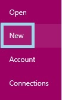
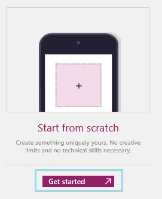
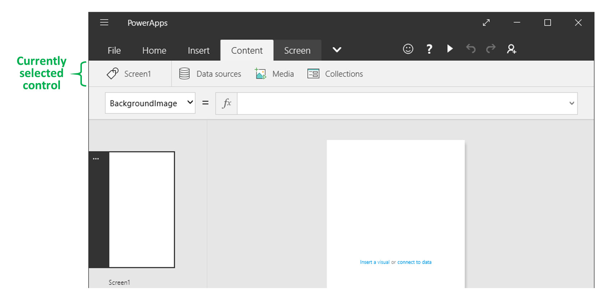
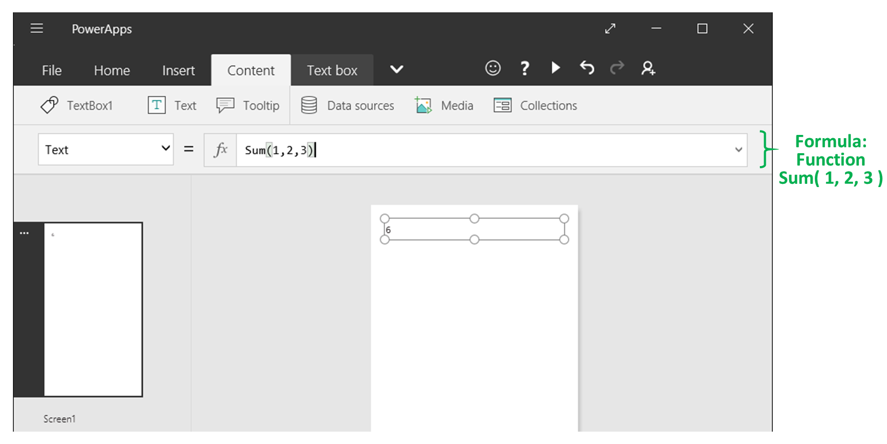
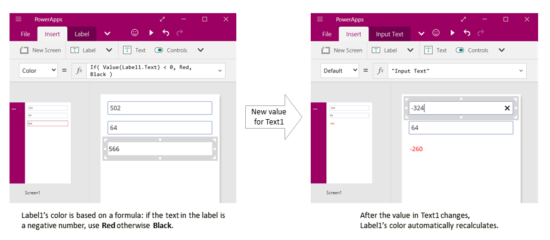
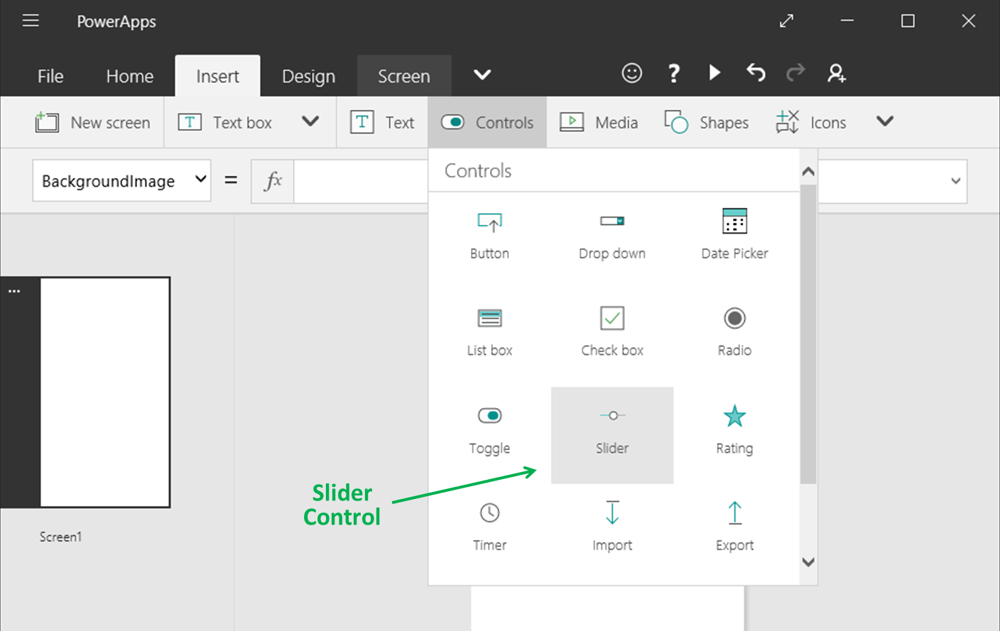
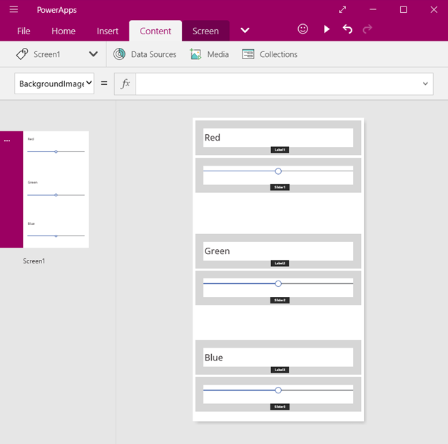
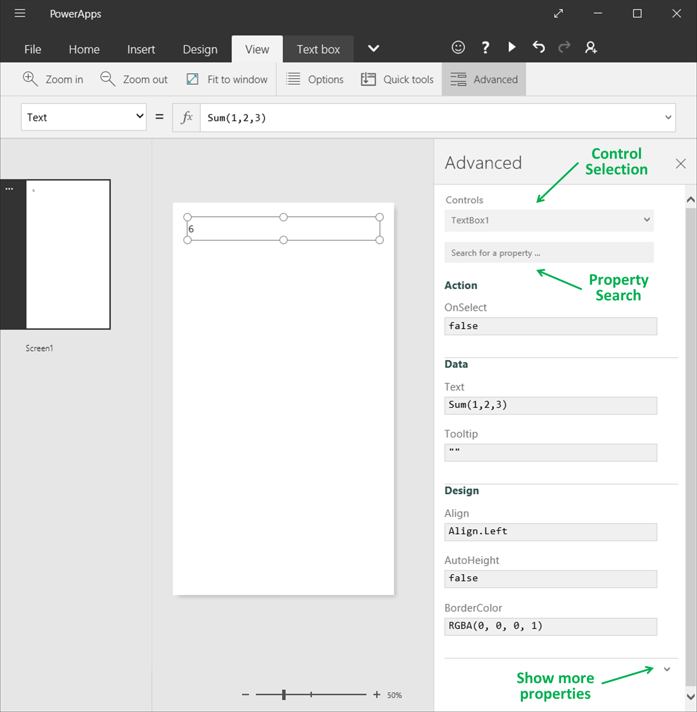

<properties	pageTitle="Working with formulas in PowerApps"
	description="User formulas to cusotmize a PowerApp."
	services="powerapps"
	documentationCenter="na"
	authors="GregLi"
	manager="dwrede"
	editor=""
	tags=""/>

<tags
   ms.service="powerapps"
   ms.devlang="na"
   ms.topic="get-started-article"
   ms.tgt_pltfrm="na"
   ms.workload="na"
   ms.date="11/23/2015"
   ms.author="gregli"/>

# Working with formulas #

Customize how your PowerApp behaves as users enter information and click buttons.  Formulas drive the appearance and behavior of each UI element so that you can optimize the experience for your exact goals and workflow.

This article provides only an overview of working with formulas.  Browse the [formula reference](formula-reference.md) for more details and the complete list of functions, operators, and other building blocks available to you.

[What are PowerApps?]()

**Prerequisites**

- Install [PowerApps](http://aka.ms/powerappsinstall)
- Learn how to [configure a control](get-started-test-drive.md#configure-a-control) in PowerApps

## Getting started ##

1. Launch PowerApps

1. Select **New** on the **File** menu (near the left edge of the screen).

	

1. Leave the default option to create a phone app.

	

1. Under **Blank App**, select **Get Started**.

	

1. You will see the formula bar at the top of the screen.

	

	This bar has two parts:

	- *Property*:  Each control and screen has a [set of properties](reference-properties.md).  Use this selector to show and edit the formula for a specific property.  
	
	- *Formula*:  The formula to be calculated for this property, made up of [values, operators, and functions](formula-reference.md). 

1. The formula bar shows and edits properties for the currently selected control, or for the screen if no controls are selected.  You can see the name of the current selection on the **Content** tab:

	

	The name of the control can also be changed in the **Content** tab, but clicking on the name.

1. Let's add a label control to our screen.  From the **Insert** tab, select **Label**, and a label control will be added at the top of the screen:

	

1. The property shown by default for the **Label** control is the **Text** property.  The value of this property drives what is shown in the label control.  It has a default value of **"Label"**.  

1. Let's change this value to **"Hello World"**, by typing that string into the formula bar, complete with the double quotes (") on each end:

	

	The control on the screen will reflect this new value as you type it.  The screen may show yellow exclamation point errors while you are typing, as the value may be incomplete until you are done.  For example, a string without a double quotes on both ends is not valid.

	Unlike Excel, you do not need to enter the equal sign (=) when starting a formula.  All entries in the formula bar are formulas, as if all of them started with an equal sign in Excel.  The formula bar even shows a permanent equal sign between the proeprty and the formula.  This is why strings must be enclosed in double quotation marks (").

1. Let's change our formula to do a calculation.  Replace **"Hello World"** with **Sum(1,2,3)** and note there are no double quotes:

	

	While you are typing, the formula bar helps you by showing the descripotion and expected arguments for this function.  As with final double quote of **"Hello World"**, the screen is showing yellow exclamation points to indicate there is a problem, until we type the final parenthesis of this formula:

	

## Just like Excel ##

If you are an Excel user, the above should look familiar.  PowerApps is modeled after Excel.  Many of the same formulas that you use in Excel also work in PowerApps.

Let's review how Excel works.  A cell can contain a value, such as a number or a string, or it can contain a formula that is based on and floats with the values of other cells.  After a user enters a new value into a cell, Excel dutifully recalculates all the dependent formulas based on the new value.  This behavior is automatic.

PowerApps behave very much like Excel.  Instead of cells, controls are used that can be named and placed wherever you desires on screens.  The equivalent PowerApp of the Excel example consists of:

- Input Text control, named **Text1**.  This takes the place of cell **A1**.  This allows the user to type in the first value to add.
- Another Input Text control, named **Text2**.  This takes the place of cell **A2**.  This allows the user to type in the second value to add.
- Label control, named **Label1**.  This takes the place of cell **A3**.  This will show the result of the addition.
- Formula for the **Text** property of **Label1** which performs the addition: **Label1!Text = Text1 + Text2**.  Control properties are accessed with the **!** operator.  **Label1!Text** refers to the Label's **Text** property, while for example **Label1!Fill** refers to its background color property.

This app has the same recalculation behavior as Excel.  Change the value of either of the text boxes, and the label's formula is recalculated automatically and the new result displayed.

PowerApps can use formulas for more than the primary value of a control.  For example formulas can be used to control formatting.  In this next example, a formula for the Color property of the label will automatically show negative values in Red.  The **If** function should look very familiar from Excel.

Formulas can be used for a wide variety of scenarios.  For example, by using your device's GPS, a map control can display you current location with a formula that uses **Location!Latitude** and **Location!Longitude**.  As you move, the map will automatically track your location.

## Controls working together ##

In this example, we will use three sliders to govern the background color of a screen.

1. Remove the label control from our previous example, or create a new blank app as we did previously.

1. Add three slider controls to the screen.  Slide controls are located on the **Insert** tab under **Controls**:

	

1. Arrange the slider controls so they do not overlap, by dragging and dropping the controls on the screen.  Add three label controls and change their text to "Red", "Green", and "Blue":

	

1. At any time, you can reveal the names of the controls and their boundaries on the screen by holding down the **Alt** key: 

	

1. For each slider, change the **Max** value to 255, the maximum value of a color component  for the **RGBA** function.  The **Max** property is easy to reach through the **Content** ribbon, or by picking the property in the formula bar:

	

1. Select the screen by clicking away from any control.  For the **Fill** property, enter the formula **RGBA( Slider1!Value, Slider2!Value, Slider3!Value, 1 )**.  Control properties are accessed with the **!** operator.  **Slider1!Value** refers to the slider's **Value** property which reflects where the user has placed the slider between **Min** and **Max** values.  As you enter this formula, each control that appears in the formula will be color coded between the screen and the formula bar:

	

	As you type the closing parenthesis, the screen's background will change a dark gray.  At the moment the formula is complete, it is calculated, and used as the value of the background fill color.  Apps that are being editing are live and do not need to be in preview mode in order to start interacting with it:

	

1. Now we can change the values of the sliders and see what effect they have on the background color.  As each slider changes, **RGBA** is recalculated which immediately changes how the screen appears.

	

## Behavior formulas ##

Besides calculations, formulas are used to take action.  For example, the **OnSelect** formula of a button control is evaluated when the button is pressed, and with it, we can change from one screen to another.

Some functions can only appear in behavior formulas, such as **Navigate** and **Collect**.  The formula reference calls out if a function can only be used in this context.  

Sometimes you will want to take more than one action at a time.  For example, updating a context variable, pushing data to a data source, and finally navigating to another screen.  To accomplish this, use the **;** operator.    

## Advanced view ##

To view and change all the properties of a control, open the **Advanced** view on the **View** tab: 

You can edit formulas directly within this view.

Initially, this view shows a limited selection of the most important properties.  To reveal all the properties, press the down arrow at the bottom of the pane:

Each control has a long list of properties that govern all aspects of the control's behavior and appearance.  You may need to scroll through a long list.  To find a specific property, you can use the search box at the top of the pane.

