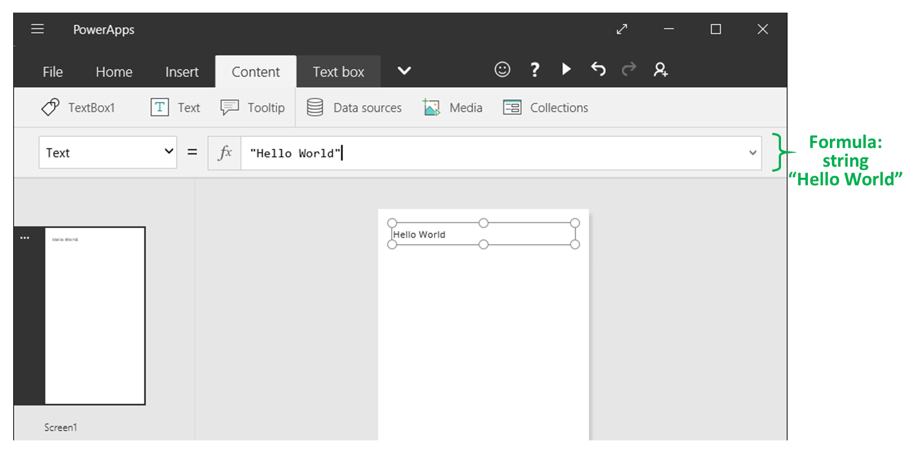
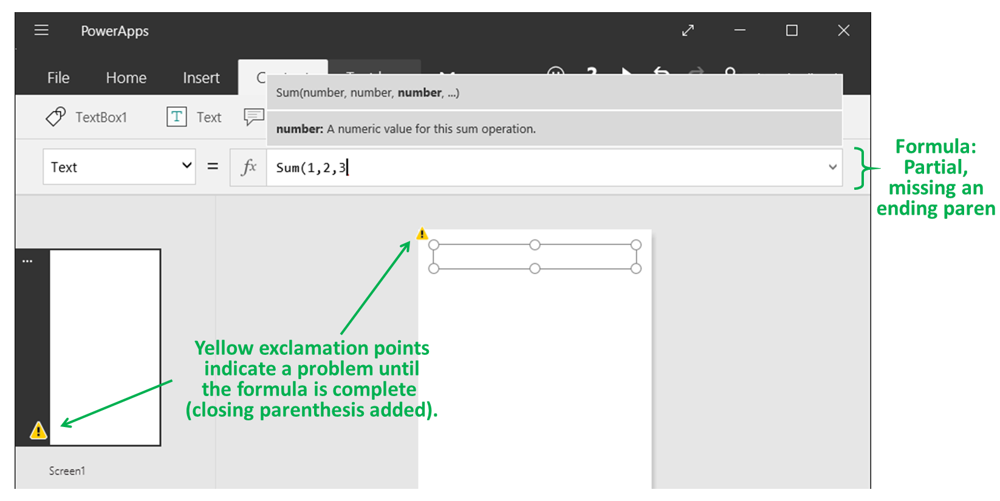
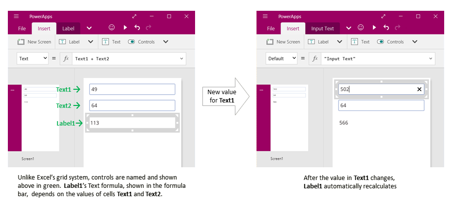
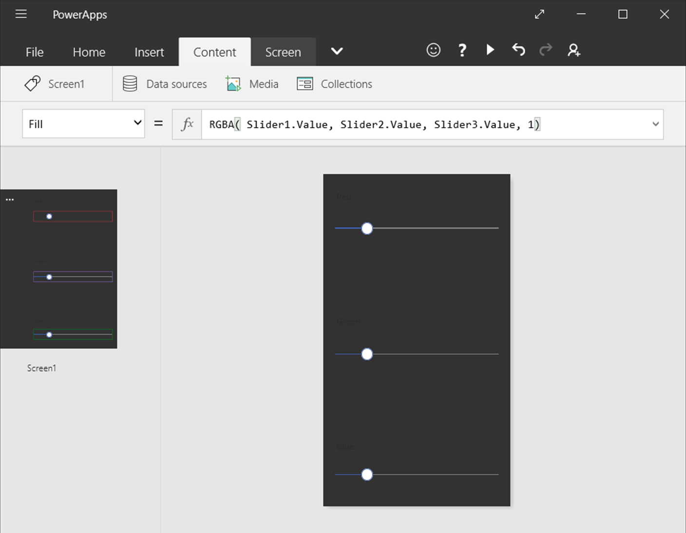

<properties
	pageTitle="Working with formulas | Microsoft PowerApps"
	description="Use formulas to customize an app."
	services=""
	suite="powerapps"
	documentationCenter="na"
	authors="gregli-msft"
	manager="dwrede"
	editor=""
	tags=""/>

<tags
   ms.service="powerapps"
   ms.devlang="na"
   ms.topic="article"
   ms.tgt_pltfrm="na"
   ms.workload="na"
   ms.date="11/23/2015"
   ms.author="gregli"/>

# Working with formulas #

Customize how your app behaves as users enter information and click buttons.  Formulas drive the appearance and behavior of each UI element so that you can optimize the experience for your exact goals and workflow.  Formulas operate much like they do in Microsoft Excel.

This article provides only an overview of working with formulas.  Browse the [formula reference](formula-reference.md) for more details and the complete list of functions, operators, and other building blocks available to you.

[What are PowerApps?]()

**Prerequisites**

- Install [PowerApps](http://aka.ms/powerappsinstall)
- Learn how to [configure a control](get-started-test-drive.md#configure-a-control) in PowerApps

## Getting started ##

1. Open PowerApps, and then select **New** on the **File** menu (near the left edge of the screen).

	

1. Leave the default option to create a phone app.

	

1. Under **Blank App**, select **Get Started**.

	

	You'll see the formula bar at the top of the screen.

	

	This bar has two parts:

	- *Property list*:  Each control and screen has a [set of properties](reference-properties.md).  Use this list to select a specific property.  

	- *Formula*:  The formula to be calculated for this property, made up of [values, operators, and functions](formula-reference.md).

	In the formula bar, you can see and edit properties for the selected control or for the screen if no controls are selected.  You can see the name of the selected control on the **Content** tab:

	

	You can change the name of the selected control in the **Content** tab by clicking the name.

1. Add a label by selecting **Label** on the **Insert** tab.

 	A label is added at the top of the screen:

	

	When you add a label, the property list automatically shows the **Text** property, which drives what the label shows. By default, the value of this property is **"Label"**.  

1. Set the value of the **Text** property to **"Hello World"** by typing that string, surrounded by double quotes, into the formula bar:

	

	The label reflects this new value as you type it.  The screen may show yellow exclamation-point icons while you type. These icons indicate errors, but they'll go away when you finish entering a valid value.  For example, a string without double quotes on both ends isn't valid.

	Unlike Excel, you don't need to enter the equal sign (=) when you start a formula.  Any entry in the formula bar is a formula, as if it started with an equal sign in Excel.  The formula bar even shows a permanent equal sign between the property and the formula.  This is why you must enclose strings in double quotation marks (").

1. Replace the **"Hello World"** string with the formula **Sum(1,2,3)** to do a calculation:

	**Note:** You don't surround a formula with double quotation marks as you do with a string.

	

	While you type, the formula bar helps you by showing the description and the expected arguments for this function.  As with the final double quotation mark in **"Hello World"**, the screen shows yellow exclamation points to indicate an error until you type the final parenthesis of this formula:

	

## Just like Excel ##

If you're an Excel user, the above should look familiar.  PowerApps is modeled after Excel.  Many of the same formulas that you use in Excel also work in PowerApps.

Let's review how Excel works.  A cell can contain a value, such as a number or a string, or it can contain a formula that's based on and floats with the values of other cells.  After a user enters a value into a cell, Excel dutifully recalculates all the dependent formulas based on the new value.  This behavior is automatic.

PowerApps behave very much like Excel.  Instead of cells, you add, name, and place controls wherever you want on screens.  The Excel example looks like this in an app:

- An input-text control, named **Text1**, which takes the place of cell **A1**. In this control, the user types in the first value to add.
- Another input-text control, named **Text2**, which takes the place of cell **A2**. In this control, the user types in the second value to add.
- A label, named **Label1**, which takes the place of cell **A3**.  This control shows the result of the addition.
- Formula for the **Text** property of **Label1**, which performs the addition: **Label1!Text = Text1 + Text2** You access control properties by using the **!** operator.  **Label1!Text** refers to the label's **Text** property, and **Label1!Fill**,  for example, refers to its background-color property.

This app has the same recalculation behavior as Excel. If you change the value of either of the text boxes, the label's formula is recalculated automatically, and the new result is displayed.

PowerApps can use formulas for more than the primary value of a control.  For example, you can use a formula to control formatting.  In this next example, a formula for the **Color** property of the label will automatically show negative values in red.  The **If** function should look very familiar from Excel.

You can use formulas for a wide variety of scenarios.  For example, you can use your device's GPS, a map control, and a formula that uses **Location!Latitude** and **Location!Longitude**  to display your current location.  As you move, the map will automatically track your location.

## Controls working together ##

In this example, you'll use three sliders to govern the background color of a screen.

1. Remove the label control from the previous example, or create a blank app as you did previously.

1. Add three slider controls to the screen by selecting **Controls** on the **Insert** tab and then selecting **Slider**:

	

1. Arrange the sliders so they don't overlap, add three labels, and configure them to show **Red**, **Green**, and **Blue**:

	

	**Note:** At any time, you can reveal the names of the controls and their boundaries on the screen by holding down the **Alt** key:

	

1. Change the **Max** value of each slider to 255, which is the maximum value of a color component for the **RGBA** function.

	You can specify the **Max** property by selecting it on the **Content** tab or in the property list:

	

1. Select the screen by clicking away from any control, and then set **Fill** property to this formula: **RGBA( Slider1!Value, Slider2!Value, Slider3!Value, 1 )**

	You access control properties by using the **!** operator.  **Slider1!Value** refers to the slider's **Value** property, which reflects where the user has placed the slider between the **Min** and **Max** values.  As you type this formula, each control that it contains is color coded between the screen and the formula bar:

	

	As you type the closing parenthesis, the screen's background will change to dark gray.  At the moment when you finish typing the formula, it's calculated and used as the value of the background fill color.  You can interact with your app while in the workspace without needing to Preview:

	

1. Adjust the sliders, and see how your changes affect the background color.

	As each slider changes, the formula that contains the **RGBA** function is recalculated, which immediately changes how the screen appears.

	

## Behavior formulas ##

You can use formulas not only to perform calculations but also to take action.  For example, the **OnSelect** formula of a button is evaluated when the button is selected, so we can leverage that event to change from one screen to another.

Some functions, such as **Navigate** and **Collect**, can appear only in behavior formulas.  The formula reference calls out if a function can be used only in this context.  

You use the **;** operator to take more than one action at a time.  For example, you might want to update a context variable, push data to a data source, and finally navigate to another screen.

## Advanced view ##

The properties list shows properties alphabetically, but you can also view all the properties of a control, organized by category, if you select the **Advanced** option on the **View** tab:

You can edit formulas directly within this view.

Initially, this view shows a limited selection of the most important properties.  To reveal all the properties, press the down arrow at the bottom of the pane:

Each control has a long list of properties that govern all aspects of the control's behavior and appearance.  You may need to scroll through a long list.  To find a specific property, you can use the search box at the top of the pane.
