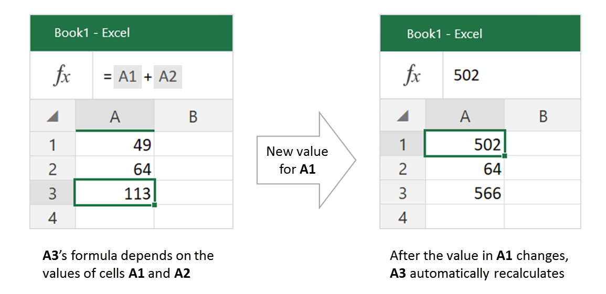
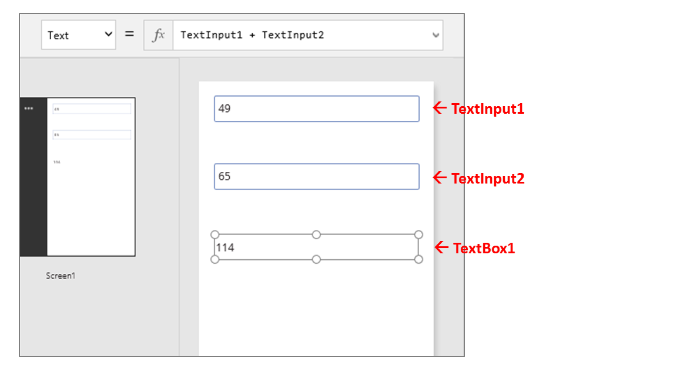
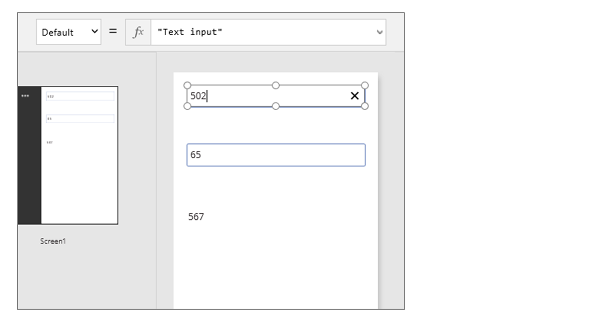
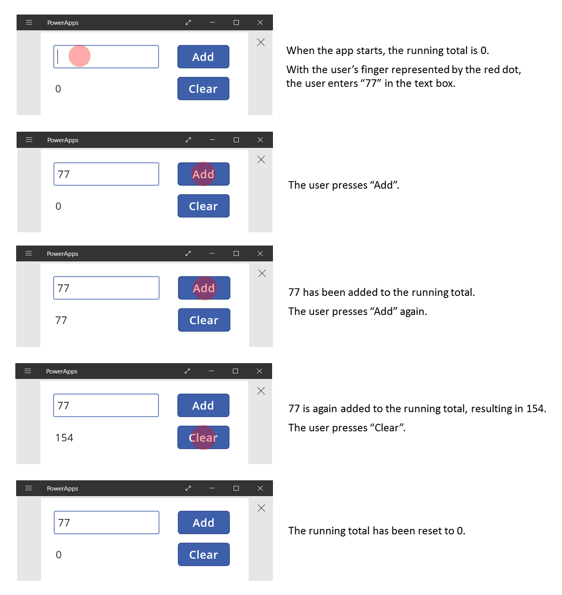
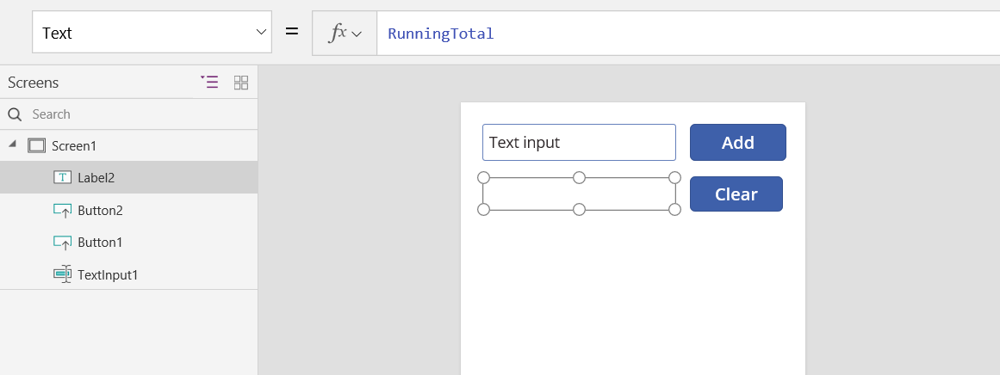
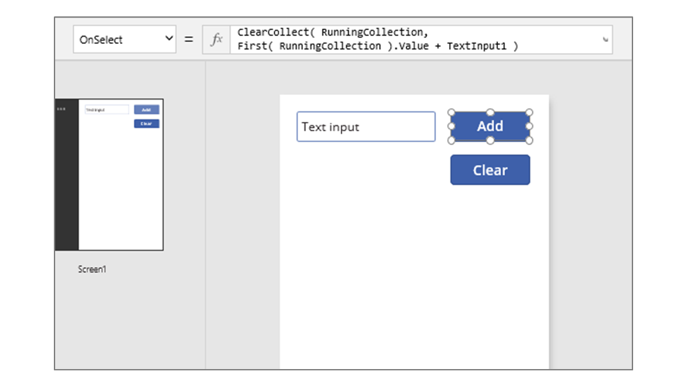
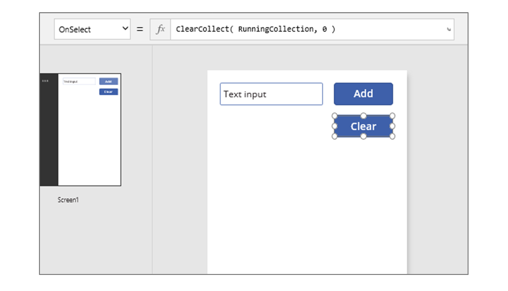
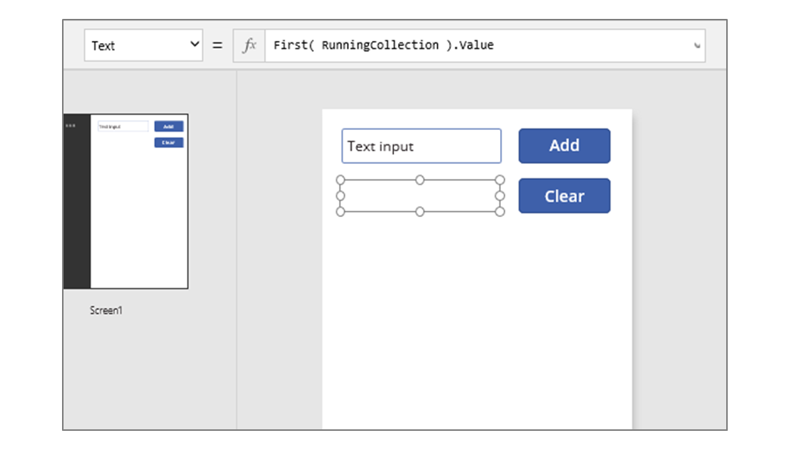
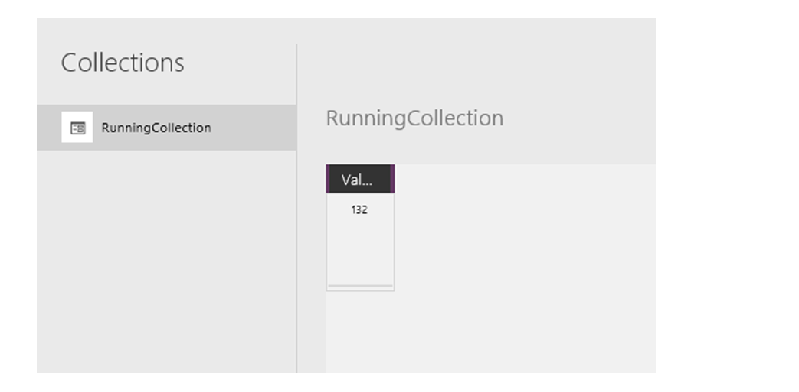

<properties
	pageTitle="Understand variables | Microsoft PowerApps"
	description="Reference information for working with state, context variables, and collections"
	services=""
	suite="powerapps"
	documentationCenter="na"
	authors="gregli-msft"
	manager="anneta"
	editor=""
	tags=""/>

<tags
   ms.service="powerapps"
   ms.devlang="na"
   ms.topic="article"
   ms.tgt_pltfrm="na"
   ms.workload="na"
   ms.date="04/26/2016"
   ms.author="gregli"/>

# Understand variables in PowerApps #
If you've used another programming tool, such as Visual Basic or JavaScript, you may be asking: **Where are the variables?** PowerApps is a little different and requires a different approach. Instead of reaching for a variable, ask yourself: **What would I do in Excel?**

In other tools, you may have explicitly performed a calculation and stored the result in a variable. However, PowerApps and Excel both automatically recalculate formulas as the input data changes, so you usually don't need to create and update variables. By taking this approach whenever possible, you can  more easily create, understand, and maintain your app.

In some cases, you'll need to use variables in PowerApps, which extends Excel's model by adding [behavior formulas](working-with-formulas-in-depth.md#behavior-formulas). These formulas run when, for example, a user selects a button. Within a behavior formula, it's often helpful to set a variable to be used in other formulas.

In general, avoid using variables. But sometimes only a variable can enable the experience you want.

## Translate Excel into PowerApps ##

### Excel ###

Let's review how Excel works. A cell can contain a value, such as a number or a string, or a formula that's based on the values of other cells. After the user enters a different value into a cell, Excel automatically recalculates any formulas that depend on the new value. You don't have to do any programming to enable this behavior.

Excel doesn't have variables. The value of a cell that contains a formula changes based on its input, but there's no way to remember the result of a formula and store it in a cell or anywhere else. If you change a cell's value, the entire spreadsheet may change, and any previously calculated values are lost.  An Excel user can copy and paste cells, but that's under the user's manual control and isn't possible with formulas.

### PowerApps ###
Apps that you create in PowerApps behave very much like Excel. Instead of updating cells, you can add controls wherever you want on a screen and name them for use in formulas.

For example, you can replicate the Excel behavior in an app by adding a **[Label](controls/control-text-box.md)** control, named **TextBox1**, and two **[Text input](controls/control-text-input.md)** controls, named **TextInput1** and **TextInput2**. If you then set the **[Text](controls/properties-core.md)** property of **TextBox1** to **TextInput1 + TextInput2**,  it will always shows the sum of whatever numbers are in **TextInput1** and **TextInput2** automatically.

Notice that the **TextBox1** control is selected, showing its **[Text](controls/properties-core.md)** formula in the formula bar at the top of the screen.  Here we find the formula **TextInput1 + TextInput2**.  This formula creates a dependency between these controls, just as dependencies are created between cells in an Excel workbook.  Let's change the value of the **TextInput1**:

The formula for **TextBox1** has been automatically recalculated, showing the new value.

In PowerApps, you can use formulas to determine not only the primary value of a control but also properties such as formatting. In the next example, a formula for the **[Color](controls/properties-color-border.md)** property of the label will automatically show negative values in red. The **[If](functions/function-if.md)** function should look very familiar from Excel:
 **If( Value(TextBox1.Text) < 0, Red, Black )**

Now, if the result of our calculation in **TextBox1.Text** is negative, the number will be shown in red:

You can use formulas for a wide variety of scenarios:

- By using your device's GPS, a map control can display your current location with a formula that uses **Location.Latitude** and **Location.Longitude**.  As you move, the map will automatically track your location.
- Other users can update [data sources](working-with-data-sources.md).  For example, others on your team might update items in a SharePoint list.  When you refresh a data source, any dependent formulas are automatically recalculated to reflect the updated data. Furthering the example, you might set a gallery's **[Items](controls/properties-core.md)** property to the formula **Filter( SharePointList )**, which will automatically display the newly filtered set of [records](working-with-tables.md#records).

### Benefits ###
Using formulas to build apps has many advantages:

- If you know Excel, you know PowerApps. The model and formula language are the same.
- If you've used other programming tools, think about how much code would be required to accomplish these examples.  In Visual Basic, you'd need to write an event handler for the change event on each text-input control.  The code to perform the calculation in each of these is redundant and could get out of sync, or you'd need to write a common subroutine.  In PowerApps, you accomplished all of that with a single, one-line formula.
- To understand where **TextBox1**'s text is coming from, you know exactly where to look: the formula in the **[Text](controls/properties-core.md)** property.  There's no other way to affect the text of this control.  In a traditional programming tool, any event handler or subroutine could change the value of the label, from anywhere in the program.  This can make it hard to track down when and where a variable was changed.
- If the user changes a slider control and then changes their mind, they can change the slider back to its original value.  And it's as if nothing had ever changed: the app shows the same control values as it did before.  There are no ramifications for experimenting and asking "what if," just as there are none in Excel.  

In general, if you can achieve an effect by using a formula, you'll be better off. Let the formula engine in PowerApps work for you.  

## Know when to use variables ##

Let's change our simple adder to act like an old-fashioned adding machine, with a running total. If you select an **Add** button, you'll add a number to the running total. If you select a **Clear** button, you'll reset the running total to zero.

Our adding machine uses something that doesn't exist in Excel: a button. In this app, you can't use only formulas to calculate the running total because its value depends on a series of actions that the user takes. Instead, our running total must be recorded and updated manually. Most programming tools store this information in a *variable*.    

You'll sometimes need a variable for your app to behave the way you want.  But the approach comes with caveats:

- You must manually update the running total. Automatic recalculation won't do it for you.
- The running total can no longer be calculated based on the values of other controls. It depends on how many times the user selected the **Add** button and what value was in the text-input control each time. Did the user enter 77 and select **Add** twice, or did they specify 24 and 130 for each of the additions? You can't tell the difference after the total has reached 154.
- Changes to the total can come from different paths. In this example, both the **Add** and **Clear** buttons can update the total. If the app doesn't behave the way you expect, which button is causing the problem?

## Create a context variable ##
To create our adding machine, we require a variable to hold the running total. The simplest variables in PowerApps are *context variables*.  

How context variables work:

- You create and set context variables by using the **[UpdateContext](functions/function-updatecontext.md)** function.  If a context variable doesn't already exist when first updated, it will be created with a default value of *blank*.
- You create and update context variables with records. In other programming tools, you commonly use "=" for assignment, as in "x = 1".  For context variables, use **{ x: 1 }** instead. When you use a context variable, use its name directly.  
- You can also set a context variable when a screen is displayed, by using the **[Navigate](functions/function-navigate.md)** function. If you think of a screen as a kind of procedure or subroutine, this is similar to parameter passing in other programming tools.
- Except for **[Navigate](functions/function-navigate.md)**, context variables are limited to the context of a single screen, which is where they get their name.  You can't use or set them outside of this context.
- Context variables can hold any value, including strings, numbers, records, and [tables](working-with-tables.md).
- When the user closes an app, all of its context variables are lost.

Let's rebuild our adding machine by using a context variable:

1. Add a text-input control, named **TextInput1**, and two buttons, named **Button1** and **Button2**.

1. Set the **[Text](controls/properties-core.md)** property of **Button1** to **"Add"**, and set the **Text** property of **Button2** to  **"Clear"**.

1. To update the running total whenever a user selects the **Add** button, set its **[OnSelect](controls/properties-core.md)** property to this formula:  **UpdateContext( { RunningTotal: RunningTotal + Text1 } )**.

	The first time a user selects the **Add** button and **[UpdateContext](functions/function-updatecontext.md)** is called, **RunningTotal** is created with a default value of *blank*.  In the addition, it will be treated as a zero.

	

1. To set the running total to **0** whenever the user selects the **Clear** button, set its **[OnSelect](controls/properties-core.md)** property to this formula: 
**UpdateContext( { RunningTotal: 0 } )**

	Again, **[UpdateContext](functions/function-updatecontext.md)** is used with the formula **UpdateContext( { RunningTotal: 0 } )**.

	

3. Add a **[Label](controls/control-text-box.md)** control, and set its **[Text](controls/properties-core.md)** property to **RunningTotal**.

	This formula will automatically be recalculated and show the user the value of **RunningTotal** as it changes based on the buttons that the user selects.

	

4. Preview the app, and we have our adding machine as described above.

## Create a collection ##
To refer a variable from any screen (not only the one on which it was created), use a [collection](working-with-data-sources.md#collections) to hold a global variable.

How collections work:

- Create and set collections by using the **[ClearCollect](functions/function-clear-collect-clearcollect.md)** function.  You can use the **[Collect](functions/function-clear-collect-clearcollect.md)** function instead, but it will effectively require another variable instead of replacing the old one.  
- A collection is a data source and, therefore, a table. To access a single value in a collection, use the **[First](functions/function-first-last.md)** function, and extract one field from the resulting record. If you used a single value with **[ClearCollect](functions/function-clear-collect-clearcollect.md)**, this will be the **Value** field, as in this example: **First(** *VariableName* **).Value**
- Any formula can access a collection from any screen in the app.
- When a user closes an app, all of its collections are emptied.

Let's recreate our adding machine by using a collection:

1. Add a **[Text input](controls/control-text-input.md)** control, named **TextInput1**, and two buttons, named **Button1** and **Button2**.

1. Set the **[Text](controls/properties-core.md)** property of **Button1** to **"Add"**, and set the **Text** property of **Button2** to **"Clear"**.

1. To update the running total whenever a user selects the **Add** button, set its **[OnSelect](controls/properties-core.md)** property to this formula:  **ClearCollect( RunningTotal, First( RunningTotal ).Value + TextInput1 )**

	By using **[ClearCollect](functions/function-clear-collect-clearcollect.md)** with a single value, a record will be created in the collection with a single **Value** field. The first time that the user selects the **Add** button and **[ClearCollect](functions/function-clear-collect-clearcollect.md)** is called, **RunningTotal** will be [empty](functions/function-isblank-isempty.md). In the addition, **[First](functions/function-first-last.md)** will return *blank* and will be treated as a zero.

	

1. To set the running total to **0** whenever a user selects the **Clear** button, set its **[OnSelect](controls/properties-core.md)** property to this formula: 
**ClearCollect( RunningTotal, 0 )**

	Again, **[ClearCollect](functions/function-clear-collect-clearcollect.md)** is used with the formula **ClearCollect( RunningTotal, 0 )**.

	

1. To display the running total, add a label, and set its **[Text](controls/properties-core.md)** property to this formula: 
**First(RunningTotal).Value**

	This formula extracts the **Value** field of the first record of the **RunningTotal** collection. The label will automatically show the value of **RunningTotal** as it changes based on the buttons that the user selects.

	

1. To run the adding machine, press F5 to open Preview, enter numbers in the text-input control, and select buttons.

1. To return to the default workspace, press Esc.

1. To see the values in your collection, select **Collections** on the **File** menu.

	
