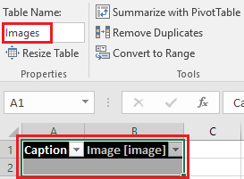
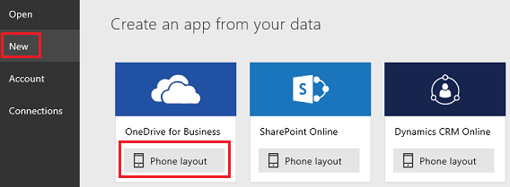
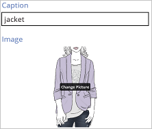
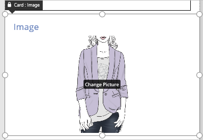
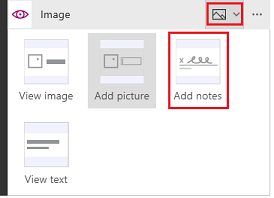
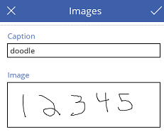

# Add images to Excel from PowerApps
Create an app automatically in which users can show, add, or delete images from files or drawings from a **Pen** control. The app is based on an Excel file that you create and upload to a cloud-storage account.

## Prerequisites

* Familiarity with [adding and configuring controls](add-configure-controls.md).
* Familiarity with [configuring Excel data as a table](https://support.office.com/en-us/article/Format-an-Excel-table-6789619F-C889-495C-99C2-2F971C0E2370?ui=en-US&rs=en-US&ad=US).
* A [PowerApps connection](add-data-connection.md) to a cloud-storage account (such as Dropbox, OneDrive, or Google Drive) in which you can store an Excel file.

## Create the data source and the app
1. In Excel, add **Caption** and **Image [image]** to any two cells that are side by side (for example, A1 and B1) and that are just above two empty cells.
2. Format the cells that you updated and the cells just below them as a table, and name the table (for example, **Images**).
   
    
3. Save the file (for example, as **ImageDemo**), and upload it to your cloud-storage account.
4. In PowerApps, click or tap **New** on the **File** menu (along the left edge if you haven't yet opened an app), and then click or tap **Phone layout** in the tile for your cloud-storage account.
   
    
5. Under **Choose an Excel file**, click or tap the file that you created.
   
    
6. Under **Choose a table**, click or tap the table that you created, and then click or tap **Connect**.
   
    
7. If you just installed or upgraded PowerApps, take the quick tour, or click or tap **Skip**.
   
    

## Add an image from a file
1. Open Preview mode by pressing F5 (or by clicking or tapping the play button near the upper-right corner), and then click or tap the plus icon in the upper-right corner.
   
    
2. In the **Caption** box, type or paste a short description of the image file that you want to add, and then click or tap below it to specify the file.
3. In the **Open** dialog box, browse to the file that you want to add, click or tap it, and then click or tap **Open**.
   
    
4. Click or tap the checkmark icon in the upper-right corner to save your changes.
   
    
5. Add as many images as you want by repeating the last three steps, and then press Esc to return to the default workspace.
6. (optional) Delete either **Label** control that shows the caption for each image.

## Add a drawing
1. Show **EditScreen1** by clicking or tapping it in the left navigation bar, and then click or tap the image card to select it.
   
    
2. In the right-hand pane, click or tap the card selector for the image card, and then click or tap **Add Notes**.
   
    
3. Show **BrowseScreen1** by clicking or tapping it in the left navigation bar, and then open Preview mode.
4. Click or tap the plus icon in the upper-right corner, add a caption, and draw an image in the **Pen** control.
   
    
5. Click or tap the checkmark icon in the upper-right corner to save your changes.
   
    
6. Add as many drawings as you want by repeating the last two steps, and then press Esc to return to the default workspace.

