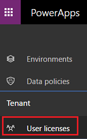

# Identify PowerApps users in your organization
If you’re a global administrator for Office 365 or a tenant administrator for Azure Active Directory, you can download a list of users in your organization who not only are licensed to use PowerApps, Microsoft Flow, or both but also have accessed either of those products. The list contains each user’s name, email address, license type, and other information. For example, a user might have:

* a trial license for PowerApps or Microsoft Flow
* access to both products through an Office 365 license
* access to both products through a Dynamics 365 license
* access from PowerApps and Microsoft Flow plans

## Download the list of users
1. In the PowerApps admin center, click or tap **User licenses** near the left edge.
   
    > [!IMPORTANT]
> This option is available to Office 365 Global administrators and Azure Active Directory tenant admininstrators only.
   
    
2. Click or tap **Download a list of active user licenses**.
   
    
   
    The file might take a few minutes to download. Wait a few minutes for the .csv file to download, and then open it in Excel.
   
    > [!NOTE]
> If you close the window before the file finishes downloading, you might have to restart the process.

This example shows two users who have licenses to both PowerApps and Microsoft Flow through different means. Jane Doe has access through a subscription to Office 365, and John Doe got a trial license for each product.

This list doesn't contain users who have licenses for PowerApps and Microsoft Flow but have never accessed them. You can view all user licenses from the [Office 365 admin center][1].

If a user has left the organization, the list will show **Unknown** in columns such as **User name** and **Email** address. If the list shows **Unknown** but nobody has left the organization, wait several minutes, and then download the list again.

To add user licenses, open the [Office 365 admin center][1].

<!--Reference links in article-->
[1]:https://support.office.com/article/Assign-or-remove-licenses-for-Office-365-for-business-997596b5-4173-4627-b915-36abac6786dc
