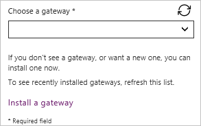
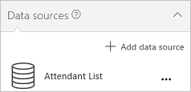

# Connect to SharePoint from PowerApps

Connect to a SharePoint site to generate an app automatically from a list, build an app from scratch, or update an existing app.

## Known issues
You can add data from a custom list but not a library. In addition, not all types of columns are supported, and not all types of columns support all types of cards.

| Column type | Support | Default cards |
| --- | --- | --- |
| Single line of text |Yes |View text |
| Multiple lines of text |Yes |View text |
| Choice |Yes |View lookup Edit lookup View multiselect Edit multiselect |
| Number |Yes |View percentage View rating View text |
| Currency |Yes |View percentage View rating View text |
| Date and Time |Yes |View text |
| Lookup |Yes |View lookup Edit lookup View multiselect Edit multiselect |
| Boolean (Yes/No) |Yes |View text View toggle |
| Person or Group |Yes |View lookup Edit lookup View multiselect Edit multiselect |
| Hyperlink |Yes |View URL View text |
| Picture |Yes (read-only) |View image View text |
| Attachment |Yes (read-only) |View Attachments|
| Calculated |Yes (read-only) | |
| Task Outcome |No | |
| External data |No | |
| Managed Metadata |Yes (read-only) | |
| Rating |No | |

Columns that contain spaces can by read by PowerApps, but the spaces are replaced with the hexadecimal escape code **"\_x0020\_"**. For example, **"Column Name"** in SharePoint will appear as **"Column_x0020_Name"** in PowerApps when displayed in the data layout or used in a formula.

## Prerequisites
Open PowerApps by taking *either* of these steps:

* [Sign up](../signup-for-powerapps.md) for PowerApps, [install PowerApps Studio for Windows](http://aka.ms/powerappsinstall), open it, and then sign in by providing the same credentials that you used to sign up.

* [Open PowerApps Studio for the web](https://create.powerapps.com/api/start) in a browser.

    For a list of supported browsers and limitations in the preview release of PowerApps Studio for the web, see [Create or edit apps in a browser](../create-app-browser.md).

## Create an app
* [Generate an app automatically](../app-from-sharepoint.md) based on data in a SharePoint list.

    The app will have three screens by default: one each for browsing records, displaying details of a record, and creating or updating a record. After the app is generated, you'll probably want to customize [the browse screen](../customize-layout-sharepoint.md) and [the details and edit screens](../customize-forms-sharepoint.md) to suit your needs.

    **Note:** If your SharePoint list contains a **Choice**, **Lookup**, or **Person or group** column, see [Show data in a gallery](connection-sharepoint-online.md#show-data-in-a-gallery) later in this topic.

* Build your own app from scratch by [connecting to SharePoint](../connect-to-sharepoint.md), reviewing the concepts in [Create an app from scratch](../get-started-create-from-blank.md), and applying them to SharePoint instead of Excel.

## Add a SharePoint list to an existing app
1. In PowerApps Studio, open the app that you want to update.

2. On the **View** tab of the ribbon, click or tap **Data sources**

3. In the right-hand pane, click or tap **Add data source**.

    

4. Click or tap **New connection**, click or tap **SharePoint**, and then click or tap **Connect**.

    

5. Specify the type of SharePoint site to which you want to connect:

    

   * Click or tap **Connect directly (cloud services)** to connect to SharePoint Online.

   * Click or tap **Connect using on-premises data gateway** to connect to an on-premises SharePoint site.

       Specify **Windows** as the authentication type, and then specify your credentials. (If your credentials include a domain name, specify it as *domain\alias*.)

       

       **Note:** If you don't have an on-premises data gateway installed, [install one](../gateway-reference.md), and then click or tap the icon to refresh the list of gateways.

       Under **Choose a gateway**, click or tap the gateway that you want to use.

       

6. Click or tap **Connect**.

7. Under **Connect to a SharePoint site**, click or tap an entry in the **Recent sites** list (or type or paste the URL for the site that you want to use), and then click or tap **Go**.

    

8. Under **Choose a list**, select the check box for one or more lists that you want to use, and then click or tap **Connect**:  

    

    Not all types of lists appear by default. If the name of the list that you want to use doesn't appear, scroll to the bottom, and then type the name of the list in the box that contains **Enter a custom list name**.

    

    The data sources are added to your app.

    

## Show data in a gallery
To show data from any of these types of columns in a gallery, use the formula bar to set the **Text** property of one or more **Label** controls in that gallery:

* For a **Choice** or **Lookup** column, specify **ThisItem.[ColumnName].Value** to show data in that column.

    For example, specify **ThisItem.Location.Value** if you have a **Choice** column named **Location**, and specify **ThisItem.PostalCode.Value** if you have a **Lookup** column named **PostalCode**.

* For a **Person or Group** column, specify **ThisItem.[ColumnName].DisplayName** to show the display name of the user or the group.

    For example, specify **ThisItem.Manager.DisplayName** to show display names from a **Person or Group** column named **Manager**.

    You can also show different information about users, such as email addresses or job titles. To display a complete list of options, specify **ThisItem.[ColumnName].** (with the trailing period).

    **Note:** For a **CreatedBy** column, specify **ThisItem.Author.DisplayName** to show the display names of users who created items in the list. For a **ModifiedBy** column, specify **ThisItem.Editor.DisplayName** to show the display names of users who changed items in the list.

* For a **Managed Metadata** column, specify **ThisItem.[ColumnName].Label** to show data in that column.

    For example, specify **ThisItem.Languages.Label** if you have a **Managed Metadata** column named **Languages**.

## Next steps
* Learn how to [show data from a data source](../maker/add-gallery.md).
* Learn how to [view details and create or update records](../maker/add-form.md).
* See other types of [data sources](../connections-list.md) to which you can connect.
