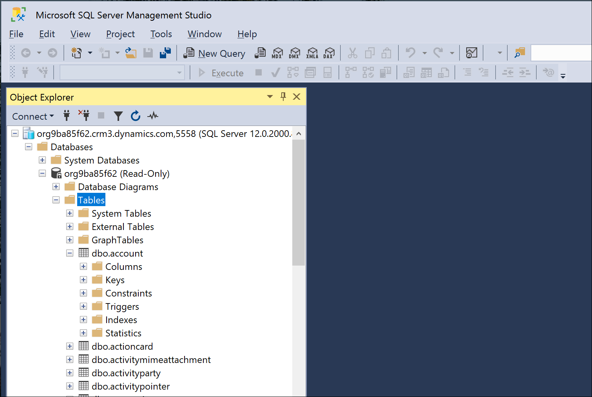
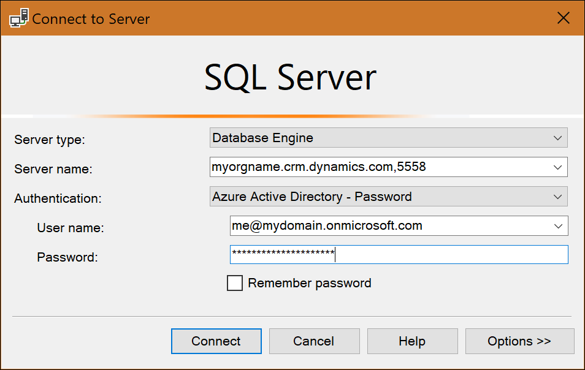

# Use SQL to query data

A SQL data connection is available on the Common Data Service (CDS) endpoint. The SQL connection provides read-only access to the entity data of the target CDS environment. This allows you to write and execute SQL queries against the entity data table. Table columns provide the attribute data of the entity. No custom views of the data have been provided.

## Applications support

The SQL data connection is available in Power BI Desktop through the **Data** > **Entities** > **Analyze in Power BI** button within the Power Apps maker experience. If you do not have this button in your Power Apps environment, then you do not yet have access to the SQL connection feature. More information: <link to related maker topic>

You can also use [SQL Server Management Studio](/sql/ssms/download-sql-server-management-studio-ssms) (SSMS) version 18.4 or later with the CDS endpoint SQL connection. Examples of using SSMS with the SQL data connection are provided below.



## Security and authentication

The CDS endpoint SQL connection uses the CDS security model for data access. Data can be obtained for all entities to which a user has access to in CDS.

Only Azure Active Directory authentication is supported. SQL authentication and Windows authentication are not supported. Below is an example of how to logon to the SQL connection in SSMS. Notice the server name is the organization address URL followed by a comma and the port value of 5558.



## Example entity data queries

Below are a couple of example queries composed in SSMS. The first image shows a simple query using aliases and result ordering.

```tsql
select top 5 a.name as [VIP customer], a.address1_postalcode as [ZIP code] from account a order by a.address1_postalcode desc
```


This next query shows a JOIN.

```tsql
select name, fullname from account a inner join contact c on a.primarycontactid = c.contactid
```


## Supported operations and data types

The list of supported SQL operations includes:

- Batch operations
- SELECT
- Aggregation functions (i.e., Count() and Max() functions)
- UNIONs and JOINs
- Filtering

Any operation that attempts to modify data (i.e., INSERT, UPDATE) will not work as this is a read-only SQL data connection. CDS option sets are represented as \<OptionSet>Name and \<OptionSet>Label in a result set.

The following CDS datatypes are not supported with the SQL connection: binary, image,
ntext, sql_variant, varbinary, virtual, hierarchyid, managedproperty, file, xml, party list, timestamp.

### See also

[Use FetchXML to construct a query](use-fetchxml-construct-query.md)