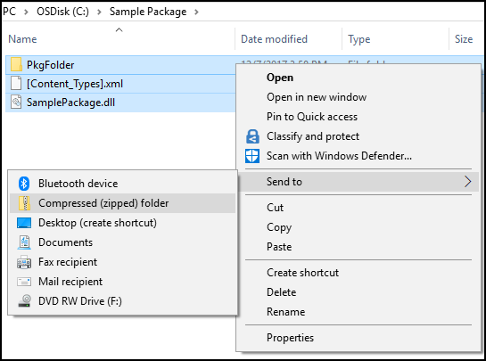
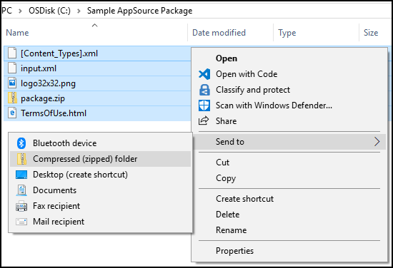

# Step 4: Create an AppSource package for your app

You must create an AppSource package (.zip file) to include your solution and demo data files along with other required files. An AppSource package consists of the following files:

|File|Description|
|--|--|
|Package file|A package file used by Package Deployer tool to deploy your solutions and demo configuration data into multiple languages.|
|[Content_Types].xml|File that provides MIME type information of the file type extensions included in the AppSource package. Typically, these are .config, .dll, .exe, .xml, and .zip file types, but you can add almost any file type that is supported by Windows.|
|Icon file|An image file for the appsource package icon; size should be 32x32 pixels. Valid image formats are PNG and JPG.|
|HTML file|File containing your License terms.|
|input.xml|Files that describes the assets in your AppSource package.|


## Create a Package file

A package lets you bundle and deploy multiple files related to your app at once. 

1. Create a Dynamics 365 package to include the solution and configuration data files that you created in [Step 2: Create a managed solution for your app](create-solution-app-appsource.md). A package can also contain custom code that can run before, while, or after the package is deployed to the Common Data Service instance. For more information about creating a package file, see [Create packages for the Dynamics 365 Package Deployer](/dynamics365/customer-engagement/developer/create-packages-package-deployer).

    After you have created a package, your package will consist of the following things:

    - **\<PackageName> folder**: This folder contains  all solutions,  configuration data, flat files, and the contents for your package. For example: **PkgFolder**.  
  
    - **\<PackageName>.dll**: The assembly contains the custom code for your package. For example: **SamplePackage.dll**.

2. Next, create a **[Content_Types].xml** file that provides MIME type information of the file type extensions that are included in your package. This is separate from the one that will be included again in the AppSource package. Here is the sample contents of a Content_Types].xml file with file types listed:

    ```xml
    <?xml version="1.0" encoding="utf-8"?>
    <Types xmlns="http://schemas.openxmlformats.org/package/2006/content-types">
      <Default Extension="xml" ContentType="application/octet-stream" />
      <Default Extension="xaml" ContentType="application/octet-stream" />
      <Default Extension="dll" ContentType="application/octet-stream" />
      <Default Extension="zip" ContentType="application/octet-stream" />
      <Default Extension="jpg" ContentType="application/octet-stream" />
      <Default Extension="gif" ContentType="application/octet-stream" />
      <Default Extension="png" ContentType="application/octet-stream" />
      <Default Extension="htm" ContentType="application/octet-stream" />
      <Default Extension="html" ContentType="application/octet-stream" />
      <Default Extension="db" ContentType="application/octet-stream" />
      <Default Extension="css" ContentType="application/octet-stream" />
    </Types>
    ```

3. Compress (zip) the following files into a file called *package.zip*:
   - package folder (PkgFolder)
   - package dll (SamplePackage.dll)
   - [Content_Types].xml

     To compress these files, browse to the folder where these files are present, select them all, right-click and select **Send to** > **Compressed (zipped) folder**.

      

4. Rename the .zip file to **package.zip**.

## Create [Content_Types].xml

You can reuse the **[Content_Types].xml** that you created in the previous section under step 2.

## Create an icon for your AppSource package

Create an icon file of size 32x32 to display along with the preferred solution name and description in the Dynamics 365 Administration Center portal. Valid file formats are PNG and JPG.

## Create an HTML file for license terms

Create an HTML file containing your license terms. You can have an HTML file per language to display the license terms in the user selected language if your app supports multiple languages.

## Create input.xml file

Create an *input.xml* file that provides information about your package and the contents of the package. Here is the contents of a sample **input.xml** file; each element is explained later in the table.

```xml
<?xml version="1.0" encoding="utf-8"?>
<PvsPackageData>
  <ProviderName>Microsoft</ProviderName>
  <PackageFile>package.zip</PackageFile>
  <SolutionAnchorName>SampleSolution.zip</SolutionAnchorName>
  <StartDate>12/01/2017</StartDate>
  <EndDate>01/01/2021</EndDate>
  <SupportedCountries>US,CA</SupportedCountries>
  <LearnMoreLink>http://www.microsoft.com</LearnMoreLink>
  <Locales>
    <PackageLocale Code="1033" IsDefault="true">
      <Logo>logo32x32.png</Logo>
      <Terms>
        <PackageTerm File="TermsOfUse.html" />
      </Terms>
    </PackageLocale>
  </Locales>
</PvsPackageData>
```


Here is a description of the elements in the **input.xml** file.

|Element|Description|
|--|--|
|ProviderName|Name of the solution provider. If created by a Microsoft internal team, specify **Microsoft**.|
|PackageFile|Name of package (.zip file) for the Package Deployer tool. This zip file should contain the package assembly, the package folder with your app assets, and the Content_Types.xml file. For example, the package.zip file created under the [Create a Package file](#create-a-package-file) section.|
|SolutionAnchorName|Name of the solution zip file in the package that is use for the display name and description of solution assets.|
|SolutionAnchorName|Name of the solution zip file in the package that is use for the display name and description of solution assets.|
|StartDate|Date on which the app becomes available on AppSource. The format is MM/DD/YYYY.|
|EndDate|Date on which the app stops being available on AppSource. The format is MM/DD/YYYY.|
|SupportedCountries|This is a comma-separated list of countries or regions where the app should be available. At the time of writing this article, the supported countries list is the following: AE,AL,AM,AO,AR,AT,AU,AZ,BA,BB,BD,BE,BG,BH,BM,BN,BO,BR,BY,CA,CH,CI,CL,CM,CO,CR,CV,CW,CY,CZ,DE,DK,DO,DZ,EC,EE,EG,ES,FI,FR,GB,GE,GH,GR,GT,HK,HN,HR,HU,ID,IE,IL,IN,IQ,IS,IT,JM,JO,JP,KE,KG,KN,KR,KW,KY,KZ,LB,LK,LT,LU,LV,LY,MA,MC,MD,ME,MK,MN,MO,MT,MU,MX,MY,NG,NI,NL,NO,NZ,OM,PA,PE,PH,PK,PL,PR,PS,PT,PY,QA,RO,RS,RU,RW,SA,SE,SG,SI,SK,SN,SV,TH,TM,TN,TR,TT,TW,UA,US,UY,UZ,VE,VI,VN,ZA,ZW|
|LearnMoreLink|URL to the detailed information page for this package.|
|Locales|An instance of this node for each language you want to support in the Preferred solution UI. This node contains the following children elements:<br/>- **PackageLocale.Code**: LCID of the language for this node. Example: US English is 1033<br/>- **PackageLocale.IsDefault**: Indicates the default language. This is used as the fallback language if the language chosen by the customer is not available.<br/>- **Logo**: Logo for your app package. Size of the image must be 32x32. Valid image formats are PNG and JPG.<br/>- **Terms**: Name of the HTML file that contains your license terms for each language.|

## Add the items to an AppSource package

The final step is to add all the components that you created earlier into a single compressed (zip) file, which will be your app source package.

1. Navigate to the folder that contains the package file, [Content_Types].xml, icon, license terms file (HTML), select them all, right-click and then select **Send to** > **Compressed (zipped) folder**.

    

    > [!IMPORTANT]
    > You must follow the content structure precisely for your package as described here otherwise, your package will fail during certification. Some common issues that lead to certification failure are incorrect file names or a nested file structure.

2. Rename the file appropriately as per your app. We recommend that you include your company name and app name. For example: **Microsoft_SamplePackage.zip**.
 

> [!div class="nextstepaction"]
> [Step 5: Store your AppSource Package on Azure Storage](store-appsource-package-azure-storage.md) 
