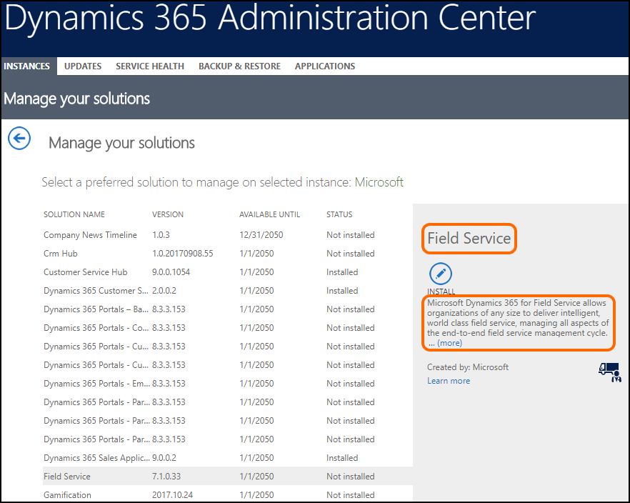

# Step 3: Create a managed solution for your app

Create a managed solution to include all the components for your app. You might find these topics helpful as you plan and create a managed solution to package your app components:
- [Introduction to solutions](introduction-solutions.md)
- [Plan for solution development](plan-solution-development.md) 
- [Create, install, and update a managed solution](create-install-update-managed-solution.md)

## Display name and description of your solution

While creating a solution to package your app components, make sure you provide appropriate values in the **Display Name** and **Description** fields for your new solution that you want to be displayed to your customers.

The **Display Name** and **Description** values for a solution are displayed to the customers in the **Dynamics 365 Administration Center** portal.

## Supporting data for your solution

If your solution requires supporting or demo data:
1. Create supporting/demo data in your test environment.
2. Use the [Configuration Migration tool](/dynamics365/customer-engagement/admin/manage-configuration-data) to create a schema to include your supporting/demo data. 
3. Save the schema file so that you can reuse it later to update the data in case your demo data changes.
4. Use the schema to export the data. Ensure that you provide a meaningful name to your export file. The data is exported and as a .zip file.

For detailed information about using the Configuration Migration tool to create a schema and export your data, see [Create a schema to export configuration data](/dynamics365/customer-engagement/admin/create-schema-export-configuration-data.md)

## At the end of this step

You will have a solution file (example: *SampleSolution.zip*) and optionally a demo data file (example: *SampleData.zip*) for your app.

> [!div class="nextstepaction"]
> [Step 4: Create an AppSource package for your app](create-package-app-appsource.md) 
  