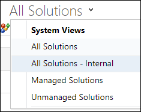
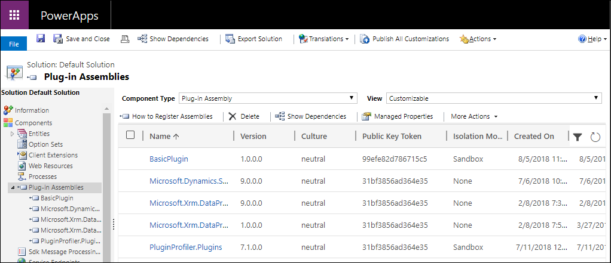
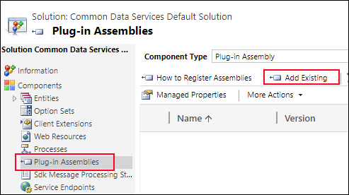
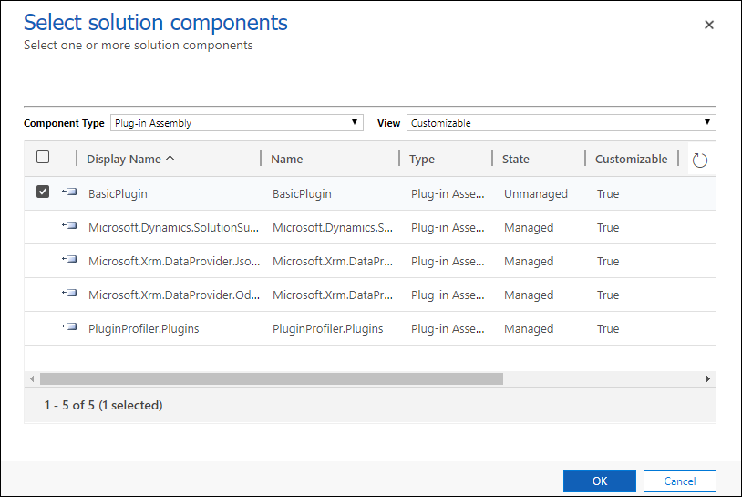
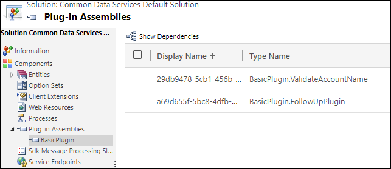

# Register a plug-in


The process of writing, registering, and debugging a plug-in is:

1. Create a .NET Framework Class library project in Visual Studio
1. Add the `Microsoft.CrmSdk.CoreAssemblies` NuGet package to the project
1. Implement the <xref:Microsoft.Xrm.Sdk.IPlugin> interface on classes that will be registered as steps.
1. Add your code to the <xref:Microsoft.Xrm.Sdk.IPlugin.Execute*> method required by the interface
    1. Get references to services you need
    1. Add your business logic
1. Sign & build the assembly
1. Test the assembly
    1. **Register the assembly in a test environment**
    1. **Add your registered assembly and steps to an unmanaged solution**
    1. Test the behavior of the assembly
    1. Verify expected trace logs are written
    1. Debug the assembly as needed

<!-- TODO I think we need something about adding the plug-in to a solution -->

Content in this topic describes the steps **in bold** above and supports the following tutorials:

- [Tutorial: Write a plug-in](tutorial-write-plug-in.md)
- [Tutorial: Debug a plug-in](tutorial-debug-plug-in.md)
- [Tutorial: Update a plug-in](tutorial-update-plug-in.md)

## Plugin registration tool (PRT)

You will use the Plugin Registration Tool (PRT) to register your plug-in assemblies and steps.

PRT is one of the tools available for download from NuGet. Follow the instructions in [Download tools from NuGet](download-tools-nuget.md). That topic includes instructions to use a PowerShell script to download the latest tools from NuGet.

After you download the PRT, use the [Connect using the Plug-in Registration tool](tutorial-write-plug-in.md#connect-using-the-plug-in-registration-tool) steps in the [Tutorial: Write a plug-in](tutorial-write-plug-in.md) to connect to your CDS for Apps environment.

## Register an assembly

Registering an assembly is the the process of uploading the assembly to the CDS for Apps database. See the instructions found at [Register your assembly](tutorial-write-plug-in.md#register-your-assembly) in the [Tutorial: Write a plug-in](tutorial-write-plug-in.md)

> [!NOTE]
> You will find options related to the *isolation mode* and *location* for the assembly. These refer to options that apply to on-premise deployments. CDS for Apps is not available for on-premises deployments, so you will always accept the default options of **SandBox** and **Database** for these options.

When an assembly is uploaded it is stored in the `PluginAssembly` entity. Most of the properties are set using reflection of the imported entity. The base64 encoded bytes of the assembly is stored in the `Content` attribute. While viewing the **Properties** of the assembly in the PRT, you can only edit the **Description** attribute value.

### View registered assemblies

You can view information about registered assemblies in the application solution explorer without using the PRT.

[!INCLUDE [cc_navigate-solution-from-powerapps-portal](../../includes/cc_navigate-solution-from-powerapps-portal.md)]

> [!NOTE]
> Each assembly you add using PRT will be added to the system **Default Solution**, (not to be confused with the **Common Data Serices Default Solution**). To view the **Default Solution**, select All solutions under Solutions and then change the view to **All Solutions - Internal**.



There you can find all the assemblies that are registered for this environment.



### Query registered assemblies with code

To view information about registered assemblies without the PRT or the application, use the following Web API query in your browser:

```
[org uri]]/api/data/v9.0/pluginassemblies
?$filter=ishidden/Value eq false
&$select=
createdon,
culture,
customizationlevel,
description,
isolationmode,
major,
minor,
modifiedon,
name,
pluginassemblyid,
publickeytoken,
version
```

Or use following FetchXml to retrieve it in a program you write:

```xml
<fetch>
  <entity name='pluginassembly' >
    <attribute name='createdon' />
    <attribute name='culture' />
    <attribute name='customizationlevel' />
    <attribute name='description' />
    <attribute name='isolationmode' />
    <attribute name='major' />
    <attribute name='minor' />
    <attribute name='modifiedon' />
    <attribute name='name' />
    <attribute name='pluginassemblyid' />
    <attribute name='publickeytoken' />
    <attribute name='version' />
    <filter type='and' >
      <filter>
        <condition attribute='ishidden' operator='eq' value='false' />
      </filter>
    </filter>
  </entity>
</fetch>
```
More information: [Use FetchXML with FetchExpression](org-service/entity-operations-query-data.md#use-fetchxml-with-fetchexpression)

## Add your assembly to a solution

As described in [View registered assemblies](#view-registered-assemblies), the assembly registration you created was added to the system **Default Solution**. You should add your assembly to an unmanaged solution so you can distribute it to other organizations.

Within the managed solution you are using, use solution explorer to navigate to **Plug-in Assemblies**. In the list menu, select **Add Existing**.



Then add your assembly as a component to the solution.



When you select the plug-in assembly you added, you can view the plug-in classes it includes.



> [!NOTE]
> Any existing or subsequent step registrations are not added to the unmanaged solution that includes the plug-in assemblies. You must add each registered step to the solution separately. More information: [Add step to solution](#add-step-to-solution)

## Register plug-in step

When an assembly is loaded or updated, any classes that implement <xref:Microsoft.Xrm.Sdk.IPlugin> will be available in the PRT. Use the instructions in [Register a new step](tutorial-write-plug-in.md#register-a-new-step) in the [Tutorial: Write a plug-in](tutorial-write-plug-in.md) to create a new step registration.

When you register a step, there are many options available to you which depend on the stage of the event pipeline and the nature of the operation you will register your code to respond to.

### General Configuration Information Fields

|Field|Description|
|--|--|
|**Message**|PRT will auto-complete available message names in the system. More information: [Use messages with the Organization service](org-service/use-messages.md)|
|**Primary Entity**|PRT will auto-complete valid entities that apply to the selected message. These messages have a `Target` parameter that accepts and <xref:Microsoft.Xrm.Sdk.Entity> or <xref:Microsoft.Xrm.Sdk.EntityReference> type. If valid entities apply, you should set this when you want to limit the number of times the plug-in is called. <br />If you leave it blank for core entity messages like `Update`, `Delete`, `Retrieve`, and `RetrieveMultiple` or any message that can be applied with the message the plug-in will be invoked for all the entities that support this message.|
|**Secondary Entity**|This field remains for backward compatibility for long deprecated messages that accepted an array of <xref:Microsoft.Xrm.Sdk.EntityReference> as the `Target` parameter. This field is typically not used anymore.|
|**Filtering Attributes**|With the `Update` message, when you set the **Primary Entity**, filtering attributes limits the execution of the plug-in to cases where the selected attributes are included in the update. This is a best practice for performance. |
|**Event Handler**|This value will be populated based on the name of the assembly and the plug-in class. |
|**Step Name**|The name of the step. A value is pre-populated based on the configuration of the step, but this value can be overridden.|
|**Run in User's Context**|Provides options for applying impersonation for the step. The default value is **Calling User**. If the calling user doesn't have privileges to perform operations in the step, you may need to set this to a user who has these privileges. More information: [Impersonation](plug-ins.md#impersonation) |
|**Execution Order**|Multiple steps can be registered for the same stage of the same message. The number in this field determines the order in which they will be applied from lowest to highest. Edit this to control the order in which plug-ins are applied in the stage.|
|**Description**|A description for step. This value is prepopulated but can be overwritten.|

> [!NOTE]
> There are certain cases where plug-ins registed for the `Update` event can be called twice. More information: [Behavior of specialized update operations](special-update-operation-behavior.md)


### Event Pipeline Stage of execution

Choose the stage in the event pipeline that best suites the purpose for your plug-in.

|Option|Description|
|--|--|
|**PreValidation**|[!INCLUDE [cc-prevalidation-description](../../includes/cc-prevalidation-description.md)]|
|**PreOperation**|[!INCLUDE [cc-preoperation-description](../../includes/cc-preoperation-description.md)]|
|**PostOperation**|[!INCLUDE [cc-postoperation-description](../../includes/cc-postoperation-description.md)]|

More information: [Event execution pipeline](event-framework.md#event-execution-pipeline)

### Execution Mode

There are two modes of execution asynchronous, and synchronous.

|Option|Description|
|--|--|
|**Asynchronous**|The execution context and the definition of the business logic to apply is moved to system job which will execute after the operation completes.|
|**Synchronous**|Plug-ins execute immediately according to the stage of execution and execution order. The entire operation will wait until they complete.|

Asynchronous plug-ins can only be registered for the **PostOperation** stage. For more information about how system jobs work, see [Asynchronous service](asynchronous-service.md)

### Deployment

|Option|Description|
|--|--|
|**Server**|The plug-in will run on the CDS for apps server.|
|**Offline**|The plug-in will run within the Dynamics 365 for Outlook client when the user is in offline mode.|

<!-- TODO Add link to where more information about offline-plugins will be documented -->

### Set configuration data

The **Unsecure Configuration** and **Secure Configuration** fields allow you to specify configuration data to pass to the plug-in for a specific step.

You can write your plug-in to accept string values in the constructor to use this data to control how the plug-in should work for the step. More information: [Pass configuration data to your plug-in](write-plug-in.md#pass-configuration-data-to-your-plug-in)

### Define entity images

Within your plug-in, you may want to reference primary entity property values that were not included in an operation. For example, in an `Update` operation you might want to know what a value was before it was changed, but the execution context doesn't provide this information, it only includes the changed value. 

If your plug-in step is registered in the **PreValidation** or **PreOperation** stages of the execution pipeline, you could use the organization service to retrieve the current value of the property, but this is not a good practice for performance. A better practice is to define a pre entity image with your plug-in step registration. This will capture a 'snapshot' of the entity with the fields you are interested in as they existed before the operation that you can use to compare with the changed values. 

#### Messages that support entity images

In CDS for Apps, only the following messages support entity images:

|Message|Request Class Property| Description|
|--|--|--|
|`Assign`|`Target`|The assigned entity.|
|`Create`|`Target`|The created entity.|
|`Delete`|`Target`|The deleted entity.|
|`DeliverIncoming`|`EmailId`|The delivered email ID.|
|`DeliverPromote`|`EmailId`|The delivered email ID.|
|`Merge`|`Target` or `SubordinateId`|	The parent entity, into which the data from the child entity is being merged or the child entity that is being merged into the parent entity.|
|`Route`|`Target`|The item being routed.|
|`Send`|`FaxId`, `EmailId`, or `TemplateId` |The item being sent.|
|`SetState`|`EntityMoniker`|The entity for which the state is set.|
|`Update`|`Target`|The updated entity.|


#### Types of entity images

There are two types of entity images: **Pre Image** and **Post Image**. When you configure them, these images will be available within the execution context as <xref:Microsoft.Xrm.Sdk.IExecutionContext.PreEntityImages> and <xref:Microsoft.Xrm.Sdk.IExecutionContext.PostEntityImages> properties respectively. As the names suggest, these snapshots represent what the entity looks like before the operation and after the operation. When you configure an entity image, you will define an *entity alias* value that will be the key value you will use to access a specific entity image from the `PreEntityImages` or `PostEntityImages` properties.

#### Availabilty of images

When you configure an entity image it is important that you recognize that the type of entity images available depend on the stage of the registered step and the type of operation. For example:

- You cannot have a **Pre Image** for the `Create` message because the entity doesn't exist yet.
- You cannot have a **Post Image** for the `Delete` message because the entity won't exist anymore.
- You can only have a **Post Image** for steps registered in the **PostOperation** stage of the execution pipeline because there is no way to know what the entity properties will be until the transaction is completed.
- For an `Update` operation that is registered in the **PostOperation** stage you can have both a **Pre Image** AND a **Post Image**.


#### Add an entity image

See [Add an image](tutorial-update-plug-in.md#add-an-image) step in the [Tutorial: Update a plug-in](tutorial-update-plug-in.md) for the steps to add an entity image.

### Add step to solution

As mentioned in [Add your assembly to a solution](#add-your-assembly-to-a-solution), **Plug-in Assemblies** are solution components that can be added to an unmanaged solution. **Sdk Message Processing Steps** are also solution components and must also be added to an unmanaged solution in order to be distributed.

The steps to add a step to a solution is similar to adding an assembly. You will use the **Add Existing** command to move it into the desired unmanaged solution. The only difference is that if you attempt to add a step but have not already added the assembly that contains the class used in the step, you will be prompted to add missing required components.


If you encounter this, you should usually select **OK** to bring the assembly in with the unmanaged solution. The only time you would not select this is if your solution is designed to be installed in an environement where another solution containing the assembly is already installed.

Similarly, you should note that removing the assembly from the solution will not remove any steps that depend on it.

## Update an assembly

When you change and re-build an assembly that you have previously registered, you will need to update it. See the [Update the plug-in assembly registration](tutorial-update-plug-in.md#update-the-plug-in-assembly-registration) step in the [Tutorial: Update a plug-in](tutorial-update-plug-in.md) for the steps.

> [!IMPORTANT]
> If you are making changes to a plug-in assembly that is part of a managed solution that has been deployed you need to consider the impact your changes may have when you update that managed solution.
> 
>

## Unregister an assembly