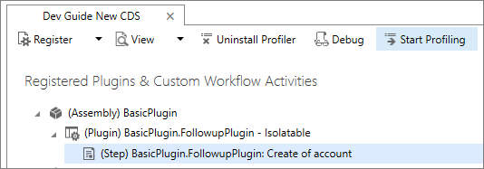
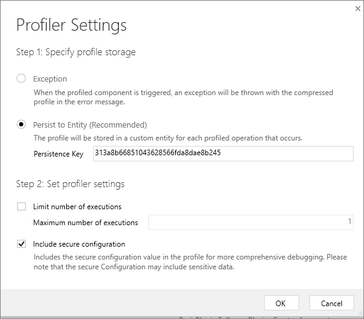
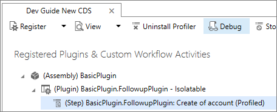
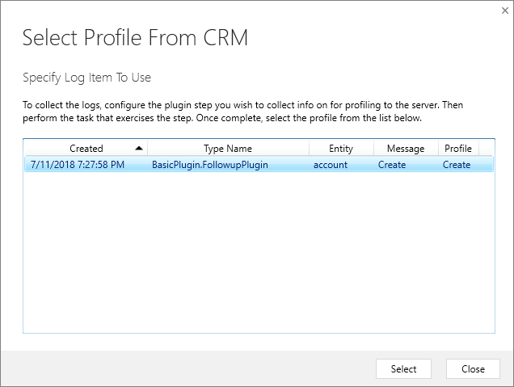
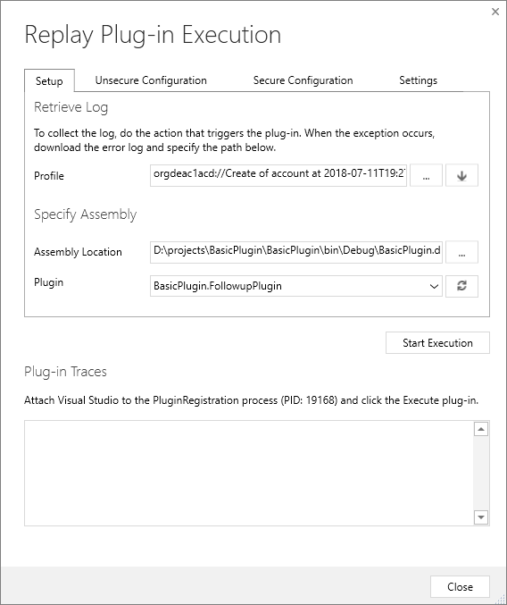
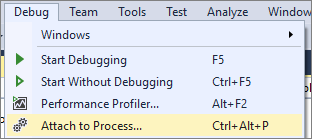
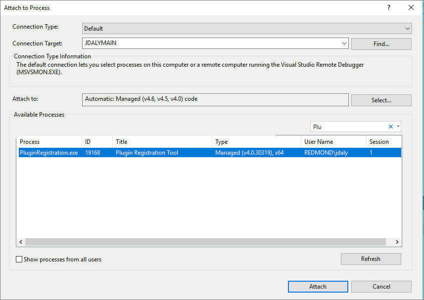
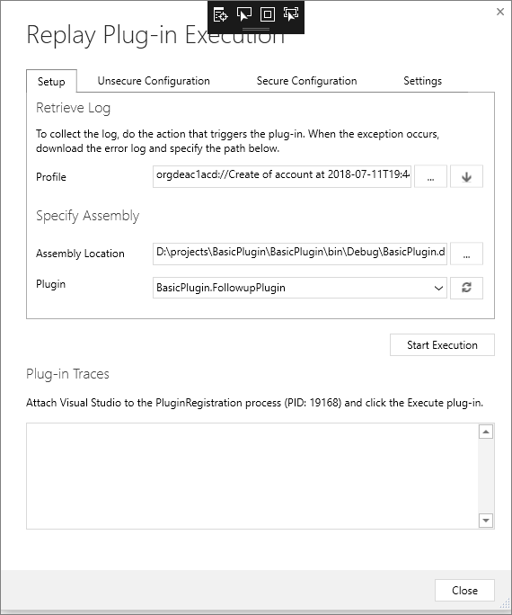
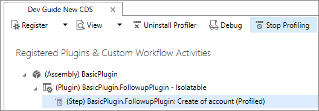

# Tutorial: Debug a plug-in

This tutorial is the second in a series that will show you how to work with plug-ins. 

- [Tutorial: Write a plug-in](tutorial-write-plug-in.md)
- Tutorial: Debug a plug-in (This tutorial)
- [Tutorial: Update a plug-in](tutorial-update-plug-in.md)

For detailed explanation of supporting concepts and technical details see:

- [Use plug-ins to extend business processes](plug-ins.md)
- [Write a plug-in](write-plug-in.md)
- [Debug Plug-ins](debug-plug-in.md)

## Goal

Because the plug-in executes on a remote server, you cannot attach a debugger to the process. The plug-in profiler captures a profile of an executing plug-in and allows you to re-play the execution of the plug-in using Visual Studio locally.

## Prerequisites

- All the prerequisites for  [Tutorial: Write a plug-in](tutorial-write-plug-in.md) apply. See [Prerequisites](tutorial-write-plug-in.md#prerequisites).
- If you haven't completed the previous tutorial, you can use the general steps below with a different registered plug-in.

## Install plug-in profiler

1. If the Plug-in registration tool isn't already installed and open, follow the steps in [Tutorial: Write a plug-in](tutorial-write-plug-in.md) to open it. Complete the [Connect using the Plug-in Registration tool](tutorial-write-plug-in.md#connect-using-the-plug-in-registration-tool) section.
1. In the Plugin Registration tool, click **Install Profiler**.

    

1. This will install a new managed solution named Plug-in Profiler in your CDS for Apps environment. This will take a minute or two to complete.

## Start profiling

1. In the Plugin Registration tool, select the **(Step) BasicPlugin.FollowupPlugin: Create of account** step you registered earlier, and click **Start Profiling**.

    

1. In the **Profiler Settings** dialog accept the default settings and click **OK** to close the dialog.

    

## Capture a profile

1. In your model-driven app, create a new account to trigger the plug-in. This will capture an instance of the plug-in executing and persist it as a profile record in the system.
1. In the Plug-in Registration tool, click **Debug**.

    

1. In the **Replay Plug-in Execution** dialog, on the **Setup** tab, click the  icon to open the **Select Profile from CRM** dialog.
1. In the **Select Profile from CRM** dialog, select the profile where **Type Name** equals **BasicPlugin.FollowupPlugin** and represents the profile captured when you last triggered the plug-in.

    

## Debug your plug-in

1. In the **Replay Plug-in Execution**dialog, on the **Setup** tab, in the **Specify Assembly** section, click the ellipses (**…**) button and choose the location of your `BasicPlugin.dll`.

    

1. In your Visual studio project, set a break point in your plug-in class.

    

1. In your Visual Studio project, select **Debug** > **Attach to Process…**.

    

1. Select the **PluginRegistration.exe** process ID `19168` and click **Attach**.

    

    > [!NOTE]
    > You should see that the Plug-in Registration tool is now running in debug mode.

1. In the **Replay Plug-in Execution** dialog, click **Start Execution**.

    

1. In your Visual Studio project, you should see that the code is paused at the breakpoint you set earlier. 

    

1. You can now step through your code to debug.

## Repeat

To repeat, in your Visual Studio project select **Debug** > **Reattach** to process and in the**Replay Plug-in Execution** dialog click **Start Execution** again.

## Stop profiling

1. Close the **Replay Plug-in Execution** dialog
1. In the Plug-in Registration tool, click **Stop Profiling**.

    

## Next steps

To learn more about common things you will do with plug-ins, continue to [Tutorial: Update a plug-in](tutorial-update-plug-in.md)

If you will not continue to the next tutorial you should unregister the BasicPlugin assembly you created in this step. See [Unregister assembly, plug-in, and step](tutorial-update-plug-in.md#unregister-assembly-plug-in-and-step) for instructions.

