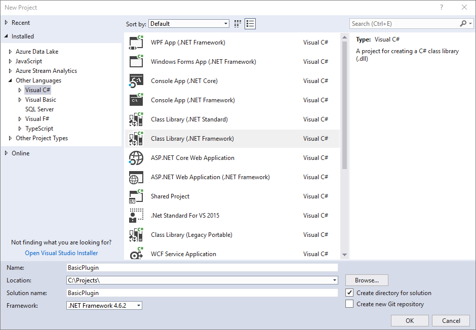
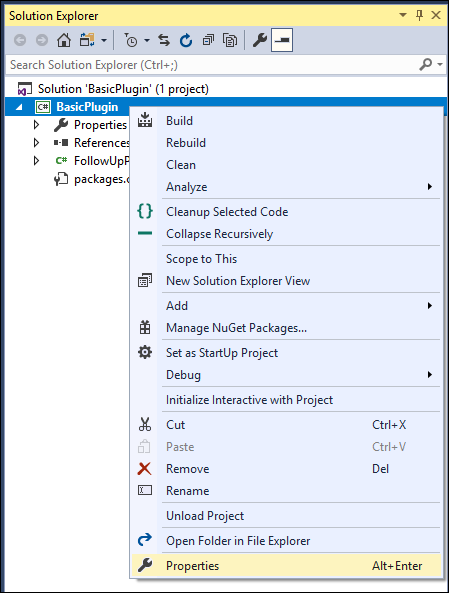
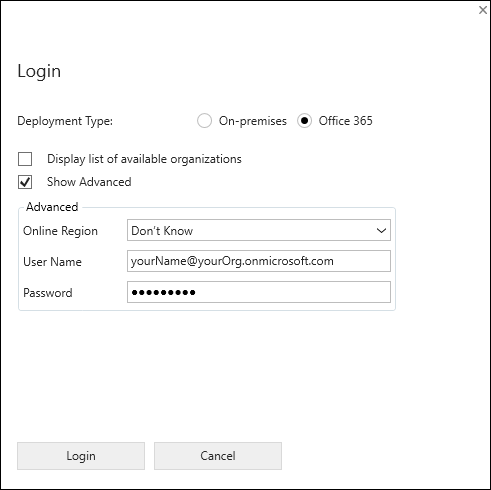
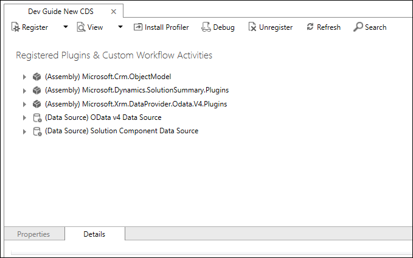
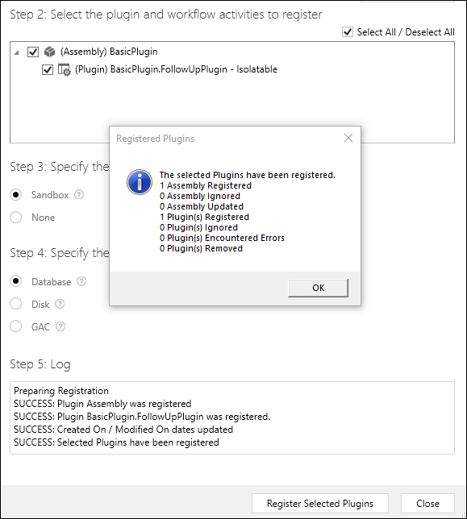
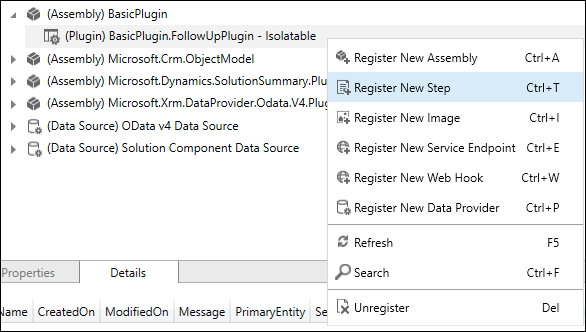
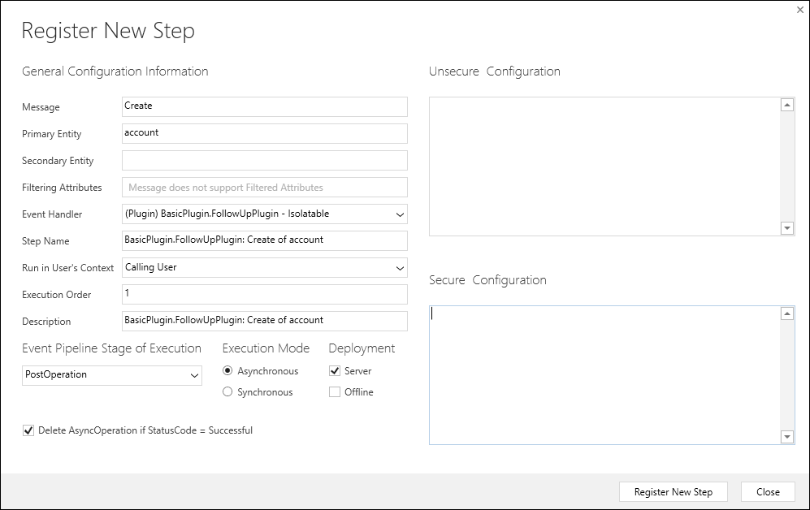

# Tutorial: Write a plug-in

This tutorial is the first in a series that will show you how to work with plug-ins. This tutorial is a pre-requisite for the following tutorials:

- [Tutorial: Debug a plug-in](tutorial-debug-plug-in.md)
- [Tutorial: Update a plug-in](tutorial-update-plug-in.md)

## Goal
Create an asynchronous plug-in registered on the Create message of the account entity. The plug-in will create a task activity that will remind the creator of the account to follow up one week later.

> [!NOTE]
> This goal can be easily achieved using a workflow without writing code. We are using this simple example so that we can focus on the process of creating and deploying a plug-in.

## Prerequisites

- Administrator level access to a Common Data Service for Apps environment
- A model-driven app that includes the account and task entities.
- Visual Studio 2017
- Knowledge of the Visual C# programming language
- Download the Plug-in Registration tool.
    - Information about downloading the Plug-in registration tool is at : [Download tools from NuGet](download-tools-nuget.md). That topic includes instructions to use a PowerShell script to download the latest tools from NuGet.

## Create a plug-in project

You need to use Visual Studio to write a plug-in. Use these steps to write a basic plug-in.

### Create a Visual Studio Project for the Plug-in

1. Open Visual Studio 2017 and open a new **Class Library (.NET Framework)** project using **.NET Framework 4.5.2**

    

    The name used for the project will be the name of the assembly. This tutorial uses the name `BasicPlugin`.
1. In **Solution Explorer**, right-click the project and select **Manage NuGet Packages…** from the context menu.

    

1. Select **Browse** and search for `Microsoft.CrmSdk.CoreAssemblies` and install the latest version.

    

1. You must select **I Accept** in the **License Acceptance** dialog.
1. In **Solution Explorer**, right-click the `Class1.cs` file and choose **Rename** in the context menu.

    

1. Rename the `Class1.cs` file to `FollowupPlugin.cs`.
1. When prompted, allow Visual Studio to re-name the class to match the file name.

    

### Edit the Class file to enable a plug-in

1.Add the following `using` statements to the top of the `FollowupPlugin.cs` file:


```csharp
using System.ServiceModel;  
using Microsoft.Xrm.Sdk;
```
 
1. Implement the <xref:Microsoft.Xrm.Sdk.IPlugin> Interface by editing the class.
    > [!NOTE]
    > If you just type  `: IPlugin` after the class name, Visual Studio will auto-suggest implementing a stub for the **Execute** Method.


    ```csharp
    public class FollowupPlugin : IPlugin
    {
        public void Execute(IServiceProvider serviceProvider)
        {
            throw new NotImplementedException();
        }
    }
    ```

1. Replace the contents of the `Execute` method with the following code:


    ```csharp
    // Obtain the tracing service
    ITracingService tracingService =
    (ITracingService)serviceProvider.GetService(typeof(ITracingService));

    // Obtain the execution context from the service provider.  
    IPluginExecutionContext context = (IPluginExecutionContext)
        serviceProvider.GetService(typeof(IPluginExecutionContext));

    // The InputParameters collection contains all the data passed in the message request.  
    if (context.InputParameters.Contains("Target") &&
        context.InputParameters["Target"] is Entity)
    {
        // Obtain the target entity from the input parameters.  
        Entity entity = (Entity)context.InputParameters["Target"];

        // Obtain the organization service reference which you will need for  
        // web service calls.  
        IOrganizationServiceFactory serviceFactory =
            (IOrganizationServiceFactory)serviceProvider.GetService(typeof(IOrganizationServiceFactory));
        IOrganizationService service = serviceFactory.CreateOrganizationService(context.UserId);

        try
        {
            // Plug-in business logic goes here.  
        }

        catch (FaultException<OrganizationServiceFault> ex)
        {
            throw new InvalidPluginExecutionException("An error occurred in FollowUpPlugin.", ex);
        }

        catch (Exception ex)
        {
            tracingService.Trace("FollowUpPlugin: {0}", ex.ToString());
            throw;
        }
    }
    ```

### About the code

- The <xref:Microsoft.Xrm.Sdk.ITracingService> enables writing to the tracing log.  You can see an example in the final catch block. More information: [Tracing](plug-ins.md#tracing)
- The <xref:Microsoft.Xrm.Sdk.IPluginExecutionContext> provides access to the context for the event that executed the plugin.  More information: [Context information available to your code](plug-ins.md#context-information-available-to-your-code).
- The code verifies that the context <xref:Microsoft.Xrm.Sdk.IExecutionContext.InputParameters> includes the expected parameters for the <xref:Microsoft.Xrm.Sdk.Messages.CreateRequest> that this plug-in will be registered for. If the <xref:Microsoft.Xrm.Sdk.Messages.CreateRequest.Target> property is present, the <xref:Microsoft.Xrm.Sdk.Entity> that was passed to the request will be available.
- The <xref:Microsoft.Xrm.Sdk.IOrganizationServiceFactory> interface provides access to a service variable that implements the <xref:Microsoft.Xrm.Sdk.IOrganizationService> interface which provides the methods you will use to interact with the service to create the task.


## Add business logic

The plug-in will create a task activity that will remind the creator of the account to follow up one week later.

Add the following code to the try block. Replace the comment: `// Plug-in business logic goes here`. with the following:


```csharp
// Create a task activity to follow up with the account customer in 7 days. 
Entity followup = new Entity("task");

followup["subject"] = "Send e-mail to the new customer.";
followup["description"] =
    "Follow up with the customer. Check if there are any new issues that need resolution.";
followup["scheduledstart"] = DateTime.Now.AddDays(7);
followup["scheduledend"] = DateTime.Now.AddDays(7);
followup["category"] = context.PrimaryEntityName;

// Refer to the account in the task activity.
if (context.OutputParameters.Contains("id"))
{
    Guid regardingobjectid = new Guid(context.OutputParameters["id"].ToString());
    string regardingobjectidType = "account";

    followup["regardingobjectid"] =
    new EntityReference(regardingobjectidType, regardingobjectid);
}

// Create the task in Microsoft Dynamics CRM.
tracingService.Trace("FollowupPlugin: Creating the task activity.");
service.Create(followup);
```

### About the code

- This code uses the late-bound style to create a task and associate it with the account being created. More information: [Create entities using the Organization Service](org-service/entity-operations-create.md)
- Early bound classes can be used, but this requires generating the classes for the entities and including the file defining those classes with the assembly project. This is mostly a personal preference, so those steps have been left out of this tutorial for brevity. More information: [Late-bound and Early-bound programming using the Organization service](org-service/early-bound-programming.md)
- The <xref:Microsoft.Xrm.Sdk.Entity.Id> of the account being created is found in the context <xref:Microsoft.Xrm.Sdk.IExecutionContext.OutputParameters> and set as the `regardingobjectid` lookup attribute for the task.

## Build plug-in

In Visual Studio, press **F6** to build the assembly. Verify that it compiles without error.

## Sign plug-in

1. In **Solution Explorer**, right click the **BasicPlugin** project and in the context menu select **Properties**.

    

1. In the project properties, select the **Signing** tab and select the **Sign the assembly** checkbox.

    

1. In the **Choose a strong name key file**: dropdown, select **<New…>**. 
1. In the **Create Strong Name Key**dialog, enter a **key file name** and deselect the **Protect my key file with a password** checkbox.
1. Click **OK** to close the **Create Strong Name Key** dialog.
1. In the project properties **Build** tab, verify that the **Configuration** is set to **Debug**.
1. Press **F6** to build the plug-in again.
1. Using windows explorer, find the built plug-in at:` \bin\Debug\BasicPlugin.dll`.

> [!NOTE]
> Build the assembly using **Debug** configuration because you will use the Plug-in profiler to debug it in a later tutorial.   Before you include a plug-in with your solution, you should build it using the release configuration.

## Register plug-in

To register a plug-in, you will need the plug-in registration tool

### Connect using the Plug-in Registration tool

1. After you have downloaded the Plug-in registration tool, click the `PluginRegistration.exe` to open it.
1. Click **Create new Connection** to connect to your instance.
1. Make sure Office 365 is selected. If you are connecting using a Microsoft account other than one you are currently using, click **Show Advanced**.

    

1. Enter your credentials and click **Login**.
1. If your Microsoft Account provides access to multiple environments, you will need to choose an environment.
1. After you are connected, you will see any existing registered plug-ins & custom workflow activities

    

### Register your assembly

1. In the **Register** drop-down, select **New Assembly**.

    

1. In the **Register New Assembly** dialog, select the ellipses (**…**) button and browse to the assembly you built in the previous step.

    

1. Verify that the **isolation mode** is **sandbox** and the **location** to store the assembly is **Database**.

    > [!NOTE]
    > Other options for **isolation mode** and **location** apply to on-premises deployments.

1. Click **Register Selected Plug-ins**.
1. You will see a **Registered Plug-ins** confirmation dialog.

    

1. Click **OK** to close the dialog and close the **Register New Assembly** dialog. 
1. You should now see the **(Assembly) BasicPlugin** assembly which you can expand to view the **(Plugin) BasicPlugin.FollowUpPlugin** plugin.

    


### Register a new step

1. Right-click the **(Plugin) BasicPlugin.FollowUpPlugin** and select **Register New Step**.

    

1. In the **Register New Step** dialog, set the following fields:

    |Setting|Value|
    |--|--|
    |Message|Create|
    |Primary Entity|account|
    |Event Pipeline Stage of Execution|PostOperation|
    |Execution Mode|Asynchronous|

    

1. Click **Register New Step** to complete the registration and close the **Register New Step** dialog.
1. You can now see the registered step.

    


## Test plug-in

## View trace logs

## Next steps