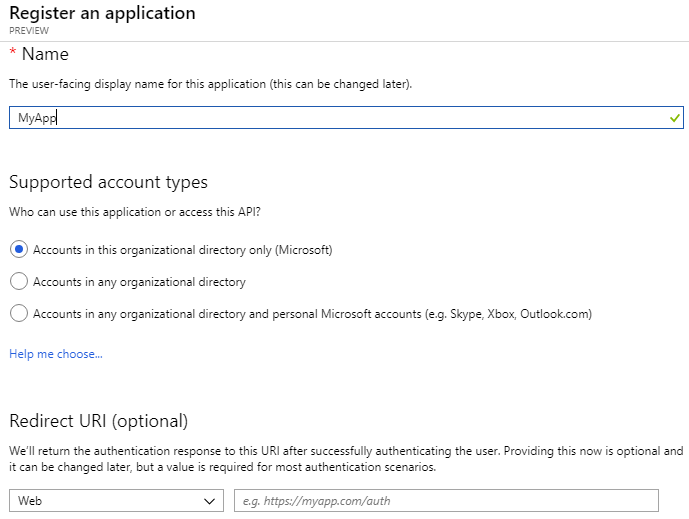
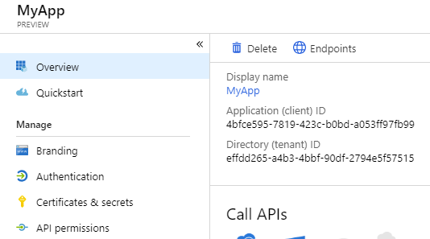
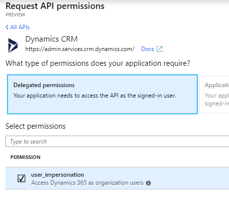
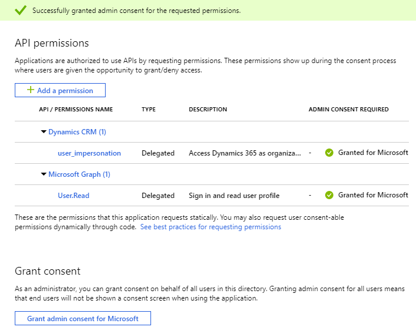

# Use Single-Tenant server-to-server authentication

The single-tenant server-to-server scenario typically applies for enterprise organizations who have multiple Common Data Service (CDS) for Apps environments using Active Directory Federation Services (AD FS) for authentication. However, it can also be applied by environments when the application won't be distributed to other environments.  
  
 An enterprise can create a web application or service to connect to any CDS for Apps environments associated with a single Azure Active Directory (AD) tenant.
  
## Differences from multi-tenant scenario  
 Creating a web application or service for a single-tenant server-to-server authentication is similar to that used for a multi-tenant organization but there are some important differences.  
  
-   Because all the organizations are in the same tenant, there is no need for a tenant admin to grant consent for each organization. The application is simply registered once for the tenant.
  
-   You have the opportunity to use certificates rather than keys if you prefer.  

<a name="bkmk_Requirements"></a>
## Requirements  

 To create and test a single-tenant application that uses server-to-server (S2S) authentication you will need:  
  
- An Azure AD tenant to use when registering the provided sample application.
- A CDS for Apps subscription that is associated with the Azure AD tenant.
- Administrator privileges in the Azure AD tenant and D365 organization.

<a name="bkmk_registration"></a>
## Azure application registration
To create an application registration in Azure AD, follow these steps.

1. Navigate to https://portal.office.com and sign in, or from your D365 organization web page select the application launcher in the top left corner.
2. Choose **Admin** > **Admin centers** > **Azure Active Directory**
3. From the left panel, choose **Azure Active Directory** > **App registrations (Preview)**
4. Choose **+ New registration** [ [image](#bkmk_app-registration-started) ]
5. In the **Register an application** form provide a name for your app, select **Accounts in this organizational directory only**, provide a valid web URI for the **Redirect URI**, and choose **Register**. Note that the URI must syntactically correct but does not need to actually exist.
6. On the **Overview** page, select **API permissions** [ [image](#bkmk_app-registration-completed) ]
7. Choose **+ Add a permission**
8. In the **Microsoft APIs** tab, choose **Dynamics CRM**
9. In the **Request API permission** form, select **Delegated permissions**, check **user_impersonation**, and select **Add permissions** [ [image](#bkmk_api-permission-started) ]
10. On the **API permissions** page below **Grant consent**, select **Grant admin consent for "org-name"** and when prompted choose **Yes** [ [image](#bkmk_api-permission-completed) ]
11. Select **Overview** in the navigation panel, record the **Display name**, **Application ID**, and **Directory ID** values of the app registration. You will provide these later in the code sample.
12. In the navigation panel, select **Certificates & secrets**
13. Below **Client secrets**, choose **+ New client secret** to create a secret
14. In the form, enter a description and select **Add**. Record the secret string. You will not be able to view the secret again once you leave the current screen.

<a name="bkmk_appuser"></a>
## Application User creation
To create an unlicensed "application user" in your Dynamics 365 organization, follow these steps. This application user will be given access to your organization's data on behalf of the end user who is using your application.

1. Navigate to the Azure Active Directory admin center
2. In the left navigation panel, choose **Users**
3. Select **+ New user**
4. In the **User** form, enter a name and username for the new user and select **Create**. Make sure the username contains the organization domain URL of your D365 tenant (i.e., someuser@myorg.onmicrosoft.com). You can exit Azure AD now.
5. Navigate to your D365 organization
6. Navigate to **Settings** > **Security** > **Users**
7. Choose **Application Users** in the view filter
8. Select **+ New**
9. In the **New User** form, enter the required information. These values must be identical to those values for the new user you created in the Azure tenant. [ [image](#bkmk_new-appuser) ]
10. If all goes well, after selecting **SAVE**, the **Application ID URI** and **Azure AD Object Id** fields will auto-populate with their correct values
11. Before exiting the user form, choose **MANAGE ROLES** and assign a security role to this application user so that the application user can access the desired organization data.

> [!IMPORTANT]
> When developing a real-world application using S2S, you should use a custom security role which can be stored in a solution and distributed along with your application. [image: New user completed]

<a name="bkmk_coding"></a>
## Application coding and execution

Follow these steps to download, build, and execute the sample application.

1. Download the Visual Studio 2017 SingleTenantS2S [sample](https://github.com/Microsoft/PowerApps-Samples/tree/master/cds/webapi/C%23/SingleTenantS2S).
2. Update the App.config file with your app registration and server key values.
3. Build and run the application.

### Expected results
An OData response listing the top 3 account names in your D365 organization.

### Example console output
Shown below is example console output obtained from a D365 organization that only had two accounts named "Test Account 1", and "Test Account 2".

```json
{
"@odata.context":"https://crmue2.api.crm.dynamics.com/api/data/v9.1/$metadata#accounts(name)",
"@Microsoft.Dynamics.CRM.totalrecordcount":-1,
"@Microsoft.Dynamics.CRM.totalrecordcountlimitexceeded":false,

"value":[
{"@odata.etag":"W/\"4648334\"","name":"Test Account 1","accountid":"28630624-cac9-e811-a964-000d3a3ac063"},
{"@odata.etag":"W/\"4648337\"","name":"Test Account 2","accountid":"543fd72a-cac9-e811-a964-000d3a3ac063"}]
}
```

### See also
 [Use Multi-Tenant Server-to-server authentication](use-multi-tenant-server-server-authentication.md)   
 [Build web applications using Server-to-Server (S2S) authentication](build-web-applications-server-server-s2s-authentication.md)

## List of figures

<a name="bkmk_app-registration-started"></a>
#### Azure AD app registration [[go back](#bkmk_registration)]



<a name="bkmk_app-registration-completed"></a>
#### Azure AD app registration overview [[go back](#bkmk_registration)]



<a name="bkmk_api-permission-started"></a>
#### Setting app permissions [[go back](#bkmk_registration)]



<a name="bkmk_api-permission-completed"></a>
#### Completedd app permissions and consent [[go back](#bkmk_registration)]



<a name="bkmk_new-appuser"></a>
#### Adding a new application user in D365 [[go back](#bkmk_appuser)]


