# Walkthrough: Registering and configuring a SPA application with adal.js

This walkthrough describes the process of registering and configuring the simplest Single Page Application (SPA) to access data in Common Data Service for Apps using adal.js and Cross-origin Resource Sharing (CORS). More information: [Use OAuth with Cross-Origin Resource Sharing  to connect a Single Page Application  to Dynamics 365 (online)](oauth-cross-origin-resource-sharing-connect-single-page-application.md).
  
## Prerequisites  
  
- PowerApps CDS for Apps  
  
- You must have a Dynamics 365 (online) system user account with administrator role for the Office 365.  
  
- An Azure subscription for application registration. A trial account will also work.  
  
- Visual Studio 2017  
  
<a name="bkmk_goal"></a>

## Goal of this walkthrough

When you complete this walkthrough you will be able to run a simple SPA application in Visual Studio that will provide the ability for a user to authenticate and retrieve data from CDS for Apps. This application consists of a single HTML page.  

When you debug the application initially there will only be a **Login** button.  

Click **Login** and you will be re-directed to a sign-in page to enter your credentials.  

After you enter your credentials you will be directed back to the HTML page where you will find the **Login** button is hidden and a **Logout** button and a **Get Accounts** button are visible. You will also see a greeting using information from your user account.  

Click the **Get Accounts** button to retrieve 10 account records from your CDS for Apps organization. The **Get Accounts** button is disabled as shown in the following screenshot:  
  
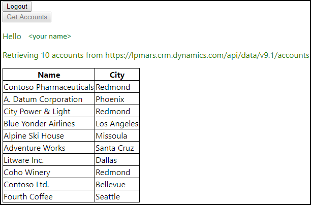  

> [!NOTE]
>  The initial load of data from CDS for Apps may be slow as the operations to support authentication take place, but subsequent operations are much faster.  

Finally, you can click the **Logout** button to logout.  

> [!NOTE]
>  This SPA application is not intended to represent a pattern for developing robust SPA applications. It is simplified to focus on the process of registering and configuring the application.  
  
## Create a web application project  
  
1.  Using Visual Studio 2017, create a new **ASP.NET Web Application** project and use the **Empty** template. You can name the project whatever you like.  
  
    You should be able to use earlier versions of Visual Studio as well, but these steps will describe using Visual Studio 2017.  
  
2.  Add a new HTML page named `SimpleSPA.html` to the project and paste in the following code:  
  
    ```html  
    <!DOCTYPE html>  
    <html>  
    <head>  
     <title>Simple SPA</title>  
     <meta charset="utf-8" />  
     <script src="https://secure.aadcdn.microsoftonline-p.com/lib/1.0.17/js/adal.min.js"></script>  
     <script type="text/javascript">  
      "use strict";  
  
      //Set these variables to match your environment  
      var organizationURI = "https://[organization name].crm.dynamics.com"; //The URL of your CDS for Apps organization  
      var tenant = "[xxx.onmicrosoft.com]"; //The name of the Azure AD organization you use  
      var clientId = "[client id]"; //The ClientId you got when you registered the application  
      var pageUrl = "http://localhost:[PORT #]/SimpleSPA.html"; //The URL of this page in your development environment when debugging.  
  
      var user, authContext, message, errorMessage, loginButton, logoutButton, getAccountsButton, accountsTable, accountsTableBody;  
  
      //Configuration data for AuthenticationContext  
      var endpoints = {  
       orgUri: organizationURI  
      };  
  
      window.config = {  
       tenant: tenant,  
       clientId: clientId,  
       postLogoutRedirectUri: pageUrl,  
       endpoints: endpoints,  
       cacheLocation: 'localStorage', // enable this for IE, as sessionStorage does not work for localhost.  
      };  
  
      document.onreadystatechange = function () {  
       if (document.readyState == "complete") {  
  
        //Set DOM elements referenced by scripts  
        message = document.getElementById("message");  
        errorMessage = document.getElementById("errorMessage");  
        loginButton = document.getElementById("login");  
        logoutButton = document.getElementById("logout");  
        getAccountsButton = document.getElementById("getAccounts");  
        accountsTable = document.getElementById("accountsTable");  
        accountsTableBody = document.getElementById("accountsTableBody");  
  
        //Event handlers on DOM elements  
        loginButton.addEventListener("click", login);  
        logoutButton.addEventListener("click", logout);  
        getAccountsButton.addEventListener("click", getAccounts);  
  
        //call authentication function  
        authenticate();  
  
        if (user) {  
         loginButton.style.display = "none";  
         logoutButton.style.display = "block";  
         getAccountsButton.style.display = "block";  
  
         var helloMessage = document.createElement("p");  
         helloMessage.textContent = "Hello " + user.profile.name;  
         message.appendChild(helloMessage)  
  
        }  
        else {  
         loginButton.style.display = "block";  
         logoutButton.style.display = "none";  
         getAccountsButton.style.display = "none";  
        }  
  
       }  
      }  
  
      // Function that manages authentication  
      function authenticate() {  
       //OAuth context  
       authContext = new AuthenticationContext(config);  
  
       // Check For & Handle Redirect From AAD After Login  
       var isCallback = authContext.isCallback(window.location.hash);  
       if (isCallback) {  
        authContext.handleWindowCallback();  
       }  
       var loginError = authContext.getLoginError();  
  
       if (isCallback && !loginError) {  
        window.location = authContext._getItem(authContext.CONSTANTS.STORAGE.LOGIN_REQUEST);  
       }  
       else {  
        errorMessage.textContent = loginError;  
       }  
       user = authContext.getCachedUser();  
  
      }  
  
      //function that logs in the user  
      function login() {  
       authContext.login();  
      }  
      //function that logs out the user  
      function logout() {  
       authContext.logOut();  
       accountsTable.style.display = "none";  
       accountsTableBody.innerHTML = "";  
      }  
  
    //function that initiates retrieval of accounts  
      function getAccounts() {  
  
       getAccountsButton.disabled = true;  
       var retrievingAccountsMessage = document.createElement("p");  
       retrievingAccountsMessage.textContent = "Retrieving 10 accounts from " + organizationURI + "/api/data/v9.1/accounts";  
       message.appendChild(retrievingAccountsMessage)  
  
       // Function to perform operation is passed as a parameter to the aquireTokenRedirect method  
       authContext.acquireTokenRedirect(organizationURI, retrieveAccounts)  
  
      }  
  
    //Function that actually retrieves the accounts  
      function retrieveAccounts(error, token) {  
       // Handle ADAL Errors.  
       if (error || !token) {  
        errorMessage.textContent = 'ADAL error occurred: ' + error;  
        return;  
       }  
  
       var req = new XMLHttpRequest()  
       req.open("GET", encodeURI(organizationURI + "/api/data/v9.1/accounts?$select=name,address1_city&$top=10"), true);  
       //Set Bearer token  
       req.setRequestHeader("Authorization", "Bearer " + token);  
       req.setRequestHeader("Accept", "application/json");  
       req.setRequestHeader("Content-Type", "application/json; charset=utf-8");  
       req.setRequestHeader("OData-MaxVersion", "4.0");  
       req.setRequestHeader("OData-Version", "4.0");  
       req.onreadystatechange = function () {  
        if (this.readyState == 4 /* complete */) {  
         req.onreadystatechange = null;  
         if (this.status == 200) {  
          var accounts = JSON.parse(this.response).value;  
          renderAccounts(accounts);  
         }  
         else {  
          var error = JSON.parse(this.response).error;  
          console.log(error.message);  
          errorMessage.textContent = error.message;  
         }  
        }  
       };  
       req.send();  
      }  
      //Function that writes account data to the accountsTable  
      function renderAccounts(accounts) {  
       accounts.forEach(function (account) {  
        var name = account.name;  
        var city = account.address1_city;  
        var nameCell = document.createElement("td");  
        nameCell.textContent = name;  
        var cityCell = document.createElement("td");  
        cityCell.textContent = city;  
        var row = document.createElement("tr");  
        row.appendChild(nameCell);  
        row.appendChild(cityCell);  
        accountsTableBody.appendChild(row);  
       });  
       accountsTable.style.display = "block";  
      }  
  
     </script>  
     <style>  
      body {  
       font-family: 'Segoe UI';  
      }  
  
      table {  
       border-collapse: collapse;  
      }  
  
      td, th {  
       border: 1px solid black;  
      }  
  
      #errorMessage {  
       color: red;  
      }  
  
      #message {  
       color: green;  
      }  
     </style>  
    </head>  
    <body>  
     <button id="login">Login</button>  
     <button id="logout" style="display:none;">Logout</button>  
     <button id="getAccounts" style="display:none;">Get Accounts</button>  
     <div id="errorMessage"></div>  
     <div id="message"></div>  
     <table id="accountsTable" style="display:none;">  
      <thead><tr><th>Name</th><th>City</th></tr></thead>  
      <tbody id="accountsTableBody"></tbody>  
     </table>  
    </body>  
    </html>  
  
    ```  
  
3.  Right click on the SimpleSPA.html file and select **Set As Start Page** to set this page as the start page for the project.  
  
4.  In the properties of the project, select **Web** and under **Servers** note the **Project URL**. It should be something like `http://localhost:62111/`. Note the port number that is generated. You will need this in the next step.  
  
5.  Within the SimpleSPA.html page, locate the following configuration variables and set them accordingly. You will be able to set the `clientId` after you complete the next part of the walkthrough.  
  
    ```javascript  
    //Set these variables to match your environment  
    var organizationURI = "https://[organization name].crm.dynamics.com"; //The URL to connect to PowerApps CDS for Apps  
    var tenant = "[xxx.onmicrosoft.com]"; //The name of the Azure AD organization you use  
    var clientId = "[client id]"; //The ClientId you got when you registered the application  
    var pageUrl = "http://localhost:[PORT #]/SimpleSPA.html"; //The URL of this page in your development environment when debugging.  
  
    ```  
  
## Register the application  
  
1.  [Sign in](https://portal.azure.com) to the Azure management portal by using an account with administrator permission. You must use an account in the same Office 365 subscription (tenant) as you intend to register the app with. You can also access the Azure portal through the Office 365 admin center by expanding the **ADMIN** item in the left navigation pane and selecting **Azure AD**.  
  
     If you don’t have an Azure tenant (account) or you do have one but your Office 365 subscription with CDS for Apps is not available in your Azure subscription, following the instructions in the topic [Set up Azure Active Directory access for your Developer Site](https://docs.microsoft.com/en-us/office/developer-program/office-365-developer-program) to associate the two accounts.  
  
     If you don’t have an account, you can sign up for one by using a credit card. However, the account is free for application registration and your credit card won’t be charged if you only follow the procedures called out in this topic to register one or more apps. More information: [Active Directory Pricing Details](http://azure.microsoft.com/pricing/details/active-directory/).  
  
2.  Click on **Azure Active Directory** in the left column of the page. You may need to scroll the left column to see the **Azure Active Directory** icon and label.  
  
3.  Now select **Enterprise Applications** in the panel that opens up.

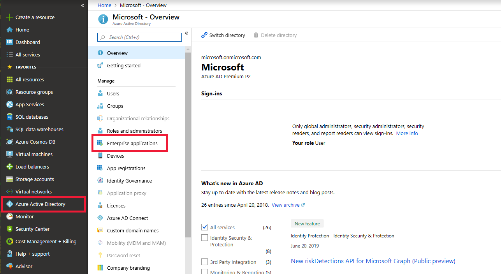

4.  Select **New application**(near the top of the page), and then under **Add your own app** select **Application you're developing**.  

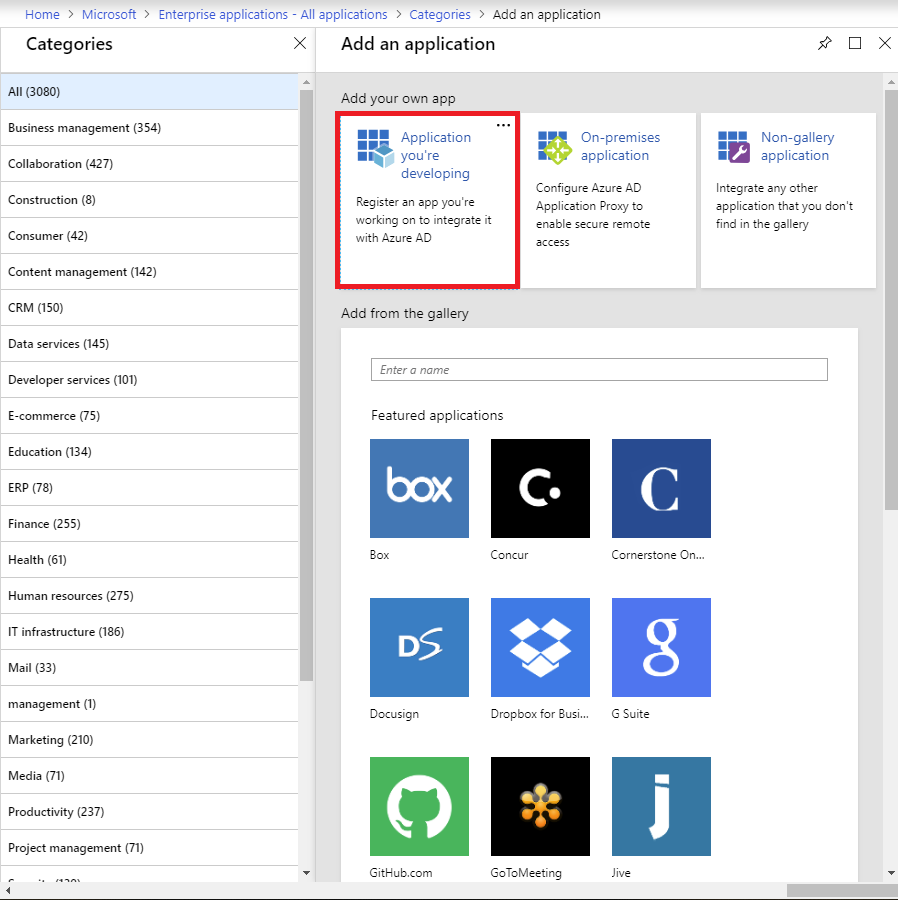
  
5.  Now click on **Ok, take me to App Registrations to register my new application**.

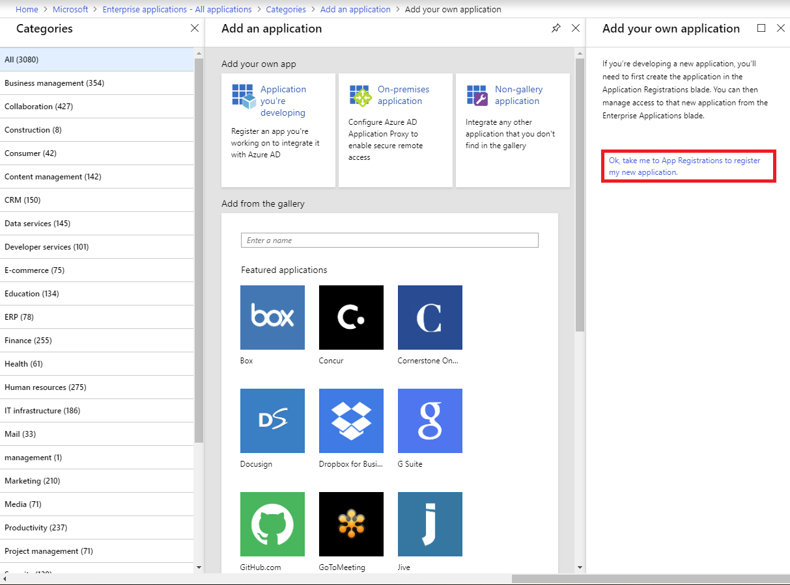

6.  Now click on **New application registration**(near the top of the page).  

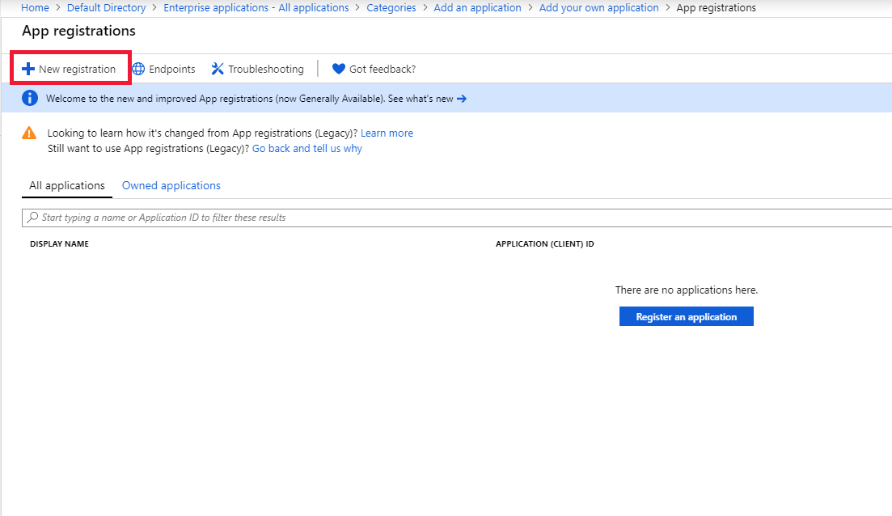
  
7.  Enter the following information :  
  
  - **Name**<br />The name of the application.

  - **Web application type**<br />Select **Web app/API**.

  - **Sign-on URL**<br />This is the URL which the user should be redirected to after they sign in. For debugging purposes in Visual Studio it should be  `http://localhost:####/SimpleSPA.html` where #### represents the port number you got from step 4 of the **Create a web application project** procedure.  

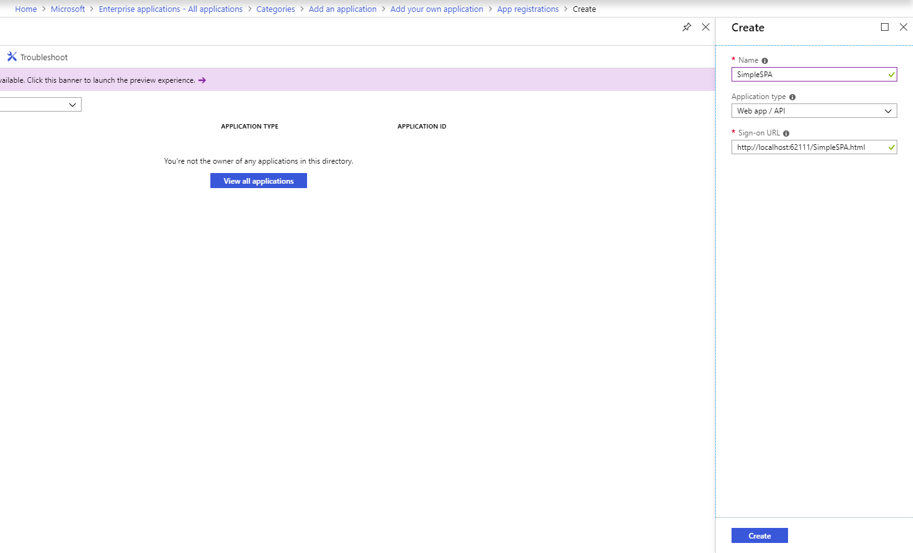
    
  
8. Then click on **Create** at the end of the page.

9.  In the tab of the newly registered app, copy the **Application ID**.  
  
    Set the `clientId` variable in the SimpleSPA.html page to this value. Refer to step 5 of the **Create a web application project** procedure.  

10. Now click on **Settings** and then select **Required permissions**.

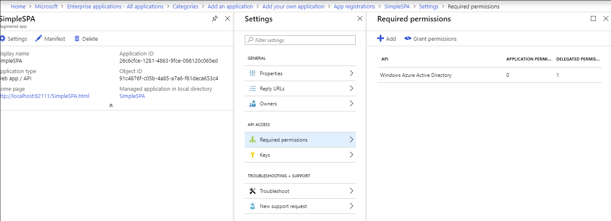

11. Click on **Add**, then select **Select an API**. Now select **Dynamics CRM Online** and click **Select** at the end of the page.

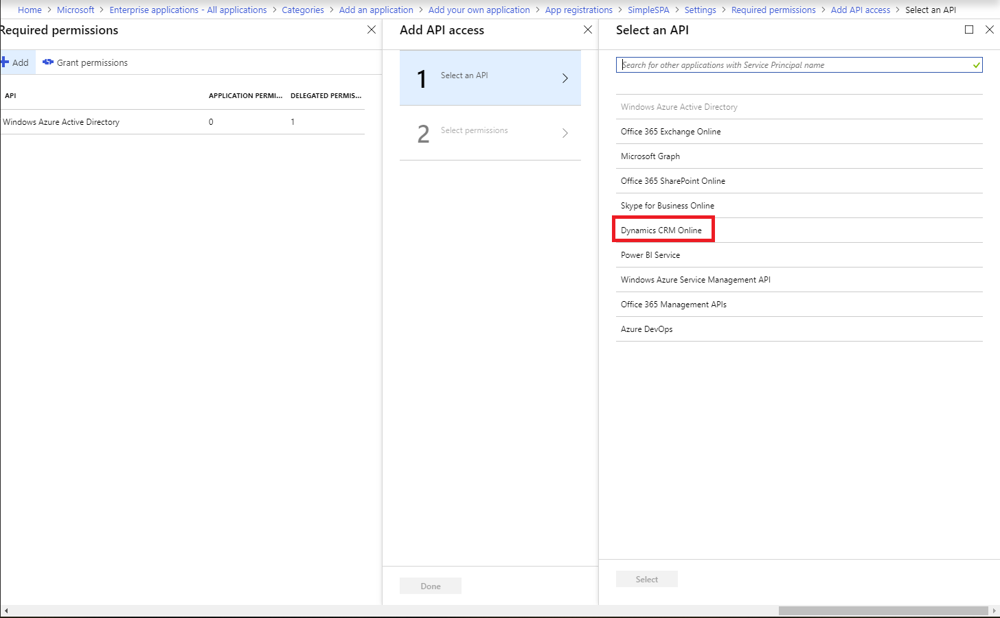

12. Now in the **Selected permissions** tab, select all **Delegated Permissions** and click on **Select** at the end of the page.

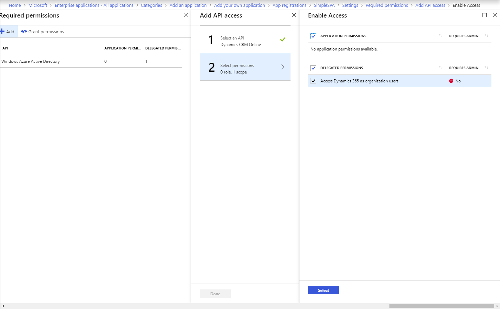

13. Then select **Done**. You will see a row for **Dynamics CRM Online** added.

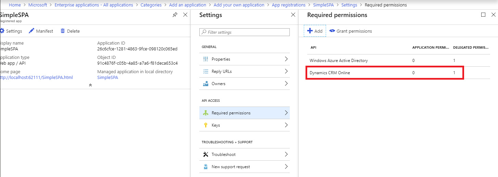

14. Now close the **Settings** tab. In the registered app tab, select **Manifest**.

15. Click on **Edit** and locate the line: `"oauth2AllowImplicitFlow": false,` and change `false` to `true` and then click on **Save** to save the file.

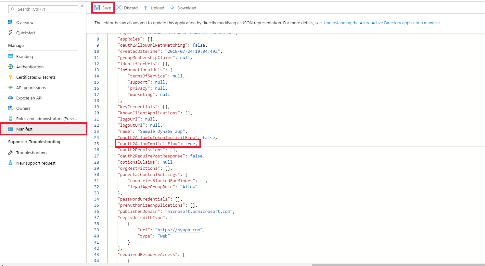

16. For successful execution of your application, you will also need to grant admin consent to it. For this, select **Azure Active Directory** in your Azure management portal, then select **Enterprise Applications** and from the list of applications that appear, select the application that you just created.

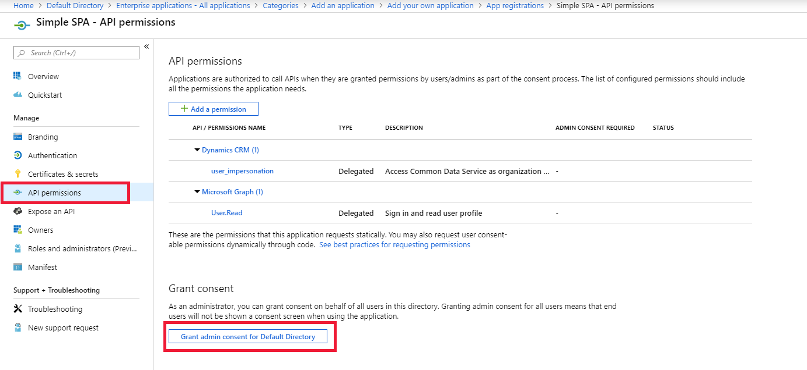

17. Now, select **Permissions** as shown above, and click on **Grant admin consent for <Your AAD org name>**

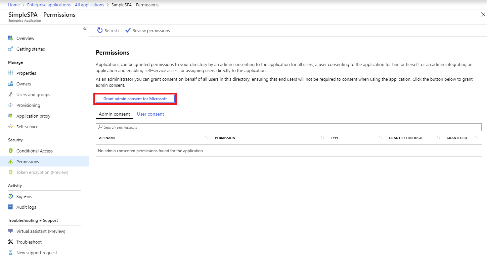

18. Once you click on this button, it will open a login window and ask you whether you wish to grant the requested permissions to your application. Click on **Accept** to proceed.

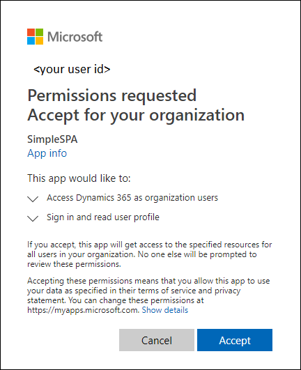

## Debugging the application  
  
1.  Set the browser to use Microsoft Edge or Google Chrome.  
  
    > [!NOTE]
    > Internet Explorer will not work for debugging in this situation.  
  
2.  Press F5 to start debugging. You should expect the behavior described in [Goal of this walkthrough](walkthrough-registering-configuring-simplespa-application-adal-js.md#bkmk_goal).  
  
     If you don’t get the results you expect, double-check the values you set when registering the application and configuring the SimpleSPA.html code.  
  
## See also  
 [Create client applications](connect-cds.md)<br />
 [Register an app with Azure Active Directory](walkthrough-register-app-azure-active-directory.md) <br />
 [Build web applications using Server to Server(S2S) authentication](build-web-applications-server-server-s2s-authentication.md)<br />
 [Use OAuth with Cross-Origin Resource Sharing to connect a Single Page Application to CDS for Apps](oauth-cross-origin-resource-sharing-connect-single-page-application.md)