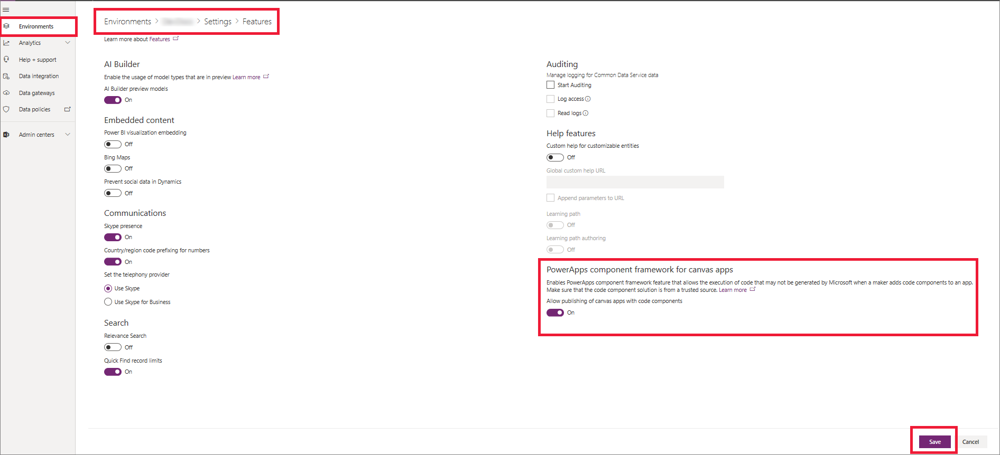

# PowerApps component framework for canvas apps

> [!IMPORTANT]
> This feature is still experimental and disabled by default. For more information, see [Experimental and preview features](../../maker/canvas-apps/working-with-experimental.md).

PowerApps component framework enables developers and app makers to create custom components to use in an app or across apps. PowerApps component framework gives the ability for the developers to enhance the user experience for the users to view and work with data. For example:

- Replace a field that displays a numeric text value with a dial or slider component.

> [!NOTE]
> In this experimental preview, canvas apps only support field type of custom components and not the data-set type.

Component developers and app makers can utilize modern web practices and also harness the power of external libraries to create advanced user interactions. The framework automatically handles component lifecycle, retains application business logic and optimizes the performance. more information: [PowerApps component framework overview](overview.md) 

> [!WARNING]
> Custom components contains code that may not be generated by Microsoft and can potentially access tokens and data. Make sure that the custom component solutions are from trusted source.

## Prerequisites

1. System Administrator privileges is required to enable PowerApps component feature in the environment.

> [!IMPORTANT]
> By default PowerApps component framework is enabled in model-driven apps.

## Enable PowerApps component framework feature

To enable PowerApps component feature:

1. Sign in to [PowerApps](https://powerapps.microsoft.com/en-us/).

2. Click on the **Settings** icon and then select **Admin Center**
    
     

3. Select the environment where you want to enable this feature and click on **...** and then select **Settings**

4. Under the **Products** tab, select **Features**

   

5. From the list of available features, turn on the switch under the **PowerApps component framework for canvas apps**

## Implementing custom components

After you enable the PowerApps component framework feature in your environment, you can start implementing the custom components. [Implement sample component](implementing-controls-using-typescript.md) topic demonstrates step by step process to create custom components right from implementing custom logic, manifest file, debug process, and creating a solution zip file.

> [!NOTE]
> Implementing custom components is same for both model-driven apps and canvas apps (experimental preview). The only difference is adding the custom components. 

## Add components to a canvas app

To add custom components to a canvas app:

> [!NOTE]
> To add custom components to a field or an entity, see [Add custom components to model-driven apps](add-custom-controls-to-a-field-or-entity.md)

1. Navigate to PowerApps Studio.
2. Select the app that you want to add the custom component.

   > [!IMPORTANT]
   > Make sure the custom components solution zip file is already [imported](https://docs.microsoft.com/en-us/powerapps/maker/common-data-service/import-update-export-solutions) into Common Data Service before you go onto the next step.

3. Click on **Insert** > **Components** > **Import component** > 
 
    

4. Select **Code (experimental)** tab and add a component from the list and click on **Import**. This adds the sample component in the **Components** menu

    

5. Navigate to **Components** and select the component to add it to the app.

   

## Known limitations

1. Only the field type of components are supported in experimental preview and not the data set type. 
2. Common Data Service dependent APIs including WebApi along with few other APIs are not available for this experimental preview. For individual API availability for canvas experimental preview release, see [PowerApps component framework API reference](reference/index.md)

## See also

[PowerApps component framework overview](overview.md) 
[Implement sample component](implementing-controls-using-typescript.md)
<!--[Capabilities and limitations of PowerApps component framework for canvas apps](capabilities-and-limitations-for-canvas-apps.md)-->