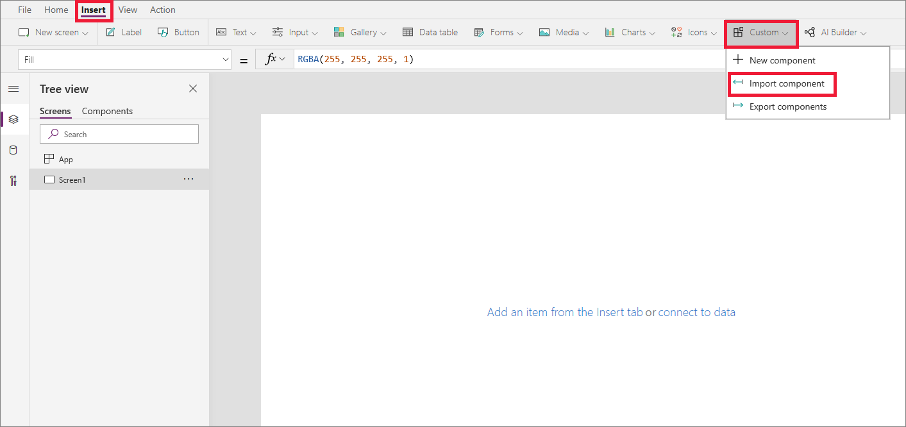
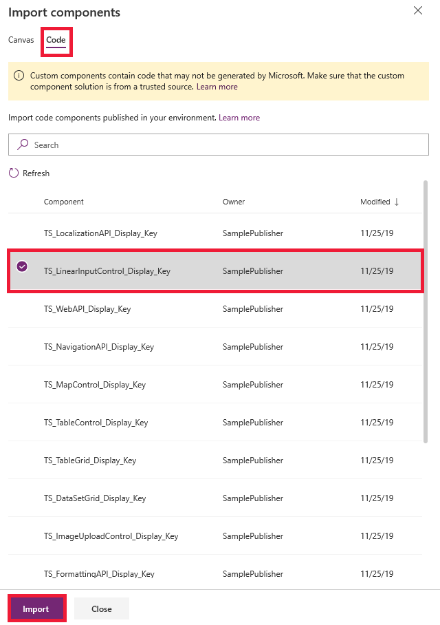

# PowerApps component framework for canvas apps

> [!IMPORTANT]
> This feature is still experimental and disabled by default. For more information, see [Experimental and preview features](working-with-experimental.md).

PowerApps component framework enables developers and app makers to create custom components to use in an app or across apps. PowerApps component framework gives the ability for the developers to enhance the user experience for the users to view and work with data. For example:

- Replace a field that displays a numeric text value with a dial or slider component.

Component developers and app makers can utilize modern web practices and also harness the power of external libraries to create advanced user interactions. The framework automatically handles component lifecycle, retains application business logic and optimizes the performance. more information: [PowerApps component framework overview](overview.md) 

## Prerequisites

1. System Administrator privileges is required to enable PowerApps component feature in the environment.

To create custom components using PowerApps component framework, follow t he steps below:

## Step 1: Enable PowerApps component framework feature

To enable PowerApps component feature:

1. Sign in to PowerApps Admin Portal.

2. Click on the **Settings** icon and click on the **Admin Center**
    
     

3. Select the environment and click on **...** and select **Settings**

4. Under the **Products** tab, click on **Features**

5. From the list of available features, enable the switch under the **PowerApps component framework for canvas apps**

## Step 2: Implementing the custom component

After you enable the feature in your environment, the next step in the process is to implement the custom component. To implement a custom component step by step, follow the instructions in this topic [Implement sample component](implementing-controls-using-typescript.md)

## Adding components to app

To add custom components to an app:

1. Navigate to PowerApps Studio.
2. Select the app that you want to add the custom component.
3. Click on **Insert** > **Components** > **Import component** > 
 
    

4. Select **Code (experimental)** tab and add a component from the list and click on **Import**. This adds the sample component in the **Components** menu

    

5. Navigate to **Components** and select the component to add it to the app.

   

## See also

[Capabilities and limitations of PowerApps component framework for canvas apps](capabilities-and-limitations-for-canvas-apps.md)