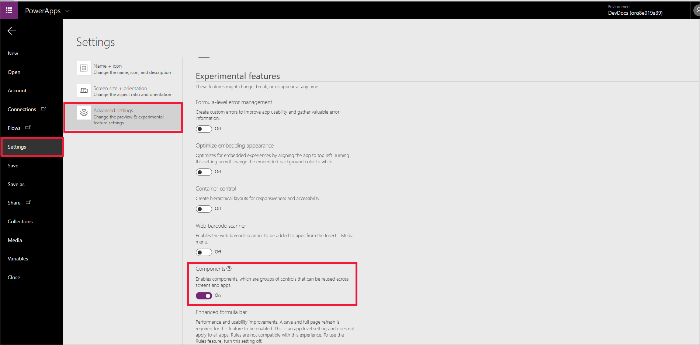
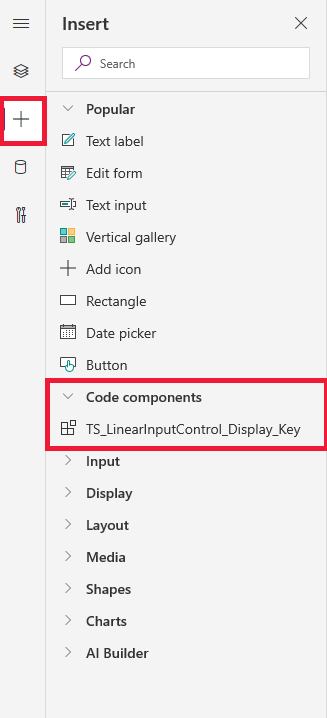

# PowerApps component framework for canvas apps

> [!IMPORTANT]
> This feature is still experimental and disabled by default. For more information, see [Experimental and preview features](../../maker/canvas-apps/working-with-experimental.md).

PowerApps component framework enables app makers to create code components to use in an app or across the apps. more information: [PowerApps component framework overview](overview.md) 

In this experimental preview, PowerApps component framework enables app makers to create code components, debug, import and add them to canvas apps using the PowerApps CLI tooling. Only certain APIs are supported in this experimental preview. It is recommened to check each individual API whether it supports canvas apps or not. 

> [!WARNING]
> Code components contain code that may not be generated by Microsoft and can potentially access security tokens and data. When adding code components to an app, make sure that the code components solutions are from trusted source.

## Prerequisites

1. System Administrator privileges is required to enable PowerApps component feature in the environment.

> [!IMPORTANT]
> By default PowerApps component framework is enabled for model-driven apps.

## Enable PowerApps component framework feature

To add code components to an app, you need to be enable the PowerApps component framework feature in each environment where they are to be used. To enable an environment to use code components inside its apps:

1. Sign in to [PowerApps](https://powerapps.microsoft.com/en-us/).

2. Click on the **Settings** icon and then select **Admin Center**.
    
     

3. Select the environment where you want to enable this feature and click on **...** and then select **Settings**.

4. Under the **Products** tab, select **Features**.

   

5. From the list of available features, turn on the switch under the **PowerApps component framework for canvas apps**.

6. Now, open the app where you want to add the code component and navigate to **File** > **App settings** and select **Advanced settings**.

   
   
7. Turn on the **Components** switch under the **Experimental feature** section.

## Implementing code components

After you enable the PowerApps component framework feature in your environment, you can start implementing the logic for code components. The [implement sample component](implementing-controls-using-typescript.md) topic demonstrates the step by step process to create code components right from implementing the custom logic, manifest file, debug process, and creating a solution zip file.

> [!NOTE]
> Implementing code components is same for both model-driven apps and canvas apps (experimental preview). The only difference is adding the code components. 

## Add components to a canvas app

To add code components to a canvas app:

> [!NOTE]
> To add code components to a field or an entity for model-driven apps, see [Add code components to model-driven apps](add-custom-controls-to-a-field-or-entity.md)

1. Navigate to PowerApps Studio.
2. Create a new canvas app or edit an existing app that you want to add the code components to.

   > [!IMPORTANT]
   > Make sure the code components solution zip file is already [imported](https://docs.microsoft.com/en-us/powerapps/maker/common-data-service/import-update-export-solutions) into Common Data Service before you go onto the next step.

3. Click on **Insert** > **Components** > **Import component**. 
 
    

4. Select **Code (experimental)** tab and add a component from the list and click on **Import**. This adds the sample component in the **Components** menu.

    

5. Navigate to **Components** and select the component to add it to the app.

   

## Known limitations

1. Only the field type of components are supported in the experimental preview and not the data set type components. 
2. Common Data Service dependent APIs including WebAPI along with few other APIs are not available for this experimental preview. For individual API availability for this experimental preview release, see [PowerApps component framework API reference](reference/index.md)

## See also

[PowerApps component framework overview](overview.md) 
[Implement sample component](implementing-controls-using-typescript.md)

