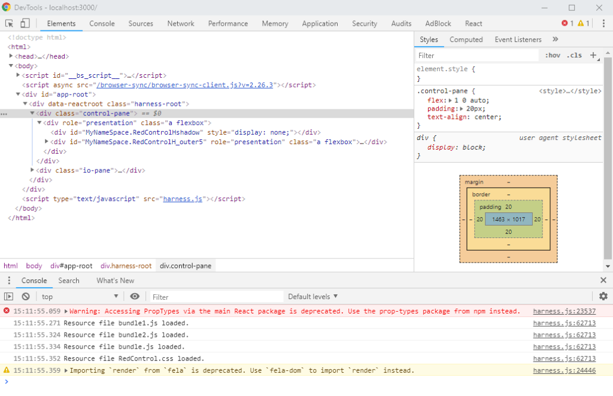

# Debugging custom components

Once you are done implementing your custom control logic, run the following command to start the debugging process

```CLI
npm start
```

> [!NOTE]
> Today you can only visualize your field component, but dataset support is coming soon. Below image shows a sample component implemented in the tutorial below just as an example. 

> [!div class="mx-imgBorder"]
> 

As shown in the image above, the browse window will open with 3 sections. Your component will be rendered in the left pane while the right pane consists of **Inputs** and **Outputs** sections

  - **Inputs** section is an interactive UI that displays all properties and their types or type-groups defined in the manifest file. It allows you to key in mock data for each property. 
  - **Outputs** section renders the output whenever a component's `getOutputs` method gets called.  
 
> [!NOTE]
> If you want to modify the manifest file or create additional properties, you will need to restart the debug process before they appear in the inputs section.

As you are inputting mock data, you can use the browser’s debugging capabilities to observe the component behavior. Each browser provides you with a debugging tool to help you debug your code natively in the browser. Typically, you can activate debugging in your browser by pressing the **F12** key to display the native developer tool used for debugging. Today both Chrome and Edge browsers are supported.

For example, on **Microsoft Edge**,

- Press **F12** to open inspector.
- Click on your component
- On top bar, go to **Debugger**, and then start searching for the component name described in the Manifest file in the search bar. For example, type your component name like `Hello World component`.

     > [!div class="mx-imgBorder"]
     > 

> [!NOTE]
> It is always a good practice to set breakpoints on the component's life cycle methods like [init](reference/control/init.md) and [updateView](reference/control/updateview.md)

You can also interact with the component locally in real time and observe elements in the DOM by setting a breakpoint in the sources tab as follows:

> [!div class="mx-imgBorder"]
> 

> [!div class="mx-imgBorder"]
> 


 > [!NOTE]
 > You can also use the following steps to perform outer loop debugging using fiddler.
 >    1. Install [Fiddler](https://www.telerik.com/download/fiddler)
 >    2. Follow the steps to configure [AutoResponder](https://docs.microsoft.com/en-us/dynamics365/customer-engagement/developer/streamline-javascript-development-fiddler-autoresponder)

### See also

[Packaging your custom components](import-custom-controls.md)
