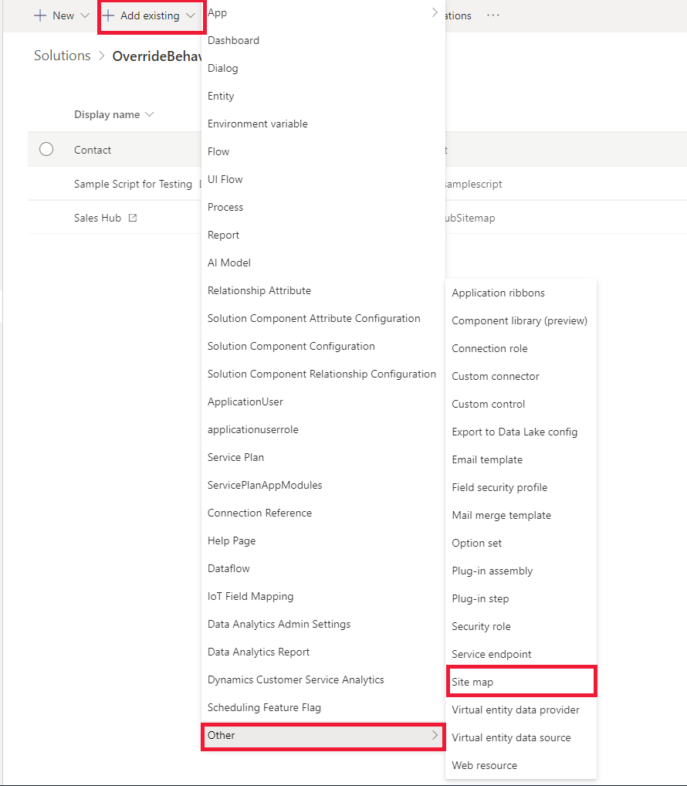
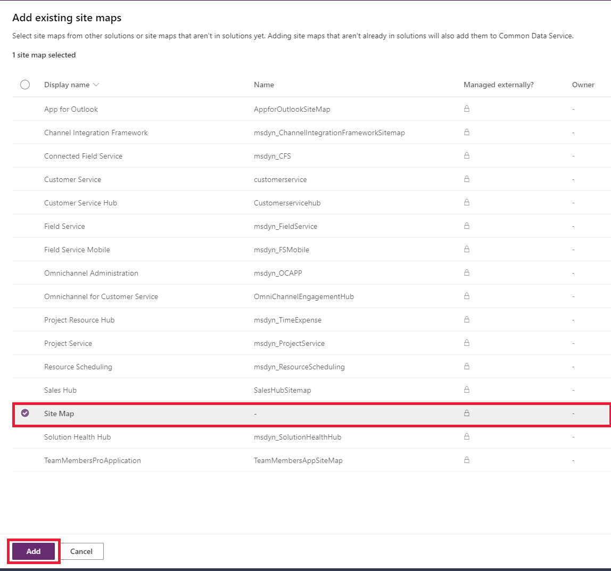

# Override the default open behavior of data rows in an entity-bound grid

Performing any of the following actions in a data row in an entity-bound grid opens the entity record by default:

- Double-clicking the data row or clicking the primary attribute link in the row.
- Selecting a data row, and pressing ENTER.
- On a touch-enabled device, selecting a data row.

There might be situations where you don't want the entity record to open (default behavior), but want a custom action to be performed such as open a URL or execute JavaScript functions. You can override the default behavior to define your own custom behavior by creating a command definition for an entity with `Mscrm.OpenRecordItem` as the value of the Id attribute `CommandDefinition`, and define custom action in the `Actions` tab. The application looks for the `Mscrm.OpenRecordItem` command Id for an entity when you try to open a record from the entity-bound grid, and if present, will execute the custom action instead of opening the entity record (default behavior).

> [!NOTE] 
> - This feature is supported only for Unified Interface.
> - You can also use, Ribbon Workbench, a community tool to visually edit ribbons using the UI. Note that tools created by the community are not supported by Microsoft. If you have questions or issues with community tools, contact the publisher of the tool.

## Step 1: Create a web resource

Create a web resource to change the default behavior. For example, if you wish to open a URL instead of displaying the record, you need to create a JavaScript web resource to perform that action. To create a web resource:

1. Sign in to [Power Apps](https://make.powerapps.com/?utm_source=padocs&utm_medium=linkinadoc&utm_campaign=referralsfromdoc) and select **Solutions** from the left navigation. 
  
2. Select **New solution** and then complete the required fields for the solution.
  
    |Field|Description|  
    |-----------|-----------------|  
    |**Display Name**|The name shown in the list of solutions. You can change this later.|  
    |**Name**|The unique name of the solution. This is generated using the value you enter in the Display Name field. You can edit this before you save the solution, but after you save the solution, you can’t change it.|  
    |**Publisher**|You can select the default publisher or create a new publisher. We recommend that you create a publisher for your organization to use consistently across your environments where you will use the solution.|  
    |**Version**|Enter a number for the version of your solution. This is only important if you export your solution. The version number will be included in the file name when you export the solution.|  
  
3. Select **Save**.  

4. Open the solution, select **New** > **Other** > **Web resource**.
 
   > [!div class="mx-imgBorder"]
   > 

5. Enter the name of the web resource and select the **Type** as **Script(JScript)**.

6. Select **Text Editor**, copy-paste the code shown below and enter the url value:

   ```JavaScript
   function ChangeBehavior(){
    
    // Enter the url
    var url =  "Enter the URL";
    var OpenUrlOptions = {height: 800, width: 1000};
    Xrm.Navigation.openUrl(url, openUrlOptions);
   }
   ```
 
7. Save and publish the web resource.

## Step 2: Create a custom button

Create a custom button on the entity form where you want to change the default behavior. For example, if you have a subgrid on the accounts form that displays contact records in the subgrid, you need to create a button and add it to the contact form. You can create a button by editing the customization.xml file:

1. Open the solution that you have created in step 1 and add the entity where you want to create the button. 

2. Select **Add existing** > **Other** > **Site map** to add the site map. 

    > [!div class="mx-imgBorder"]
    > 

3. From the list, select **Site Map**.

    > [!div class="mx-imgBorder"]
    > 

4. Add the web resource that we created earlier in the article.

5. Save and publish the solution. 

6. Select **Export** to make edits to the customization XML file. 

    > [!div class="mx-imgBorder"]
    > 

7. If you have made recent changes that have not yet been published, select **Publish**, select **Run** to check if the solution has any issues or dependencies, and then select **Next**.

    > [!div class="mx-imgBorder"]
    > 

8. With the Unmanaged option selected, select **Export**.

   > [!div class="mx-imgBorder"]
   > 

9. Select **Save** in the file download dialog box and then select **Open Folder** in the download complete dialog box.

10. Right-click on the compressed .zip file that you downloaded, and select **Extract All**.

11. Select a location to extract the files and then select **Extract**.

12. The customizations.xml file is the file that you will edit.

    > [!NOTE]
    > You can enable or disable the button, doing either of the ones will still override the open default behavior.

13. Open the customization.xml file and copy-paste the code shown below:

     ```XML
    <RibbonDiffXml>
      <CustomActions>
    <CustomAction Id="cr5c1.Mscrm.OpenRecordItem.CustomAction" Location="Mscrm.SubGrid.contact.MainTab.Management.Controls._children" Sequence="28">
      <CommandUIDefinition>
        <Button Alt="$LocLabels:Mscrm.OpenRecordItem.Alt" Command="Mscrm.OpenRecordItem" Id="Mscrm.OpenRecordItem" LabelText="$LocLabels:Mscrm.OpenRecordItem.LabelText" Sequence="28" TemplateAlias="o1" ToolTipTitle="$LocLabels:Mscrm.OpenRecordItem.ToolTipTitle" ToolTipDescription="$LocLabels:Mscrm.OpenRecordItem.ToolTipDescription" />
      </CommandUIDefinition>
    </CustomAction>
    </CustomActions>
     <Templates>
    <RibbonTemplates Id="Mscrm.Templates" />
    </Templates>
      <CommandDefinitions>
       <CommandDefinition Id="Mscrm.OpenRecordItem">
      <EnableRules />
      <DisplayRules />
      <Actions>
        <JavaScriptFunction FunctionName="sampleoperations" Library="$webresource:cr5c1_samplescript" />
      </Actions>
      </CommandDefinition>
     </CommandDefinitions>
      </RibbonDiffXml>
     ```

## Step 3: Import the XML file

1. After you have edited the customization.xml file, right-click the customization.xml tab and select **Open Containing Folder**.  
2. Select all of the files or folders that were included when you extracted the solution. Right-click the selected files, select **Send To**, and then select **Compressed (zipped) folder**.  
  
   > [!NOTE]
   >  This creates a compressed .zip file in the same folder. The name of the file may vary, but it will be the same as one of the other files in the folder - except with a .zip file name extension.  
  
3. Sign in to [Power Apps](https://make.powerapps.com/?utm_source=padocs&utm_medium=linkinadoc&utm_campaign=referralsfromdoc) and select **Solutions** from the left navigation.  
  
4. On the command bar, select **Import**.  

    > [!div class="mx-imgBorder"]  
    >  
  
5. On the **Select Solution Package** page, select **Browse** to locate the compressed (.zip or .cab) file that contains the solution you want to import. 
  
6. Select **Next**.  
  
7. Information about the solution is displayed. Select **Import**.  
  
8. You may need to wait a few moments while the import completes. View the results and then select **Close**.  
  
If you have imported any changes that require publishing, you must publish customizations before they are available. 
  
If the import isn’t successful, you will see a report showing any errors or warnings that were captured. Select **Download Log File** to capture details about what caused the import to fail. The most common cause for an import to fail is that the solution did not contain some required components.  
  
 When you download the log file, you will find an XML file that you can open using Office Excel to view the contents. 

## See also

[Ribbon Workbench](https://www.develop1.net/public/rwb/ribbonworkbench.aspx)<br/>
[Customize the ribbon](customize-commands-ribbon.md)
