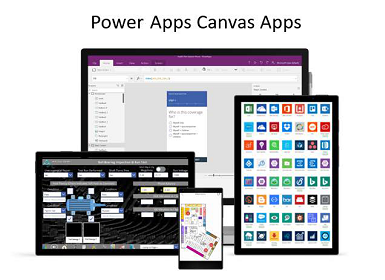
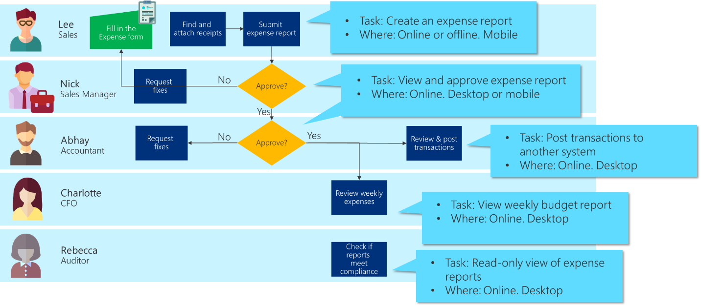
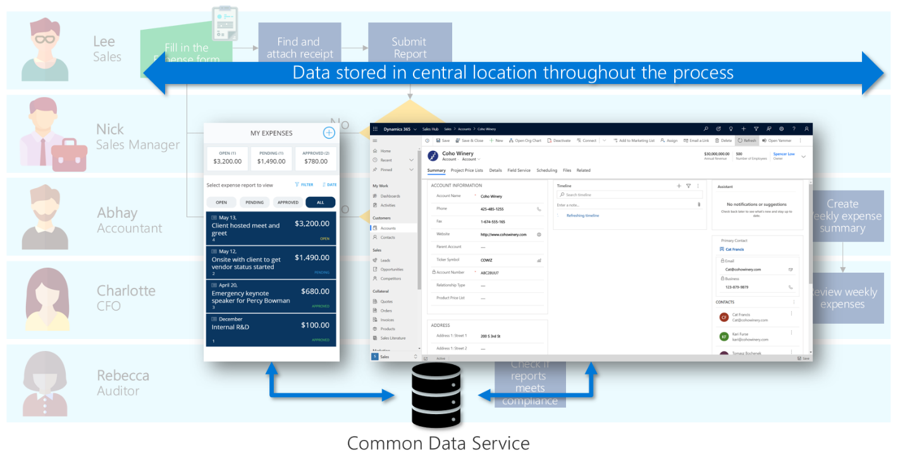

# Determining which type of app to make

In Power Apps, you have two options when creating apps for your users:<!--Suggested. "Your employees" threw me for a bit of a loop, made me think that a business owner was creating the app.--> model-driven apps and canvas apps. 
<!--[This article goes into detail about types of Power Apps apps.](../../maker/index.md) Note from editor: I recommend against having a link structured like this. It doesn't prepare the user for leaving the current page (as a "For more information, see..." or "More information:" structure does). Also, it's too high up in the article; you're encouraging the user to leave before they've even read two paragraphs. I suggest moving the link to the next paragraph (which see).-->

The following is a basic, high-level comparison. For much more detail about these two types of apps, see  [Overview of creating apps in Power Apps](../../maker/index.md).<!--Suggested.-->
<!--The graphics should be sentence case: "Power Apps model-driven apps" and "Power Apps canvas apps."-->
:::row:::
    :::column:::
        
        
        Model-driven apps require a Common Data Service database. They're built on top of
the data modeled in that database environment. Views and detail screens for model-driven
apps<!--Suggested.--> are based on the data structure. Because of this, they offer
users a more consistent look and feel from one screen to the next without requiring much
effort from the app creator.

        Model-driven apps are good for scenarios where the [business logic](logic.md) is complex, such as:<!--Suggested. Lists need introductions.-->

        -   Sophisticated data models

        -   Business process management

        -   Tracking activities associated with data
    :::column-end:::
    :::column:::
        
        
        Canvas apps, on the other hand, can be built with or without a Common Data Service
database. They use connectors to access data and services. Canvas apps start
with a blank screen, like an artist's canvas, and the creator manually lays out
each screen. This gives the creator complete control over the placement of
each element<!--Suggested, just to vary the wording.--> on the canvas.

        Use canvas apps if the user is expecting a customized user
experience. They offer:

        -   A graphical, intuitive interface

        -   The ability to create a tailor-made UI based on user requirements<!--Suggested, to be parallel.-->

        -   Integration spanning multiple systems by using connectors
    :::column-end:::
:::row-end:::

Consider creating a model-driven app unless your users<!--Suggested.--> have a specific need for a
canvas app. Model-driven apps enable you to make your app quickly because they
don't require you to build out the UI yourself.

> [!NOTE]
> If you're creating an app to be used by your customers on the web, you
can also create a third type of app: [a portal app](../../maker/portals/overview.md).

## Building an end-to-end solution that uses multiple apps

Your business process might require more than one app.

For example, our expense report project has several task sets that are quite
different, so we'll consider making several apps. The data they use is the
same, but the user experience will be tailored to the specific scenario and personas.

As you can see from the example above, there are multiple types of people
handling the same set of data. Canvas apps would be the best fit for employees
filling in the expense form, which enables people like Lee to submit an expense
report using an attractive mobile app that's intuitive to use and can be used
when he's offline.

Referring back to the section on [Documenting the business process](understanding-current-business-process.md), you can see
that Abhay's requirements are:

- Must be able to review all expense reports and receipts

- Responsible for ensuring compliance for every expense report

- Large volume of work; needs to be able to process information quickly

- Must be able to report on how expenses are balancing up to the budget

To be able to process a large volume of work and process information quickly, the
best fit would be a model-driven app. It allows Abhay to quickly view all the
details of the submitted expense report, see how it affects the budget, and look
for related information such as vendor details.

In this example scenario, you can see a combination of both canvas app and
model-driven app. Although they're two different types of apps, all the data
can be centralized in one place (Common Data Service).

