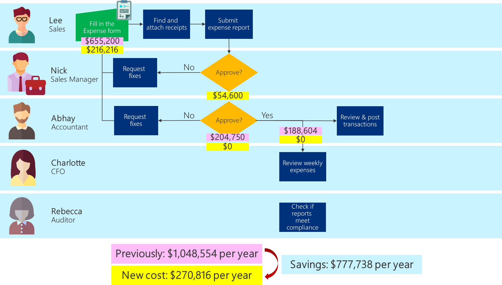

Defining the business value of solving the problem
==================================================

Business value falls into one of 4 categories – easily remembered as
REVO:

-   **Revenue** – This solution brings in revenue that wouldn't otherwise be
    realized – through a new line of business or a service that hadn’t been
    previously offered

-   **Efficiency** – Efficiency is effectively cost savings – this solution
    allows the participants who execute the process to do it faster – in turn
    saving time

-   **Volume** – Cost avoidance by enabling the current users to process more
    transactions – in turn avoiding the cost of additional resources

-   **Other** – Cost avoidance/Penalty Avoidance – traditionally associated with
    compliance

Once the category has been defined, then we need to define the value that we'll achieve:

-   Revenue

    -   Determine what will be charged for the service

    -   Determine how many customers will buy the service or product

    -   Determine the time horizon to measure (monthly, quarterly, annually)

    -   Revenue = (Price \* Customers) for the time horizon

-   Efficiency

    -   Determine the number of people doing the job today

    -   Determine the amount of direct time they take to do the job today

    -   Determine the number of people that will do the job once the Power
        Platform solution has been built

    -   Determine the amount of direct time it will take using the new solution

    -   Time Savings = New Time – Old Time (To convert this to dollars, multiply
        the time by fully loaded cost of the people per the time unit.)

-   Volume

    -   Determine the volume of transactions that a single person can
        process

    -   Determine the volume of transactions that the new solution will be able
        to process

    -   Determine the new volume of transactions that need to be processed

    -   Cost Avoidance = Volume of transactions that the new solution will
        process divided by the number of transactions that a single person can
        process (to calculate the number of people that won’t have to process
        transactions to achieve the volume), multiplied by their cost

-   Other

    -   Determine the penalty that can be avoided by having the information
        captured and available in the solution

Example: The business value of automating the expense process
-------------------------------------------------------------

In this case, the category of saving is ‘Efficiency’. The new App will reduce
the amount of time it takes to process the same number of expense reports each
week/month/year. We reviewed the new process and what we would like the App to
accomplish with our future users and asked them how much time will be saved with
the new process and being able to build in some of the rules in the expense
report App:

-   We will still have 140 expense reports being submitted each week, that
    hasn’t changed. However, when we talked with the people submitting them, we
    found that we would be able to reduce the time they spent down to 20 minutes
    – by being able to enter the information immediately and take pictures of
    the receipts when a receipt was required. The fully loaded cost also remains
    the same.

    > (140 expense reports a week \* 20 minutes) \* \$90/hr = \$4,158 a week =
        \$216,216 a year

-   Nick will be reviewing the expense reports of his team (roughly 100
    salespeople) and estimated that it will take roughly 5 minutes to review
    each expense report. His review is limited to the type of expenses being
    submitted – recognizing that the need for receipts — as well as the need to
    include guests at meals and distribution of the hotel expenses into the
    appropriate categories — will be controlled by the app.

    >   (100 expense reports a week \* 5 minutes) \* \$90/hr = \$750 a week =  \$39,000 a year

-   Other managers will review and approve the expense reports from their
    departments going forward – so the remaining 40 expense reports will cost \$15,600 a year.

-   Abhay and his team’s work has now shifted to spot checking and there
    shouldn’t be any rework required – in fact, it may be that Abhay’s team can
    be tasked with other activities due to the reduction in effort needed for
    review.

-   We optimized the process to associate the correct GL accounting code to each
    of the expense categories. Now Abhay and his team can extract the data to
    create the payment journal – reducing the 40.3 (16.5 for coding + 23.8 for
    posting) hours a week down to a few minutes, saving \$188,604 (\$77,220 for
    coding and \$111,384 for posting) a year, and be able to task some of his
    team on other more important tasks in his department.

-   With the new process Abhay and his team can consider daily posting of the
    expense reports, which will provide Charlotte with an updated view of the
    budget each day, allowing her to respond more quickly as budget constraints
    approach.

-   The new cost to the company using the automated app is roughly:

    >   \$216,216 + \$39,000 + \$15,600 = \$270,816 a year
    >
    >   Saving the company roughly **\$777,738 each year**

