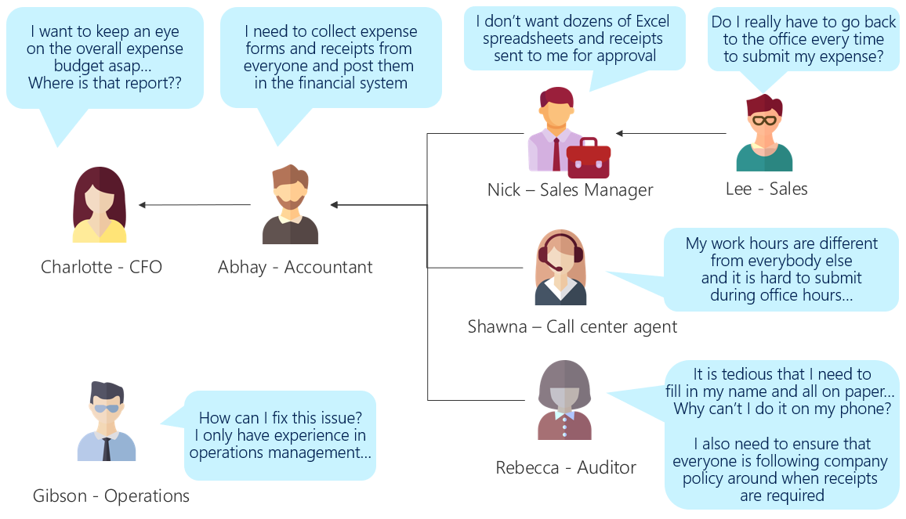

# Example: Expense Reporting

The example below shows how a typical paper-based expense approval within the
organization has inefficiencies for multiple departments and employees.

As you can see from the example, every person has their own issues, but the
common issue here is that the expense approval process is done on paper, which
is tedious and difficult for Lee, Shawna and Rebecca when they create their
reports. Nick is overwhelmed by the incoming paperwork from his team. Abhay then
needs to transcribe and put everything into Excel for the weekly budget report,
in addition to posting to the financial system. It takes time until Charlotte
can find out how much Lee, Shawna, and Rebecca have spent.

This is an ideal problem for Power Platform to solve, as the paper forms can be
recreated as Power Apps screens, approval can be set up in Power Automate, and
data analysis can be done in Power BI. We’ll be returning to this example
throughout this set of articles.

The business problem the team has decided to solve is:

> Expense reporting: Create a process that is efficient for employees and the
> accounting department, allows faster budget tracking, and reduces our
> exposure in audits.

We think it’s pretty obvious that it’s worth going digital. As a quick
calculation, the auditing team told us they process about 150 expense reports a
week, and that we use \$90/hour as our standard employee cost. If we can save an
hour over the lifecycle of each report, that’s at least \$500k in savings just
from wasted time. We’ll need to offset that against licensing costs and app
development time, but the CFO did mention that the improvement in budget
visibility and reporting compliance was worth investing in.

Throughout the process of planning a Power Apps project, we'll refer back to this example.