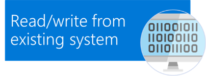
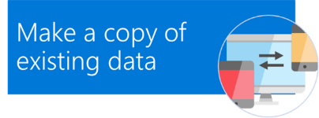

# Where is the data?

There are three different ways you can retrieve and store data:

:::row:::
    :::column:::
        

        **New Data** If your app is creating data that doesn’t exist anywhere now, such
        as in situations where the existing business process was using paper, storing
        the data in either Common Data Service or a SharePoint custom list is
        recommended.
    :::column-end:::
   :::column:::
        

       **Read/write from existing system** This is a type of data where you need to
       retrieve the latest information from an existing data/system. In these cases,
       data needs to be requested at the time you need it.
        
    :::column-end:::
    :::column:::
        

        **Make a copy of the data** In situations where original data should never be
        modified or over-written, you can copy the data to another data store such as
        Common Data Service. This ensures the data in the original system is not
        changed, yet your app can work with the data. This scenario is common when
        working with data in accounting and revenue related systems.

    :::column-end:::
:::row-end:::

## Accessing existing data

Power Apps have two ways of using existing data. One is connectors which allows
you to directly connect to a data source, and the other is dataflow which copies
a snapshot of data.

- **Using a connector**: A connector is a feature in Power Apps where you can connect to various systems,
and sources such as SharePoint, SQL Server, Office 365 etc. and directly
retrieve or save data to them. You can [read more about what a connector is](../../maker/canvas-apps/connections-list).

- **Using a dataflow**: Dataflow is a feature in Power Apps where you can extract, transform and load
data from another system to Common Data Service or Azure Data Lake storage.
Unlike a connector, it fetches data in a scheduled batch. Instead of just
retrieving the data as it is from the data source, you can use Power Query
Online to manipulate, cleanse and transform data before you store it to the
target storage. You can [read more about what a dataflow is](../../maker/common-data-service/self-service-data-prep-with-dataflows).

Depending on the use-cases and how data needs to be handled, you should choose
the method based on some of the items below.

| **Item to compare**  | **Connectors**                               | **Dataflow**                                  |
|----------------------|----------------------------------------------|-----------------------------------------------|
| Freshness of data    | Real-time                                    | Static / Snapshot                             |
| Direction            | Bi-directional                               | One-direction (from origin to CDS)            |
| Modify existing data | Yes                                          | No                                            |
| Use cases            | Production order, Timesheet, Sales Quotation | Customer master, Past invoices, Employee list |

## Example: Expense Report data

Our expense report project includes each of the three types of data storage
needs:

-   **New data**: Because the expense reports were on paper, we need a new
    storage system for the data created by the employee filling out the expense
    report. We will need to design a data model for that data.

-   **Writing to an existing system**: When the Accounting team exports the data
    from the expense reporting into the Finance system, they will need to use a
    data connector.

-   **Copied data**: Our expense reports also include some data looked up from
    Azure Active Directory, such as the employee ID, manager, and department. We
    don’t want to change that data in the original system, but we do need to
    keep a copy of it, because we want to record their manager and department at
    the time they created the report, not at some point in the future when we
    look at the report again (and they may have changed departments or even left
    the company).
