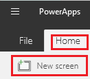
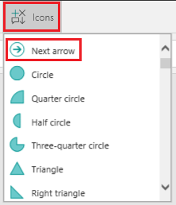

# Add a screen and navigate between screens
Create an app with multiple screens, and add ways for users to navigate between them.

## Prerequisites
* Learn how to [configure a control](add-configure-controls.md).
* Create or open an app.

## Add and rename a screen
1. On the **Home** tab, click or tap **New screen**.

    

2. In the right-hand pane, click or tap the name of the screen (just above the **Properties** tab), and then type the new name **Source**.

    

3. Add another screen, and name it **Target**.

    

## Add navigation
1. With the **Source** screen selected, open the **Insert** tab, click or tap **Icons**, and then click or tap **Next arrow**.  

    

2. (optional) Move the arrow so that it appears in the lower-right corner of the screen.

3. With the arrow still selected, click or tap the **Action** tab, and then click or tap **Navigate**.

    The **[OnSelect](../controls/properties-core.md)** property for the arrow is automatically set to a **Navigate** function.  

    

    When a user clicks or taps the arrow, the **Target** screen fades in.

4. On the **Target** screen, add a **Back arrow**, and set its **[OnSelect](../controls/properties-core.md)** property to this formula:
    **Navigate(Source, ScreenTransition.Fade)**

5. Open Preview mode ( or press F5), and then switch between the screens by clicking or tapping the arrows that you added.

6. Press **Esc** to return to the default workspace.
