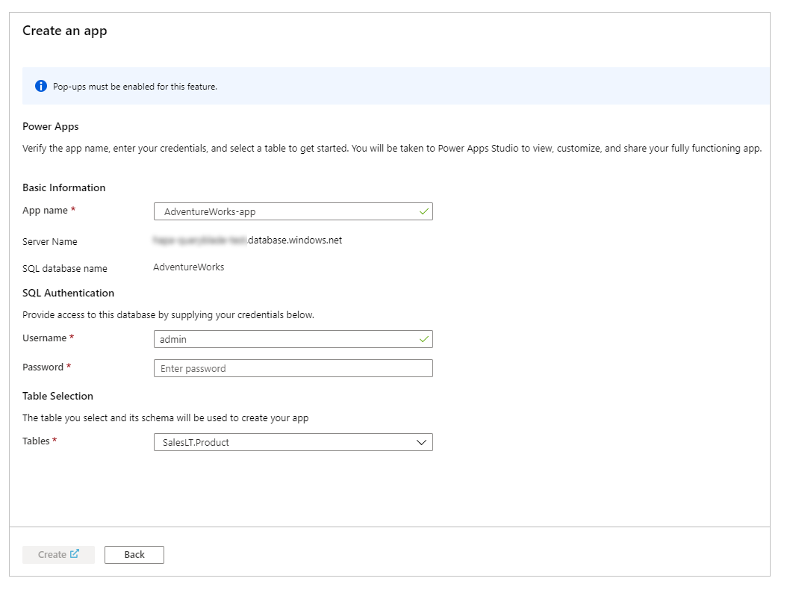

# Generate a canvas app from Azure SQL Database

[This topic is pre-release documentation and is subject to change.]

In this topic, you'll use data in your Azure SQL tables to create an app with PowerApps in minutes. You’ll have a fully functional app with your data that you can customize to fit your business needs and share  on any device.

> [!IMPORTANT]
> - This is a preview feature.
> - A preview feature may have limited availability and restricted functionality. A preview feature is available before an official release so that customers can get early access and provide feedback.

## Prerequisites

- Your browser must have pop-ups enabled.
- You need an Azure SQL Database subscription.
- You need a valid PowerApps license or a valid [30 day trial license](../signup-for-powerapps.md).

## Generate an app

1. Sign into [Azure Portal](https://portal.azure.com).
2. Navigate to your SQL Database.
3. Select PowerApps from the left side menu.

    
    

    > [!NOTE]
    > If you don't have a PowerApps license, you'll see a blue information bar with a link to start a trial. When you select start trial, you'll be taken to a new tab where you'll be signed up for a license. Once complete, go back to the Azure portal and refresh the blade to continue.

4. Type a name for the app.
    
    > [!TIP]
    > The name can only be a letter, digit, '-', '(', ')' or '_'. We suggest names such as “Site Inspection” “Fundraiser” “Budget Tracker”.

## Specify the information for your app
    

1. Provide your SQL authentication – your username is pre-filled (edit if incorrect), and fill in your password.
2. Select the table from the dropdown that you wish to use to create the app.
3. [PowerApps studio](https://create.powerapps.com/studio/ "https://create.powerapps.com/studio/") opens in a new tab. If pop-up is blocked, update browser to allow pop-ups and retry.
4. Wait while your app is created for you.
5. You now have a 3 page app with your data from the specified Azure SQL Database.

## Accessing your app

To access the created app again, visit the [PowerApps portal](https://make.powerapps.com "https://make.powerapps.com"). 
