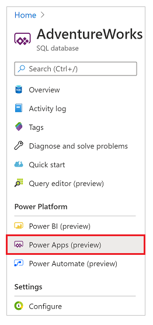

# Create a canvas app from Azure SQL Database

[This topic is pre-release documentation and is subject to change.]

In this topic, you'll use data in your Azure SQL database to create an app with PowerApps in minutes. You’ll have a fully functional app with your data that you can customize to fit your business needs and share  on any device.

> [!IMPORTANT]
> - This is a preview feature.
> - A preview feature may have limited availability and restricted functionality. A preview feature is available before an official release so that customers can get early access and provide feedback.

## Prerequisites

- Your browser must have pop-ups enabled.
- You need an Azure subscription.
- You need access to an existing SQL database.
- You need a valid PowerApps license or sign up for a [30 day trial license](../signup-for-powerapps.md).

## Create an app

1. Sign into [Azure Portal](https://portal.azure.com).
2. Navigate to your SQL Database.
3. Select PowerApps.

    
    

    > [!NOTE]
    > If you don't have a PowerApps license, you'll see a blue information bar with a link to start a trial. When you select to start trial, you'll be taken to a new tab where you'll be signed up for a license. Once complete, go back to the Azure portal and refresh the blade to continue.

4. Type a name for the app. The name can only be a letter, digit, '-', '(', ')' or '_'. We suggest names such as “Site Inspection”, “Fundraiser” and “Budget Tracker”.

5. Provide your SQL authentication – your username is pre-filled (edit if incorrect), and fill in your password.
6. Select a table from the dropdown that you wish to use to create the app. You can select only one table while creating canvas app from the Azure portal. You can customize the app after the app is created if you want to add more tables and other data sources by adding more data connections.

7. Click **Create**.

    

    The [PowerApps studio](https://create.powerapps.com/studio/) opens in a new tab. If pop-up is blocked, update browser to allow pop-ups and retry. Once created, you'll have a 3 page app with data from your Azure SQL database.

## Accessing your app

To access the created app again, visit the [PowerApps portal](https://make.powerapps.com). The app is also listed in the PowerApps blade of the SQL database instance inside the Azure portal.

### Next steps
In this quickstart, you created an app using data from your Azure SQL database using the Azure portal. As a next step, customize the app with controls, images and logic to better suit your business needs.

> [!div class="nextstepaction"]
> [Design the canvas app interface in PowerApps](add-configure-controls)

### See also

- [Add a data connection to a canvas app in PowerApps](add-data-connection#add-data-source) 
- [Microsoft Learn: Customize apps in PowerApps](https://docs.microsoft.com/learn/modules/customize-apps-in-powerapps/)
