# Analyze app telemetry using Application Insights

You can connect your app with [Application Insights](https://docs.microsoft.com/azure/azure-monitor/app/app-insights-overview), a feature of [Azure Monitor](https://docs.microsoft.com/azure/azure-monitor/overview). Application Insights is an extensible Application Performance Management (APM) service for developers and DevOps professionals.

With your app connected to Applications Insights, you can collect
information to help you drive better business decisions and improve the quality of your apps.

In this quickstart, you'll instrument a canvas app called Kudos. This helps you explore, discover telemetry concepts and apply them to your own canvas
apps. The sample Kudos app is part of a suite of employee engagement apps
available for download from [Employee Experience Starter
Kit](https://powerapps.microsoft.com/blog/powerapps-employee-experience-starter-kit).

## Prerequisites

- You must have access to [Azure Portal](https://portal.azure.com).
- You must have the permissions to [create Azure resources](https://docs.microsoft.com/azure/role-based-access-control/quickstart-assign-role-user-portal).

### Optional

- Download and install Kudos app from [Employee Experience Starter
Kit](https://powerapps.microsoft.com/blog/powerapps-employee-experience-starter-kit).
- You can also use an existing app.

## Create an Application Insights resource

Before you can send telemetry for an app, you will need to create an Azure
Application Insights resource to store the events.

1. Sign in to the [Azure portal](https://portal.azure.com/).

1. Search for Application Insights:

    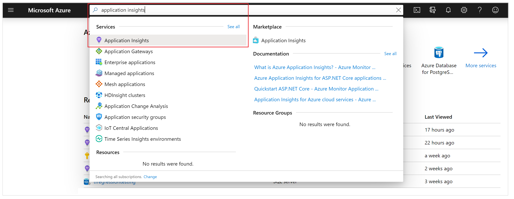

1. Create an Application Insights resource:

    

1. Enter the appropriate values and select **Review + create**. For more details, read [Create an Application Insights resource](https://docs.microsoft.com/azure/azure-monitor/app/create-new-resource). 

    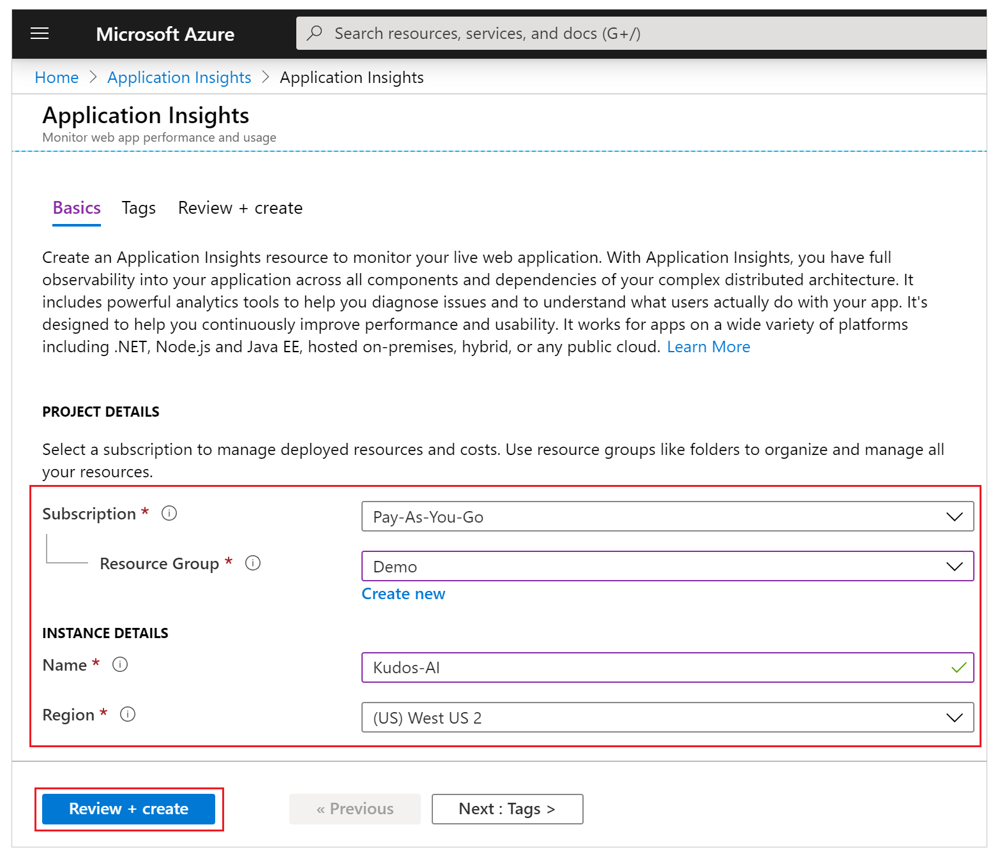

1. After the Application Insights instance is created, you'll see the instance overview. Copy the **Instrumentation Key**. You'll need this key to configure your app.

    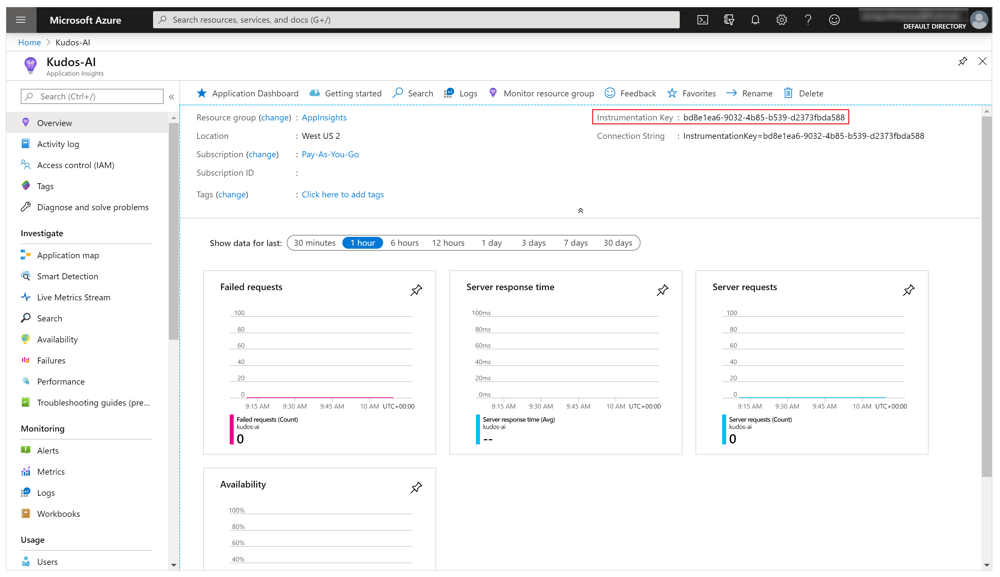

## Connect your app to Application Insights

1. Sign in to [Power Apps](https://make.powerapps.com).

1. Select **Apps** from the left navigation. From the list of apps, select the **Kudos** app and then select **Edit**:

    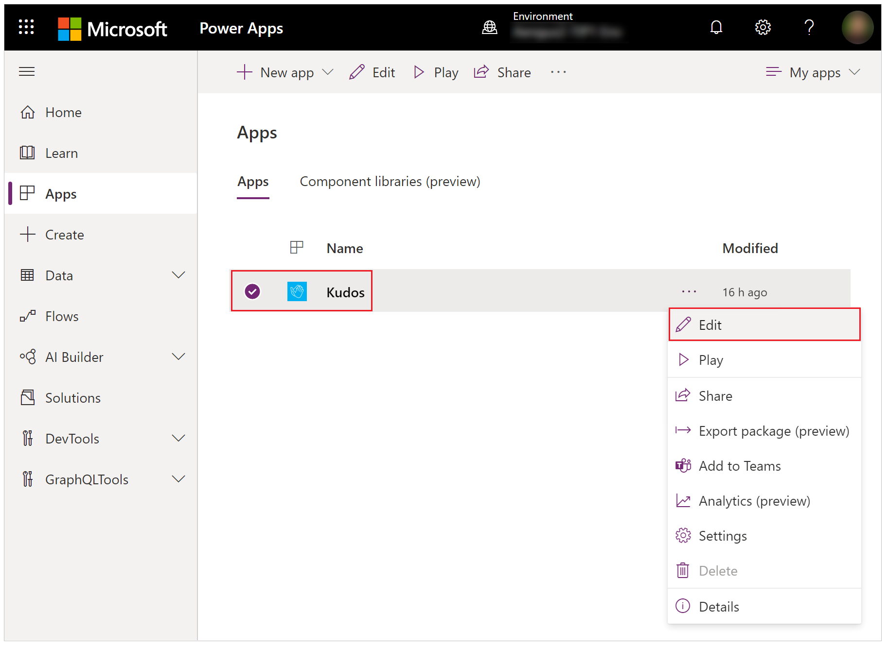

    > [!NOTE]
    > You can also [create](open-and-run-a-sample-app.md) a new app or [edit](edit-app.md) any existing app instead.

1. Select **App** object from the left navigation tree view and paste the **Instrumentation Key**:

    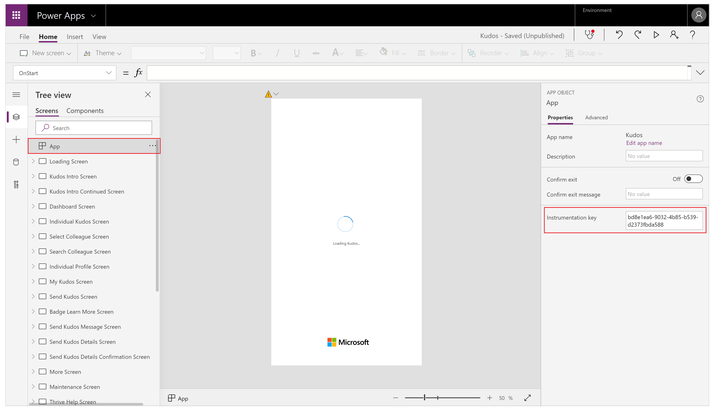

1. **Save** & **Publish** your app.

1. **Play** the published app and browse through different screens. 

As you browse through different screens, events are automatically logged to Application Insights including the usage details such as:

- Where the app is accessed from.
- Which are the devices used.
- The browser types used.

> [!IMPORTANT]
> You must play the published app to send events to Application
Insights. Events are not sent to Application Insights when you preview the
app in Power Apps Studio.

## View events in Application Insights

1. Sign in to the [Azure portal](https://portal.azure.com/) and open the Application Insights resource you created [earlier](#create-an-application-insights-resource).

1. Scroll down in the left navigation pane and select **Users** under the **Usage** section. 

    > [!NOTE]
    > **Users** view shows usage details of the app, such as:
    > - Number of users that viewed the app.
    > - Number of sessions by the users for the app.
    > - Number of events logged for the app.
    > - Operating systems and browser version details of the users.
    > - Region and location of the users.
    > 
    > For more details, read [Users, sessions, and events analysis in Application Insights](https://docs.microsoft.com/azure/azure-monitor/app/usage-segmentation).

1. Select one of the user sessions to drill into specific details. You can see information such as the session length and the screens visited:

    

1. Select the **Events** view in left navigation pane under **Usage** section. You can see a summary of all the screens viewed across all app sessions:

    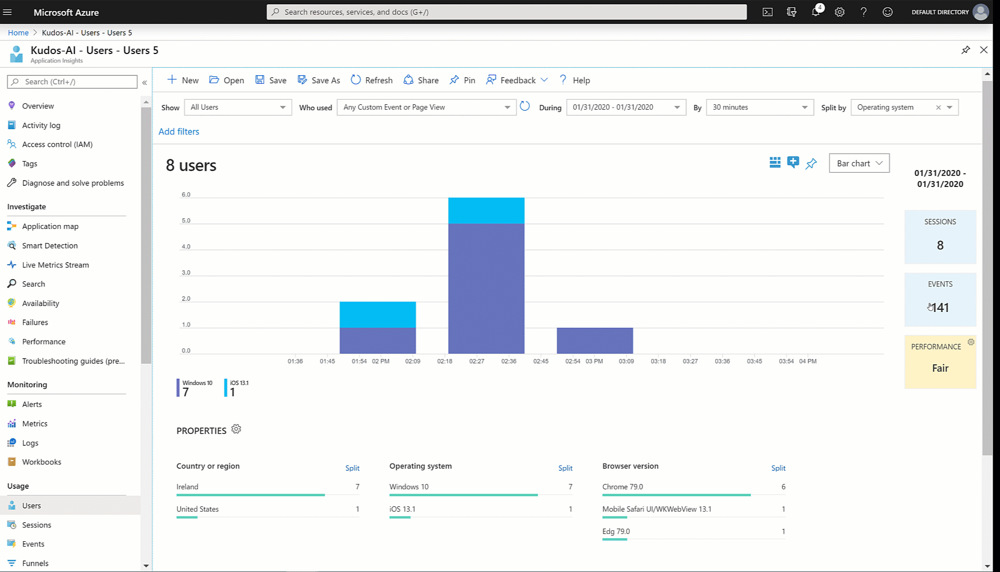

> [!TIP]
> Some of the additional Application Insights features you can use are:  
> - [**Funnels**](https://docs.microsoft.com/azure/azure-monitor/app/usage-funnels)
> - [**Cohorts**](https://docs.microsoft.com/azure/azure-monitor/app/usage-cohorts)
> - [**Impact analysis**](https://docs.microsoft.com/en-us/azure/azure-monitor/app/usage-impact)
> - [**Retention analysis**](https://docs.microsoft.com/azure/azure-monitor/app/usage-retention)
> - [**Usage flows**](https://docs.microsoft.com/azure/azure-monitor/app/usage-flows)

## Create custom trace events

You can write custom traces directly to Application Insights and start to analyze information specific to your scenario. [Trace](https://docs.microsoft.com/powerapps/maker/canvas-apps/functions/function-trace) function allows you to collect:

- Granular usage information for controls on the screens.
- Which specific users are accessing your app.
- What errors occur.

Tracing can also help diagnose issues as you can send a trail of information as your users browse through your app and perform different actions.

There are 3 severities for trace messages when sending custom trace information to Application Insights from your app:

- **Information**
- **Warning**
- **Error**

Depending on your scenario, you can choose to send trace message with the appropriate severity. You can query the data and take specific actions based on the message severity.

> [!NOTE]
> If you are logging any personnel data, you will need to consider any
data compliance obligations, such as GDPR, that you may also need to implement.

You'll now update your app and create a new component to collect feedback on each screen of the app. You'll write the events to Application Insights.

1. Sign in to [Power Apps](https://make.powerapps.com).

1. Select **Apps** from the left navigation. From the list of apps, select the **Kudos** app and then select **Edit**.

    > [!NOTE]
    > You can also [create](open-and-run-a-sample-app.md) a new app or [edit](edit-app.md) any existing app instead.

1. Select the **Components** option in the **Tree view**:

    

1. Select **New component**, and then resize the width to 200, height to 75:

    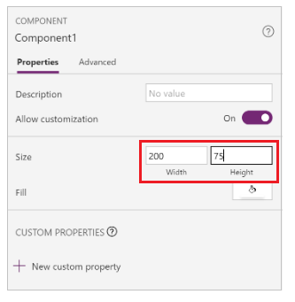

1. Select **Insert** from the menu and then select **Icons** to add *Emoji - Frown* and *Emoji - Smile* icons:

    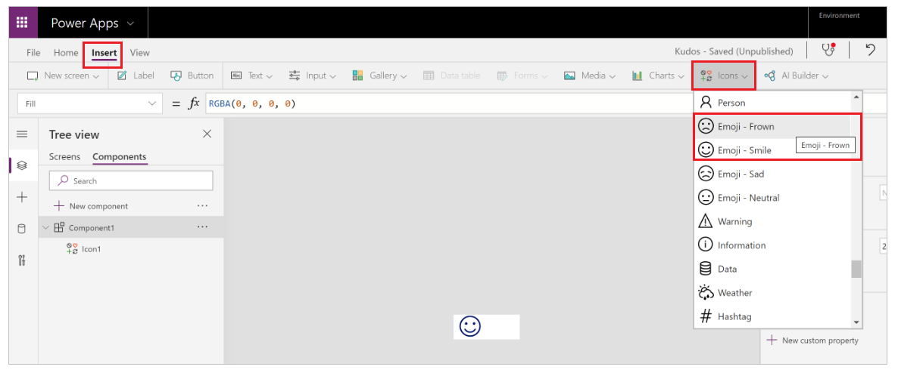

1. Select **New custom property** to create a custom property:

    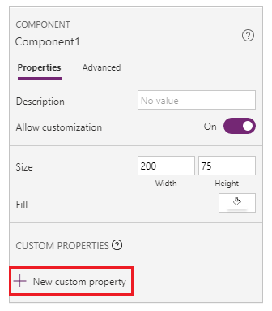

1. Enter property *Name* and *Display name* such as *FeedbackSceen*.

1. Enter property *Description*.

1. Select **Property type** a **Input** and **Data type** as **Screen**:

    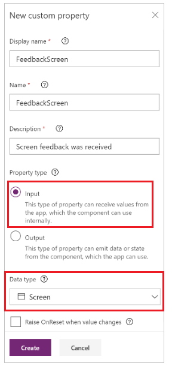

    > [!NOTE]
    > Input property allows you to capture the screen name and it's component so that you can log this information to Application Insights.

1. Select the component on the **Tree View**, then select the **More actions** (**...**) and then select **Rename** to rename the component with a meaningful name such as *FeedbackComponent*.

    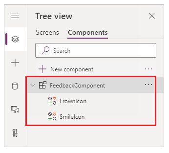

1. Select icons, select **More actions** (**...**) and then select **Rename** to rename the icons with a meaningful names, such as *FrownIcon* and *SmileIcon*.

1. Select the *FrownIcon*, select the **OnSelect** property and then enter the following expression in the formula bar:

    ```
    Trace(
       "App Feedback",
       TraceSeverity.Information,
           {
             UserName: User().FullName,
             UserEmail: User().Email,
             Screen: FeedbackComponent.FeedbackScreen.Name,
             FeedbackValue: "-1"
           }
         );
    Notify("Thanks for you feedback!");
    ```

    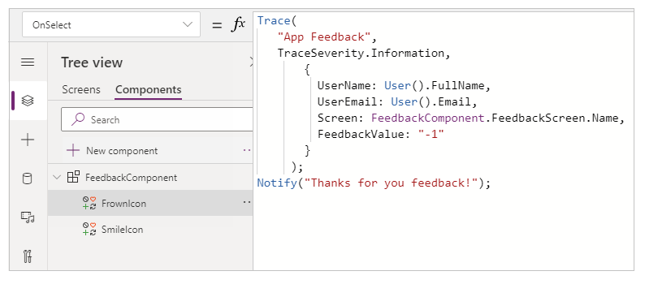

    > [!NOTE]
    > The formula expression sends *UserName*, *UserEmail*, *Screen* and the *Feedback* (with the value *-1*) to Application Insights.

1. Select the *SmileIcon*, select the **OnSelect** property and then enter the following expression in the formula bar:
    
    ```
    Trace(
       "App Feedback",
       TraceSeverity.Information,
           {
             UserName: User().FullName,
             UserEmail: User().Email,
             Screen: FeedbackComponent.FeedbackScreen.Name,
             FeebackValue: "1"
           }
         );
    Notify("Thanks for you feedback!");
    ```

1. Add the component to one of the screens in your app:

    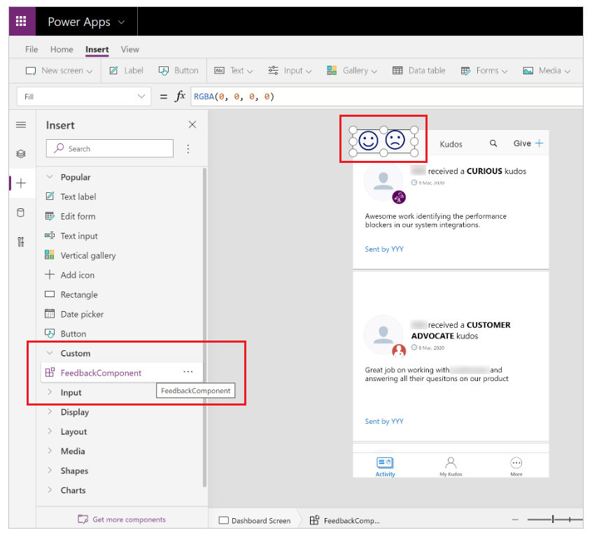

1. Select **Save** and then select **Publish** to save & publish your app.

1. Play the published app, and send a smile and a frown feedback from your
    screens.

    > [!IMPORTANT]
    > You must play the published app to send events to Application
    Insights. Events are not sent to Application Insights when you preview the
    app in Power Apps Studio.

    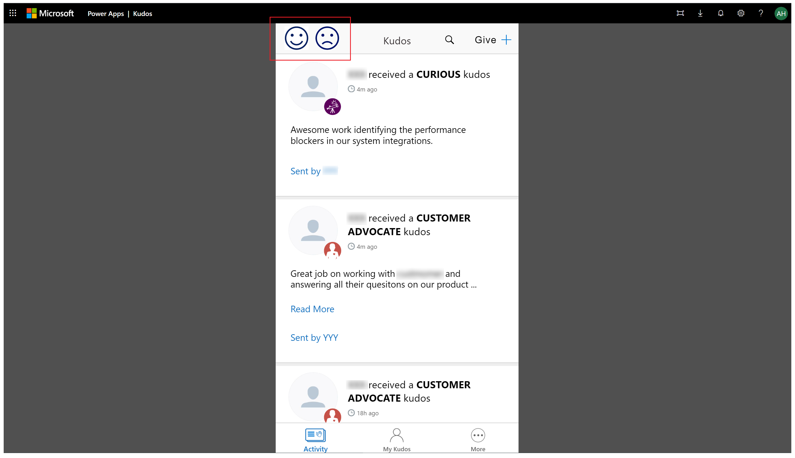

## Analyze the information in Application Insights

You can now begin to analyze the information you sent using the Trace function
from your application in App Insights.

1.  Sign in to the [Azure portal](https://portal.azure.com/)

2.  Select the App Insights resource you created earlier


1.  Select Logs in the left tree menu.


1.  Type the below query and select Run. The feedback received from your app are
    returned.


1.  Select a row in the results and expand the custom dimensions field. The
    values for Screen, UserName, UserEmail and FeedbackValue for the OnSelect
    event of the smile or frown icon in your component have being recorded.
    There are also some additional values recorded for each event sent to
    Application Insights, such as the AppId, AppName and AppSessionId.


1.  Using the below query, you can extend the properties of the JSON custom
    dimensions and present them columns in the results view.

    Log queries are extremely powerful, and you can use them to join multiple
    tables, aggregate large amounts of data and perform complex operations. You
    can learn more about Log
    queries [here](https://docs.microsoft.com/en-us/azure/azure-monitor/log-query/log-query-overview). 

traces

\| extend customdims = parse_json(customDimensions)

\| where message == "App Feedback"

\| project timestamp

, message

, AppName = customdims.['ms-appName']

, AppId = customdims.['ms-appId']

, FeedbackFrom = customdims.UserEmail

, Screen = customdims.Screen

, FeedbackValue = customdims.FeedbackValue

\| order by timestamp desc


Export the information to Power BI

You can also export your Application Insights data and query results to Power BI
for further analysis and data presentation to stakeholders.

1.  From the log analytics query window, select export.

2.  Select "Export to Power BI (M query)" option. This download a Power BI query
    file to your machine. Open the file and copy the query.


1.  Open Power BI.

2.  Select "Get Data" and "Blank Query" menu option.


1.  In the query window, select "Advanced editor". Paste the query from step 2
    into the window and select "Done" followed by "Close & Apply".


1.  With my data, I can create charts and visualizations in Power BI to
    represent feedback received in my app, and make data-based decisions and
    actions.


Default event context and dimensions

In order to track what a user does over time, Application Insights needs an ID
for each user or session. The following IDs are included in every trace or
screen view event sent.

| Event property | Represents                                                 |
|----------------|------------------------------------------------------------|
| User_Id        | The AAD user object id of the end user of the application. |
| Session_Id     | The Power Apps player session id.                          |

In addition to these properties, a set of default dimensions are also added to
the customDimensions property on each event. These can be used to identify the
application and application sessions the events occurred in. If you log addition
custom data using the trace function, they will also appear in the custom
dimensions.

| Dimension Name  | Represents                                            |
|-----------------|-------------------------------------------------------|
| ms-appId        | The Application Id of the app that sent the event     |
| ms-appName      | The Application name of the app that sent the event   |
| ms-tenantId     | The Tenant Id related to the app that sent the event. |
| ms-isTest       | If the event was sent during the execution of a test. |
| ms-appSessionId | The application session Id.                           |

 
