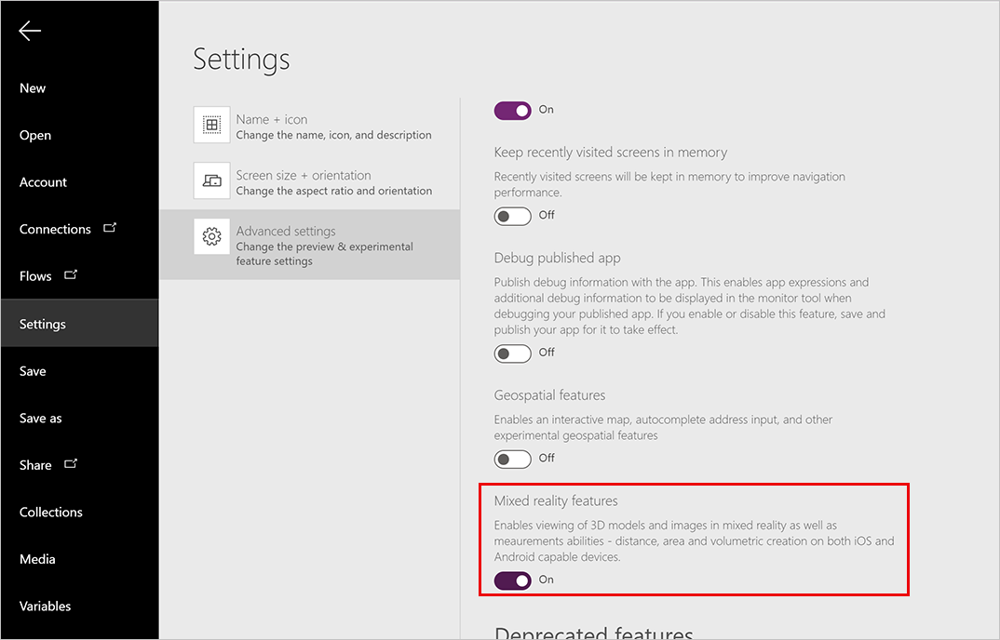
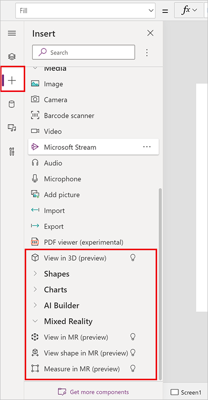

# Add augmented reality components to your app

You can add a number of augemented reality (AR) components to your canvas app to support multiple 3D and mixed reality scenarios.

Components are groups of controls that can answer the need for a specific scenario. For example, you can use these AR components to:
- View and manipulate 3D objects
- Overlay 3D objects and 2D images onto the feed from the camera
- Measure and identify spaces and objects in the real world with an AR overlay

You can read more about components and how to build your own in [the Power Apps developer library](/powerapps/developer/component-framework/custom-controls-overview).

The following pre-built components can be used to solve your AR scenarios:
- [View in 3D](augmented-reality-component-view-3d.md)
- [View in augmented reality](augmented-reality-component-view-ar.md)
- [Measure in augmented reality - distance](augmented-reality-component-measure-distance.md)
- [Measure in augmented reality - advanced](augmented-reality-component-measure-advanced.md)
- [View shape in augmented reality](augmented-reality-component-view-shape.md)

## Prerequisites

1. You need to be [enrolled in the Experience Dynamics Insider Program](#enroll-in-the-mixed-reality-in-power-apps-dynamics-365-insider-program-internal).
1. You need a PowerApps license that supports Common Data Service. If you [identify your current license](/powerapps/maker/signup-for-powerapps#identify-your-current-license) does not support CDS, you can sign up for a [free trial license for 30 days](http://web.powerapps.com/trial). Please note that in some circumstances this step may take 30 to 60 minutes. Please check periodically after requesting a trial license.
2. If you don’t have one already, you will need to [create an environment with Common Data Service instance installed](/power-platform/admin/create-environment). You will need to have system administrator privileges for this step.
3. [Enable the mixed reality features for each app](#enable-the-mixed-reality-features-for-each-app).

### Enroll in the Mixed Reality in Power Apps Dynamics 365 insider program (INTERNAL)

You need to be enrolled in the Dynamics 365 insider program to gain access to the components.

**To enroll in the program**

1. visit https://experience.dynamics.com
2. Select **Insider Program" 
3. sign in
4. answer “yes” when asked to grant the Experience Dynamics Portal access
5. complete and update your profile
6. you’ll be redirected to the Insider portal landing page
7. click the “Apply Now” button
8. accept the Terms and Conditions (you must scroll to the bottom)
9. Send an email (mrceg@microsoft.com) so we can approve your membership

Once you're enrolled and you've emailed us, you will be added automatically to the [Mixed Reality in Power Apps program](https://experience.dynamics.com/insider/campaign/?id=441083a0-eb1d-ea11-a811-000d3a8f004f).

### Download and install the augmented reality components

After you've been added to the program, you'll need to download and import the solution files. Once you've done this you'll be able to add augmented reality controls to your canvas apps.

**To download and import the AR components**

1. Go to the [Mixed Reality in Power Apps program website](https://experience.dynamics.com/insider/campaign/?id=441083a0-eb1d-ea11-a811-000d3a8f004f).
2. Select **View Program Downloads**.
3. Download the program .zip file.
4. Open the .zip file and extract the *MixedRealityPreview_###.zip* file to a location on your hard drive. *###* in the file name indicates the latest version number, for example *MixedRealityPreview_1_1_2.zip*. You can also extract the *ModelGallerySample.zip* file.
5. [Import the two solutions into your environment](/powerapps/maker/common-data-service/import-update-export-solutions).

### Enable the mixed reality features for each app

For each app you create, you need to enable the mixed reality features:

1. Open the app for editing in the Power Apps studio at [https://create.powerapps.com](https://create.powerapps.com).

2. Select **File** from the top menu.

    

3. Go to the **Settings** tab, select **Advanced settings**, and scroll down to find the **Mixed reality features** option. Set the option to **On**.

    

4. Return to editing your app by selecting the back arrow icon

    

5. Open the **Insert** pane to see the mixed reality components under **Media** and **Mixed Reality**.

    

## Scenarios

### Whatever other scenario

Describe what this scenario achieves, what the controls are that are needed.

## Next steps
Explore [example AR apps](augmented-reality-example-apps.md) and see what sorts of scenarios AR controls can help solve
