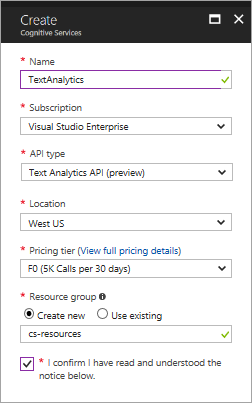
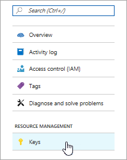
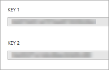
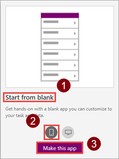
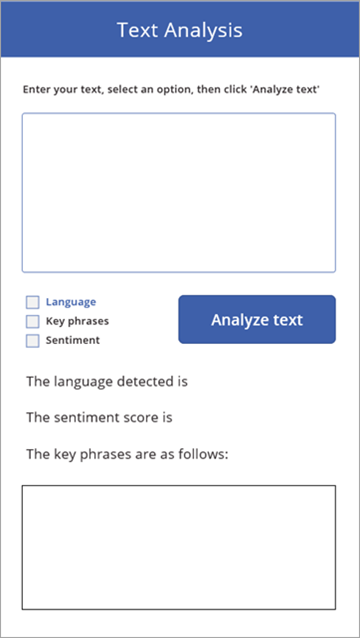
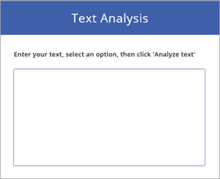
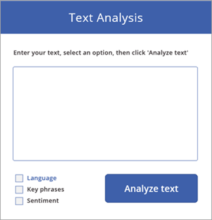
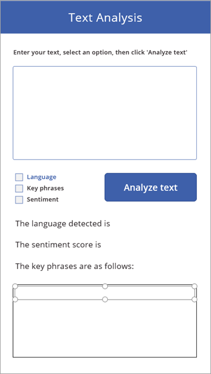
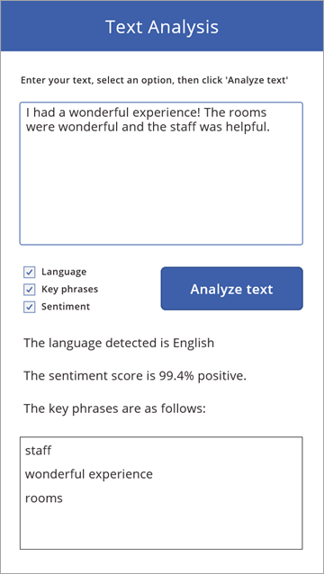

# Use Cognitive Services in PowerApps
This article shows you how to build a basic canvas app that uses the [Microsoft Cognitive Services Text Analytics API](https://docs.microsoft.com/azure/cognitive-services/text-analytics/overview) to analyze text. We'll show you how to set up the Text Analytics API, and connect to it with the [Text Analytics connector](https://docs.microsoft.com/connectors/cognitiveservicestextanalytics/). Then we'll show you how to create a canvas app that calls the API.

> [!NOTE]
> If you are new to building apps in PowerApps, we recommend reading [Create an app from scratch](get-started-create-from-blank.md) before diving into this article.

## Introduction to Microsoft Cognitive Services
Microsoft Cognitive Services are a set of APIs, SDKs, and services available to make your applications more intelligent, engaging, and discoverable. These services enable you to easily add intelligent features – such as emotion and video detection; facial, speech and vision recognition; and speech and language understanding – into your applications.

We'll focus on "language understanding" for this article, working with the Text Analytics API. This API enables you to detect sentiment, key phrases, topics, and language from your text. Let's get started by trying out a demo of the API, then signing up for a preview version.

### Try out the Text Analytics API
The API has an online demo – you can see how it works, and look at the JSON that the service returns.

1. Go to the [Text Analytics API](https://azure.microsoft.com/services/cognitive-services/text-analytics/) page.

2. In the **See it in action** section, use the example text, or enter your own text. Then click or tap **Analyze**. 
   
    

3. The page shows formatted results on the **Analyzed text** tab, and the JSON response on the **JSON** tab. [JSON](http://json.org/) is a way to represent data - in this case, data returned by the Text Analytics API.

## Sign up for the Text Analytics API
The API is available as a free preview, and it is associated with an Azure subscription. You manage the API through the Azure portal.

1. If you don't already have an Azure subscription, [sign up for a free subscription](https://azure.microsoft.com/free/).

2. Sign in to your Azure account.

3. Go to the [Create Cognitive Services blade](https://go.microsoft.com/fwlink/?LinkId=761108) in the Azure portal.

4. Enter information for the Text Analytics API, like in the following image. Select the **F0** (free) pricing tier.
   
    

5. In the lower-left corner, click or tap **Create**.

6. On the **Dashboard**, click or tap the API that you just created.
   
    

7. Click or tap **Keys**.
   
    

8. Copy one of the keys on the right of the screen. You use this key later when you create a connection to the API.
   
    

## Build the app
Now that you have the Text Analytics API up and running, you connect to it from PowerApps, and build an app that calls the API. This is a single screen app that provides functionality similar to the demo on the Text Analytics API page. Let's get started on building this!

### Create the app and add a connection
First, you create a blank phone app and add a connection with the **Text Analytics** connector. If you need more information about these tasks, see [Create an app from scratch](get-started-create-from-blank.md) and [Manage your connections in PowerApps](add-manage-connections.md).

1. In [powerapps.com](https://web.powerapps.com?utm_source=padocs&utm_medium=linkinadoc&utm_campaign=referralsfromdoc), choose **Start from blank** >  (phone) > **Make this app**.

    

2. In the middle pane of the PowerApps Studio, choose **connect to data**.

3. On the **Data** panel, click or tap **New connection** > **Text Analytics**.

4. Copy your key into **Account Key**, then click or tap **Create**.
   
    

### Add controls to the app
The next step in creating the app is to add all the controls. Normally when we build apps, we add formulas to the controls as we go, but in this case we'll focus on the controls first, then add a few formulas in the next section. The following image shows the app with all the controls.



Follow the steps below to create this screen. If a control name is specified, that name is used in a formula in the next section.

1. On the **Home** tab, click or tap **New Screen**, then **Scrollable screen**. 

2. On **Screen2**, select **[Title]** and change it to **Text Analysis**.

3. Add a **Label** control for the introductory text.

4. Add a **Text input** control, so you can enter text to analyze. Name the control **tiTextToAnalyze**. The app should now look like the following image.
   
    

5. Add three **Check box** controls, so you can choose which API operations to perform. Name the controls **chkLanguage**, **chkPhrases**, and **chkSentiment**.

6. Add a button, so you can call the API after selecting which operations to perform. The app should now look like the following image.
   
    

7. Add three **Label** controls. The first two hold results from the language and sentiment API calls; the third is just an introduction for the gallery at the bottom of the screen.

8. Add a **Blank vertical gallery** control, then add a **Label** control to the gallery. The gallery holds results from the key phrases API call. The app should now look like the following image.
   
    

9. In the left pane, select **Screen1** > ellipsis (**. . .**) > **Delete** (you don't need this screen for the app).

We're keeping this app simple to focus on calling the Text Analytics API, but you could add things - like logic to show and hide controls based on the check boxes selected, error handling if the user doesn't select any options, and so on.

### Add logic to make the right API calls
OK, you have a nice-looking app, but it doesn't do anything yet. You'll fix that in a moment. But before we dive into the details, let's understand the pattern that the app follows:

1. The app makes specific API calls based on the check boxes selected in the app. When you click or tap **Analyze text**, the app makes 1, 2, or 3 API calls.

2. The app stores data that the API returns in three different [collections](working-with-variables.md#create-a-collection): **languageCollect**, **sentimentCollect**, and **phrasesCollect**.

3. The app updates the **Text** property for two of the labels, and the **Items** property for the gallery, based on what's in the three collections.

With that background, let's add the formula for the **OnSelect** property of the button. This is where all the magic happens.

```powerapps-dot
If(chkLanguage.Value=true,
	ClearCollect(languageCollect, 
		TextAnalytics.DetectLanguage(
			{numberOfLanguagesToDetect:1, text:tiTextToAnalyze.Text}
		).detectedLanguages.name
	)
);

If(chkPhrases.Value=true,
	ClearCollect(phrasesCollect, 
		TextAnalytics.KeyPhrases(
			{language:"en", text:tiTextToAnalyze.Text}
		).keyPhrases
	)
);

If(chkSentiment.Value=true,
	ClearCollect(sentimentCollect, 
		TextAnalytics.DetectSentiment(
			{language:"en", text:tiTextToAnalyze.Text}
		).score
	)
)
```

There's a bit going on here, so let's break it down:

* The **If** statements are straightforward – if a specific check box is selected, make the API call for that operation.

* Within each call, specify the appropriate parameters:

  * In all three calls, you specify **tiTextToAnalyze.Text** as the input text.

  * In **DetectLanguage()**, **numberOfLanguagesToDetect** is hard-coded as 1, but you could pass this parameter based on some logic in the app.

  * In **KeyPhrases()** and **DetectSentiment()**,**language** is hard-coded as "en", but you could pass this parameter based on some logic in the app. For example, you could detect the language first, then set this parameter based on what **DetectLanguage()** returns.

* For each call that is made, add the results to the appropriate collection:

    * For **languageCollect**, add the **name** of the language that was identified in the text.

    * For **phrasesCollect**, add the **keyPhrases** that were identified in the text.

    * For **sentimentCollect**, add the sentiment **score** for the text, which is a value of 0-1, with 1 being 100% positive.

### Display the results of the API calls
To display the results of the API calls, reference the appropriate collection in each control:

1. Set the **Text** property of the language label to: `"The language detected is " & First(languageCollect).name`.
   
    The **First()** function returns the first (and in this case only) record in **languageCollect**, and the app displays the **name** (the only field) associated with that record.

2. Set the **Text** property of the sentiment label to: `"The sentiment score is " & Round(First(sentimentCollect.Value).Value, 3)\*100 & "% positive."`.
   
    This formula also uses the **First()** function, gets the **Value** (0-1) from the first and only record, then formats it as a percentage.

3. Set the **Items** property of the key phrases gallery to: `phrasesCollect`.
   
    You're now working with a gallery so you don't need the **First()** function to extract a single value. You reference the collection, and the gallery displays the key phrases as a list.

## Run the app

Now that the app is finished, run it to see how it works: click or tap the run button in the upper right corner . In the following image, all three options are selected, and the text is the same as the default text on the Text Analytics API page.



If you compare the output of this app to the Text Analytics API page at the beginning of this article, you see that the results are the same.

We hope you now understand a little more about the Text Analytics API, and you've enjoyed seeing how to incorporate it into an app. Let us know if there are other Cognitive Services (or other services in general) that you would like us to focus on in our articles. As always, please leave feedback and any questions in the comments.

