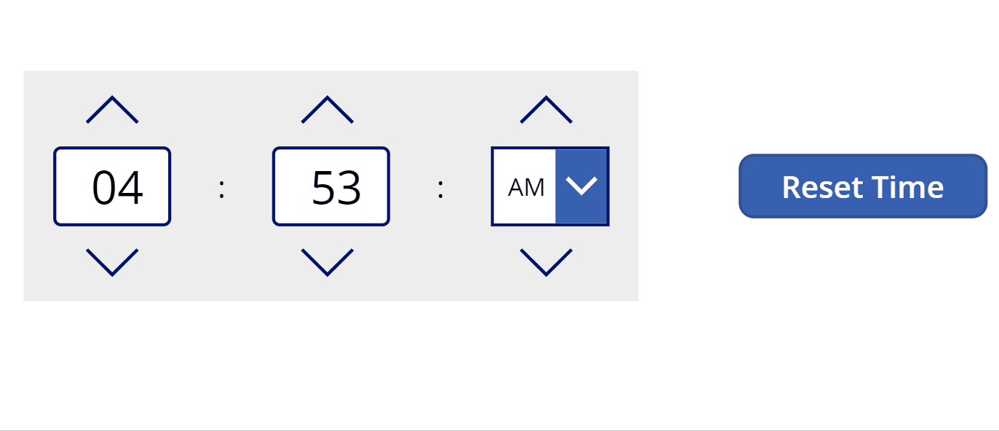
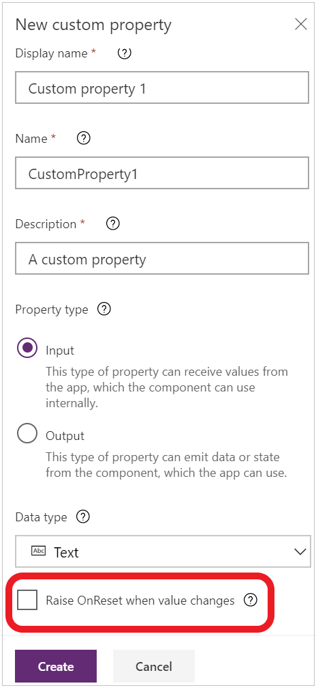
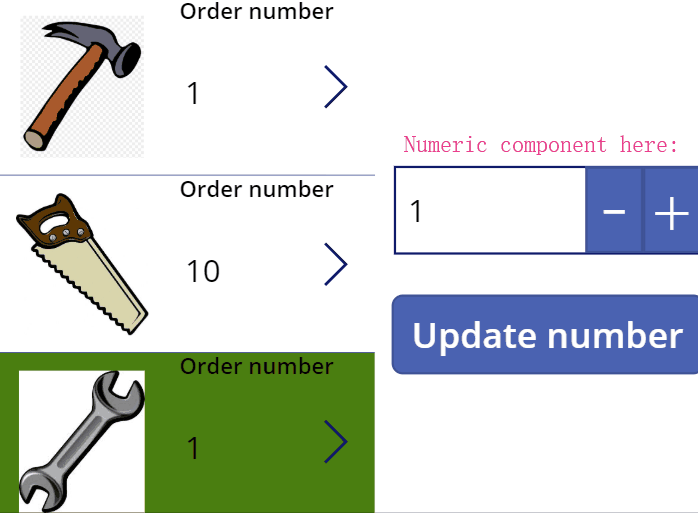

# Behavior formulas for components

> [!IMPORTANT]
> This feature is still experimental and disabled by default. For more information, see [Experimental and preview features](working-with-experimental.md).

Specify one or more [behavior formulas](working-with-formulas-in-depth.md) that run when an event triggers a change in component instances. For example, set a component's **OnReset** property to one or more formulas that perform initialization, clear input, and reset values when the **Reset** function runs on the component instances.

## OnReset

With a component master selected, select **OnReset** in the drop-down list of properties (on the left side of the formula bar), and then enter one or more formulas.

> [!div class="mx-imgBorder"]
> 

To test **OnReset**, configure a control to reset the component. For example, set the **OnSelect** property of a button to this formula: **Reset**(*ComponentName*).

### Example - Reset timer

> [!div class="mx-imgBorder"]
> 

In this time picker component, two variables are used to display the time _selectedHour and _selectedMinute. When the picker gets reset, these variables should be reset to a default value, say 12: 12.  The OnReset property for the component has the following formula: **Set(_selectedHour,12); Set(_selectedMinute,12)**

To trigger reset, go to a screen and insert an instance of the component. Add a button and configure OnSelect of the button to call **Reset(TimerComponent_instance)**  to trigger OnReset.

> [!div class="mx-imgBorder"]
> 

## Custom properties trigger OnReset when value changes

Besides resetting a component instance from the outside of the component, there is another method to trigger the OnReset from the inside. "**Raise OnReset when value changes**" is an option when creating a custom input property, and it allows the value changes of this property to trigger OnReset of the component. This method is designed to set and reset default value easily. 

> [!div class="mx-imgBorder"]
> 

### Example

> [!div class="mx-imgBorder"]
> 

This is an example of reviewing order numbers and updating the numbers. The numeric up and down component is used to increase or decrease number of orders. When selecting the gallery on the left, the default number of numeric up and down component is reset to display the order number of selected tool. "**Raise OnReset when value changes**" made it possible to reset the default value when the input changes. 

To do so, check "**Raise OnReset when value changes**" of the default input property. **OnReset** of the component is set to **Set(_numericValue,'Numeric up down'.DefaultValue)**. _numericValue is the variable to store the value of the current order value. And set the **Default** of the text input control to **If(IsBlank(_numericValue), 'Numeric up down'.DefaultValue, _numericValue)**. 
