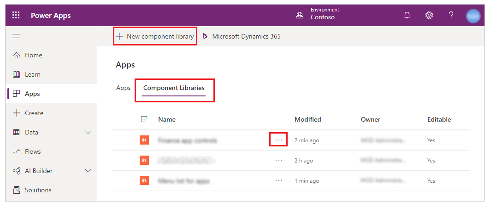
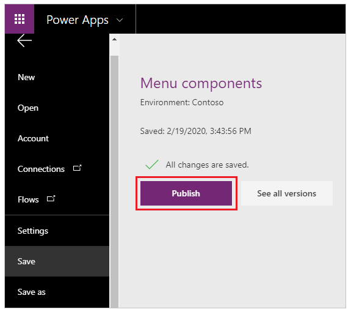
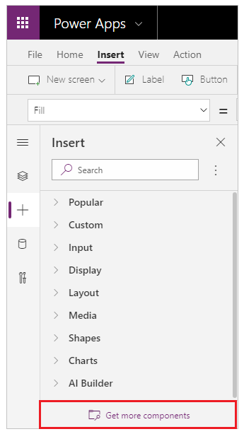
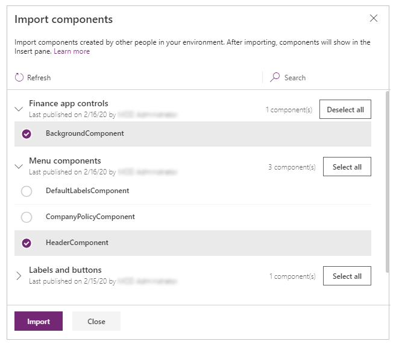
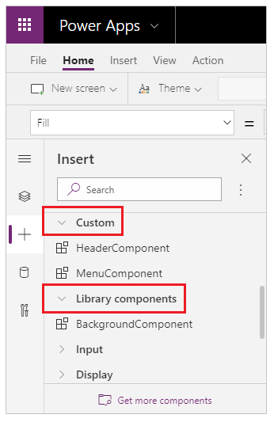
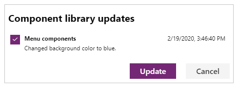
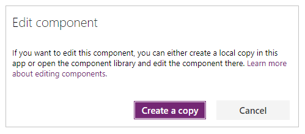

# Component library in canvas app

> [!IMPORTANT]
> This feature is still in public preview. For more information, see [Experimental and preview features](working-with-experimental.md).

In the [overview](create-component.md) article for creating components, you are introduced to components inside canvas app. While you can create components inside an app and reuse them inside the same or any other app, you can also create a library of components that can be reused. This enables app makers to share and update components with other makers by creating component libraries. 

Component libraries are containers of component definitions that make it easy to discover and search for components, publish updates across environments, and notify app makers of available component updates. 

## Difference between an app and a component library

A component library provides a centralized and managed repository of components for reusability. 

When you create a component library, the tree view on left navigation by default displays components. When you create an app, this view shows screens instead of components. 

The screens inside a component library are available for testing only. This provides library creators a way to quickly test the created components on actual screen and also validate the update behavior as components are enhanced over time. In order to use the components from component library you must create an app that uses component library.

As [components overview](create-component.md) explains, you can preview component library components using the screens inside the library with the play option. When you select component tab, the play option is disabled. Component library does not display when using Power Apps mobile.

> [!NOTE]
> Component library discussed in this article is different from the Power Apps Component Framework that enables developers and makers to create code components for model-driven and canvas apps. For more information, read [Power Apps Component Framework overview](https://docs.microsoft.com/powerapps/developer/component-framework/overview).

## Working with component library

You can create a new component library or edit an existing component library from the same interface by browsing to make.powerapps.com and selecting **Component Libraries**:

## Create an example component library

The steps to create components inside a component library are same as creating components inside an app. In this example, you'll create a component library first and then reuse the steps for creating components from [components overview example](create-component.md#create-an-example-component). Once you create the required components and preview as you walk through the example, you'll use the component library to provide the reusable components in a new app.

1. Go to make.powerapps.com, select **Apps** in left navigation, select **Component Libraries** and then select **New component library**.

1. Name the component library as *Menu components*; you can also provide a different name of your choice.

1. Follow the steps to create components from the [components overview example](create-component.md#create-an-example-component) topic. Note that you don't have to open Power Apps Studio or create a new blank app, since you already have created a new component library. Start with step 2. 

    After following steps to create components, follow next set of steps to also add screen the steps to create output property. Since all this is to reuse the components for testing, you can use the same component library.

1. After you completed the components creation and testing, save the component library by selecting **File** menu and then selecting **Save**. 

    When you select **Save** after making a change to the component library, you also have an option to save a **Version note**. This version note becomes useful when reviewing versions of a component library and upgrading the components used in apps from this component library.

    

    > [!TIP]
    > Version note is useful when reviewing versions of a component library and for the app makers using your component library to review changes and update apps consuming these components as needed.   

1. Saved component library can be published. Since only published component library updates are available for apps that consume a component library, select **Publish** to publish the component library version:

    

## Import from a component library

After you create a component library and publish, apps can consume the components from this component library by importing the library. 

To do this, edit an existing app or create a new app by browsing to make.powerapps.com and from **Apps** on the left navigation, use **New** and then **Canvas app**; or select **Edit** for any existing app from the **More Commands** (...) drop down menu.

After the Canvas App Studio opens, you select **Insert** or the **+** on the left navigation and then select **Get more components** to list the component libraries available in current environment:

This opens the list of component libraries available in current environment on right side of the screen. You can select a component library such as *Menu components* in above example and then select **Import**:

> [!NOTE]
> If maker doesn't see the component library listed in import section, ensure the component library is shared with the maker. For more details, read [component library permissions](component-library.md#component-library-permissions). 

Notice you can select and import more than one component and across different component libraries. 

Components available inside the app are listed under **Custom** category in list of components inside tree view; whereas components available from imported component libraries are listed under **Library components** category:

## Update a component library

You can modify existing component library and save any changes with additional version notes. However, the updated component library version must be published for use in existing apps that use the component library. Example component library steps above explain how to publish a component library after saving it.

After you publish component library changes, maker of the apps using the library gets to review the update when the app is opened for editing. Maker is automatically notified of updated components being available and can choose to update to latest:

Once you select **Review**, you are presented with option to update the component:

Select **Update** to update the components.

## Component library permissions

Sharing a component library works the same way you share a canvas app. When you share a component library, you are allowing others to reuse the component library. Once shared, others can edit the component library and import components from this shared component library for creating and editing apps. If shared as co-owner, user can use, edit, share component library but not delete or change owner.

## Known limitations

- [Known limitations](create-component.md#known-limitations) applicable to components also applies to component library.
- You cannot import components using component library from locally saved component library file. If you try to import a locally saved component library using **File** -> **Save As** -> **This Computer** and download the component library file as an app, following error message appears: 

    

- You cannot add component libraries to a [solution](add-app-solution.md).

- If you import a component from a component library, you cannot edit it inside the consuming app. If you select **Edit component**, you are presented with an option to create a copy of the component inside current app for you to make changes: 

    

    If you select **Create a copy**, the component is copied to the local app and behaves same as any other component inside an app instead of a component library.

## Next steps

Learn [behavior formulas](component-behavior.md) for canvas app.

### See also

Read canvas app [components overview](create-component.md) and working with components in an app.