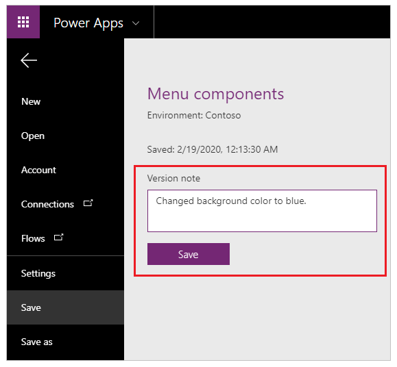
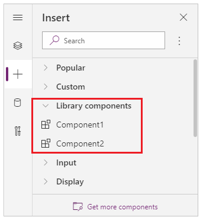

# Component library in canvas app

In the [overview](create-component.md) article for creating components, you are introduced to components inside canvas app. While you can create components inside an app and reuse them inside the same or any other app, you can also create a library of components that can be reused. This enables app makers to share and update components with other makers by creating component libraries. 

Component libraries are containers of component definitions that make it easy to discover and search for components, publish updates across environments, and notify app makers of available component updates. 

## Difference between an app and a component library

When you create a component library, the tree view on left navigation by default displays components. When you create an app, this view shows screens instead of components. 

The screens inside a component library are available for testing only. A component library cannot be used as an app even if you configure multiple screens. If you want to use components that you created inside a component library, you must create an app that uses the component library. And you can share this app with others like any other canvas app.

Components available inside the app are listed under **Custom** category in list of components inside tree view; whereas components available from imported component libraries are listed under **Library components** category:

As mentioned in [components overview](create-component.md), you cannot **preview** components from components section or the component library like the way you can preview an app using the play button on top right side of the Power Apps Studio. In order to experience the components, you must use components inside an app. Component library does not display when using Power Apps mobile.

## Working with component library

You can create a new component library or edit an existing component library from the same interface by browsing to make.powerapps.com and selecting **Component Libraries**:

## Create an example component library

The steps to create components inside a component library are same as creating components inside an app. In this example, you'll create a component library first and then reuse the steps for creating components from [components overview example](create-component.md#create-an-example-component). Once you create the required components and test the functionality using those steps, you'll use the component library to reuse the components in a new app.

1. Go to make.powerapps.com, select **Apps** in left navigation, select **Component Libraries** and then select **New component library**.

1. Name the component library as *Menu components*; you can also provide a different name of your choice.

1. Follow the steps to create components from the [components overview example](create-component.md#create-an-example-component) topic. Note that you don't have to open Power Apps Studio or create a new blank app, since you already have created a new component library. Start with step 2. 

    After following steps to create components, follow next set of steps to also add screen the steps to create output property. Since all this is to reuse the components for testing, you can use the same component library.

1. After you completed the components creation and testing, save the component library by selecting **File** menu and then selecting **Save**. 

    When you select **Save** after making a change to the component library, you also have an option to save a **Version note**. This version note becomes useful when reviewing versions of a component library and upgrading the components used in apps from this component library.

    

1. Saved component library can be published. Since only published component library updates are available for apps that consume a component library, select **Publish** to publish the component library version:

    

## Import component library

After you create a component library and publish, apps can consume the components from this component library by importing the library. 

To do this, edit an existing app or create a new app by browsing to make.powerapps.com and from **Apps** on the left navigation, use **New** and then **Canvas app**; or select **Edit** for any existing app from the **More Commands** (...) drop down menu.

After the Canvas App Studio opens, you select **Insert** or the **+** on the left navigation and then select **Get more components** to list the component libraries available in current environment:

This opens the list of component libraries available in current environment on right side of the screen. You can select a component library such as *Menu components* in above example and then select **Import**:

Notice you can select and import more than one component and across different component libraries. 

Components added from the component libraries are listed in the **Insert** navigation under section **Library components**:

## Update a component library

You can modify existing component library and save any changes with additional version notes. However, the updated component library version must be published for use in existing apps that use the component library. Example component library steps above explain how to publish a component library after saving it.

Once you publish component library changes, if you edit an existing app that uses components from this library, you are automatically notified of updated components being available:

Once you select **Review**, you are presented with option to update the component:

## Component library permissions

Sharing a component library works the same way you share a canvas app. When you share a component library, you are allowing others to reuse the component library. Once shared, others can edit the component library and import components from this shared component library for creating and editing apps.

## Known limitations

- [Known limitations](create-component.md#known-limitations) applicable to components also applies to component library.
- You cannot import components using component library from locally saved component library file. If you try to import a locally saved component library using **File** -> **Save As** -> **This Computer** and download the component library file as an app, following error message appears: 

    

- You cannot add component libraries to a [solution](add-app-solution.md).

## Next steps

Learn [behavior formulas](component-behavior.md) for canvas app.

### See also

Read canvas app [components overview](create-component.md) and working with components in an app.