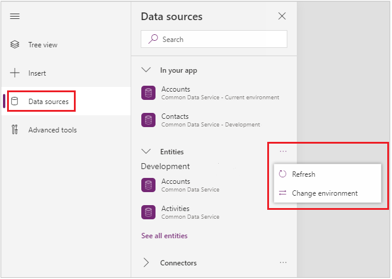

# Connect to Common Data Service

You can securely store your business data in Common Data Service and build rich apps in PowerApps so that users can manage that data. You can also integrate that data into solutions that include Microsoft Flow, Power BI, and data from Dynamics 365.

The Common Data Service connector uses your app's current environmnent by default to connect to data.  When your app moves to another environment, it will use the new environment's data.  This works well for an app using a single environment or an app that has an ALM process moving from Development to Test to Production.

When adding a new data source with the Common Data Service connector, there is an option to change the environment before selecting the one or more entities.  The default is to use the app's current environment and is called **(Current)**.  By clicking change, a specific Common Data Service environment can be selected.  Selecting a specific environment is useful for an app that pulls data from another environment in addition having datasources using the current environment. 

The Common Data Service connector is working to reach feature parity with the Dynamics 365 connector and is already more robust.

More information: [What is Common Data Service?](../../common-data-service/data-platform-intro.md)
