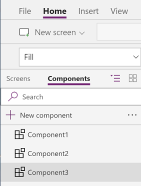
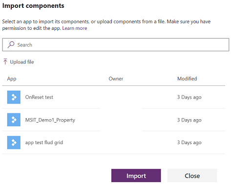
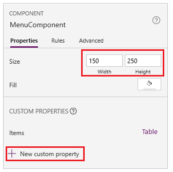
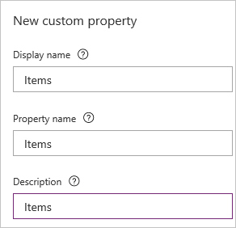
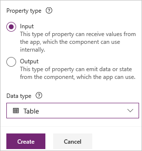
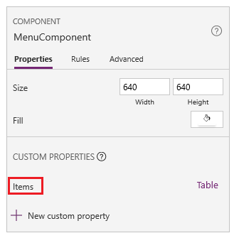
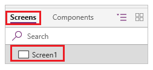
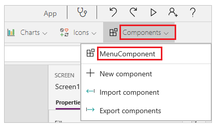

# Create a component for canvas apps

> [!IMPORTANT]
> This feature is still experimental and disabled by default. For more information, see [Experimental and preview features](working-with-experimental.md).

Components are reusable building blocks for canvas apps so that app makers can create custom controls to use in an app or across apps. Advanced features, such as custom properties, enable complex capabilities in components. This article introduces component concepts and some examples.

Components are useful in building larger apps that have similar control patterns. If you update a component definition, all instances in the app reflect your changes. You can also improve performance by using one or more components because you don't copy and paste controls, which duplicates overhead. Components also facilitates collaborative development and standardizes look-and-feel in an organization.

## Prerequisite

Open the **App Settings** screen, select **Advanced settings**, and enable the feature, as well as ensuring that **Improved app rendering** is also enabled.

## Component canvas

You can create a component from the **Components** menu on the **Insert** tab or, as the next graphic shows, in the left navigation bar. This list shows components that are defined in the app, sorted by creation time.



Regardless of which approach you take, an empty canvas appears, where you can add controls as part of the component definition. If you edit a component in the canvas, you'll update instances of the same component in other app screens and other apps.

If you select a screen, you can select a component from the list of existing components in the left navigation bar or the **Components** menu on the **Insert** tab. When you select a component, you insert an instance of that component onto the screen, just as you insert a control.

## Scope

Think of a component as an encapsulated black box with properties as the interface. You can't access controls in the component from outside of the component, and you can't refer to anything outside of the component from inside the component. If you try, an error appears. Scope restrictions keep the data contract of a component simple and cohesive, and it helps enable seamless component-definition updates, especially across apps. You can update the data contract of the component by creating one or more custom properties.

## Variables

Components don't support the **UpdateContext** function, but you can create and update variables in a component by using the **Set** function. The scope of these variables is limited to the component, but you can access them from outside the component by leveraging custom output properties.

## Import and export

To import one or more components from one app into another, select **Import components** in the drop-down list of components. A dialog box lists all apps that contain components that you have permission to edit. Select an app, and then select **Import** to import the most recent published version of all of the components in that app. After you import at least one component, you can edit your copy and delete any that you don’t need.

> [!div class="mx-imgBorder"]
> 

If you export a component, you create a local file that you can import to a different app. If the app contains a modified version of the same component, you're prompted to decide whether to replace the modified version or cancel the import. As of this writing, you can't save components to the cloud or share them within an environment.

## Custom properties

A component can receive input values and emit data if you create one or more custom properties. These scenarios are advanced and require you to understand formulas and binding contracts.

An input property is how a component receives data to be used in the component. Input properties appear in the **Properties** tab of the right-hand pane if an instance of the component is selected. You can configure input properties with expressions or formulas, just as you configure standard properties in other controls. Other controls have input properties, such as the **Default** property of a **Text input** control.

Output properties can emit data or component state. For example, the **Selected** property on a **Gallery** control is an output property. When you create an output property, you can determine what other controls can refer to the component state.

This walkthrough further explains these concepts.

## Create an example component

In this example, you'll create a menu component that resembles this graphic and in which you can change the text and use in multiple screens, apps, or both:


1. In PowerApps Studio, create a blank app.

1. In the left navigation bar, open the list of components, and then select **New component**.

    

1. While hovering over the new component, select the ellipsis (...), select **Rename**, and then type or paste **MenuComponent**.

1. In the right-hand pane, set the component's width to **150** and its height to **250**, and then select **New custom property**.

    

1. In the **Display name**, **Property name**, and **Description** boxes, type or paste **Items**.

    

    When you specify a property name, don't include spaces because you'll refer to the component by this name when you write a formula (for example, **ComponentName.PropertyName**).

    The display name appears on the **Properties** tab of the right-hand pane if you select the component. A descriptive display name helps you and other makers understand the purpose of this property. The **Description** appears in a tooltip if you hover over the display name of this property in the **Properties** tab.

1. In the **Data type** list, select **Table**, and then select **Create**.

    

    The **Items** property is set to a default value based on the data type that you specified, but you can set it to a value that suits your needs. If you specified a data type of **Table** or **Record**, you may want to change the value of the **Items** property to match the data schema that you want to input to the component. In this case, you'll change it to a list of strings.

    You can set the property's value in the formula bar if you select the name of the property on the **Properties** tab of the right-hand pane.

    

    As the next graphic shows, you can also edit the property's value on the **Advanced** tab of the right-hand pane.

1. Set the component's **Items** property to this formula:

    ```powerapps-dot
    Table({Item:"SampleText"})
    ```

    

1. In the component, insert a blank vertical **Gallery** control.

1. Make sure that the property list shows the **Items** property (as it does by default), and then set the value of that property to this expression:

    ```powerapps-dot
    MenuComponent.Items
    ```

    This way, the **Items** property of the **Gallery** control reads and depends on the **Items** input property of the component.

1. Set the **Gallery** control's **BorderThickness** property to **1**  and its **TemplateSize** property to **50**.

1. In the template of the **Gallery** control, add a **Label** control.

    

Next, you'll add the component to a screen and specify a table of strings for the component to show.

1. In the left navigation bar, select the list of screens, and then select the default screen.

    

1. On the **Insert** tab, open the **Components** menu, and then select **MenuComponent**.

    

    The new component is named **MenuComponent_1** by default.

1. Set the **Items** property of **MenuComponent_1** to this formula:

    ```powerapps-dot
    Table({Item:"Home"}, {Item:"Admin"}, {Item:"About"}, {Item:"Help"})
    ```

    This instance resembles this graphic, but you can customize the text and other properties of each instance.

    

So far, you've created a component and added it to an app. Next, you'll create an output property that reflects the item that the user selects in the menu.

1. Open the list of components, and then select **MenuComponent**.

1. In the right-hand pane, select the **Properties** tab, and then select **New custom property**.

1. In the **Display name**, **Property name**, and **Description** boxes, type or paste **Selected**.

1. Under **Property type**, select **Output**, and then select **Create**.

1. On the **Advanced** tab, set the value of the **Selected** property to this expression, adjusting the numeral in the gallery name if necessary:

    ```powerapps-dot
    Gallery1.Selected.Item
    ```

    

1. On the default screen of the app, add a label, and set its **Text** property to this expression, adjusting the numeral in the component name if necessary:

    ```powerapps-dot
    MenuComponent_1.Selected
    ```

    Note that **MenuComponent_1** is the default name of an instance, not the name of the component definition. You can rename any instance.

1. While holding down the Alt key, select each item in the menu.

    The **Label** control reflects the menu item that you selected most recently.

## Known limitations

- As of this writing, data sources aren't saved with components, so forms and data tables are disabled.
- If you create a variable in a component, that variable is scoped only to that component and doesn't appear with app variables.
- PowerApps doesn't support collections in components.
- You can't insert a component into a gallery, a form, or a data card.
- A master instance of a component is a local master and scoped to the app. If you change a master instance, only copies of the component within the app will reflect the change. Copies in other apps will remain the same unless you import the component library again. All master instances in those apps will be automatically detected and updated.
- You can't package media files when you import a component.
