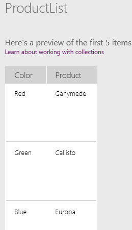
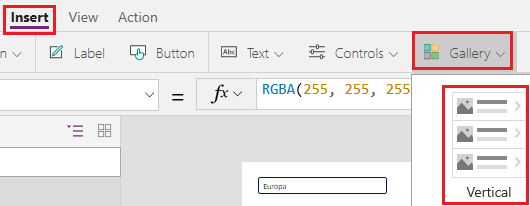
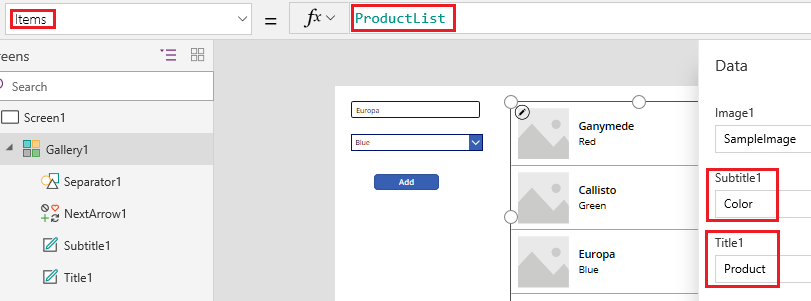
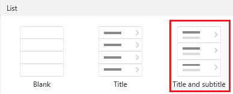
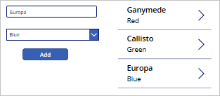

# Create and update a collection in a canvas app

Use a collection to store data that users can manage in your app. A collection is a group of items that are similar, such as products in a product list. For more information about different types of variables such as collections: [Understand canvas-app variables](working-with-variables.md).

## Prerequisites

- [Sign up](../signup-for-powerapps.md) for PowerApps, and then [sign in](https://web.powerapps.com?utm_source=padocs&utm_medium=linkinadoc&utm_campaign=referralsfromdoc) by providing the same credentials that you used to sign up.
- Create an app or open an existing app in PowerApps.
- Learn how to [configure a control](add-configure-controls.md) in PowerApps.

## Create a multicolumn collection

1. In PowerApps Studio, add a **Text input** control.

    

1. Rename the control by selecting its ellipsis in the left navigation pane, selecting **Rename**, and then typing **ProductName**.

    

1. Add a **Drop down** control.

    

1. Rename the **Drop down** control **Colors**, and make sure that the **Items** property is selected in the property list.

    

1. In the formula bar, replace **DropDownSample** with this expression:

    `["Red","Green","Blue"]`

1. Add a **Button** control, set its **Text** property to **"Add"**, and set its **OnSelect** property to this formula:

    ```powerapps-dot
    Collect(
        ProductList,
        {
            Product: ProductName.Text,
            Color: Colors.Selected.Value
        }
    )
    ```

1. Press F5, type some text into **ProductName**, select an option in **Colors**, and then select **Add**.

    

1. Repeat the previous step at least two more times, and then press Esc.

1. On the **File** menu, select **Collections** to show the collection that you created.

    

## Show a collection

1. Add a vertical **Gallery** control.

    

1. Set the gallery's **Items** property to **ProductList**.

1. In the **Data** pane, set the subtitle field to **Color**, and set the title field to **Product**.

    

1. Close the **Data** pane, and set the **Layout** field to **Title and subtitle**.

    

    Your screen resembles this example:

    

## Remove one or all items

1. Select the gallery template by clicking or tapping near the bottom of the gallery and then clicking or tapping the **Pencil** icon near the upper-left corner.

    

1. Add a **Trash** icon to the gallery template.

    

1. Set the icon's **OnSelect** property to this formula:

    `Remove(ProductList, ThisItem)`

1. Outside the gallery, add a button, set its **Text** property to **"Clear"**, and set its **OnSelect** property to this formula:

    `Clear(ProductList)`

1. While holding down the Alt key, select the **Trash** icon for an item to remove that item from the collection, or select the **Clear** button to remove all items from the collection.

## Put a SharePoint list into a collection

1. [Create a connection to a SharePoint list](connect-to-sharepoint.md).

1. Add a button, and set its **[OnSelect](controls/properties-core.md)** property to this function, replacing *ListName* with the name of your SharePoint list:<br>

    `Collect(MySPCollection, ListName)`

    This function creates a collection that's named **MySPCollection** and that contains the same data as your SharePoint list.

1. While holding down the Alt key, select the button.

1. (optional) To preview the collection that you created, select **Collections** on the **File**  menu.

For information about how to show data from a SharePoint list (such as dates, choices, and people) in a gallery: [Show data in a gallery](connections/connection-sharepoint-online.md#show-data-in-a-gallery). For information about how to show data in a form (with drop-down lists, date pickers, and people pickers): [Edit form and 
Display form controls](controls/control-form-detail.md).

## Next steps

- Review the [reference topic](functions/function-clear-collect-clearcollect.md) for the **Collect** function.
- Learn how to shape data in a collection by using the [AddColumns, DropColumns, RenameColumns, and ShowColumns](functions/function-table-shaping.md) functions.
