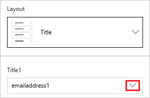

# Tutorial: Customize a gallery in PowerApps
In this tutorial, you'll customize the gallery and make other changes to an app that was generated automatically in Microsoft PowerApps. Users can manage data in the app even if you don't make these changes, but the app will be easier to use if you customize it for your organization's needs:

> [!div class="checklist"]
> * Change the layout of the gallery
> * Change the type of data that appears in the gallery
> * Change the columns by which users can sort and search the data
> * Change the screen title
> * Show a scroll bar

This tutorial starts with an app that was generated from a specific data source. However, the same concepts apply to any app that you generate in PowerApps from a SharePoint list, an Excel table, or another data source. 

If you don't have a license for PowerApps, you can [sign up for free](../signup-for-powerapps.md).

## Prerequisites
[Generate an app](data-platform-create-app.md) from the **Accounts** entity of Common Data Service (CDS) for Apps.

## Open the generated app
1. Sign in to [PowerApps](https://web.powerapps.com), and then select **Apps** near the left edge.

	

1. Find the app that you generated, select the ellipsis icon (**...**) for it, and then select **Edit**.

## Change the layout
1. In the left navigation pane, select the gallery by clicking or tapping **BrowseGallery1**.

	When the gallery is selected, a selection box with handles surrounds it.

    [](media/customize-layout-sharepoint/select-gallery-1.png#lightbox)

1. Near the right edge, select **Accounts** to open the **Data** pane.

	

1. In the **Data** pane, open the list of options under **Layout**.

	

1. In the list of options, select the option that shows only a title.

	

1. In the **Data** pane, open the list of options for the title.

	

1. In the list of options, select **Account name (name)**, and then close the **Data** pane.

    The gallery shows the name of each account.

	

## Change the sort and search columns
1. Select the gallery as the previous section describes.

	

2. Near the upper-left corner, confirm that the property list shows **Items**.

	

	The value of this property appears in the formula bar. You set this property to specify not only the data source for the gallery but also the columns by which users can sort and search the data.

1. Copy this formula, and then paste it in the formula bar.

    ```SortByColumns(Search(Accounts, TextSearchBox1.Text, "name"), "name", If(SortDescending1, Descending, Ascending))```

	By using this formula, you ensure that:

    - If a user types one or more characters in the search bar, the gallery shows only those account names that contain the text that the user typed.
    - If a user selects the sort icon, the gallery is sorted alphabetically by account name in either ascending or descending order, depending on how many times the user selects the icon.

    For more information about these and other functions, see the [formula reference](formula-reference.md).

## Test sorting and searching
1. Open Preview mode by pressing F5 (or by selecting the play button near the upper-right corner).

	

1. Near the upper-right corner of the browse screen, select the sort icon one or more times to change the alphabetical sort order between ascending and descending.

	

1. In the search box, type **k** to show only those account names that contain the letter that you typed.

	

1. Remove all text from the search bar, and then close Preview mode by pressing Esc (or by selecting the close icon near the upper-right corner).

## Change the screen title
1. Select the title of the screen by clicking or tapping it.

	

1. Ensure that the property list shows **Text** and then, in the formula bar, replace **Accounts** with **Browse** (retaining the double quotation marks).

	

	The screen reflects your change.

	

## Show a scroll bar
If your users might have neither touch screens nor mouse wheels, configure the gallery to show a scroll bar when the user hovers over it with the mouse. That way, users can show all accounts even if the screen can't show them all at once.

1. Select the gallery as the first procedure describes.

	

1. On the **Gallery** tab, select **Show scrollbar**, and confirm that the value of that property has changed to **true**. 

	

## Next steps
In this tutorial, you've customized the gallery and made other changes to the default screen for browsing records in a generated app. You can also customize the default screens for displaying details and creating or updating accounts. As the browse screen contains a gallery, the other two screens in the app contain forms. You can change, for example, which types of data the forms show and in which order.

> [!div class="nextstepaction"]
> [Customize forms](customize-forms-sharepoint.md)
