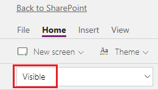
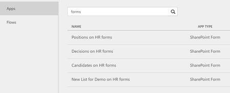

# Customize a SharePoint list form by using PowerApps

You can easily customize the form for a SharePoint list by opening PowerApps in a browser. You don't need to write traditional code, such as C#, or download another app, such as InfoPath. When you publish your changes, the form is embedded within the SharePoint list for use by all of its users. In PowerApps, you can also review analytics reports, easily create conditional formatting, and connect to other data sources.

To follow the steps in this topic, you'll create a simple list so that you can see how customization works, and then you can apply the same concepts to your own list.

> [!NOTE]
> If the **Customize forms** option isn't available or doesn't work correctly for your list, it might contain data types that [PowerApps doesn't support](connections/connection-sharepoint-online.md#known-issues). Also, you can't move your form to a different list or [environment](working-with-environments.md).

## Prerequisites

On a SharePoint site, create a list, and then add these columns:

- **Product name** (single line of text)
- **Details** (yes/no)
- **Price** (currency)
- **Availability** (date without time)
- **Color** (choice)

## Open the form in PowerApps

1. Open the list that you created, and then select **New** in the command bar.

    The form opens and shows the fields that you added, plus **Title** and **Attachments**.

1. Near the top of the form, select **Customize**.

    PowerApps Studio opens in the same browser tab.

1. If the **Welcome to PowerApps Studio** dialog box opens, select **Skip**.

## Hide extra fields

In the center of your screen, PowerApps shows your form, but it contains fields that you don't need.

- In the **Data** pane, clear the check boxes for the **Title** and **Attachments** fields.

    Those fields disappear from the form, leaving only the fields that you added.

    

## Set conditional formatting

You can configure the **Price**, **Availability**, and **Colors** fields to appear only if **Details** is set to yes.

1. Select the **Price** card by clicking or tapping it.

    

1. In the property list, select **Visible**.

    

1. In the formula bar, type or paste this formula:

    **If(DataCardValue3.Value = true, true)**

    

1. Repeat last three steps with the **Availability** and **Color** cards.

1. While holding down the Alt key, select the **Details** toggle (by clicking or tapping it) multiple times.

    The three fields that you configured appear and disappear from the form.

1. (optional) Customize your form in a variety of other ways, including these:

    - Change its size, orientation, or both (for example, to [make the form wider](set-aspect-ratio-portrait-landscape.md)).
    - Add a control so that users can [upload attachments](controls/properties-text.md).
    - Create a [lookup field](sharepoint-lookup-fields.md).

## Save, publish, and show the form

1. Open the **File** menu, select **Save**, and then select **Publish to SharePoint** twice.

1. In the upper-left corner, select the back arrow, and then select **Back to SharePoint**.

1. In the command bar, select **New** to open your customized form.

1. Select the **Details** toggle multiple times to hide and show the last three fields.

To [customize your form further](sharepoint-form-integration.md), open it, select **Customize** near the top of the form, and then make, save, and publish your changes.

If you create one or more items with this form, the **Title** field will be empty. You can hide this field by modifying the default view.

## Use the default form

1. From your list in SharePoint, open the settings page (by selecting the gear icon near the upper-right corner), and then select **List settings**.

2. Under **General settings**, select **Form settings**.

3. On the **Form Settings** page, select one of these options, and then select **OK**.

    - **Use the default SharePoint form** - When a user opens your list and selects **New** in the command bar, the default form for the list will appear.

    - **Use a custom form created in PowerApps** - When a user opens your list and selects **New** in the command bar, your custom form will appear. (As an alternative, you can publish the form again in PowerApps.)

    You can toggle back and forth between options, as needed.

    

## Delete the custom form

1. From your list in SharePoint, open the settings page (by selecting the gear icon near the upper-right corner), and then select **List settings**.

1. Under **General settings**, select **Form settings**.

1. On the **Form Settings** page, select **Use the default SharePoint form**, and then select **Delete custom form**.

    

## Q & A

### Forms vs. apps

**Q:** How does a customized form differ from a standalone app that I create from SharePoint or PowerApps?

**A:** If you customize the form for a SharePoint list, the form doesn't appear as an app in PowerApps Studio or PowerApps Mobile. You can open the form only from the list for which you created it.

**Q:** When should I customize a form to manage data in a SharePoint list, and when should I create a standalone app?

**A:** Customize a form if you want your users to manage data without leaving SharePoint (for example, in a desktop browser). Create an app if you want your users to manage data outside of SharePoint (for example, on a mobile device).

**Q:** Can I customize a form and create an app for the same list?

**A:** Yes.

**Q:** Can I customize a list and create an app using the same features?

**A:** Yes.

**Q:** Can I customize a form in an environment other than the default environment in my organization?

**A:** No.

### Manage your custom form

**Q:** How can I easily share my form with others?

**A:** Open the form, select **Copy link**, and then send the link to anyone you want to use the form.

**Q:** Can I update my form without making my changes visible to others?

**A:** Yes. You can change your form and save as many times as you want, but your changes won't be visible to anyone else unless you select **Publish to SharePoint** twice.

**Q:** If I customize a list form and make a mistake, can I revert to a previous version?

**A:** Yes.

1. Open your list, select **PowerApps** on the command bar, and then select **Customize forms**.

1. In PowerApps Studio, select **File**, and then select **See all versions**. The **Versions** page opens in a new browser tab.

    > [!NOTE]
    > If you don't see the **See all versions** button, select **Save**. The button should appear.

1. Without closing the **Versions** page or the browser tab, go back to the **Save** page in the other browser tab, click or tap the arrow at the top of the left navigation pane, and then click or tap **Back to SharePoint** to unlock your form and close PowerApps Studio.

1. Go back to the **Versions** page in the other browser tab, locate the version that you want to restore, and then select **Restore**.

    > [!NOTE]
    > If you get an error message saying the restore failed because the form is locked by another user, wait until the user unlocks the form, and then try again.

**Q:** Can I move my form from one list to another?

**A:** No.

### Administer your custom form

**Q:** How do I share my form?

**A:** You don't need to share the form - the form inherits permissions from the SharePoint list. When you're done customizing it, just [publish it back to SharePoint](customize-list-form.md#save-and-publish-the-list-form-back-to-sharepoint) so that others can use it.

**Q:** Who can customize forms?

**A:** Anyone with SharePoint permissions to manage, design, or edit the associated list.

**Q:** Do I need a PowerApps license to create or use custom list forms?

**A:** You need an [Office 365 plan that includes PowerApps](../../administrator/pricing-billing-skus.md#licenses).

**Q:** What happens when guest users access a list that has a custom form?

**A:** Guest users get an error message if they try to access a list form that's been customized using PowerApps.

**Q:** As an administrator, how do I get a list of all customized forms in my organization?

**A:** If you're a tenant administrator for PowerApps or you have environment-administrator permissions on the default PowerApps environment of your organization, do the following:

1. In the [PowerApps admin center](https://admin.powerapps.com), select the default environment for your organization from the list of environments.

1. At the top of the default environment page, select **Resources**.

1. From the list of apps, look for apps with a **SharePoint Form** app type - these are the customized forms.

    
