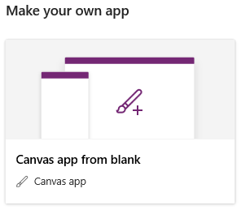
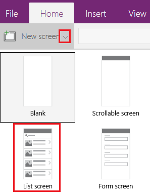
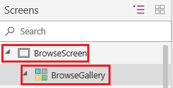
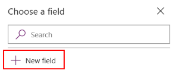

# Create a canvas app from scratch using Common Data Service

Build a canvas app to manage data that's stored in Common Data Service, using standard entities (which are built in), custom entities (which your organization creates), or both.

When you build an app from Common Data Service, you don't need to create a connection from Power Apps, as you do with data sources such as SharePoint, Dynamics 365, or Salesforce. You need only to specify the entities that you want to show or manage in the app.

## Prerequisites

- Before you create an app from scratch, familiarize yourself with Power Apps basics by [generating an app](data-platform-create-app.md) and then customizing that app's [gallery](customize-layout-sharepoint.md), [forms](customize-forms-sharepoint.md), and [cards](customize-card.md).
- [Switch to an environment](working-with-environments.md) in which a database has been created with sample data. If you have an appropriate license, you can [create an environment](../../administrator/create-environment.md) to meet this need.
- To create an app, you must be assigned to the [Environment Maker](https://docs.microsoft.com/power-platform/admin/database-security#predefined-security-roles) security role.

## Open a blank app

1. Sign in to [PowerApps](https://make.powerapps.com?utm_source=padocs&utm_medium=linkinadoc&utm_campaign=referralsfromdoc).

1. Under **Make your own app**, select **Canvas app from blank**.

    

1. Specify a name for your app, select **Phone**, and then select **Create**.

    You can build an app from scratch for tablets, but this topic shows building an app for phones.

## Specify an entity

1. In the middle of the screen, select **connect to data**.

1. In the **Data** pane, select **Common Data Service**, select the **Accounts** check box, and then select **Connect**.

1. Close the **Data** pane by selecting the close icon in the upper-right corner.

## Add a list screen

1. On the **Home** tab, select the down arrow for **New screen**, and then select **List**.

    

1. In the left navigation bar, select **BrowseGallery1**, and then set the value of the **Items** property to this formula:

    `SortByColumns(Search(Accounts, TextSearchBox1.Text, "name"), "name", If(SortDescending1, SortOrder.Descending, SortOrder.Ascending))`

    This formula specifies that:

   - The gallery should show data from the **Accounts** entity.
   - The data should be sorted in ascending order until a user selects the sort button to toggle the sort order.
   - If a user types or pastes one or more characters into the search bar (**TextSearchBox1**), the list will show only those accounts for which the **name** field contains the characters that the user specified.

     You can use [these and many other functions](formula-reference.md) to specify how your app appears and behaves.

     

1. Set the gallery's layout to show only the name of each account, and configure the title bar to show the word **Browse**, as [Customize a gallery](customize-layout-sharepoint.md) describes.

    

1. In the left navigation bar, hover over **Screen1**, select the ellipsis icon (...), and then select **Delete**.

1. In the left navigation bar, hover over **Screen2**, select the ellipsis icon (...), and then select **Rename**.

1. Type or paste **BrowseScreen**, and then rename the gallery in that screen as **BrowseGallery**.

    

## Add a form screen

1. Repeat the first step of the previous procedure, except add a **Form** screen instead of a **List** screen.

1. Set the form's **DataSource** property to **Accounts** and its **Item** property to **BrowseGallery.Selected**, as the **Advanced** tab of the right-hand pane shows.

    

1. On the **Properties** tab of the right-hand pane, select **Edit Fields** to open the **Fields** pane.

1. Select **Add field**, and then select the check boxes for these fields:

    - **Account Name**
    - **Address 1: Street 1**
    - **Address 1: City**
    - **Address 1: ZIP/Postal code**
    - **Number of Employees**
    - **Annual Revenue**

    > [!NOTE]
    > Outside of this scenario, you can create a custom field by selecting **New field**, providing the required information, and then selecting **Done**. More information: [Create a field](../common-data-service/create-edit-field-portal.md#create-a-field).  

1. Select **Add**.

1. Set the title bar's **Text** property to show **Create/Edit**.

    The screen reflects your changes.

    

1. Rename this screen **FormScreen**.

## Configure icons

1. On the **BrowseScreen**, set the **OnSelect** property of the circular icon near the top of the screen to this formula:

    `Refresh(Accounts)`

    

1. Set the **OnSelect** property of the plus icon to this formula:

    `NewForm(EditForm1); Navigate(FormScreen, ScreenTransition.None)`

    

1. Set the **OnSelect** property of the first arrow pointing to the right to this formula:

    `EditForm(EditForm1); Navigate(FormScreen, ScreenTransition.None)`

    

1. On the **FormScreen**, set the **OnSelect** property of the cancel icon to this formula:

    `ResetForm(EditForm1);Navigate(BrowseScreen, ScreenTransition.None)`

    

1. Set the **OnSelect** property of the checkmark icon to this formula:

    `SubmitForm(EditForm1); Navigate(BrowseScreen, ScreenTransition.None)`

    

1. On the **Insert** tab, select **Icons**, and then select the **Trash** icon.

1. Set the **Trash** icon's **Color** property to **White** and its **OnSelect** property to this formula:

    `Remove(Accounts, BrowseGallery.Selected); Navigate(BrowseScreen, ScreenTransition.None)`

    

## Test the app

1. In the left navigation bar, select **BrowseScreen**, and then open Preview by pressing F5 (or by selecting the play icon near the upper-right corner).

    

1. Toggle the list between ascending and descending sort orders, and filter the list by one or more characters in the account name.

1. Add an account, edit the account that you added, start to update the account but cancel your changes, and then delete the account.

## Next steps

- [Link this app to a solution](add-app-solution.md) so that you can, for example, deploy it to a different environment or publish it on AppSource.
- [Open one or more sample apps](open-and-run-a-sample-app.md), and explore different types of apps that you can create.
