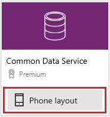
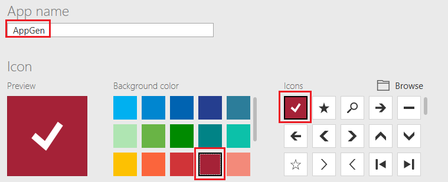

# Quickstart: Generate an app from Common Data Service for Apps in PowerApps

In this quickstart, you'll use Microsoft PowerApps to automatically generate an app based on a list of sample accounts in [Common Data Service (CDS) for Apps](../common-data-service/data-platform-intro.md). In this app, you can browse all accounts, show details of a single account, and create, update, or delete an account.

To follow this quickstart, you must [switch to an environment](working-with-environments.md) in which a database in CDS for Apps has been created, contains data, and allows updates. If no such environment exists and you have administrative privileges, you can [create an environment](../../administrator/environments-administration.md#create-an-environment) that meets this requirement.

If you don't have a license for PowerApps, you can [sign up for free](../signup-for-powerapps.md).

## Generate an app
1. Sign in to [PowerApps](https://web.powerapps.com) and, if necessary, switch environments as specified earlier in this topic.

	

1. Under **Make apps like these**, hover over **Start from data**, and then select **Make this app**.

	

1. On the **Common Data Service** tile, select **Phone layout**.

	

1. Under **Choose a table**, select **Accounts**, and then select **Connect**.

	

1. If the **Welcome to PowerApps Studio** dialog box appears, select **Skip**.

Your app opens to the browse screen, which shows a list of accounts. Near the top of the screen, a title bar shows icons for refreshing the list, sorting the list, and creating an account. Under the title bar, a search box provides the option to filter the list based on text that you type or paste. 

By default, the list shows an email address, a city, and an ID for that account. But you can customize the list, which is called a gallery, to show other types of data.

## Save the app
You'll probably want to make more changes before you use this app or share it with others. As a best practice, save your work so far before you proceed.

1. Near the upper-left corner, select the **File** tab.

1. In the **App settings** page, set the app name to **AppGen**, change the background color to deep red, and change the icon to a checkmark.

	

1. Near the left edge, select **Save** and then, in the lower-left corner, select **Save**.

## Next steps
In this quickstart, you created an app to manage sample data about accounts in CDS for Apps. As a next step, customize the gallery and other elements of the default browse screen to better suit your needs.

> [!div class="nextstepaction"]
> [Customize a gallery](customize-layout-sharepoint.md).
