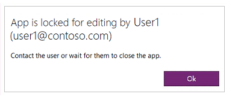

# Edit an app in PowerApps
Edit any app that you built, that you own, or for which you have **Can edit** permissions. You can edit an app in PowerApps Studio. If you try to edit an app that's open for editing elsewhere, a message tells you whether you already have it open or another user does.

## Verify your permissions
1. Sign in to [PowerApps](https://web.powerapps.com), and then click or tap **Apps** in the **File** menu (on the left edge).
   
    

2. In the app-category selector, click or tap **Apps I can edit**.

    You can edit any app in the list that appears. You can also search for an app by typing one or more characters in the search box near the upper-right corner.

    > [!NOTE]
    > If you still don't see the app that you want to edit, verify that you've selected the correct environment near the upper-right corner.
   
    

1. Click or tap the ellipsis icon (...) for the app you want to edit, and then click or tap **Edit**.

## Collaborate on an app
Anybody who has **Can edit** permission for an app can edit it, but only one person can edit an app at a time. If you try to edit an app that someone else is already editing, this message appears. You can't proceed until the other person closes the app (or that person's session times out).

In addition, this message appears if you open an app for editing and then try to open it on another device or in another browser window. You can override the previous session, but you might lose any changes that you haven't saved.

## Next Steps
Learn more about how to add a [screen](add-screen-context-variables.md), a [control](add-configure-controls.md) or a [data connection](add-data-connection.md).

