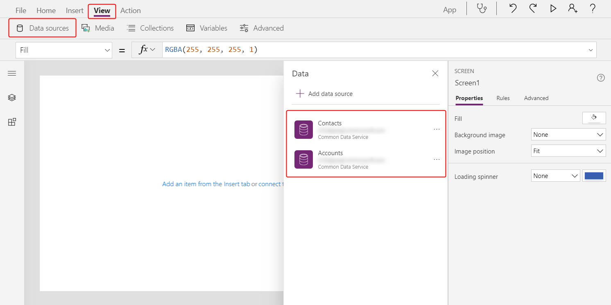
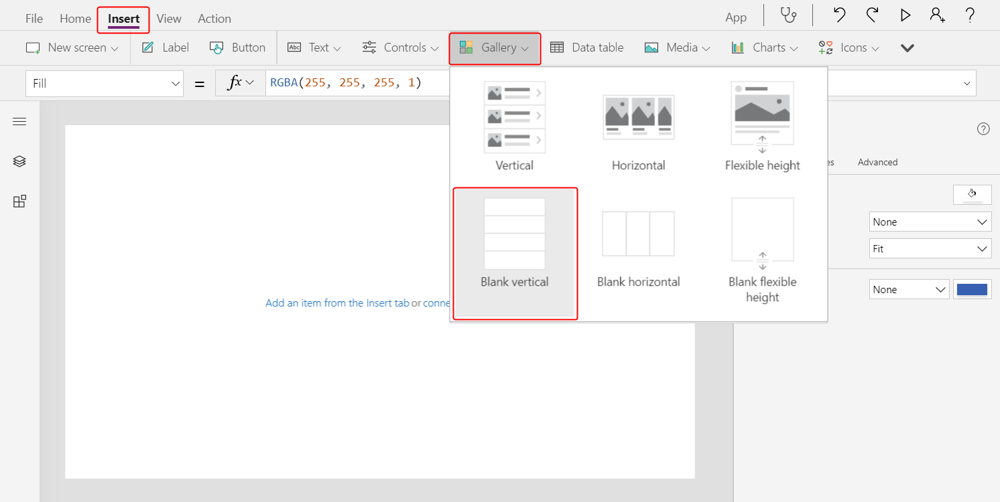
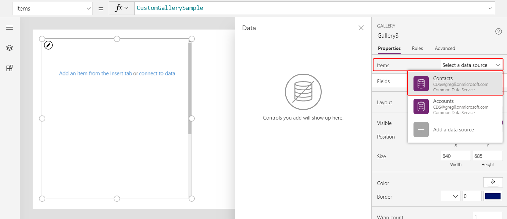
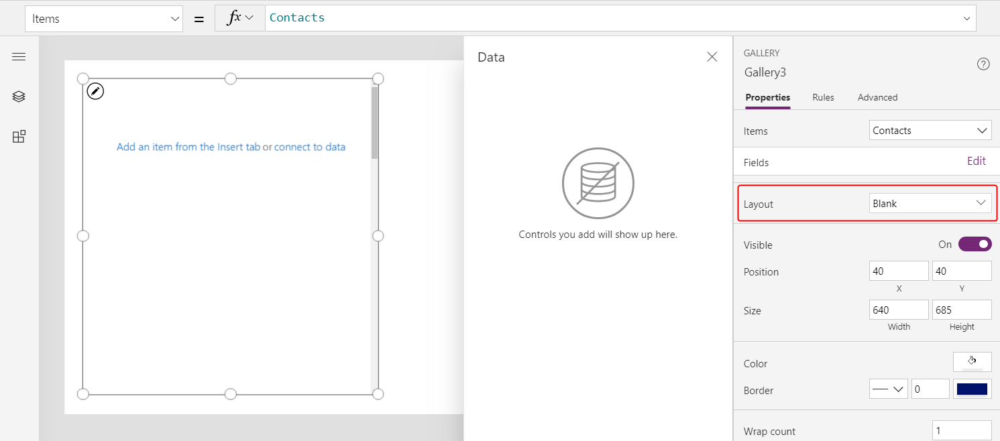
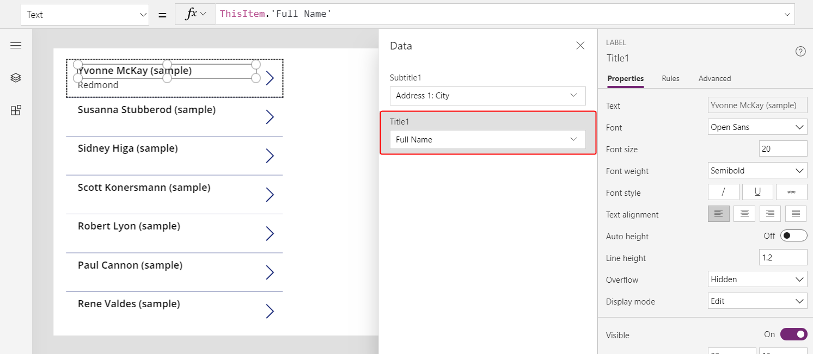
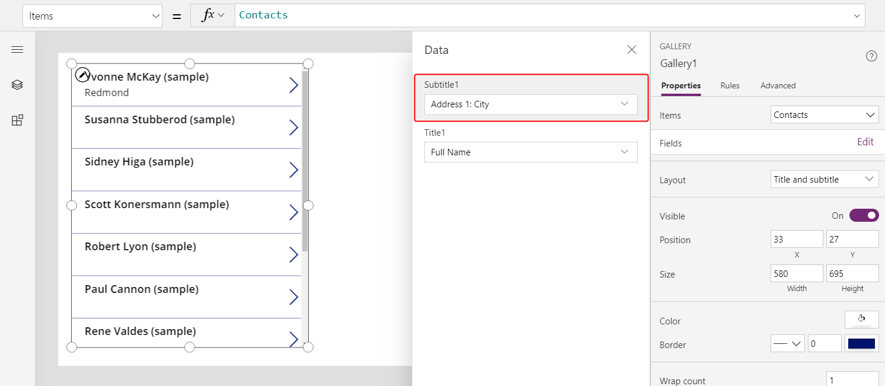
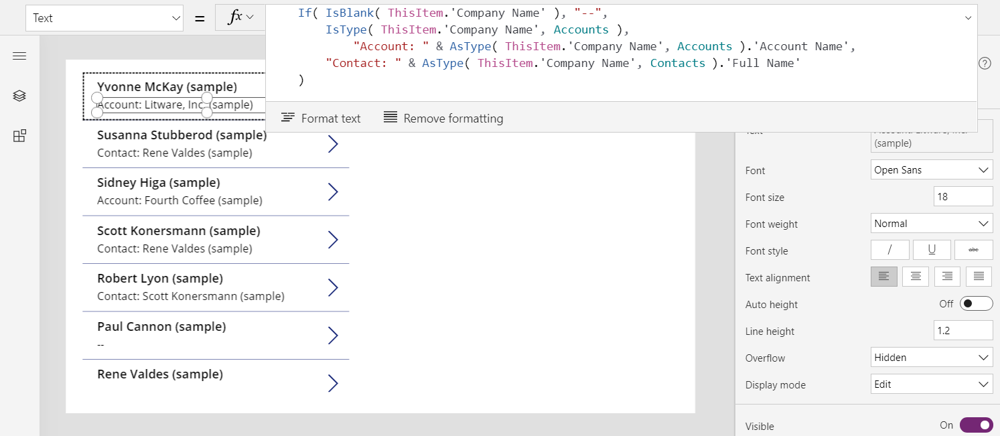

# AsType and IsType functions in PowerApps
Tests the type and casts to a specific type for record references.  

## Description

Read [understand record references and polymorphic lookups](../working-with-references.md) for a broader introduction and more details.

Normally a lookup field can only refer to records of one entity.  Because the entity type is well established, access to the fields of the lookup is possible through a simple dot notation.  For example, **First( Accounts ).'Primary Contact'.'Full Name'** walks from the **Accounts** entity to the **'Primary Contact'** record int the **Contacts** entity and extracts the **'Full Name'** field.    

Common Data Service also supports polymorphic lookup fields that can refer to records from a set of entities.  Examples include:

| Lookup field | Can refer to |
|--------------|--------------| 
| **Owner** | **Users** or **Teams** |
| **Customer** | **Accounts** or **Contacts** |
| **Regarding** | **Accounts**, **Contacts**, etc. |

Record references are used in canvas app formulas to work with polymorphic lookups.  Because a record reference can refer to different entities, we don't know when writing a formula which fields will be available.  The dot notation is not available.  Our formulas need to be adaptive to the records we encounter in a running app.  

The **IsType** function tests if a record reference refers to a specific entity type, returning a Boolean *true* or *false*.

The **AsType** function casts a record reference to a specific entity type.  The result can be used as if it were a record of the entity and again dot notation can be used to access all the fields of the record.  An error occurs if the reference is not of the specific type.

Use them together to first test the entity type of a record and then cast it to make the fields available:

```powerapps-dot
If( IsType( First( Accounts ).Owner, Users ), 
    AsType( First( Accounts ).Owner, Users ).'Full Name',
    AsType( First( Acoounts ).Owner, Teams ).'Team Name' 
)
```

These functions are not required if you are not accessing the fields of a record reference.  For example, record references can be used in the [**Filter** function](function-filter-lookup.md) function directly:

```powerapps-dot
Filter( Accounts, Owner = First( Users ) )
```

They can also be used directly with the [**Patch** function](function-patch.md):

```powerapps-dot
Patch( Accounts, First( Accounts ), { Owner: First( Teams ) } )
```  

If used in a record context, such as within a [**Gallery**](../controls/control-gallery.md) or [**Edit form**](../controls/control-form-detail.md) control, it is sometimes required to use the [global disambiguation operator](operators.md#disambiguation-operator) to reference the entity type.  For example, this formula would be effective for a gallery that is displaying a list of contacts where **'Company Name'** is a **Customer** lookup.

```powerapps-dot
If( IsType( ThisItem.'Company Name', [@Accounts] ), 
    AsType( ThisItem.'Company Name', [@Accounts] ).'Account Name',
    AsType( ThisItem.'Company Name', [@Contacts] ).'Full Name' 
)
```

For both functions, the type is specified through the name of the data source connected to the entity.  This requires creating a data source for any types that you wish to test or cast.  For example, in order to use **IsType** and **AsType** with an **Owner** lookup and records from the **Users** entity, you must add the **Users** entity as a data source.  You only need to add the data sources that you actually use in your app, you do not need to add all the entities that a lookup could reference.

If the record reference is *blank*, **IsType** will return *false* and **AsType** will return *blank*.  The fields of a *blank* record will all be *blank*.

## Syntax

**AsType**( *RecordReference*, *EntityType* )

* *RecordReference* - Required. A record reference, often a lookup field that can refer to records in more than one entity.
* *EntityType* - Required. The specific entity to test for. 

**IsType**( *RecordReference*, *EntityType* )

* *RecordReference* - Required. A record reference, often a lookup field that can refer to records in more than one entity.
* *EntityType* - Required. The specific entity to cast to.

## Example

There are extensive examples in [understand record references and polymorphic lookups](../working-with-references.md).

1. Create a blank tablet canvas app.

1. Using the **View** tab, and then **Data sources**, add the **Contacts** and **Accounts** entities as data sources.

    

1. Insert a **Gallery** control with a **Blank vertical** orientation:
 
    

3. Set the **Items** in the Property pane to **Contacts**.

    

4. Select the **Title and subtitle** layout in the Property pane.

    

1. Change the **Title1** property to **Full Name**:

    

1. Select the **Subititle1** label control:

    

3. Set the **Text** property to the formula:

    ```powerapps-dot
    If( IsBlank( ThisItem.'Company Name' ), "--",
        IsType( ThisItem.'Company Name', [@Accounts] ), 
            "Account: " & AsType( ThisItem.'Company Name', [@Accounts] ).'Account Name',
        "Contact: " & AsType( ThisItem.'Company Name', [@Contacts] ).'Full Name' 
    )
    ```

    

    The subtitle in the gallery is now showing:
    - "--" if the **'Company Name'** is *blank*.
    - "Account: " and then the **Account Name** field from the **Accounts** entity if the **'Company Name'** refers to an account.
    - "Contact: " and then the **Full Name** field from the **Contacts** entity if the **'Company Name'** refers to a contact.

    Your results may appear different than the above, the sample data used here has been modified to show additional types of results.
    