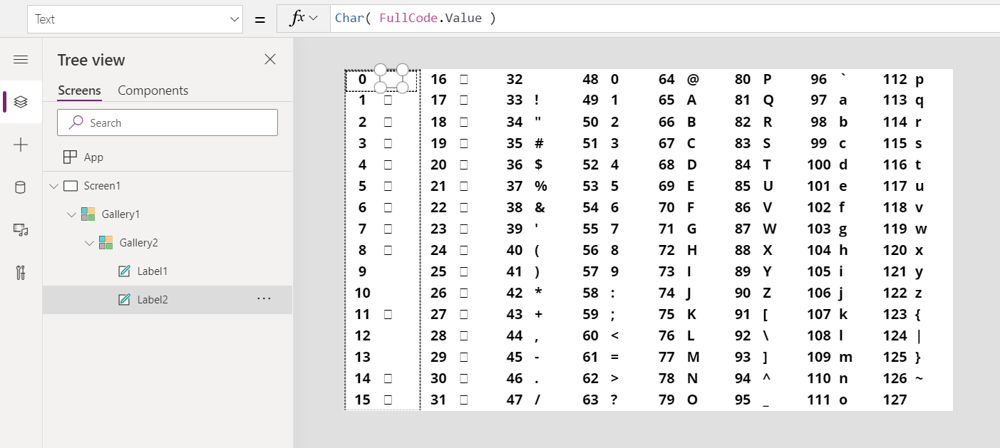
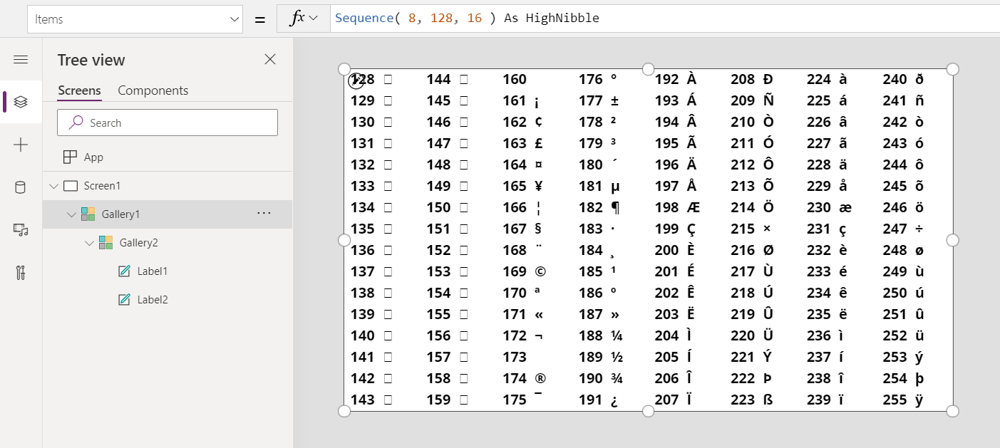
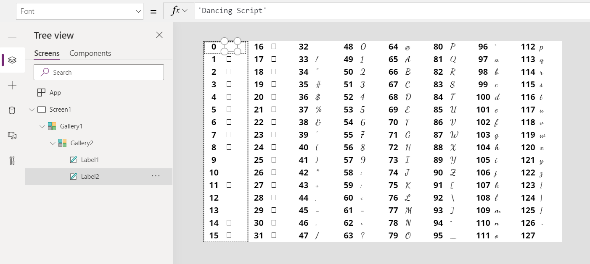

# Char function in PowerApps
Translates a character code into a string.

## Description
The **Char** function translates a number into a string with the corresponding ASCII character.

## Syntax
**Char**( *CharacterCode* )

* *CharacterCode* - Required. ASCII character code to translate.

## Examples

| Formula | Description | Result |
| --- | --- | --- |
| **Char( 65 )** |Returns the character that corresponds to ASCII code 65. |"A" |
| **Char( 105 )** |Returns the character that corresponds to ASCII code 105. |"i" |
| **Char( 35 )** |Returns the character that corresponds to ASCII code 35. |"#" |

### Display a character map

1. Create a new tablet app.

1. Add a **Gallery** control with a Blank Horizontal layout.  
    - Re-size this gallery so that 8 columns fit across the screen.
    - Set the **TemplatePadding** property to 0.
    - Set the **Items** property to the formula:
    `[0,1,2,3,4,5,6,7]`

1. Add a second **Gallery** control within the first gallery, with a Blank Vertical layout. 
    - Resize the gallery to fit within the first gallery with 16 rows.

1. Set the **Items** property of the second gallery to the formula:
    `ForAll( [1,2,3,4,5,6,7,8,9,10,11,12,13,14,15,16], Value + ThisItem.Value * 16 )`

1. Add a label control within the second gallery with the formula:
    `ThisItem.Value`

1. Add a second label control within the second gallery with the formula:
    `Char(ThisItem.Value)`

1. You will now see a chart of the first 128 ASCII characters.  Characters that show as a small square are not printable.

    

1. To show the extended ASCII characters, modify the **Items** property for the second gallery to add 128 to each of the character values:
    `ForAll( [1,2,3,4,5,6,7,8,9,10,11,12,13,14,15,16], Value + ThisItem.Value * 16 + 128)`

    

1. Change the **Font** property of the second label to see the characters in a different font. 

    
