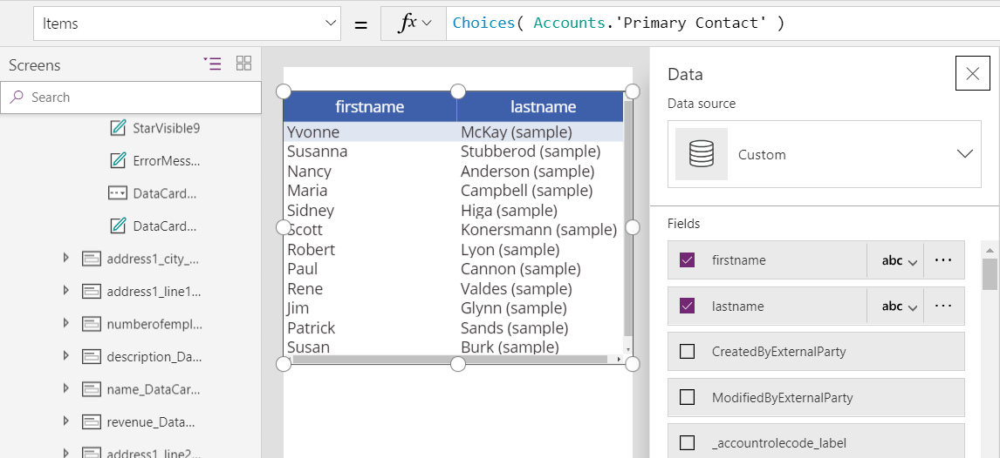

# Choices function in PowerApps
Returns a table of the possible choices for a lookup column.

## Description
The **Choices** function returns a table of the possible choices for a lookup column.  

Use the **Choices** function to provide a list of choices for your user to select from.  It is commonly used with the **Combo box** control in edit forms.

For a lookup, the table returned by **Choices** is the same as the foreign table associated with the lookup.  Using **Choices** eliminates the need to add the foreign table as an additional data source.  All columns of the foreign table are returned by **Choices**.

Since **Choices** returns a table, you can use **Filter**, **Sort**, **AddColumns**, and all the other table manipulation functions to filter, sort, and shape the table before using feeding it to a **Combo box** or other control. 

Unlike the **ShowColumns**, **Search**, and other table functions that require column names to be enclosed in double quotes as a string, this is not the case for **Choices**.  Provide the formula as if you were referencing the column directly.

Column references must be directly from the data source.  If the data source is **Accounts** and the lookup is **SLA** then the column reference would be **Accounts.SLA**. The reference cannot pass through a function of control.  For example, if **Accounts** is fed to a **Gallery** control, then the SLA for the selected Account can be referenced by **Gallery.Selected.SLA**.  However, as this reference has passed through a control, it cannot be passed to the **Columns** function, **Accounts.SLA** must still be used.  

## Syntax
**Choices**( *column* )

* *column* – Required.  A lookup column of a data source.  Do not enclose the column name in double quotes.  The reference must be directly to the column of the data source and not pass through a function or control.

## Examples

#### Choices for a lookup

1. If you have not already, create a Common Data Service database and install the sample data.  The **Accounts** entity will be created among others:

	

	The **Accounts** entity has a **Primary Contact** column which is a lookup to the **Contacts** entity.  

	

	For each each Account, there is a Contact designated as the Primary Contact.  It is also possible that the Primary Contact is *blank*.
 
2. Create a new tablet app.

4. From the View menu, open the data sources pane and add the **Accounts** entity.

	Note that we do not need to add the **Contacts** entity as a data source.

5. Insert a **Gallery** control, and rename it **Gallery1** if it has a different name.

6. Set the **Items** property of the gallery to the formula **Accounts**.

7. Add an **Edit form** control and set its data source to **Accounts**.

8. If it has not already been added, add the **Primary Contact** field to the form.

9. Select the **Combo box** control within the card for **Primary Contact**.  View the **Items** property which will contain the formula:

	**Choices( Accounts.'Primary Contact' )**

	

	Note that if the "Use column display names" is turned off in the app's advanced settings that this formula will appear as **Choices( Acccounts.primarycontactid )**.

10. To see what **Choices** is returning, inert a new screen.

11. Add a **Data table** control and set its **Items** property to the formula:

	**Choices( Accounts.'Primary Contact' )**

11. In the Data pane, select "First Name", "Last Name", or any other fields that you would like to view.

	 

  

