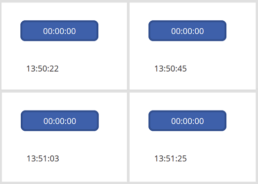

# Now, Today, and IsToday functions in PowerApps
Returns the current date and time, and tests whether a date/time value is today.

## Description
The **Now** function returns the current date and time as a date/time value.

The **Today** function returns the current date as a date/time value. The time portion is midnight. **Today** has the same value throughout a day, from midnight today to midnight tomorrow.

The **IsToday** function tests whether a date/time value is between midnight today and midnight tomorrow. This function returns a Boolean **true** or **false** value.

All these functions work with the local time of the current user.

See [working with dates and times](../show-text-dates-times.md) for more information.

## Volatile Functions
**Now** and **Today** are volatile functions.  Each time the function is evaluated it returns a different value.  

When used in a data flow formula, a volatile function will only return a different value if the formula in which it appears is reevaluated.  If nothing else changes in the formula then it will have the same value throughout the execution of your app.

For example, a label control with **Label1.Text = Now()** will not change while your app is active.  Only closing and reopening the app will result in a new value.

The function will be reevaluated if it is part of a formula in which something else has changed.  For example, if we change our example to involve a slider control with **Label1.Text = DateAdd( Now(), Slider1.Value, Minutes )** then the current time is retrieved each time the Slider control's value changes and the label's text property is reevaluated.

When used in a [behavior formula](../working-with-formulas-in-depth.md), volatile functions will be evaluated each time the behavior formula is evaluated.  See below for an example.

## Syntax
**Now**()

**Today**()

**IsToday**( *DateTime* )

* *DateTime* - Required.  The date/time value to test.

## Examples
For the examples in this section, the current time is **3:59 AM** on **February 12, 2015**, and the language is **en-us**.

| Formula | Description | Result |
| --- | --- | --- |
| **Text( Now(), "mm/dd/yyyy hh:mm:ss" )** |Retrieves the current date and time, and displays it as a string. |"02/12/2015 03:59:00" |
| **Text( Today(), "mm/dd/yyyy hh:mm:ss" )** |Retrieves the current date only, leaving the time portion as midnight, and displays it as a string. |"02/12/2015 00:00:00" |
| **IsToday( Now() )** |Tests whether the current date and time is between midnight today and midnight tomorrow. |**true** |
| **IsToday( Today() )** |Tests whether the current date is between midnight today and midnight tomorrow. |**true** |
| **Text( DateAdd( Now(), 12 ), "mm/dd/yyyy hh:mm:ss" )** |Retrieves the current date and time, adds 12 days to the result, and displays it as a string. |"02/24/2015 03:59:00" |
| **Text( DateAdd( Today(), 12 ), "mm/dd/yyyy hh:mm:ss" )** |Retrieves the current date, adds 12 days to the result, and displays it as a string. |"02/24/2015 00:00:00" |
| **IsToday( DateAdd( Now(), 12 ) )** |Tests whether the current date and time, plus 12 days, is between midnight today and midnight tomorrow. |**false** |
| **IsToday( DateAdd( Today(), 12 ) )** |Tests whether the current date, plus 12 days, is between midnight today and midnight tomorrow. |**false** |

#### Display a real time clock

1. Place a **[Timer](../controls/control-timer.md)** control on the canvas.  
2. Set the timer's **Duration** property to 1000.  This is equivalent to one second.
3. Set the timer's **Repeat** property to *true*.  This tells the timer control to automatically repeat, causing it to fire every one second.
2. Set the timer's **OnTimerEnd** property to **Set( CurrentTime, Now() )**.  This is a behavior formula that will set the **CurrentTime** global variable to the current value of the **Now** function each time the timer expires:
	
3. Place a **[Label](../controls/control-text-box.md)** control on the canvas.  
4. Set the label's **Text** property to **Text( CurrentTime, "hh:mm:ss" )**.  Use whatever formatting string you wish to display parts of the date and time using the **[Text](function-text.md)** function.  The authoring environment may insert a locale tag such as "[$-en-us]" which is normal.  Using **CurrentTime** directly without the **Text** function is fine too but will not include seconds by default.
	![A screen containing a label control with the formula Text = Text( CurrentTime, "[$-en-us]hh:mm:ss")](media/function-now-today-istoday/now-use-currenttime.png)
5. Preview the app.
6. Press the timer button.
7. The label will automatically update the time displayed to the second.
	 
8. To have the clock start on its own and not be visible set the **AutoStart** property to *true* and the **Visible** property to *false* on the timer control.  Set **CurrentTime** in the **[OnStart](../controls/control-screen.md)** formula to display a valid value until the timer fires for the first time.